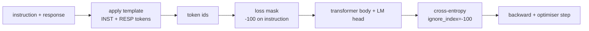
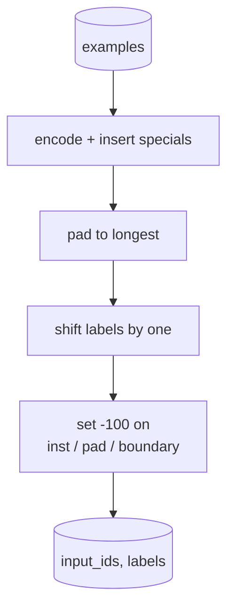
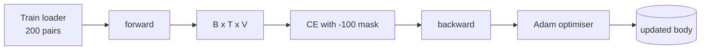

# Bài học Capstone 39: Định hướng thông qua Định hướng thông minh

> Một mô hình cơ bản được đào tạo trước có thể mở rộng một chuỗi nhưng không thể làm theo hướng dẫn. Việc điều chỉnh tinh tế được giám sát là sự thay đổi nhỏ nhất khắc phục điều này: cho mô hình cung cấp các ví dụ cặp của một hướng dẫn và một phản ứng mong muốn, và đào tạo cơ thể để dự đoán các mã phản ứng. Trù là bạn chỉ muốn thua để tính phản ứng, không phải chỉ dẫn. Bài học này xây dựng một vòng lặp SFT kiểu Alpaca với chức năng collate tùy chỉnh che giấu các token hướng dẫn với `ignore_index=-100`, đào trên 200 cặp hướng dẫn-đáp ứng, và đánh giá trên một chia cắt kéo dài bằng cách sử dụng phù hợp chính xác.

**Type:** Build
**Languages:** Python (torch, numpy)
**Prerequisites:** Phase 19 lessons 30-37 (NLP LLM track: tokenizer, embedding table, attention block, transformer body, pre-training loop, checkpointing, generation, perplexity)
**Time:** ~90 minutes

## Mục tiêu học tập

- Chuyển hình dữ liệu hướng dẫn-đáp ứng được ghép nối thành một chuỗi nguyên nhân duy nhất với các token biên giới rõ ràng.
- Xây dựng một hàm collate che giấu các token hướng dẫn để cross-entropy chỉ đếm các token phản ứng.
- Đào tạo một cơ thể biến đổi nhỏ dưới mục tiêu SFT và xem chuyển động métric đánh giá.
- Thực hiện việc sản xuất tham lam và lấy mẫu nhiệt độ tôn trọng giới hạn phản ứng-bắt đầu.
- Lượng máy tính được giữ được phù hợp chính xác trên các kết quả hoàn thành được tạo ra.

## Vấn đề

Một mô hình cơ bản được đào tạo trên dự đoán mã thông báo tiếp theo không biết một hướng dẫn là gì. Hãy cho nó chuỗi `"What is the capital of France?"`và nó sẽ tiếp tục câu hỏi hoặc phát minh ra một câu mới. mô hình có ngôn ngữ nhưng không có hợp đồng định dạng.

Hợp đồng SFT là một mẫu chuỗi. Mỗi ví dụ đào tạo trở thành một chuỗi đơn với ba khu vực:

```text
<INST> What is the capital of France? <RESP> The capital of France is Paris.
```

Các token biên giới là các token đặc biệt được lưu trữ trong thời gian đào tạo.`<RESP>`là phản ứng và phản ứng là những gì được xếp hạng. mục tiêu biểu tượng tiếp theo của mô hình cơ sở vẫn áp dụng; nó chỉ được đào tạo trên một hình dạng mà mỗi ví dụ có hình dạng này.

Nhưng có một sự mắc kẹt. Nếu bạn cung cấp toàn bộ chuỗi cho một mất đi entropy chéo vanilla, bạn đang đào tạo mô hình để dự đoán các mã chỉ dẫn. Chỉ dẫn được đưa ra. Bạn muốn gradient không trên các vị trí đó.

## Khái niệm



`ignore_index`là một đặc điểm của `torch.nn.functional.cross_entropy`Bất kỳ vị trí mục tiêu nào bằng với `ignore_index`Phụ kiện của PyTorch là:`-100`. Chức năng collate xây dựng hai tensor ví dụ: `input_ids`(các phần) và`labels`(một bản sao của `input_ids`với các vị trí hướng dẫn được ghi lại bởi `-100`().

Mô hình nhìn thấy toàn bộ chuỗi trong quá trình chuyển tiếp; sự chú ý có thể chú ý đến hướng dẫn. Sự mất chỉ đếm các mã phản ứng. Đây chính xác là những gì bạn muốn: điều kiện trên hướng dẫn, dự đoán phản ứng.

## Dữ liệu

Hai trăm cặp lệnh-đáp ứng được tạo ra theo cách xác định trong `main.py`Chúng bao gồm 6 loại nhiệm vụ:

- Thực tế đơn shot (chủ số X)
- số học
- Thu thập danh sách
- Tổng kết một câu
- mã (phác thảo, sắp xếp)
- định nghĩa

Mỗi nhiệm vụ có một hướng dẫn mẫu và một phản ứng xác định. Điều này đơn giản một cách cố ý. Sự phù hợp chính xác là hỏng lẻo, và bài học sử dụng một vật cố định nơi câu trả lời chính xác là một chuỗi cụ thể.

Các phân chia là 160 tàu, 40 thử nghiệm.

## Đánh dấu và đệm

tokeniser là cấp độ byte với ba đặc biệt được đặt:

- `INST_ID = 256`: đánh dấu sự khởi đầu của khu vực hướng dẫn.
- `RESP_ID = 257`: đánh dấu ranh giới giữa hướng dẫn và phản ứng.
- `PAD_ID = 258`: đệm cho các lô dài thay đổi.

Dòng trình diễn là`[INST] inst_bytes [RESP] resp_bytes [PAD]*`- Chức năng collate:

1. Định nghĩa cho mỗi ví dụ.
2. Pads mỗi ví dụ trong lô cho chuỗi dài nhất trong lô.
3. - Cây dựng`labels`= `input_ids`được chuyển đổi một lần (những mục tiêu LM nguyên nhân), với:
   - Khu vực hướng dẫn được thay thế bởi `-100`- Tôi không biết.
   - Khu vực đệm được thay thế bởi `-100`- Tôi không biết.
   - - `RESP_ID`vị trí biên giới tự thay thế bởi `-100`(bạn không đào tạo mô hình để dự đoán dấu hiệu biên giới; nó dự đoán những gì tiếp theo).



Chuyển đổi là thủ thuật nguyên nhân tiêu chuẩn: vị trí `i`của `input_ids`dự đoán vị trí `i+1`, vậy `labels[i] = input_ids[i+1]`(với vị trí cuối cùng bị thả từ đầu vào và vị trí đầu tiên bị thả từ mục tiêu).

## Việc đào tạo



Loop là vòng lặp PyTorch SFT tiêu chuẩn. Adam, tốc độ học tập khoảng 3e-4 đến 1e-3, mười đến hai mươi thời đại trên bộ máy này, không có lập trình viên. Mô hình đủ nhỏ (bỏ 96, 2 khối, chiều dài tối đa 64) để đào tạo để hội tụ trên CPU trong vòng hai phút.

Mỗi thời kỳ thứ năm vòng lặp chạy một đánh giá nhỏ trên bộ được giữ và in phù hợp chính xác. Xem phù hợp chính xác đi từ 0.0 ở thời điểm một đến khoảng 0.85 ở thời điểm mười lăm là phần thưởng của bài học: bạn có thể thấy mô hình học định dạng và câu trả lời cùng một lúc.

## Thế hệ

Vào thời điểm đánh giá mô hình nhận được lệnh lệnh `[INST] inst_bytes [RESP]`và tạo ra token cho đến khi:

- chuỗi đạt đến `max_len`, hoặc
- mô hình phát ra một stop heuristic đặc biệt: hai byte kết thúc câu liên tiếp (`.`- `!`- `?`().

Bài học cung cấp mã hóa tham lam cộng với một máy lấy mẫu nhiệt độ tùy chọn. Sự phù hợp chính xác sử dụng tham lam vì nhiệt độ sẽ làm cho métric stochastic. Hệ thống thực thường lấy mẫu, sau đó đánh giá vất vả; đường ống đó là bài học 41.

## Đánh giá phù hợp chính xác

Đáp ứng chính xác là metric văn bản nghiêm ngặt nhất. Dòng phản ứng dự đoán được chuẩn hóa (nhiệm chữ dưới, không gian trắng dải, không gian gấp đôi sụp đổ) và so sánh với phản ứng tham chiếu, được chuẩn hóa theo cùng một cách.

Các đường ống SFT thực sự bổ sung sự phù hợp chính xác với F1 cấp token (câu 41) và mô hình thẩm phán. Sự phù hợp chính xác vẫn hữu ích vì nó không mơ hồ; nếu nó nói 0,7, chính xác 70% các hướng dẫn thử nghiệm tạo ra ký tự phản ứng vàng cho nhân vật.

```figure
cc-sft-loss-mask
```

## Những gì bạn sẽ xây dựng

Việc thực hiện là một`main.py`cộng với các xét nghiệm.

1. `InstructionTokenizer`: trình mã hóa cấp bayt với các đặc biệt được dự trữ. Mã hóa hoặc là một lệnh tiền tố hoặc một cặp đầy đủ.
2. `make_dataset`: tạo ra 200 cặp trên sáu loại nhiệm vụ với một hạt giống cố định.
3. `SFTDataset`: trả lại `(input_ids, labels)`ví dụ, đã chuẩn bị mặt nạ.
4. `sft_collate`: đệm động, xây dựng tensor lô, tập hợp `-100`trên hướng dẫn và vị trí đệm.
5. `TinyGPT`: thân biến áp cộng với đầu LM bị buộc hoặc không bị buộc.
6. `train_sft`: vòng SFT, với các cái nón đánh giá theo thời đại.
7. `generate`: decode nguyên nhân từ một tiền tố, tham lam hoặc lấy mẫu, với stop heuristic.
8. `exact_match`: so sánh chuỗi bình thường, trả lại lơ lửng trong `[0, 1]`- Tôi không biết.
9. `run_demo`: xây dựng dữ liệu, tàu cho hai mươi thời đại, đánh giá, in một phân tích theo từng loại, đi ra khỏi không về thành công.

## Tại sao mặt nạ quan trọng

Không có mặt nạ, người mất sẽ coi các mã chỉ dẫn là mục tiêu. Mô hình học cách dự đoán hướng dẫn. Đây là một mục tiêu khác và tạo ra một mô hình tồi tệ hơn theo hai cách. Đầu tiên, dung lượng mô hình bị lãng phí tái cấu trúc đầu vào người dùng luôn cung cấp. Thứ hai, mất đáp ứng nhỏ hơn trong tổng gradient vì các token hướng dẫn lớn hơn số lượng các token đáp ứng trong hầu hết các lô; tốc độ học tập hiệu quả của người tối ưu hóa trên phần bạn quan tâm thấp hơn bạn dự định. Mặt nạ không phải là một chất xăm; nó là mục tiêu.

## Cải hướng mục tiêu

- Thêm một tốc độ học tập nóng lên sau đó là sự suy giảm cosine. SFT nhạy cảm hơn với LR hơn so với trước khi tập luyện.
- Thêm ghi chép lỗ mỗi token và vẽ đường cong lỗ qua đào tạo.`<RESP>`, tiền tố phổ biến) và thời đại sau đó được thống trị bởi các mã câu trả lời thực tế.
- Lớn thêm đánh giá thành BLEU-1 hoặc chrF. Sự phù hợp chính xác đánh giá thấp các mô hình tạo ra một câu trả lời giống nhau.
- Thêm một mẫu trò chuyện với định dạng nhiều lượt và tập trung vào một thiết bị bao gồm các sự theo dõi.

Việc thực hiện cho bạn hợp đồng định dạng, mặt nạ và vòng lặp. Sự thay đổi khách quan từ mô hình cơ bản sang người theo hướng dẫn là một hàm collate.
