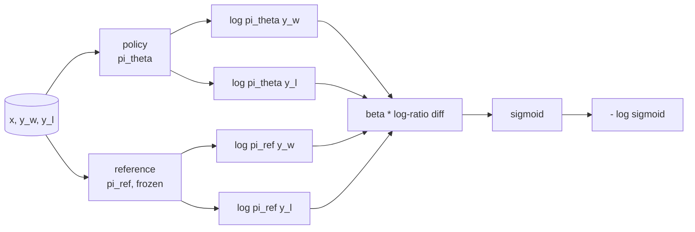
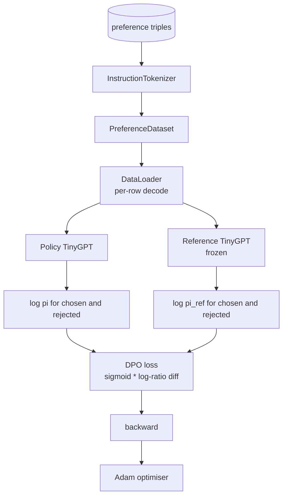

# Bài học Capstone 40: Khả năng tối ưu hóa sở thích trực tiếp từ đầu

> Các mô hình thưởng và PPO là hàng RLHF cổ điển. DPO sụp đổ một đống đó thành một lỗ được giám sát duy nhất phù hợp với chính sách trực tiếp đối với cặp ưu tiên. Bài học này rút ra sự mất mát của DPO từ danh tính khác biệt phần thưởng, gửi một mô hình tham chiếu làm việc cộng với mô hình chính sách, tính toán xác suất đăng ký mỗi token, và đào tạo một bộ biến đổi nhỏ trên một bộ cố định ưu tiên của các kết thúc được chọn và bị từ chối. Các bài kiểm tra ghi toán lỗ và hướng gradient để bạn biết việc thực hiện phù hợp với giấy.

**Type:** Build
**Languages:** Python (torch, numpy)
**Prerequisites:** Phase 19 lessons 30-37 (NLP LLM track: tokenizer, embedding table, attention block, transformer body, pre-training loop, checkpointing, generation, perplexity)
**Time:** ~90 minutes

## Mục tiêu học tập

- Thuộc dẫn mất DPO như một sigmoid trên một chênh lệch tỷ lệ log quy mô và kết nối nó với phần thưởng ngầm.
- Xây dựng một mô hình tham chiếu + mô hình chính sách cặp với một tham chiếu đóng băng và một chính sách có thể đào tạo.
- Lập toán các khả năng đăng ký ở cấp độ chuỗi trong cả hai mô hình, che giấu các token prompt.
- Căn nuôi chính sách`(prompt, chosen, rejected)`3 lần và xem các log-prob được chọn tăng so với từ chối.
- Hành vi pin với các bài kiểm tra về toán học mất mát, dấu hiệu gradient và bất biến tham chiếu.

## Vấn đề

Bạn có mô hình SFT. Nó tuân theo hướng dẫn, nhưng kết quả của nó không đồng đều; một số hoàn thành là rõ ràng, một số là từ ngữ hoặc sai. Bạn cũng có một tập dữ liệu nhỏ của các cặp ưu tiên: cho cùng một prompt, một con người đánh dấu một hoàn thành là chọn và một khác là từ chối.

Câu trả lời RLHF cổ điển là một đường ống dẫn hai giai đoạn. Tập một mô hình phần thưởng dựa trên sở thích. Tối ưu hóa chính sách chống lại phần thưởng với PPO. Điều này hoạt động nhưng tốn kém: hai mô hình trong bộ nhớ trong thời gian PPO, kiểm soát KL để giữ chính sách gần tham chiếu, tấn công phần thưởng khi mô hình phần thưởng yếu.

DPO thay thế cả hai giai đoạn bằng một lỗ duy nhất được giám sát. Mô hình phần thưởng không bao giờ tồn tại rõ ràng. Chính sách được đào tạo trực tiếp trên các cặp ưu tiên, với một hình phạt KL rõ ràng đối với tham chiếu SFT. Giải pháp tối ưu tương tự theo mô hình ưu tiên Bradley-Terry, ít mã hơn nhiều.

## Khái niệm

Bắt đầu từ mô hình Bradley-Terry.`x`và hai hoàn thành `y_w`(được chọn) và `y_l`(được từ chối), khả năng mà con người thích `y_w`là

```text
P(y_w > y_l | x) = sigmoid( r(x, y_w) - r(x, y_l) )
```

nơi `r`là một chức năng thưởng ẩn.`r`từ sở thích, sau đó đào tạo một chính sách `pi`để tối đa hóa `r`Với neo KL:

```text
max_pi   E_{x, y~pi} [ r(x, y) ] - beta * KL(pi || pi_ref)
```

Các dẫn xuất DPO lưu ý rằng chính sách tối ưu `pi*`theo mục tiêu này có hình thức đóng cửa theo các`r`- Có thể là:

```text
pi*(y | x) = (1/Z(x)) * pi_ref(y | x) * exp( r(x, y) / beta )
```

Chuẩn bị lại cho `r`- Có thể là:

```text
r(x, y) = beta * ( log pi*(y | x) - log pi_ref(y | x) ) + beta * log Z(x)
```

- `log Z(x)`thuật ngữ là giống nhau cho cả hai `y_w`và `y_l`(đáng tùy vào `x`Không .`y`), do đó nó bị hủy bỏ khi bạn tính toán sự khác biệt ưu tiên:

```text
r(x, y_w) - r(x, y_l) = beta * ( log pi_theta(y_w|x) - log pi_ref(y_w|x)
                                - log pi_theta(y_l|x) + log pi_ref(y_l|x) )
```

Thay vào Bradley-Terry sigmoid và lấy xác suất log âm so với cặp ưu tiên:

```text
L_DPO(theta) = - E_{(x, y_w, y_l)} [
  log sigmoid( beta * ( log pi_theta(y_w|x) - log pi_ref(y_w|x)
                       - log pi_theta(y_l|x) + log pi_ref(y_l|x) ) )
]
```

Đây là lỗ. Nó là một sigmoid trên một scalar đơn lẻ ví dụ, tính từ bốn log-chỉ có thể. Không mô hình phần thưởng riêng biệt. Không có PPO. Không có thuật ngữ KL trong lỗ; ràng buộc KL được nướng vào dẫn dạng đóng.



## Chứng chỉ của sự trượt dần

Một kiểm tra tinh thần hữu ích trước bất kỳ cuộc tập luyện nào.`log pi_theta(y_w | x)`- Có thể là:

```text
d L_DPO / d log pi_theta(y_w | x) = - beta * (1 - sigmoid(z))
```

nơi `z`là lập luận của sigmoid.`z`, có nghĩa là: tăng khả năng ghi chép của chính sách về việc hoàn thành được lựa chọn làm giảm tổn thất.`log pi_theta(y_l | x)`là tích cực: tăng khả năng log bị từ chối làm tăng tổn thất. đào tạo đẩy người được chọn lên và người bị từ chối xuống.

## Dữ liệu

12 ưu tiên gấp ba con tàu với bài học.`(prompt, chosen, rejected)`. Việc hoàn thành được chọn là ngắn và chính xác. Những người bị từ chối là từ ngữ, không đề cập đến chủ đề hoặc sai. Các cặp bao gồm cùng một nhóm nhiệm vụ như bài học 39 (chủ đô, toán học, danh sách) vì vậy một chính sách bắt đầu từ cơ sở SFT có một điểm khởi đầu hợp lý.

DPO hoạt động trên hàng chục ngàn cặp trong sản xuất; ở đây, điểm là toán học mất mát và vòng lặp chạy từ đầu đến cuối trên một tập dữ liệu nhỏ và khoảng cách cho chọn-về-đánh chối log-prob tăng lên rõ ràng.

## Không thay đổi tham chiếu

Một thực hiện DPO phải xử lý mô hình tham chiếu cẩn thận. mô hình tham chiếu là mô hình SFT đóng băng tại chỗ.

- Các tham số tham chiếu không bao giờ nhận gradient.
- Các xác suất hồ sơ tham chiếu không bao giờ thay đổi giữa các thời đại.
- Chính sách bắt đầu từ cùng một trọng lượng như tham chiếu.`theta`là tài liệu tham chiếu cộng với một bản cập nhật được học; khởi động chính sách như một bản sao của tài liệu tham chiếu là khởi đầu được xác định rõ ràng.)

Việc thực hiện sẽ thực thi các quy định này bằng cách:

- Kết hợp tài liệu tham chiếu trong `torch.no_grad()`trong các lần đi trước.
- Đặt `requires_grad=False`trên mỗi tham số tham chiếu.
- Xây dựng chính sách thông qua `policy.load_state_dict(reference.state_dict())`sau khi tham chiếu được xây dựng.

```figure
cap-dpo-preference
```

## Kiến trúc



Mô hình là cùng một TinyGPT được sử dụng trong bài học 39 (chỉ có mã giải mã, nguyên nhân, tokeniser byte).

## Những gì bạn sẽ xây dựng

Việc thực hiện là một`main.py`cộng với các xét nghiệm.

1. `InstructionTokenizer`: Byte tokeniser với `INST`và `RESP`hình dạng giống như bài học 39.
2. `TinyGPT`Tương tự như bài học 39, nên bài học tự nhiên ngay cả khi bạn bỏ qua bài học 39.
3. `make_preferences`: trả lại mười hai `(prompt, chosen, rejected)`gấp ba lần.
4. `sequence_log_prob`: cho mô hình, một dấu tiền đề nhanh chóng, và một kết thúc, trả lại tổng số các khả năng đăng ký token tiếp theo trên kết thúc (không có đóng góp vị trí nhanh chóng).
5. `dpo_loss`: lấy bốn khả năng log và `beta`, trả lại tensor mất mỗi ví dụ và delta phần thưởng ngầm cho ghi chép.
6. `train_dpo`: per-epoch vòng tròn tính toán được chọn và từ chối log-probs theo chính sách và tham chiếu, áp dụng lỗ, và bước Adam.
7. `evaluate_margins`: trả lại mức trung bình cho phép từ chối log-probability margin trong chính sách tại bất kỳ thời điểm nào.
8. `run_demo`: xây dựng tham chiếu và chính sách từ một sự nóng lên trước chuyến tàu, sao chép trọng lượng, tàu cho ba mươi bước, in mỗi bước mất mát và lợi nhuận, và thoát khỏi không về thành công.

## Tại sao DPO hoạt động

DPO bằng toán học với RLHF theo mô hình ưu tiên Bradley-Terry, cho đến khi tham số hóa phần thưởng.`r(x, y) = beta * (log pi(y|x) - log pi_ref(y|x))`được xác định từ ưu tiên đến hàm của `x`Chính sách hình thức đóng cho phép bạn bỏ qua mô hình phần thưởng rõ ràng.`pi`từ `pi_ref`làm cho tỷ lệ log lớn hơn, và sigmoid bão hòa, làm giảm độ nghiêng khi chính sách di chuyển quá xa.

## Cải hướng mục tiêu

- Thêm một sự bình thường hóa chiều dài vào tổng xác suất ghi: chia theo chiều dài hoàn thành. Biến chiều dài là một chế độ thất bại DPO được biết đến, trong đó mô hình ưa thích chọn các kết thúc ngắn hơn vì xác suất ghi của chúng lớn hơn trong các thuật ngữ tuyệt đối.
- Thêm phiên bản IPO của lỗ: thay thế sigmoid + log bằng `(z - 1)^2`So sánh sự hội tụ trên thiết bị.
- Thêm một tham số làm mềm nhãn liên quan đến giữa nhãn được chọn khó và loại bỏ đồng nhất 0.5.
- Thay thế tham chiếu bằng một mô hình rẻ hơn nhỏ hơn (nhiệm vị chưng cất kiến thức).

Việc thực hiện cho bạn sự mất mát, sự bất biến tham chiếu, và vòng tròn đào tạo. toán học là bài học. Mã làm cho toán học cụ thể.
