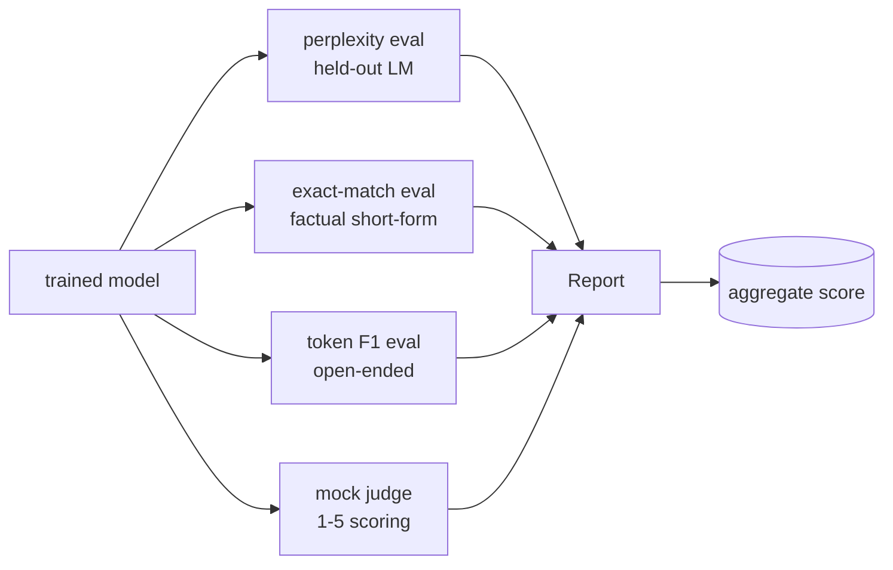
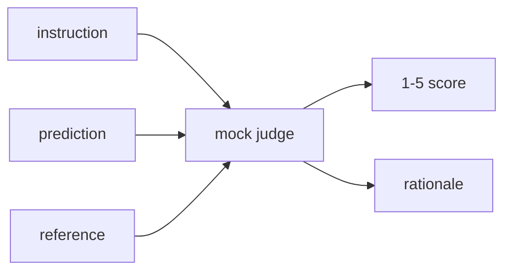
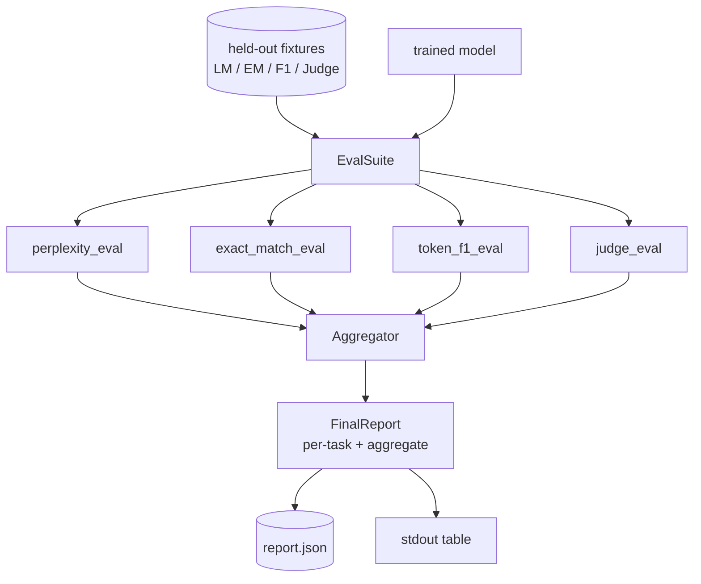

# Bài học Capstone 41: Đường ống đánh giá đầy đủ

> Trình luyện là phần bạn có thể theo dõi bằng đường cong mất mát. Đánh giá là phần bạn phải thiết kế. Bài học này xây dựng một đường ống đánh giá thống nhất lấy bất kỳ mô hình ngôn ngữ được đào tạo nào, chạy bốn đánh giá khác nhau trên nó, tổng hợp kết quả thành một báo cáo mỗi nhiệm vụ, và gửi một LLM giả mạo địa phương như thẩm phán để vòng lặp chạy mà không có mạng. Bốn đánh giá bao gồm các kích thước mà mỗi mô hình vận chuyển cần: mô hình hóa ngôn ngữ (lật hật), chính xác dạng ngắn (sẵn sàng chính xác), tương tự dạng mở (tốc hiệu F1), và điểm số chất lượng (hình phán).

**Type:** Build
**Languages:** Python (torch, numpy)
**Prerequisites:** Phase 19 lessons 30-37 (NLP LLM track: tokenizer, embedding table, attention block, transformer body, pre-training loop, checkpointing, generation, perplexity)
**Time:** ~90 minutes

## Mục tiêu học tập

- Lập toán sự phức tạp với việc tính toán mã hóa trên một biến thể nhỏ.
- Thực hiện một đánh giá phù hợp chính xác trên các lời nhắc thực tế ngắn gọn.
- Lập trình F1 cấp token giữa chuỗi dự đoán và chuỗi tham chiếu với chuẩn hóa.
- Hãy tạo ra một chương trình thẩm phán giả mạo của địa phương để đánh giá kết quả của mô hình trên thang điểm 1-5.
- Kết hợp bốn đánh giá thành một báo cáo cân nặng duy nhất với phân bố từng nhiệm vụ.

## Vấn đề

Một chỉ số duy nhất không bao giờ mô tả mô hình ngôn ngữ. Sự bối rối nói về mức độ phù hợp của mô hình với sự phân phối ngôn ngữ nhưng không nói gì về việc nó có trả lời câu hỏi hay không. Sự phù hợp chính xác cho biết liệu mô hình có tạo ra dây vàng hay không nhưng trừng phạt các đoạn phần chính xác. Token F1 tha thứ cho việc phác thảo nhưng bị lừa bởi sự chồng chéo từ ngữ với nội dung sai. LLM như một thẩm phán nắm bắt các chiều kích chất lượng nhưng là đắt tiền và stochastic.

Các hệ thống mà bạn thực sự muốn có tất cả bốn. Mỗi đánh giá bao gồm một chiều kích mà những người khác bỏ lỡ. Mỗi chạy trên một bộ phận khác nhau của dữ liệu được hình thành cho số liệu đó. Báo cáo cuối cùng cho thấy các số mỗi nhiệm vụ bên cạnh và tổng hợp, để một nhà đánh giá có thể nhìn thấy một cái nhìn mà thương lượng mô hình đang làm.

Bài học này xây dựng đường ống dẫn đó, từ đầu đến cuối, trong một tập tin.

## Khái niệm



Mỗi eval là một hàm từ `(model, dataset) -> EvalResult`Kết quả chứa giá trị métric, chi tiết cho mỗi ví dụ để kiểm tra, và một tên cho tổng hợp.

## Sự bối rối, được đếm đúng cách

Sự bối rối là `exp(mean negative log-likelihood per token)`Việc thực hiện có hai cái bẫy:

- Tỷ lệ trung bình phải nằm trên các vị trí biểu tượng thực tế, chứ không phải trên chuỗi hàng loạt.
- Mô hình dự đoán token tiếp theo, vì vậy logits ở vị trí `i`dự đoán token ở vị trí `i+1`Những sai lầm thường xuyên ở đây là im lặng: sự mất mát vẫn tiếp tục, nhưng số liệu trở nên vô nghĩa.

Thử nghiệm đánh giá tính toán số tiền mỗi lô của `-log p(token)`trên các vị trí không pad và một con số token mỗi lô, sau đó chia ở cuối. Điều này là an toàn hơn về mặt số so với trung bình các phức tạp mỗi lô (được dưới trọng lượng các chuỗi ngắn) và phù hợp với định nghĩa sách giáo khoa.

## Sự phù hợp chính xác, với việc chuẩn hóa

Bộ đeo làm bình thường cả dự đoán và tham chiếu trước khi so sánh:

- - Tầm chữ nhỏ.
- Đường xung quanh không gian trắng.
- Không gian trắng nội bộ sụp đổ chạy đến một không gian duy nhất.
- Định nghĩa điểm cuối (`.`- `!`- `?`) nếu cả hai bên chỉ khác nhau bằng cách chấm điểm.

Việc chuẩn hóa làm cho sự phù hợp chính xác hữu ích trong thực tế.`"Paris"`đúng; một người nói `"Paris."`cũng đúng; một người nói `"  paris  "`Metric vẫn yêu cầu câu trả lời phải là cùng một chuỗi sau khi bình thường hóa.

## Địa chỉ F1, đúng hướng

Token F1 là trung bình hợp nhất của độ chính xác và thu hồi được tính trên túi token.

1. Tiêu chuẩn dự đoán và tham chiếu (các quy tắc tương tự như sự phù hợp chính xác).
2. Chia từng thẻ thành một danh sách các mã thông báo (đánh dấu không gian trắng).
3. Đếm điểm giao giao.
4. Độ chính xác = `intersection_count / len(pred_tokens)`. Nhớ lại = `intersection_count / len(ref_tokens)`F1 = trung bình hài hòa.

Nếu cả dự đoán và tham chiếu đều trống, F1 là 1 (cái khớp trống). Nếu chỉ có một trống, F1 là 0.

## Luật pháp giả mạo địa phương - như một thẩm phán

Một thẩm phán thực sự là một mô hình biên giới đằng sau một API. Đối với bài học này thẩm phán phải chạy ngoài khơi. thẩm phán giả mạo là một điểm số xác định học lấy hướng dẫn, dự đoán của mô hình và tham chiếu, và trả lại điểm trong `{1, 2, 3, 4, 5}`+ một lý do một dòng.

- 5 nếu dự đoán bình thường hóa bằng với chuẩn tham chiếu.
- 4 nếu token F1 giữa dự đoán và tham chiếu là ít nhất 0,8.
- 3 nếu token F1 là trong `[0.5, 0.8)`- Tôi không biết.
- 2 nếu token F1 là trong `[0.2, 0.5)`- Tôi không biết.
- Nếu không thì 1

Đây không phải là một thẩm phán thực sự, nhưng nó có giao diện đúng. thay đổi trong một mô hình thực sau đó bằng cách thay đổi một chức năng.



## Tổng hợp

Tổng số là một trung bình trọng lượng của điểm đánh giá bình thường.`[0, 1]`- Có thể là:

- Sự bối rối: bình thường hóa như `1 / (1 + log(perplexity))`Một sự phức tạp của 1 bản đồ đến 1, bản đồ vô hạn đến 0.
- Đúng đúng: đã được `[0, 1]`- Tôi không biết.
- Tín hiệu F1: đã được đưa vào `[0, 1]`- Tôi không biết.
- Thẩm phán: chia bằng 5.

Các trọng lượng có thể cấu hình được. Sự hỗn hợp mặc định là 0.2 phức tạp, 0.3 phù hợp chính xác, 0.3 mã F1, 0.2 thẩm phán.

```figure
cg-eval-quadrant
```

## Kiến trúc



- `EvalSuite`mỗi đánh giá cá nhân là một hàm miễn phí mà mất`(model, tokenizer, dataset, config)`và trả lại một `EvalResult`- `Aggregator`thu thập kết quả và sản xuất báo cáo cuối cùng. Demo in bảng và viết một bản sao JSON mà CI dòng chảy xuống có thể nuốt.

## Những gì bạn sẽ xây dựng

Việc thực hiện là một`main.py`cộng với các xét nghiệm.

1. `TinyGPT`: cùng một kiến trúc chỉ dùng giải mã được sử dụng trong các bài học 38-40, bao gồm để bài học đứng riêng.
2. `InstructionTokenizer`: tokeniser byte với đặc biệt INST / RESP / PAD.
3. Bốn bộ máy: một bộ LM, một bộ EM, một bộ F1, và một bộ thẩm phán.
4. `perplexity_eval`: trả lại `EvalResult`với giá trị phức tạp và histogram mất per token.
5. `exact_match_eval`: trả lại trung bình EM và hồ sơ cho mỗi ví dụ.
6. `token_f1_eval`: trả lại trung bình token F1 và các hồ sơ cho mỗi ví dụ.
7. `mock_judge`và `judge_eval`: điểm/ví dụ và lý luận, điểm trung bình trên toàn bộ bộ bộ.
8. `Aggregator.normalise`: quy tắc bình thường hóa theo từng năm.
9. `Aggregator.aggregate`: trung bình trọng lượng và báo cáo tổng hợp.
10. `run_demo`: đào tạo một mô hình nhỏ ngắn gọn, chạy tất cả bốn đánh giá, in bảng báo cáo và viết JSON, thoát khỏi số không về thành công.

## Đọc báo cáo

Báo cáo có ba lớp. Đầu là điểm tổng cộng. Dưới đây là bốn số mỗi kỳ. Dưới đây là phân chia mỗi ví dụ cho chẩn đoán. Một chạy CI thất bại thường muốn tổng hợp, nhưng một nhà phê bình theo đuổi sự lùi lại muốn phân chia mỗi ví dụ để xem mô hình đã sai.

Các JSON dump sử dụng các khóa ổn định để một bảng điều khiển CI có thể vẽ các dòng xu hướng trên các phiên bản. bảng được in khá đẹp là cho con người nhìn vào thiết bị cuối sau khi chạy đào tạo.

## Cải hướng mục tiêu

- Thêm một đánh giá hiệu chuẩn: có xác suất softmax của mô hình phù hợp với độ chính xác của nó không? dự đoán bucket theo sự tin tưởng và báo cáo độ chính xác thực nghiệm cho mỗi bucket.
- Thêm một đánh giá độ bền: gắn thẻ mỗi ví dụ với một sự nhiễu loạn (typo, phác thảo, phân tâm) và báo cáo giảm métric cho mỗi sự nhiễu loạn.
- Thay thế thẩm phán giả bằng một mô hình thực đằng sau cuộc gọi HTTP.
- Thêm việc học trọng lượng mỗi nhiệm vụ: thay vì trọng lượng cố định, phù hợp trọng lượng với một thứ tự ưu tiên mục tiêu so với các mô hình.

Việc thực hiện cho bạn bốn eval, tổng hợp và báo cáo. Các đường ống đánh giá thực tế layer nhiều chiều kích hơn ở trên; mô hình vẫn giống nhau: một chức năng cho mỗi eval, một tổng hợp, một báo cáo.
