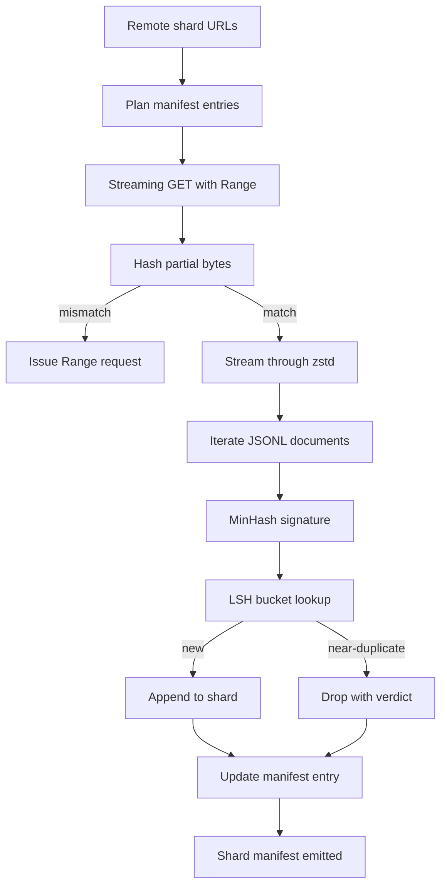

# Máy tải xuống lớn

> Việc đào tạo một mô hình ngôn ngữ bắt đầu từ lâu trước khi đi trước đầu tiên. Corpus phải được đưa lên đĩa, được nén, được sao chép, và có thể được địa chỉ, với câu chuyện về sơ yếu lý lịch đã được làm trước khi mạng giảm xuống 4%. Bài học này xây dựng một trình tải xuống trực tuyến kéo các mảnh bị nén, giải nén trên máy bay với Zstandard, dấu vân tay gần như sao chép thông qua MinHash cộng với hashing nhạy cảm với địa điểm, và viết một biểu hiện mảnh còn lại của đường ống dẫn có thể tin tưởng.

**Type:** Build
**Languages:** Python
**Prerequisites:** Phase 19 lessons 30-37
**Time:** ~90 minutes

## Mục tiêu học tập

- Chuyển các đoạn phim từ xa với `urllib`và làm giảm nén với `zstandard`mà không cần phải đặt bộ nhớ toàn bộ tập tin.
- Tái lại các tải xuống một phần bằng cách phát hành HTTP `Range`yêu cầu chống lại một sự bù đắp bằng byte được xác minh.
- Xây dựng một chữ ký MinHash cho mỗi tài liệu và vỏ nó với LSH để các bản trùng lặp gần chạm vào.
- Giả ra một bản biểu đồ phân mảnh với nội dung hash, kích thước byte, số tài liệu và phán quyết dedup.

## Vấn đề

Lần đầu tiên bạn tập luyện trên một bộ 200 GB mạng lưới giảm ở mức 41% và kịch bản xuất hiện với một `urllib`ngoại lệ. lần thứ hai nó giảm xuống mức 78%. 99% bạn đã viết lại vòng lặp ba lần. Hai lỗi bạn phải thiết kế cho từ phút đầu là sơ khai tải xuống một phần và xóa tài liệu trùng lặp. Cả hai đều có giải pháp nổi tiếng; cả hai đều thường bị bỏ qua vì đường ống bắt đầu như một dòng .`requests.get`gọi là răng lớn.

Resume là vấn đề HTTP.`Range`, khách hàng phải theo dõi sự bù đắp xác minh được so sánh với một bản ghi trên đĩa, và sự bù đắp xác minh phải tồn tại sau khi quá trình chết. Nếu sự bù đắp và tệp khác nhau thậm chí một byte, tải lại sẽ viết rác và corpus bị hư hỏng theo cách chỉ xuất hiện trong quá trình token hóa.

Sự sao chép là một vấn đề ký hiệu. Exact-hash dedup bỏ lỡ gần như sao chép: cùng một bài viết Wikipedia xuất hiện với ba chân phím khác nhau, cùng một tệp mã với tiêu đề giấy phép khác nhau, cùng một bài đăng trên blog với một tham số theo dõi trên mỗi liên kết. MinHash cộng với LSH bắt được chúng với chi phí phụ tuyến tính. Chi phí là một chữ ký mỗi tài liệu và một tìm kiếm vỏ mỗi chữ ký.

## Khái niệm



### Chuyển trực tuyến với `urllib`

Thư viện tiêu chuẩn`urllib.request.urlopen`trả lại một vật thể giống như tệp.`zstandard.ZstdDecompressor().stream_reader`và các byte chảy từ mạng thông qua decompressor vào trình lặp tài liệu mà không bao giờ thực hiện các mảnh bị nén hoặc các mảnh bị nén trong bộ nhớ. chi phí bộ nhớ duy nhất là line buffer, chữ ký MinHash cho tài liệu hiện tại, và chỉ số LSH.

### Đặt lại với `Range`

Người tải xuống viết hai tệp cho mỗi mảnh: mảnh tự và một `.partial.json`Địa điểm kiểm soát.`verified_bytes`- `expected_size`- `sha256_prefix`(được tính qua lần đầu tiên `verified_bytes`khi khởi động, trình tải xuống đọc điểm kiểm tra, tính lại `sha256_prefix`trên các byte trên đĩa, và chỉ tiếp tục nếu các hash tính toán lại phù hợp. Nếu hash sai, phần phần được loại bỏ và tải xuống bắt đầu lại từ byte không. Sự tham nhũng im lặng là không thể bởi vì các byte được xác minh được kiểm tra, không được giả định.

### MinHash cộng LSH

MinHash ước tính sự tương đồng Jaccard của hai bộ trong không gian cố định. Đối với một tài liệu, bộ là các vỏ bọc (n-gram chồng chéo) của văn bản của nó.`k`giá trị hash tối thiểu, một cho mỗi hàm hash độc lập. Hai tài liệu có sự tương đồng Jaccard `s`có khả năng`s`của việc đồng ý về bất kỳ thành phần nào của chữ ký.

LSH sau đó nhóm các `k`các thành phần thành `b`băng tần `r`mỗi hàng, nơi `k = b * r`Hai tài liệu va chạm trong ít nhất một băng thông có khả năng`1 - (1 - s^r)^b`, là ngưỡng thâm hụt xung quanh giá trị của `s`Anh nghe nhạc`(b, r)`Thâm giới cho các loại khoá học điển hình là `s = 0.8`, mà các nghiên cứu của LSH tiếp cận với `k = 128`- `b = 32`- `r = 4`- Tôi không biết.

### Bản ghi dấu như hợp đồng

Khả năng xuất phát duy nhất của trình tải xuống là bản biểu diễn. Bản biểu diễn chứa, cho mỗi shard, URL, số lượng byte bị gỡ nén, số lượng tài liệu, số lượng tài liệu độc đáo sau khi dedup, và sha256 của tệp shard cuối cùng. Đánh giá theo dòng đọc biểu đồ, không phải danh sách thư mục. Nếu một mảnh vỡ bị thiếu hoặc sha256 của nó sai, biểu lộ cho biết giai đoạn tiếp theo từ chối bắt đầu. Bản biểu diễn là cạnh quyết định giữa "dữ liệu được tải xuống" và "dữ liệu được tải xuống và xác minh".

```figure
cap-corpus-downloader
```

## Hãy xây dựng nó

`code/main.py`thực hiện:

- `ShardPlanner`- đọc một danh sách các URL mảnh và tạo ra các mục biểu hiện được lên kế hoạch.
- `StreamingDownloader`- mở ra một `urllib`dòng với tùy chọn `Range`, viết vào một tệp tạm thời, cập nhật các `.partial.json`Checkpoint trên mỗi mảnh, và xác minh tiền tố Sha256 trên hồ sơ.
- `ZstdDocIterator`- gói dòng file như trong `zstandard.ZstdDecompressor`và tạo ra một tài liệu cho mỗi dòng.
- `MinHasher`- tạo ra một `k`- chữ ký thành phần cho một chuỗi sử dụng một gia đình cố định của hạt hash.
- `LSHIndex`- ghi dấu hiệu của băng và báo cáo vụ va chạm.
- `Dedup`- kết hợp hasher và index để gắn nhãn mỗi tài liệu `keep`hoặc `near_duplicate`cùng với thẻ nhận dạng của mảnh tương ứng.
- `ManifestWriter`- thu thập số liệu thống kê mỗi phân khúc và viết `manifest.json`- Tôi không biết.

Một bản demo ở dưới cùng của tệp tạo ra một cơ thể tổng hợp nhỏ trên đĩa, nén nó với `zstandard`, tải xuống nó qua một `file://`URL, sao chép và in sổ.

Đi đi.

```bash
python3 code/main.py
```

Bản kịch bản thoát khỏi số không và in một bản tóm tắt rõ ràng.

## Các mẫu sản xuất

Bốn mô hình mở rộng bài học này thành những cơ thể thực sự.

**Checkpoint before write.**- `.partial.json`phải là `fsync`-ed trước khi các byte được thêm vào các shard. Nếu không một mất điện đảo ngược thứ tự: shard byte trên đĩa, checkpoint mà không có chúng, tiếp theo resume tin rằng nó có ít byte xác minh hơn nó làm, các byte hậu tố trùng lặp làm hỏng tệp. Checkpoint trước, sau đó viết. Đây là kỷ luật tương tự như một ghi chép viết trước.

**Sharded LSH index.**Một chỉ số LSH duy nhất trên toàn bộ bộ bộ phận không phù hợp với RAM ở thang đo 200 GB. Chia chỉ số LSH bằng băng tần hash đầu tiên, lưu trữ phân vùng trên đĩa, và chỉ tham khảo phân vùng mà chữ ký mới sẽ đổ bộ. Chi phí là một đĩa đọc thêm cho mỗi tài liệu; lợi ích là chỉ số LSH không còn là một ổ cứng memory trần.

**Tombstone, not delete.**Những bản sao bị bỏ rơi được ghi lại trong bản ghi với phán quyết .`near_duplicate`và ID mảnh của tài liệu mà họ đã đâm vào. xóa chúng mất mối liên hệ giữa bản sao và người giữ nó. Tombstoning bảo tồn dấu vết kiểm toán và cho phép một con đường qua dòng chảy thay đổi ý kiến về ngưỡng.

**Per-shard sha256 in the manifest, plus a manifest sha256.**Bản thể tự nó nhận được một hàm hàm hash. Các giai đoạn lưu dưới xác minh hàm hash trước khi họ tin vào các mục nhập mỗi phần. Nếu không có điều này, biểu thức là bề mặt tấn công im lặng: một kẻ tấn công có thể chỉnh sửa một tập tin duy nhất có thể làm hỏng toàn bộ đường ống.

## Sử dụng nó

Các mô hình sản xuất:

- **Resume on every CI run.**Các bộ chạy thông tin thông tin thông tin là tạm thời. người tải xuống phải đảm nhận một đĩa mới trong mỗi lần chạy và phục hồi từ cache hoặc từ xa. `--cache-dir`là một lá cờ hạng nhất.
- **Dedup before tokenization.**Đánh giá token hóa đắt tiền. Đánh giá nó hai lần trên cùng một tài liệu là gấp đôi chi phí cho cùng một đường cong mất mát. Dedup là dòng tiền lên của token hóa, không phải dòng tiền xuống.
- **Manifest as merge gate.**Các khóa học chạy đọc các biểu đồ sha256 từ một commit gắn. Một phiên bản tập dữ liệu mới đòi hỏi một commit biểu đồ mới.

## Chuyển nó

`outputs/skill-corpus-downloader.md`sẽ, trên một dự án thực sự, mô tả những URL cung cấp cho người tải xuống, cách thư mục điểm kiểm soát được đặt ra, chiều rộng và `(k, b, r)`Dùng số lượng máy tính trong phiên bản này sẽ tăng gấp 3 lần.

## Các bài tập

1. Thêm một `--shingle-width`cờ và đo cách phán quyết dedup thay đổi ở độ rộng 3, 5, 9. Bảo vệ mặc định được chọn.
2. Thêm hỗ trợ gzip bên cạnh zstd bằng cách ngửi các byte ma thuật.
3. Thêm một `--resume-only`chế độ từ chối bắt đầu tải lại nếu không tìm thấy điểm kiểm soát. hữu ích trong CI để ngăn chặn một chạy không ngẫu nhiên kéo lại 200 GB.
4. Di chuyển chỉ số LSH vào một tệp kệ hoặc sqlite và đo dung lượng so với biến thể trong bộ nhớ.
5. Thêm một biểu đồ sha256 kiểm tra khi khởi động. trình tải xuống sẽ không thể đóng nếu biểu đồ trên đĩa không đồng ý với biểu đồ hash trong `manifest.lock`- Tôi không biết.

## Các điều khoản chính

| Term | What people say | What it actually means |
|------|-----------------|------------------------|
| Shard | "A file" | A self-contained slice of the corpus with its own sha256, used as the unit of resume and dedup |
| MinHash signature | "Fingerprint" | A `k`-component sketch of a set, where each component is the minimum of one independent hash over the set |
| LSH band | "Bucket" | A group of `r` signature components used as a single bucket key for collision detection |
| Verified bytes | "Resume offset" | Bytes on disk whose sha256 prefix matches the checkpoint; the only safe offset to resume from |
| Manifest | "The index" | The single durable record of what the downloader produced, including content hashes |

## Đọc thêm

- [RFC 7233](https://datatracker.ietf.org/doc/html/rfc7233)- HTTP Range yêu cầu, quy trình tiếp tục
- [Zstandard format specification](https://datatracker.ietf.org/doc/html/rfc8478)- định dạng khung làm cho việc giải nén dòng chảy an toàn
- [MinHash](https://en.wikipedia.org/wiki/MinHash)- gia đình chữ ký bài học này sử dụng
- [Locality-sensitive hashing](https://en.wikipedia.org/wiki/Locality-sensitive_hashing)- quy trình liên kết phía sau ngưỡng khấu trừ
- Giai đoạn 19 · 43 - HDF5 tokenized corpus tải xuống cung cấp
- Giai đoạn 19 · 44 - lịch trình cosine tập trên corpus
- Giai đoạn 19 · 45 - vòng AMP tiêu thụ lịch trình
