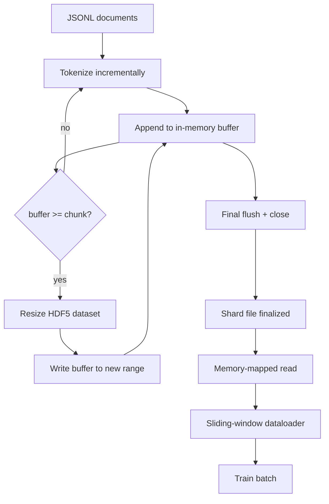

# HDF5 Tokenized Corpus

> Các bản tải xuống phải hạ cánh trong một bố cục mà huấn luyện viên có thể phát trực tuyến từ tốc độ đường. JSONL trên đĩa không tồn tại 16 nhân viên tải dữ liệu. HDF5 với một bộ dữ liệu số nguyên có thể thay đổi kích thước. Bài học này xây dựng các mã thông báo trực tuyến thành một bộ dữ liệu HDF5 có thể kích thước, viết từng mảnh trên nhiều tệp, đọc trong bộ nhớ trong thời gian đào tạo, và một bộ tải dữ liệu cửa sổ trượt tạo ra các chuỗi dài cố định với gói đúng.

**Type:** Build
**Languages:** Python
**Prerequisites:** Phase 19 lessons 30-37
**Time:** ~90 minutes

## Mục tiêu học tập

- Chuyển các tài liệu vào một bộ dữ liệu HDF5 có kích thước có thể thay đổi với phân tích xác định.
- Chia các ghi trên nhiều tệp HDF5 để lỗi được giới hạn và song song có thể.
- Đọc token lại qua trang HDF5 hỗ trợ cache bố cục để bộ tải dữ liệu sao chép vào bộ đệm lô chỉ vào thời gian lô.
- Thực hiện một bộ tải dữ liệu cửa sổ trượt phát ra các chuỗi huấn luyện dài cố định với các quy tắc đóng gói rõ ràng.

## Vấn đề

Một chương trình đào tạo ngôn ngữ hiện đại đọc mã thông báo với hàng trăm ngàn mẫu mỗi giây trên hàng chục công nhân. JSONL trên đĩa chết khi lỗi trang lưu trữ lạnh đầu tiên: trình phân tích JSON chậm, ranh giới tài liệu không thể địa chỉ, và tìm kiếm "chọn mẫu 4,217,884" đòi hỏi phải quét tệp. Ngay cả Parquet, mà nén tốt, là một sự phù hợp kém bởi vì huấn luyện viên không muốn cột; nó muốn một dòng token phẳng với O(1) truy cập ngẫu nhiên.

HDF5 phù hợp bởi vì nó cung cấp một bộ dữ liệu nhỏ, có thể kích thước, chỉ có số nguyên, các mảnh của nó là trang cache thân thiện tại thời điểm đọc.`tokens[3,200,000 : 3,200,8192]`và HDF5 sao chép các hyperslab yêu cầu từ bộ nhớ cache trang vào một mảng NumPy vừa được phân bổ. Chi phí là một tay xử lý tập tin mở và một dấu chân bộ nhớ cache trang kích thước nhỏ cho mỗi người lao động, điều này là không đáng kể so với chi phí giải mã JSONL.

Vấn đề xây dựng là làm cho mặt viết thành thật. Các tập hợp dữ liệu có thể được quy mô lớn dễ sử dụng sai: viết một tài liệu một lúc và tệp HDF5 bị phân mảnh đến mức không thể sử dụng. Viết tất cả các tài liệu trong một kích thước và một quá trình chết mất toàn bộ mảnh. Phân tích đúng là buffer-then-extend, với kích thước buffer phù hợp với kích thước của phần, và viết chia nhỏ chia khối lượng làm việc trên các tệp để một vụ tai nạn mất tối đa một mảnh.

## Khái niệm



### HDF5 có thể đo được được thực hiện đúng

Bộ dữ liệu token được tạo bằng `maxshape=(None,)`và một cố định `chunks=(chunk_size,)`. Tác lại thu nhập bằng cách bơm token trong một mảng dài NumPy `chunk_size`Khi bộ đệm điền, bộ dữ liệu được đổi kích thước bằng chính xác`chunk_size`và buffer được viết vào phạm vi mới. ở cuối của chip buffer còn lại được viết vào phạm vi phần cuối cùng. mỗi viết là liền kề và liên kết với các mảnh trừ người đọc được yêu cầu cắt ngắn ở ghi`token_count`trong các thuộc tính HDF5 của mảnh.

### Tác phẩm bị chia nhỏ

Một tập tin HDF5 duy nhất là một điểm thất bại duy nhất. Các đường ống viết các đoạn song song: mỗi đoạn đầu vào từ giai đoạn 19 bài học 42 tạo ra một đoạn đầu ra HDF5.`shards.json`Các bản ghi chỉ mục, mỗi mảnh, đường dẫn tập tin, số lượng token, số lượng tài liệu, và một sha256 trên các token.`shards.json`để tính toán các khoản bù trừ toàn cầu và xác nhận corpus.

### Đọc theo bộ nhớ

Trong thời gian đào tạo mỗi công nhân mở phần của mình của các tệp HDF5 trong `swmr=True`chế độ và yêu cầu `tokens[start:stop]`. HDF5 bố cục làm cho nó một trang cache-backed đọc khi phần nóng. Người lao động không bao giờ thực hiện toàn bộ tập tin: phần được sao chép vào bộ đệm hàng loạt của bộ tải dữ liệu, mà bộ tải dữ liệu sau đó sao chép vào một tensor đào tạo bộ nhớ gắn vào thời gian hàng loạt.

### Bộ tải dữ liệu cửa sổ trượt

Data loader là giai đoạn duy nhất biết về độ dài của chuỗi đào tạo. nó chọn một chỉ số khởi động ngẫu nhiên trong dòng token toàn cầu, đọc `window_size + 1`token, và trả lại `(input, target) = (tokens[:-1], tokens[1:])`. Các ranh giới tài liệu không được áp dụng: một cửa sổ có thể nằm giữa hai tài liệu, với một `boundary_token_id`giữa chúng để mô hình học cách sử dụng bộ phân tách. Đây là quy tắc đóng gói tiêu chuẩn; cũng là quy tắc mà người mới bắt đầu quên, kết thúc với một corpus có 8% mã giới hạn đào tạo và 92% văn bản tự nhiên.

```figure
cc-hdf5-corpus
```

## Hãy xây dựng nó

`code/main.py`thực hiện:

- `Tokenizer`- một token deterministic cấp độ byte đủ tốt cho demo.`encode(text) -> list[int]`và `vocab_size`- Tôi không biết.
- `HDF5ShardWriter`- mở một bộ dữ liệu số nguyên có thể kích thước, buffer token đến kích thước phần, kích thước lại và viết bằng các bước kích thước cố định, ghi lại `token_count`và `sha256`như thuộc tính HDF5 trên gần.
- `ShardedTokenizationPipeline`- lặp lại các tài liệu nhập, định tuyến chúng đến một nhà văn, và phát ra một `shards.json`chỉ số.
- `MmapTokenStore`- mở các tập tin shard cho các bài đọc trong bộ nhớ, tính toán các thay thế toàn cầu, phơi bày một đơn `get_slice(start, stop)`API.
- `SlidingWindowDataloader`- chọn cửa sổ ngẫu nhiên từ dòng chảy toàn cầu và đầu tư `(input_ids, target_ids)`Các mảng số.

Một bản demo ở dưới cùng của tệp xây dựng một bộ nhớ nhỏ, mã hóa thành hai mảnh, mở chúng qua bản đồ bộ nhớ, chạy bộ nhớ dữ liệu cho 10 lô, và in hình dạng mỗi lô và một số lượng kiểm tra.

Đi đi.

```bash
python3 code/main.py
```

Bản kịch bản sẽ đi ra khỏi 0 và in số lượng kiểm tra hàng loạt.

## Các mẫu sản xuất

Bốn mô hình mở rộng bài học này để thực sự tập luyện.

**Chunk size equals the typical read.**Người huấn luyện đọc `window_size + 1`Đặt phần HDF5 lên nhiều hơn `window_size`và đọc được trang-đồ sơ bộ nhớ. Các mảnh không phù hợp làm giảm gấp nửa thông qua bởi vì mỗi mẫu chạm vào hai mảnh.

**Token count in attributes, not in the dataset.**Phần sau của bộ dữ liệu có thể đầy một phần vì kích thước của phần không chia cắt ranh giới tài liệu.`token_count`Nếu không có nó, người đọc sẽ đi ra khỏi đầu vào các token không được đệm và mô hình học được dự đoán không.

**Sharded sha256 with parallel verification.**Mỗi mảnh có sha256 riêng trên các byte token. người huấn luyện có thể xác minh tất cả các mảnh song song trước khi bắt đầu đào tạo. một sha256 sai lầm thất bại trong cuộc chạy sớm, không phải trong thời kỳ ba sau mười sáu giờ.

**`swmr=True` on both sides, with `libver="latest"` on the writer.**Chế độ Single-Writer-Multiple-Reader yêu cầu người viết mở với `libver="latest"`, tạo ra mỗi bộ dữ liệu trước, sau đó đặt `file.swmr_mode = True`Sau đó , nhà văn phải gọi điện .`dataset.flush()`sau mỗi thay đổi kích thước để người đọc công việc (được mở với `swmr=True`) xem dữ liệu nhất quán.`libver="latest"`hoặc bật SWMR sau khi thay đổi cấu trúc là một nguồn phổ biến của lỗi "tệp bị khóa".

## Sử dụng nó

Các mô hình sản xuất:

- **One HDF5 per source shard.**Các trình tải xuống (câu 42) phát ra một mảnh mỗi URL; token hóa (câu này) phát ra một HDF5 mỗi mảnh nguồn. bản đồ 1: 1 làm cho resume và phần thất bại phục hồi tầm thường.
- **Boundary token id.**Các token biên giới là một phần của từ ngữ tokeniser và là token duy nhất mà dataloader tiêm.
- **`shards.json` as the source of truth.**Thêm một mảnh mới có nghĩa là viết HDF5, tính toán sha256 của nó và thêm một mục.

## Chuyển nó

`outputs/skill-hdf5-tokenized-corpus.md`sẽ, trên một dự án thực, mô tả các tokeniser cung cấp cho đường ống dẫn, kích thước của phần nào phù hợp với cửa sổ của huấn luyện viên, nơi `shards.json`và cách các nhân viên tải dữ liệu được chia nhỏ qua các tệp. Bài học này giúp động cơ vận chuyển.

## Các bài tập

1. Thêm một `--compression gzip`cờ cho HDF5 writer và đo chi phí thông qua trên demo corpus. Bảo vệ mặc định được chọn.
2. Thêm một hạt giống xác định vào bộ tải dữ liệu cửa sổ trượt và xác minh hai lần chạy với giống nhau hạt giống sản xuất các lô giống nhau.
3. Thêm một `--validate`chế độ đọc từng mảnh, tính lại sha256 trên các token của nó, và so sánh với `shards.json`Cảnh sát nên kiểm tra trước khi bắt đầu huấn luyện.
4. So sánh dung lượng tải dữ liệu ở kích thước phần bằng, một nửa, và gấp đôi kích thước cửa sổ.
5. Thêm một `--max-document-tokens`cờ cắt ngắn các tài liệu rất dài vào thời điểm viết.

## Các điều khoản chính

| Term | What people say | What it actually means |
|------|-----------------|------------------------|
| Resizable dataset | "Append-only" | An HDF5 dataset with `maxshape=(None,)` that grows via `resize` calls in chunk-sized strides |
| Chunked layout | "How HDF5 stores it" | Fixed-size on-disk pages that the kernel can memory-map and the dataloader can read contiguously |
| `swmr` mode | "Read-while-write" | Single-Writer-Multiple-Reader mode that lets dataloader workers share the file safely |
| Shard index | "shards.json" | The durable index of all token shards with offsets and content hashes |
| Sliding window | "Training sample" | A fixed-length slice of the global token stream that the trainer pairs with its shift-by-one target |

## Đọc thêm

- [HDF5 chunking documentation](https://support.hdfgroup.org/documentation/hdf5/latest/hdf5_chunking.html)- các mảnh, kích thước thiết kế tập dữ liệu này bài học sử dụng
- [h5py user guide](https://docs.h5py.org/en/stable/)- Python liên kết cho HDF5
- [NumPy memory mapping](https://numpy.org/doc/stable/reference/generated/numpy.memmap.html)- phần đọc nguyên thủy HDF5 phơi bày qua h5py
- Giai đoạn 19 · 42 - trình tải xuống mà đầu ra của bài học này là biểu tượng
- Giai đoạn 19 · 44 - lịch trình cosine tiêu thụ bộ tải dữ liệu này
- Giai đoạn 19 · 45 - vòng AMP kết thúc bước tập luyện
