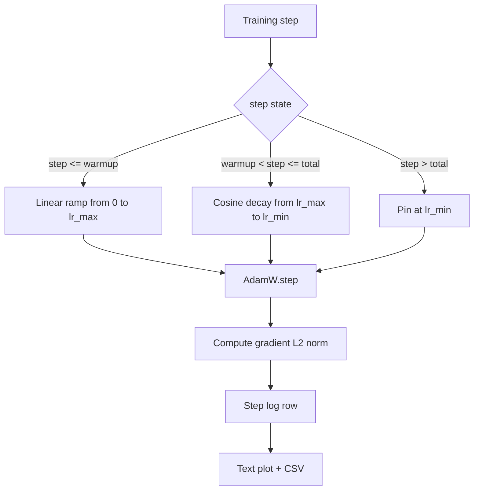

# Cosine LR với Linear Warmup

> Lịch trình học tập là quyết định quan trọng thứ hai sau hàm mất mát. AdamW với sự phân rã cosine và sự nóng lên tuyến tính là mặc định hiện đại cho đào tạo mô hình ngôn ngữ bởi vì nó cho phép mô hình nhìn thấy một kích thước bước hiệu quả nhỏ trong các bản cập nhật ngàn đầu tiên dễ vỡ, tăng lên đến một đỉnh cấu hình, và phân rã một cách trơn tru trở lại về phía không. Bài học này xây dựng lịch trình đó, vẽ đường cong trên các bước đào tạo, ghi lại các chuẩn mực gradient bên cạnh lịch trình, và chứng minh lịch trình tôn vinh giới hạn ấm lên, đỉnh cao và phân rã.

**Type:** Build
**Languages:** Python
**Prerequisites:** Phase 19 lessons 30-37
**Time:** ~90 minutes

## Mục tiêu học tập

- Thực hiện một máy tối ưu hóa AdamW được cáp vào một lịch trình tốc độ học tập cosine với nhiệt tuyến tính.
- Xét giá trị chính xác của lịch trình ở bất kỳ bước nào mà không có điểm nổi trôi qua các đường chạy.
- Lập trình L2 chuẩn bên cạnh tốc độ học tập để sức khỏe tập thể hiện được.
- Đưa lịch trình cho một bản đồ văn bản mà mắt có thể đọc và một CSV bất kỳ công cụ nào có thể tiêu thụ.

## Vấn đề

Hàng ngàn lần huấn luyện đầu tiên là tiếng ồn nhất. Các trọng lượng của mô hình vẫn gần như bắt đầu. Đánh giá thời gian thứ hai của người tối ưu hóa vẫn chưa ổn định. Tỷ lệ gradient là lớn và ồn ào. Nếu tốc độ học tập ở đỉnh cao trong những cập nhật này mô hình hoặc đi ngược thẳng hoặc định cư vào một cao nguyên mất mát nó không bao giờ thoát khỏi. Hai sự cố được biết đến là cắt gradient, là chủ đề của bài học giai đoạn 19 45, và một lịch trình tốc độ học tập bắt đầu nhỏ và tăng lên.

Chương trình cosine-with-warmup có ba khu vực.`warmup_steps`tốc độ học tập thay đổi theo đường thẳng từ 0 đến đỉnh được cấu hình `lr_max`Từ bước đi`warmup_steps`bước đi`total_steps`tốc độ học tập theo nửa trên của đường cong cosine, suy giảm từ `lr_max`đến`lr_min`Sau đó`total_steps`tốc độ học tập được gắn vào `lr_min`Vì vậy, một huấn luyện viên không đúng cách mà không thể rời khỏi lịch trình.

Vấn đề xây dựng là lịch trình dễ bị sai lầm một lần. Một lần đi lại chỉ xuất hiện trong sáu giờ trong một cuộc tập luyện như một tỷ lệ học tập quá cao hoặc quá thấp 1% vào thời điểm mô hình bắt đầu quá phù hợp, điều này là vô hình trừ khi lịch trình được kiểm tra đầy đủ ở ranh giới.

## Khái niệm



### Công thức làm nóng

Vì `step`trong `[0, warmup_steps]`với `warmup_steps > 0`, tỷ lệ học là `lr_max * step / warmup_steps`- Người bị mất tích`warmup_steps = 0`trường hợp được coi là "không ấm lên": lịch trình bắt đầu trực tiếp tại `lr_max`ở bước 0 và ngay lập tức xâm nhập vào sự phân hủy cosine.`warmup_steps = 0`để kiểm tra lịch trình vẫn tạo ra một đường cong có thể sử dụng.

### Công thức cosine

Vì `step`trong `(warmup_steps, total_steps]`tốc độ học là `lr_min + 0.5 * (lr_max - lr_min) * (1 + cos(pi * progress))`nơi `progress = (step - warmup_steps) / max(1, total_steps - warmup_steps)`- Tại `step = warmup_steps`cosine đánh giá đến `cos(0) = 1`, cho phép`lr_max`, phù hợp với điểm cuối nhiệt độ chính xác.`step = total_steps`cosine đánh giá đến `cos(pi) = -1`, cho phép`lr_min`, phù hợp với điểm cuối của sự phân hủy chính xác.

Sự liên tục ở cả hai điểm cuối không phải là một tai nạn.`step`Một lịch trình bị dán mất một giới hạn lần đầu tiên`lr_max`đã thay đổi.

### Lầu sau các bước tổng thể

Vì `step > total_steps`tốc độ học tập vẫn ở mức `lr_min`. Hợp đồng là rõ ràng: lịch trình không sai và không phân tích; nó đấm vào sàn và cho phép huấn luyện viên ghi một cảnh báo.`total_steps`Không phải vòng lặp.

### Lượng lượng tử chuẩn ghi lại cùng với tỷ lệ

Chương trình là một nửa của sức khỏe tập luyện. Tỷ lệ gradient là một nửa khác. Lòng tập luyện ghi lại cả hai từng bước. Một cuộc tập luyện khác nhau cho thấy mức độ gradient tăng lên trước khi mất mát xảy ra; một sự nóng lên được điều chỉnh tốt giữ cho chuẩn tăng lên theo tuyến tính với tốc độ; một đỉnh quá hung hăng xuất hiện như một chuẩn mà vẫn cao sau khi nóng lên.`step, lr, grad_l2_norm, loss`CSV là hồ sơ duy nhất bền vững.

```figure
cap-cosine-warmup
```

## Hãy xây dựng nó

`code/main.py`thực hiện:

- `CosineWithWarmup`- một chức năng không có quốc tịch `lr(step) -> float`trên lịch trình được cấu hình.
- `TrainState`- gói một mô hình, một `AdamW`Optimizer, và lịch trình thành một chức năng bước.
- `TrainState.step`- chạy một lần đi trước, một lần đi ngược, ghi lại chuẩn gradient L2, và áp dụng `lr(step)`cho người tối ưu hóa.
- `plot_schedule_ascii`- trình bày lịch trình như một bản đồ văn bản mà mắt có thể đọc.
- `write_schedule_csv`- phát ra một hàng mỗi bước với tốc độ học tập.

Một bản demo ở dưới cùng của tệp tạo ra một cái nhỏ `nn.Linear`mô hình, tàu cho 20 bước trên một loạt đầu vào cố định, và in tốc độ học tập mỗi bước, chuẩn gradient và mất mát.

Đi đi.

```bash
python3 code/main.py
```

Bản kịch bản sẽ đi ra khỏi 0 và in một nhật ký huấn luyện mỗi bước cộng với lịch trình.

## Các mẫu sản xuất

Bốn mô hình nâng lên lịch trình thành một đồ tạo tác sản xuất.

**Schedule lives in a config, not in code.**Người huấn luyện đọc `warmup_steps`- `total_steps`- `lr_max`- `lr_min`Từ một cấu hình YAML hoặc JSON được cam kết với git.

**Step counter is monotonic and decoupled from epochs.**Một số khung nhầm lẫn bước và thời đại khi bộ dữ liệu được chia nhỏ hoặc bộ tải dữ liệu khởi động lại.`global_step`Từ điểm kiểm soát của huấn luyện viên, không phải từ một bộ đếm địa phương. Một cuộc chạy tiếp tục ở vị trí lịch trình đúng vì bộ đếm bước là trục bền.

**Schedule plot in the run directory.**Mỗi lần tập luyện đều viết`outputs/lr_schedule.png`(hoặc trong bài học này một bản đồ văn bản) vào thư mục chạy. Một nhà phê bình đã sơ khai thư mục có thể kiểm tra lịch trình mà không cần chạy lại bất cứ điều gì. Điều này bắt được lớp lỗi lịch trình không được cấu hình đúng thời gian PR.

**Log row schema is fixed.** `step, lr, grad_l2_norm, loss`Một sổ ghi chép hoặc bảng điều khiển dòng chảy đọc kế hoạch; đổi tên một cột mà không đập một phiên bản vô hiệu hóa tất cả các bảng điều khiển hiện có.

## Sử dụng nó

Các mô hình sản xuất:

- **Sweep peak before sweeping anything else.** `lr_max`là nút nhạy cảm nhất. Đặt nó trên một mô hình nhỏ trước; tối ưu `lr_max`Scales yếu với kích thước mô hình, do đó, các mô hình nhỏ quét là một trước mạnh mẽ.
- **Warmup is a fraction of total steps, not an absolute count.**Một cuộc chạy 200 triệu bước với 2.000 bước làm nóng bắt đầu ở đỉnh cao gần như ngay lập tức; một cuộc chạy 20.000 bước với cùng một số lượng làm nóng lên 10% .
- **`lr_min` is non-zero on purpose.**Một tầng là 10% của `lr_max`giữ cho người tối ưu hóa học trong thời gian dài.`lr_min = 0`lịch trình tạo ra một đường cong đào tạo trông tuyệt vời trên một cốt truyện và một mô hình không thực sự hoàn thành đào tạo.

## Chuyển nó

`outputs/skill-cosine-warmup.md`sẽ, trên một dự án thực sự, mô tả cấu hình nào mang theo lịch trình, bước huấn luyện viên nào máy tính toàn cầu được đọc từ, và những gì `lr_max`Thử nghiệm này giúp động cơ được vận chuyển.

## Các bài tập

1. Thêm một biến thể ngược của đường lập trình và so sánh nó trên một cuộc chạy huấn luyện đồ chơi 200 bước.
2. Thêm một `--restart`cờ thêm một sự nóng lên thứ hai tại `total_steps / 2`Bảo vệ xem khởi động lại ấm có cải thiện hay bị tổn thương trong việc chạy đồ chơi.
3. Thêm một unit test rằng lịch trình là liên tục: cho mỗi bước trong `[0, total_steps]`sự khác biệt`|lr(step+1) - lr(step)|`được giới hạn bởi `lr_max / warmup_steps`- Tôi không biết.
4. Chuyển lịch trình vào một `torch.optim.lr_scheduler.LambdaLR`Bài học sử dụng một hàm bước đơn giản; bao bì thay đổi gì?
5. Thêm một `--plot-png`cờ viết một âm mưu thực sự qua `matplotlib`Bảo vệ liệu bản đồ văn bản của bài học hay PNG là mặc định tốt hơn cho các chạy CI.

## Các điều khoản chính

| Term | What people say | What it actually means |
|------|-----------------|------------------------|
| Warmup | "Slow start" | Linear ramp from zero to `lr_max` over the first `warmup_steps` updates |
| Cosine decay | "Smooth drop" | Upper-half cosine curve from `lr_max` to `lr_min` over the remaining steps |
| Floor | "After training" | The fixed `lr_min` value the schedule pins at past `total_steps` |
| Gradient norm | "L2 of grads" | The Euclidean norm of the concatenated gradient vector, logged each step |
| Global step | "Schedule axis" | A monotonic step counter that survives restarts and drives the schedule |

## Đọc thêm

- [Loshchilov and Hutter, SGDR: Stochastic Gradient Descent with Warm Restarts (arXiv 1608.03983)](https://arxiv.org/abs/1608.03983)- giấy tham chiếu của lịch trình cosine
- [Loshchilov and Hutter, Decoupled Weight Decay Regularization (arXiv 1711.05101)](https://arxiv.org/abs/1711.05101)- Báo cáo của AdamW
- [PyTorch torch.optim.lr_scheduler](https://docs.pytorch.org/docs/stable/optim.html#how-to-adjust-learning-rate)- các chức năng bước kết hợp với các lập trình khung
- Giai đoạn 19 · 42 - người tải xuống có cơ thể này lịch sử tiêu thụ
- Giai đoạn 19 · 43 - bộ tải dữ liệu lịch trình cùng phát triển với
- Giai đoạn 19 · 45 - cắt gradient và AMP, lớp tiếp theo trong vòng lặp
