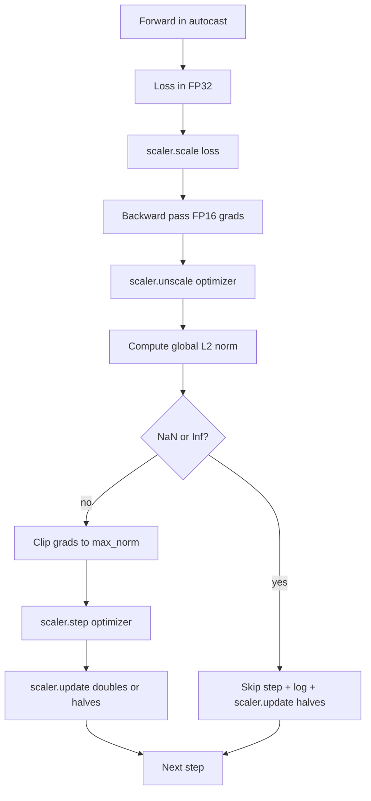

# Phong cắt và độ chính xác hỗn hợp

> Các tối ưu hóa và lịch trình từ bài học trước cho rằng gradient là hợp lý. Thường thì không. Một lô hàng xấu có thể tăng mức độ gradient lên 3 bậc. Việc đào tạo chính xác hỗn hợp tăng cường điều này bằng cách đưa FP16 tràn vào phía mất. Bài học này xây dựng hai dây an toàn mà đào tạo sản xuất không thể vận chuyển mà không có: cắt gradient cho một chuẩn L2 toàn cầu được cấu hình, và một vòng lặp chính xác hỗn hợp với tự độngcast và GradScaler phát hiện NaN và Inf, bỏ qua bước sạch sẽ, và ghi lại yếu tố quy mô cho pháp y.

**Type:** Build
**Languages:** Python
**Prerequisites:** Phase 19 lessons 30-37
**Time:** ~90 minutes

## Mục tiêu học tập

- Xét chuẩn L2 toàn cầu trên tất cả các gradient tham số và clip ở chỗ khi nó vượt quá ngưỡng được cấu hình.
- Lắp một bước huấn luyện trong tự động đúc cộng với một GradScaler để FP16 đi về phía trước và ngược vượt qua quá tải.
- Khám phá NaN và Inf trong mất mát hoặc gradient, bỏ qua bước tối ưu hóa, và ghi lại bỏ qua.
- Báo cáo nhân tố quy mô của GradScaler từng bước để một chuỗi dài của các nhảy được nhìn thấy ngay lập tức.

## Vấn đề

Một cuộc tập luyện hôm qua đã hoàn thành một đường cong thua lỗ đi thẳng đứng ở bước 8.217. Người phạm tội là một lô đơn với mức độ gradient là 4.200, gấp 20 lần đỉnh trước đó. Không cắt giảm, người tối ưu hóa áp dụng một bước đặt lại mọi bài học mà mô hình đã thực hiện trong giờ trước. Với một clip L2 toàn cầu ở chuẩn 1.0, cùng một lô đóng góp vào một bản cập nhật chuẩn đơn vị; lỗ vẫn ở trên đường xu hướng của nó; chạy tồn tại.

Việc đào tạo chính xác hỗn hợp đẩy thông qua gấp 2-3 lần bằng cách tính toán thông qua phía trước và hầu hết các thông qua ngược trong FP16. Chi phí là FP16 có phạm vi biểu tượng hẹp. Một gradient điển hình chảy qua trong FP16 đánh giá đến Inf, lây lan qua các lớp tiếp theo như NaN, đặt mọi trọng lượng lên NaN ở bước tối ưu hóa tiếp theo. GradScaler của PyTorch giải quyết điều này bằng cách nhân sự mất bằng một yếu tố quy mô lớn trước khi đi ngược và chia các gradient bằng cùng một yếu tố trước bước tối ưu hóa. Nếu bất kỳ gradient nào là Inf hoặc NaN tại thời gian không quy mô, người quy mô bỏ qua bước và giảm một nửa yếu tố quy mô; nếu các bước N trước đó sạch, người quy mô tăng gấp đôi yếu tố. Trong quá trình đào tạo, nhân tố tìm thấy giá trị cao nhất mà phạm vi FP16 cho phép.

Vấn đề xây dựng là dây kết nối hai đúng. clip trước khi unscaler và ngưỡng là trên gradient quy mô; clip sau unscale và thứ tự của các hoạt động trên GradScaler quan trọng.`scaler.scale(loss).backward()`, sau đó `scaler.unscale_(optimizer)`, sau đó `clip_grad_norm_`, sau đó `scaler.step(optimizer)`, sau đó `scaler.update()`Bất kỳ thứ tự nào khác cũng tạo ra một vòng tròn bị phá vỡ.

## Khái niệm



### Tỷ lệ L2 toàn cầu

Tự chuẩn toàn cầu L2 là chuẩn Euclidean của các đường dẫn gradient kết nối, chứ không phải là chuẩn mỗi tham số. PyTorch thực hiện điều này như `torch.nn.utils.clip_grad_norm_(parameters, max_norm)`. Chức năng trả lại chuẩn trước khi clip để bài học có thể ghi cả giá trị tự nhiên và cắt, cần thiết cho chẩn đoán "chúng ta đang cắt ở mỗi bước".

### autocast và GradScaler

`torch.amp.autocast(device_type)`là người quản lý bối cảnh chạy chọn lọc các hoạt động đủ điều kiện (nhất nhiều hoạt động lớp matmul) trong FP16. `torch.amp.GradScaler(device_type)`là trợ lý đo lường mất trước khi quay trở lại và ngược đo gradient trước bước tối ưu hóa. Hai được thiết kế cùng nhau; sử dụng một không có khác là một lỗi cấu hình mà bài kiểm tra nên bắt được.

Bài học sử dụng CPU tự độngcast bởi vì đó là những gì chạy trong CI; mô hình tương tự chuyển từ cho CUDA bằng cách thay đổi `device_type="cpu"`đến`device_type="cuda"`. GradScaler trên CPU là một stub (CPU autocast đã hoạt động trong BF16 theo mặc định và không cần quy mô mất mát), nhưng bài học bao gồm các địa điểm gọi vì vậy dây là giống hệt với vòng GPU.

### Khám phá NaN và Inf

Việc phát hiện xảy ra ở hai nơi.`torch.isfinite`trước khi trở lại; một lỗ Inf hoặc NaN không tạo ra gradient hữu ích và được bỏ qua mà không cần vào tối ưu hóa.`scaler.unscale_(optimizer)`Bài học sẽ quét các gradient không được quy mô bằng `has_non_finite_grad(...)`và đối xử với bất kỳ Inf hoặc NaN như một skip.

### Chẩn đoán yếu tố quy mô

Các yếu tố quy mô là trạng thái nội bộ của GradScaler.`scaler.get_scale()`và ghi nó bên cạnh tốc độ học tập và chuẩn gradient. một chạy khỏe mạnh cho thấy nhân tố quy mô leo lên trong sức mạnh của hai cho đến khi nó bão hòa gần`2^17`hoặc `2^18`Một chạy hành vi sai trái cho thấy yếu tố dao động giữa các giá trị cao và thấp, đó là tín hiệu rằng các gradient của mô hình đôi khi là trong phạm vi và đôi khi không.

```figure
grad-clip-monitor
```

## Hãy xây dựng nó

`code/main.py`thực hiện:

- `clip_global_l2_norm`- một cái bọc xung quanh `torch.nn.utils.clip_grad_norm_`trả lại cả chuẩn trước và sau khi clip.
- `has_non_finite_grad`- một trợ lý quét gradient cho NaN và Inf.
- `AmpTrainState`- gói một mô hình, một `AdamW`Optimizer, một GradScaler, và một thiết bị tự độngcast.`step(inputs, targets)`là chạy toàn bộ đường ống cắt, quy mô, và skip-on-NaN.
- `StepLog`và `SkipLog`- các hồ sơ cấu trúc từng bước.
- Một bản demo để huấn luyện một đứa trẻ nhỏ`nn.Linear`mô hình cho 20 bước, tiêm Inf vào gradient ở bước 5 để thực hiện đường nhảy, và in nhật ký kết quả.

Đi đi.

```bash
python3 code/main.py
```

Các kịch bản thoát khỏi số không và in một nhật ký mỗi bước với mỗi hàng được đánh dấu `STEP`hoặc `SKIP`; ít nhất một hàng là `SKIP`- Tôi không biết.

## Các mẫu sản xuất

Bốn mô hình nâng vòng lên một bước đào tạo sản xuất.

**Skip counter as an alert, not a log line.**Một số bước bỏ qua mỗi lần chạy tập luyện là lành mạnh. Hàng trăm bước nhảy mỗi thời đại là một cảnh báo khó khăn: mô hình đang trong chế độ FP16 không thể chịu đựng và vòng lặp đang âm thầm thất bại. Bài học theo dõi tốc độ nhảy lăn 1.000 bước và sẽ, trong sản xuất, trang trên tốc độ trên 5 phần trăm.

**Clip threshold lives in the config.** `max_norm = 1.0`là mặc định hiện đại cho đào tạo mô hình ngôn ngữ. Đầu tiên hãy quét nó trên một mô hình nhỏ; ngưỡng lớn hơn cho phép mô hình phục hồi từ các lô thực sự khó khăn; ngưỡng nhỏ hơn giới hạn trường hợp tồi tệ nhất với chi phí của một đường cong mất tiếng ồn hơn. Mức ngưỡng thuộc về cùng cấu hình YAML hoặc JSON như lịch trình từ bài học 44.

**Norm log goes to a CSV with the schedule.**Các cột CSV là `step, lr, grad_l2_pre_clip, grad_l2_post_clip, loss, skipped, skip_reason, scaler_scale`. Một người xem xét mở tập tin thấy lịch trình, các gradient câu chuyện, nhân tố quy mô, và kết quả bỏ qua (với lý do của nó) trong một hàng.

**`scaler.update()` runs every step, even on skip.**Trên một bước sạch, người đo lường đọc số không thông tin của nó, tăng nó, và có thể tăng gấp đôi nhân tố.`update()`trên đường trượt là lỗi tạo ra "scale factor không thay đổi".

## Sử dụng nó

Các mô hình sản xuất:

- **Autocast device matches optimizer device.** `torch.amp.autocast(device_type="cuda")`cho đào tạo GPU; `torch.amp.autocast(device_type="cpu")`cho CPU. Các thiết bị trộn tạo ra một lỗi kiểu im lặng xuất hiện như một đường cong mất mát trông tốt nhưng một mô hình không học tập.
- **Loss check before backward.** `torch.isfinite(loss).all()`là một sự giảm căng thẳng; chi phí là vô cùng đáng kể và tiết kiệm về một mất NaN là một bước đào tạo toàn bộ.
- **`set_to_none=True` in `zero_grad`.**Đặt gradient đến `None`thay vì không, cho phép tối ưu hóa bỏ qua tính toán cho các nhóm tham số không bị ảnh hưởng.

## Chuyển nó

`outputs/skill-clip-amp.md`sẽ, trên một dự án thực, mô tả những ngưỡng clip và thiết bị tự động phát sử dụng bước đào tạo, nơi CSV từng bước sống trong điều khiển phiên bản, và những gì ngưỡng cảnh báo sản xuất tốc độ skip là. Bài học này vận chuyển động cơ.

## Các bài tập

1. Thay thế tiêm Inf tổng hợp bằng một mức tăng tổn thất thực (nhiều lần mục tiêu của một lô bằng 1e8) và xác minh các kích hoạt đường thoát.
2. Thêm một `--bf16`chế độ chuyển đổi tự động phát lên BF16 thay vì FP16. BF16 có phạm vi biểu tượng rộng hơn FP16 và hiếm khi cần quy mô mất mát; xác minh tỷ lệ bỏ qua giảm xuống không trên cùng một demo.
3. Thêm một thử nghiệm đơn vị cho thấy bao bì clip gradient trả lại chuẩn trước và sau khi clip đúng khi không có cắt.
4. Thêm một tính toán tốc độ bỏ cửa sổ tròn và một cờ CLI không chạy nếu tốc độ vượt quá ngưỡng được cấu hình cho 100 bước liên tiếp.
5. Chuyển dây vòng để viết CSV Canonical (`step, lr, grad_l2_pre_clip, grad_l2_post_clip, loss, skipped, skip_reason, scaler_scale`) và xác nhận rằng tập tin tồn tại trong một Ctrl-C bằng cách rửa sạch sau mỗi hàng.

## Các điều khoản chính

| Term | What people say | What it actually means |
|------|-----------------|------------------------|
| Global L2 norm | "Clip target" | Euclidean norm of the concatenated gradient vector across all trainable parameters |
| autocast | "Mixed precision" | Selective FP16 (or BF16) execution of eligible operations inside a `with` block |
| GradScaler | "Loss scaler" | Helper that multiplies the loss before backward and inverse-scales gradients before the optimizer step |
| Skip | "Bad step" | An optimizer step refused because the gradient or loss was non-finite; the scaler halves the factor |
| Scaling factor | "Scaler state" | The GradScaler's current multiplier; doubles after clean stretches and halves on every skip |

## Đọc thêm

- [Micikevicius et al., Mixed Precision Training (arXiv 1710.03740)](https://arxiv.org/abs/1710.03740)- đề xuất quy mô tổn thất ban đầu
- [Pascanu, Mikolov, Bengio, On the difficulty of training recurrent neural networks (arXiv 1211.5063)](https://arxiv.org/abs/1211.5063)- giấy tham chiếu cắt gradient
- [PyTorch torch.amp.GradScaler](https://docs.pytorch.org/docs/stable/amp.html)- API quy mô bài học này kết thúc
- [PyTorch torch.nn.utils.clip_grad_norm_](https://docs.pytorch.org/docs/stable/generated/torch.nn.utils.clip_grad_norm_.html)- việc cắt cổ điển bài học này sử dụng
- Giai đoạn 19 · 42 - trình tải xuống có cơ thể cung cấp cho vòng lặp
- Giai đoạn 19 · 43 - bộ tải dữ liệu vòng lặp tiêu thụ
- Giai đoạn 19 · 44 - lịch trình vòng lặp này bao gồm
