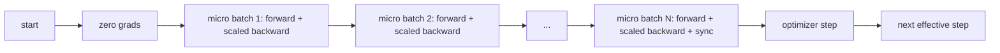
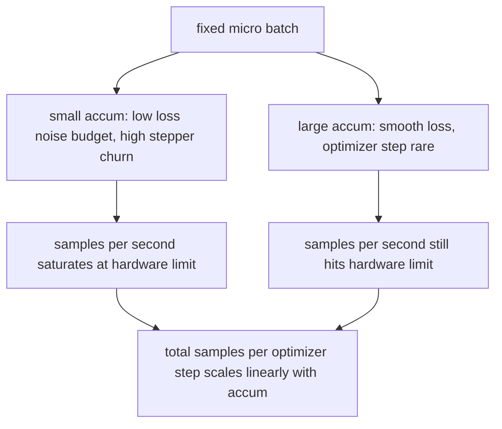

# Sự tích lũy dần

> Tập luyện với một loạt hiệu quả mà bạn không thể đủ khả năng, một loạt nhỏ một lúc.

**Type:** Build
**Languages:** Python
**Prerequisites:** Phase 19 lessons 42 to 45
**Time:** ~90 minutes

## Mục tiêu học tập

- Thuộc tính hiệu quả của lô: `effective_batch = micro_batch * accum_steps`- Tôi không biết.
- Thực hiện quy mô mất per micro batch để gradient tích lũy phù hợp với một batch hoàn toàn ngược lại.
- Tẩy đồng bộ hóa tối ưu hóa cho đến micro-batch cuối cùng (sinc-on-last-step).
- Đọc thông qua so với đường cong hàng hiệu quả và giải thích lợi nhuận giảm.

## Vấn đề

Bạn muốn tập luyện ở một số lượng hiệu quả là 512 bởi vì đường cong mất mát là mượt mà hơn và bước tối ưu hóa có ý nghĩa hơn ở quy mô đó. Máy đẩy trên bàn chứa 32 ví dụ trước khi nó hết bộ nhớ. Lần thứ hai không phải là lựa chọn. Tự phân nửa mô hình không phải là một lựa chọn. Trùi trường đạt được trong năm 2017 và không bao giờ ngừng sử dụng là chạy 16 lần đi ngược, để các gradient tích lũy bên trong các bộ đệm tham số, và chỉ bước vào tối ưu hóa khi số lượng đạt đến mục tiêu.

Nguy cơ là mất mát không còn là số lượng giống như nó ở lô lớn hơn. Sự tham nhũng chéo của 16 lô nhỏ được tổng hợp một cách ngây thơ là 16 lần mất mát của một lô đầy đủ. Không có quy mô, hướng nghiêng là đúng nhưng quy mô là sai, và bước tối ưu hóa là 16 lần quá lớn. Giải pháp là một phân chia. Giải pháp cũng dễ quên.

## Khái niệm



Hợp đồng ngắn:

- Lối mất cho mỗi micro-batch được chia bằng `accum_steps`trước đây`backward()`PyTorch tổng hợp các gradient thành `param.grad`mặc định; chia đẩy số tiền chạy trở lại quy mô đúng.
- Các bước tối ưu hóa phát ra một lần cho mỗi lô hiệu quả, sau khi micro-batch cuối cùng trở lại. bước giữa tích lũy lệch mọi tham số phần còn lại của chạy phụ thuộc vào.
- Tình trạng tối ưu hóa (giờ đệm khoá, khoảnh khắc Adam) tiến lên một lần cho mỗi bước hiệu quả, không phải một lần cho mỗi micro-batch.
- Trên một thiết bị duy nhất, đây là kế toán.`no_sync`ngữ cảnh bỏ qua gradient all-reduce; micro-batch cuối cùng giảm gradient tích lũy đầy đủ trong một lần thay vì trả chi phí mạng N lần.

### Bằng chứng tương đương trong mã

```python
loss = criterion(model(x_full), y_full)
loss.backward()
opt.step()
```

tương đương với

```python
for x, y in chunks(x_full, y_full, n):
    scaled = criterion(model(x), y) / n
    scaled.backward()
opt.step()
```

đến thứ tự tổng điểm nổi. Buffer gradient tích lũy ở cuối vòng lặp là cùng một tensor mà một loạt hoàn toàn ngược lại sẽ tạo ra. mã bài học khẳng định điều này với sự khác biệt max-abs dưới 1e-4 trong`equivalence_check`- Tôi không biết.

### Đi đâu là chi phí

Mỗi micro-batch chi phí một phía trước và một phía sau.`outputs/accum-curve.json`cho thấy những gì xảy ra khi lô hiệu quả phát triển ở lô nhỏ cố định:



Không có bữa trưa miễn phí.`accum_steps`thay đổi là sự khác biệt của ước tính gradient: với cùng ngân sách tường bạn đã thực hiện ít bước tối ưu hóa hơn nhưng mỗi bước được trung bình trên nhiều mẫu. Văn học xử lý lô lớn và lô nhỏ như các vấn đề tối ưu hóa khác nhau; bài học ở đây là cơ học, không phải thống kê.

```figure
cc-grad-accumulation
```

## Hãy xây dựng nó

`code/main.py`là vật thể có thể chạy được. Nó làm ba điều.

### Bước 1: Kiểm tra tương đương

`equivalence_check()`xây dựng hai bản sao của cùng một mạng với cùng một hạt giống. Một thấy một lô 16 mẫu trong một lần đi về phía trước.`max_abs_diff < 1e-4`- Tôi không biết.

### Bước 2: mô hình đồng bộ hóa bước cuối cùng

`train_one_optimizer_step`Đi bộ các lô vi nhỏ. cho mỗi lô vi nhỏ trừ lần cuối cùng nó vào.`no_sync_context(model)`. Trong một quá trình duy nhất, ngữ cảnh là không hoạt động; trên DDP đây là nơi mà gradient tất cả giảm được bỏ qua.`sync_counter`ghi lại bao nhiêu lần chúng tôi rời khỏi phạm vi no_sync; cho N micro-batch số là một cho mỗi bước hiệu quả, không phải N.

### Bước 3: đường cong thông qua

`sweep_effective_batches`chạy cùng một mô hình với một micro-batch cố định và một danh sách các bước tích lũy.

- `samples_per_sec`: tổng số mẫu được nhìn thấy chia theo thời gian tường
- `median_step_ms`: 50 phần trăm cho mỗi bước hiệu quả
- `sync_calls`: điểm tập thể được thực hiện
- `avg_loss`: trung bình qua các bước tối ưu hóa của việc lau

Lượng sản xuất xuống `outputs/accum-curve.json`và có thể được sử dụng lại từ sổ ghi chép.

Đi đi.

```bash
python3 code/main.py
```

Các kịch bản in sự tương đương khác biệt, sau đó là bảng trôi, sau đó là con đường JSON. mã thoát 0

## Sử dụng nó

Trong đào tạo sản xuất, sự tích lũy gradient sống sau một nút.`accumulation_steps = effective_batch // (micro_batch * world_size)`Các khung mà bạn không được phép sử dụng ở đây bao quanh cùng một vòng lặp, nhưng các bước là giống nhau: quy mô mất mát, bỏ qua đồng bộ hóa trên các máy vi mô không cuối cùng, tích lũy, bước một lần.

Ba mô hình trong tự nhiên:

- Số lượng micro-batch được chọn để làm bão hòa bộ nhớ thiết bị. Bất cứ thứ gì nhỏ hơn sẽ lãng phí chu kỳ tăng tốc. Bất cứ thứ gì lớn hơn sẽ bị hỏng.
- Các lô hiệu quả được chọn từ một lịch trình tốc độ học tập. Các lô hiệu quả lớn cần tốc độ học tập và nóng lên quy mô; đây là quy tắc quy mô tuyến tính được nói đến từ năm 2017.
- Số tích lũy là cầu giữa hai và nút duy nhất bạn có thể tự do điều chỉnh vào thời gian chạy mà không cần viết lại bộ tải dữ liệu.

## Chuyển nó

`outputs/skill-gradient-accumulation.md`bắt được công thức để một đồng nghiệp có thể thả nó vào một repo mới: giảm quy mô bởi `accum_steps`, bỏ qua đồng bộ hóa tối ưu hóa trên các vi mô không cuối cùng, bước tối ưu hóa một lần cho mỗi lô hiệu quả, ghi thông qua so với lô hiệu quả như JSON để giao dịch được nhìn thấy.

## Các bài tập

1. Lại chạy lại với `--num-steps 100`và lấy mẫu biểu đồ mỗi giây so với lô hiệu quả.
2. Thêm một biến thể quy mô sai (không phân chia) và hiển thị các tham số khác nhau ở bước 1 đối với tham chiếu.
3. Thay đổi SGD với AdamW và xác nhận trạng thái tối ưu hóa tiến triển một lần mỗi bước hiệu quả, không phải một lần mỗi micro-batch.
4. Hãy giới thiệu một thực `DistributedDataParallel``no_sync_context`xác nhận các cuộc gọi đồng bộ giảm N-1 cho mỗi lô hiệu quả.
5. Thay đổi kiểm tra tương đương để so sánh hai phân chia nhỏ khác nhau (2 x 8 so với 4 x 4) và giải thích bất kỳ sự dung nạp nào bạn cần để thư giãn.

## Các điều khoản chính

| Term | What people say | What it actually means |
|------|-----------------|------------------------|
| Micro batch | The batch you forward | The slice that fits in memory in a single forward pass |
| Accum steps | Backward passes per step | Number of backwards summed before one optimizer step |
| Effective batch | The batch | Micro batch times accum steps times data parallel world size |
| Loss scaling | Divide by N | Per-micro-batch division so summed gradients match full batch |
| Sync on last | Skip the rest | Only run the gradient collective on the last backward in the window |

## Đọc thêm

- Các tài liệu PyTorch trên `DistributedDataParallel.no_sync`cho phiên bản sản xuất của trò chơi đồng bộ hóa bước cuối cùng.
- Goyal et al., 2017, về quy mô tuyến tính cho đào tạo hàng loạt lớn, lý do truyền thống để quan tâm đến hàng loạt hiệu quả.
- PyTorch phát hiện theo dõi các tương tác tích lũy gradient với độ chính xác hỗn hợp không mở rộng.
- Các bài học giai đoạn 19 42 đến 45 bao gồm mô hình, bộ tải dữ liệu, tối ưu hóa và trình giảng dạy bài học này giả định.
- Chương 47 của giai đoạn 19 bao gồm kiểm soát và tiếp tục để một cuộc chạy dài tích lũy tồn tại trong một nắp đồng hồ.
