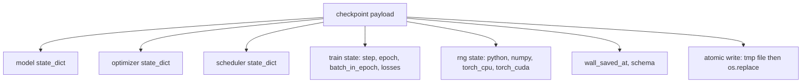
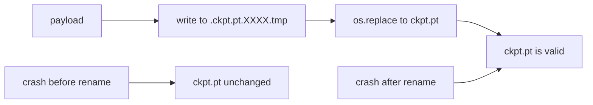
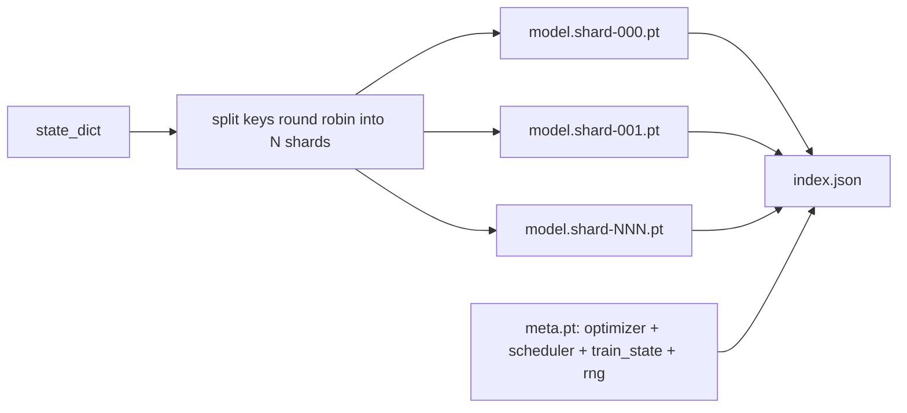

# Checkpoint Save và bắt đầu lại

> Đường sắt gián đoạn giết chạy; các điểm kiểm soát cho phép họ tiếp tục. lưu mô hình, tối ưu hóa, lập lịch, lịch sử mất mát, đếm bước, và trạng thái RNG, nguyên tử, vì vậy một giết bất cứ lúc nào để lại một tệp hợp lệ trên đĩa.

**Type:** Build
**Languages:** Python
**Prerequisites:** Phase 19 lessons 42 to 45
**Time:** ~90 minutes

## Mục tiêu học tập

- Giữ toàn bộ trạng thái huấn luyện thành một tải trọng hữu ích duy nhất có thể được tải lại vào một quá trình mới.
- Thực hiện lưu nguyên tử với viết-to-temp sau đó đổi tên để một vụ tai nạn không bao giờ để lại một tập tin nửa viết.
- Khôi phục trạng thái RNG cho Python, NumPy và PyTorch để mất sau resume phù hợp với đường cơ sở không bị gián đoạn.
- Xây dựng một bố cục điểm kiểm tra phân mảnh cho các mô hình không còn phù hợp với một tệp duy nhất, với các phân mảnh được xác minh bằng hash và chỉ số JSON.

## Vấn đề

Anh định làm việc huấn luyện 18 giờ. Bức cáp đồng hồ tường là 4 giờ. Cluster khởi động lại lúc 11 giờ vì ai đó trên cấp lương của bạn đã phê duyệt nâng cấp hạt nhân. Không có điểm kiểm soát thì bắt đầu lại. Không có resume bạn cũng mất trạng thái tối ưu hóa mà mất 11 giờ đầu tiên để học, vì vậy ngay cả khi trọng lượng mô hình tồn tại, những khoảnh khắc AdamW đã biến mất và bước tiếp theo đang ẩn náu theo hướng mà quỹ đạo đào tạo đã di chuyển qua.

Các tạo vật đúng là một tập tin duy nhất chứa tất cả mọi thứ cần thiết để tiếp tục: các tham số mô hình, trạng thái tối ưu hóa, trạng thái lập lịch, lịch sử mất mát cho các bản đồ, bước hiện tại và thời đại và số lượng hàng loạt trong thời đại, và trạng thái RNG cho mỗi nguồn ngẫu nhiên. Nếu không có trạng thái RNG, đường cong mất mát được nối lại là đường cong khác. Cùng một mô hình, cùng một dữ liệu, khác nhau trộn, khác nhau mặt nạ bỏ, khác nhau số trên bảng điều khiển.

Atomic save là nửa kia của hợp đồng. Việc viết vào tên tập tin cuối cùng có nghĩa là một tập tin crash mid-writing để lại một tập tin bị hỏng; resume đọc rác. Việc viết vào một tập tin tạm thời trong cùng một thư mục và sau đó đổi tên có nghĩa là một tập tin crash mid-writing để lại tập tin tốt trước đó không bị ảnh hưởng.

## Khái niệm



### 5 cái vỏ của tiểu bang

| Bucket | Why it matters |
|--------|----------------|
| Model | Weights and buffers; what the model is. |
| Optimizer | Momentum and adaptive moments; without these the next step is a different optimization problem. |
| Scheduler | Where the learning rate is on its curve; cosine schedules in particular care. |
| Train counters | Step, epoch, batch-in-epoch, plus the loss history that draws the dashboard. |
| RNG state | Determinism for dropout, data shuffling, and any sampling inside the model. |

### Cung cấp nguyên tử



Hai quy tắc. Thứ nhất, tệp tạm thời sống trong cùng thư mục với mục tiêu để đổi tên vẫn ở trong cùng một hệ thống tệp; đổi tên giữa các thiết bị không phải là nguyên tử. Thứ hai, tên tạm thời là độc đáo mỗi lần cố gắng để hai nhà văn không đạp chân.

### Các trạm kiểm soát bị phá vỡ

Khi mô hình lớn, tải trọng của một tập tin trở nên quá lớn để tải nhanh, quá lớn để kiểm tra, và quá đau khi một mạng chia sẻ hiccups giữa đọc.



Chỉ số ghi lại số lượng các mảnh, sha256 của mỗi mảnh và sha256 của tệp meta. Loader thất bại lớn khi bất kỳ hash nào không phù hợp. Các mảnh có thể hạ cánh trên các đĩa vật lý khác nhau; meta nhỏ và đọc trước.

### Đọc tiếp tiếp tục giữa thời đại

Một tiểu sử có thể bắt đầu với thời đại tiếp theo của chất thải ở bất cứ nơi nào từ vài phút đến một ngày.`(epoch, batch_in_epoch)`+ trạng thái RNG. Sau khi tải, vòng đào tạo nhanh chóng tiến về phía trước máy phát điện số ngẫu nhiên qua các lô đã tiêu thụ trong thời đại hiện tại và tiếp tục từ `batch_in_epoch`. Mã bài học làm điều này chính xác; khẳng định là quỹ đạo mất mát sau khi tiếp tục phù hợp với đường cơ bản không bị gián đoạn trong 1e-4.

```figure
cc-atomic-checkpoint
```

## Hãy xây dựng nó

`code/main.py`cung cấp bốn bộ máy nguyên thủy và một trình điều khiển demo.

### Bước 1: bắt và khôi phục trạng thái RNG

`capture_rng_state`trả lời một lệnh với Python `random.getstate`, NumPy `np.random.get_state`, và PyTorch CPU và CUDA RNG byte. `restore_rng_state`CPU tensor là một bộ đệm uint8 byte mà RNG của PyTorch biết tiêu thụ.

### Bước 2: tiết kiệm nguyên tử

`atomic_save`viết tải trọng hữu ích vào một tệp tạm thời trong thư mục mục tiêu, sau đó `os.replace`đổi nó thành tên cuối cùng. `atomic_write_json`làm tương tự cho chỉ số bị chia nhỏ.

### Bước 3: Đi lại và đi lại tại điểm kiểm soát đầy đủ

`save_checkpoint`gói mô hình, tối ưu hóa, lập trình, trạng thái tàu, và RNG vào một dict. `load_checkpoint`đảo ngược nó và trả lại một `TrainState`. Vùng schema là cái nón nâng cấp: thay đổi định dạng trong tương lai làm đập chuỗi phiên bản và bộ tải phát.

### Bước 4: biến thể bị chia nhỏ

`save_sharded_checkpoint`round-robins các phím tham số trên các mảnh N, viết mỗi mảnh với lưu nguyên tử riêng của nó, viết một tệp meta với tối ưu hóa và lập trình và trạng thái tàu, và viết chỉ số JSON với các mảnh sha256s. `load_sharded_checkpoint`xác minh từng mảnh trước khi sáp nhập.

### Bước 5: trình diễn tiếp tục

`run_resume_demo`đào một mô hình nhỏ cho `total_steps`, lưu một điểm kiểm soát tại `interrupt_at`, sau đó tiếp tục. Một quá trình thứ hai khôi phục điểm kiểm soát và chạy các bước còn lại. hàm trả lại sự khác biệt tuyệt đối tối đa giữa hai quỹ đạo mất mát sau khi điểm gián đoạn.

Đi đi.

```bash
python3 code/main.py
```

Các tập tin đơn và các bản demo từng mảnh đều khẳng định sự khác biệt tối đa dưới 1e-4.`outputs/resume-demo.json`- Tôi không biết.

## Sử dụng nó

Các thiết kế sản xuất xếp chồng để kiểm soát tàu như một phần của huấn luyện viên. hình dạng giống nhau: mô hình + tối ưu hóa + lập trình + đếm + RNG, được viết bằng nguyên tử, được đặt tên theo từng bước để dễ dàng tìm thấy.

Ba mô hình để thực thi:

- **Schema is a string in the payload.**Không có nó, bạn không thể phát triển định dạng mà không phá vỡ các đường chạy cũ.
- **Sha256 every shard.**Một tải xuống được cắt giảm âm thầm là loại lỗi tồi tệ nhất; bộ tải thất bại nhanh hoặc nó thất bại muộn.
- **Keep checkpoint cadence honest.**Hãy lưu lại từng bước N và mỗi phút đồng hồ, tùy thuộc vào bước nào ngắn hơn.

## Chuyển nó

`outputs/skill-checkpoint-save-resume.md`là công thức cho bất kỳ kịch bản đào tạo mới nào: hình dạng tải trọng, viết nguyên tử, ghi RNG, chỉ số phân mảnh.`save_checkpoint`tại địa điểm lưu định kỳ, dây `load_checkpoint`khi khởi động, và chạy sống sót sau khi giết người.

## Các bài tập

1. Thay thế phân mảnh tròn bằng phân mảnh theo nhóm tham số (phần kết thúc ở `.weight`vs `.bias`(văn số 1): Khi nào mỗi bố cục được ưa thích?
2. Lớn thêm vòng lưu để giữ các điểm kiểm soát K cuối cùng và cắt bỏ những điểm kiểm soát cũ hơn.
3. Thêm một `--ckpt-every-seconds`cờ kích hoạt một save trên một khoảng thời gian đồng hồ tường, không chỉ đếm bước.
4. Thêm một con đường xác minh số lượng kiểm tra chạy khi khởi động, quét mọi điểm kiểm tra trong thư mục, và báo cáo những gì bị tham nhũng.
5. Thực hiện một`migrate_v1_to_v2`hàm thêm một trường mới vào tải trọng và bumps chuỗi schema.

## Các điều khoản chính

| Term | What people say | What it actually means |
|------|-----------------|------------------------|
| Atomic save | "Write and pray" | Write to a temp file in the same directory, then os.replace into the target name |
| State dict | "The weights" | Model parameters and buffers, keyed by parameter name |
| Sharded checkpoint | "Big model file" | Multiple files, one per shard, plus a meta file and a JSON index with sha256s |
| RNG state | "Random seed" | Captured state for python random, numpy, torch CPU, torch CUDA; not just the seed |
| Mid-epoch resume | "Restart" | Fast-forward the RNG and continue from the next batch in the same epoch |

## Đọc thêm

- POSIX `rename`ngữ nghĩa cho tính nguyên tử tuyên bố rằng `os.replace`dựa vào.
- Tài liệu PyTorch về `torch.save`và `torch.load`, bao gồm `map_location`cho các thiết bị phục hồi chéo.
- Chương 46 của giai đoạn 19 bao gồm sự tích lũy gradient mà tải trọng điểm kiểm soát của bài học này tồn tại qua.
- Giai đoạn 19 bài học 48 bao gồm các gói phân phối có định dạng quy định của nhà nước phù hợp với chương trình này.
- Lòng lõi Linux `fsync`Tài liệu bảo đảm độ bền đằng sau đổi tên nguyên tử.
