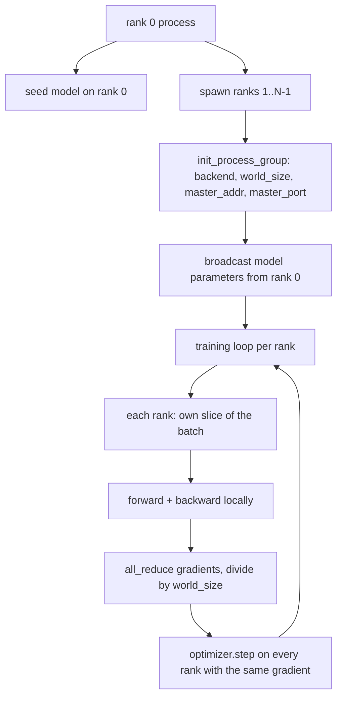
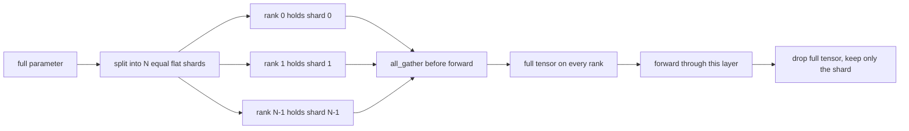

# Các dữ liệu phân phối song song và FSDP từ đầu

> Việc đào tạo đa cấp là hai tập thể và một quy tắc. Truyền thông các tham số khi khởi động, trung bình các gradient sau khi trở lại, không bao giờ để các cấp độ không đồng ý về bước mà họ đang đi.

**Type:** Build
**Languages:** Python
**Prerequisites:** Phase 19 lessons 42 to 45
**Time:** ~90 minutes

## Mục tiêu học tập

- Tạo ra một nhóm quá trình trên các hàng N với `gloo`Backend, không có phần cứng đặc biệt.
- Thực hiện một lớp phủ DDP tối thiểu phát sóng các tham số khi xây dựng và giảm gradient sau khi quay trở lại.
- Bằng chứng rằng sự giảm hoàn toàn các gradient mỗi cấp độ phù hợp với một gradient quá trình đơn trên đầu vào kết nối.
- Bước phác thảo FSDP: mỗi bậc chứa một mảnh, tensor đầy đủ được thu thập cho đi trước và rơi sau đó.

## Vấn đề

Mô hình này phù hợp với một thiết bị. Bộ dữ liệu không có. Ngân sách tối ưu hóa nói rằng bạn muốn xem N nhân các ví dụ mỗi giây. Cánh đòn đầu tiên là các dữ liệu song song: mỗi cấp độ chạy cùng một mô hình trên một mảnh khác nhau của lô, sau đó trung bình gradient trước bước tối ưu hóa. Cánh đòn thứ hai là FSDP: mô hình cũng không phù hợp với một thiết bị, vì vậy mỗi bậc giữ một phần nhỏ của mỗi tham số và tái cấu trúc các tensor đầy đủ lớp theo lớp trong quá trình đi về phía trước.

Nếu các tham số di chuyển qua các hàng, thì chạy bị hỏng lặng lẽ. Nếu bạn trung bình gradient nhưng không mất mát bảng điều khiển nằm. Nếu nhóm backend không thể đồng ý về một topology, chạy sẽ treo mãi mãi. Giải pháp là viết tập thể bằng tay một lần và không bao giờ tin vào một gói mà bạn không thể tái tạo.

Bài học này chạy trên CPU. CUDA không được giả định.`gloo`Các tàu hậu thuẫn với mỗi PyTorch xây dựng và chấp nhận `torch.multiprocessing`công nhân; cùng mã chuyển sang `nccl`trên một nút đa GPU mà không thay đổi cấu trúc.

## Khái niệm



### Hai nhóm quan trọng

| Collective | What it does | When |
|------------|--------------|------|
| `broadcast` | Copy a tensor from one rank to all others | Parameter init, scheduler state, any one-to-all sync |
| `all_reduce` | Sum (or mean, or max) a tensor across all ranks, every rank gets the result | Gradient averaging after backward |
| `all_gather` | Each rank contributes a tensor, every rank gets the concatenation | Logits collection, FSDP parameter unshard |

Hợp đồng DDP là`broadcast`trong việc xây dựng và`all_reduce`Sau khi quay trở lại.`all_gather`trước khi mỗi lớp đi về phía trước.

### Phương tiện trung bình gradient phù hợp gradient đơn quá trình

Một mô hình được đào tạo trên một loạt các ví dụ B trên các hàng N phải tạo ra cùng độ lệch như một khóa đào tạo đơn phương trên một loạt N * B. Trù là cộng các độ lệch mỗi hàng và chia bằng N tạo ra độ lệch mất trung bình, đó là những gì entropy chéo với giảm trung bình sẽ tạo ra trên toàn bộ hàng. Mã bài học khẳng định điều này với `max-abs-diff < 1e-3`giữa gradient giảm toàn bộ thủ công và gradient đơn quá trình tham chiếu.

### Bản phác thảo của FSDP



Khoản ghi nhớ thắng chính xác: trí nhớ mỗi cấp bậc cho các tham số giảm xuống 1/N. Chi phí là tập hợp, được trả mỗi lần đi về phía trước. sản xuất FSDP chồng chéo tập hợp với tính toán của lớp trước vì vậy chi phí đồng hồ tường nhỏ hơn nhiều so với dự đoán kế toán ngây thơ. Bài học thực hiện chuyến đi về và về trên mỗi tham số và khẳng định việc tái tạo là bit bằng với nguyên bản.

### CPU và nền nền ghê tởm

CUDA là mục tiêu sản xuất, nhưng các đường mã tương tự tồn tại trên CPU. `gloo`là CPU backend tập thể. Nó chậm hơn `nccl`trên GPU theo thứ tự kích thước, nhưng bề mặt API là giống nhau.`backend="gloo"`và các hàng được sinh ra với `torch.multiprocessing`thay vì`torchrun`; cả hai đều kết thúc cùng một lúc `torch.distributed`Trong một nút đa GPU, những thay đổi duy nhất là `backend="nccl"`, các tensor thiết bị, và `torchrun`để phóng.

```figure
cg-allreduce-ring
```

## Hãy xây dựng nó

`code/main.py`là vật cổ vật có thể chạy.

### Bước 1: đưa ra nhóm quy trình

```python
os.environ["MASTER_ADDR"] = "127.0.0.1"
os.environ["MASTER_PORT"] = str(port)
dist.init_process_group(backend="gloo", rank=rank, world_size=world_size)
```

`MASTER_ADDR`và `MASTER_PORT`Các bài học chọn một cổng miễn phí thông qua một thủ thuật liên kết và đóng để tránh va chạm khi nhiều lần chạy cùng một máy.

### Bước 2: phát sóng tại công trình

`MinimalDDP.__init__`đi qua mọi tham số và bộ đệm và cuộc gọi `dist.broadcast(tensor, src=0)`Các giá trị của hạng 0 trở thành init. Nếu không có nó, mỗi hạng bắt đầu với hạt giống của riêng mình và các hạng khác nhau từ bước một.

### Bước 3: giảm tất cả các gradient sau khi quay trở lại

```python
def all_reduce_grads_(module, world_size):
    for p in module.parameters():
        if p.grad is None:
            p.grad = torch.zeros_like(p.data)
        dist.all_reduce(p.grad.data, op=dist.ReduceOp.SUM)
        p.grad.data.div_(world_size)
```

Mỗi cấp bậc kết thúc với cùng một gradient trung bình. bước tối ưu hóa bây giờ là một hàm của cùng đầu vào trên mỗi cấp bậc, đó là lý do tại sao các tham số vẫn đồng bộ trong suốt chạy.

### Bước 4: chứng minh sự tương đương

`manual_all_reduce_matches_single_process`xây dựng mô hình tương tự trên bậc 0 và so sánh gradient sau tất cả giảm so với gradient một quá trình duy nhất sẽ tính toán trên đầu vào kết nối.

### Bước 5: chuyến đi về FSDP

`fsdp_round_trip_sketch`làm phẳng mỗi tham số, pads đến nhiều hơn `world_size`, cắt, tổng hợp, và unpads. mỗi bậc tái tạo bằng với nguyên bản. Đây là bước không chia; ngược (đánh lại sau phía trước) là một mảnh khỏi tensor được thu thập.

Đi đi.

```bash
python3 code/main.py
```

Cỡ thế giới mặc định là 2. Hai CPU xử lý sinh ra, nói chuyện với nhau thông qua `gloo`, và thoát 0 .`outputs/ddp-demo.json`ghi lại tổng số tham số cho mỗi cấp bậc, chuẩn gradient sau khi giảm tất cả, kết quả chuyến đi về FSDP và sự khác biệt gradient hướng dẫn đối với tham chiếu.

## Sử dụng nó

Các tập luyện sản xuất gọi là nguyên thủy.`DistributedDataParallel`thêm: các hook gradient hậu hậu hậu chồng chéo tất cả giảm với trở lại, bucketed tất cả giảm kết hợp một số gradient nhỏ thành một tập thể, và `no_sync`ngữ cảnh bài học 46 được sử dụng.

FSDP của PyTorch thêm: một khung cảnh tham số phẳng cho mỗi lớp vì vậy mỗi bậc giữ một bộ đệm liền kề, chồng chéo của lớp tiếp theo không chia với tính toán của lớp hiện tại, và CPU tùy chọn cho các mảnh.

Hình dạng vẫn giống nhau: phát sóng khi khởi động, giảm sau khi quay trở lại, phân mảnh các tham số khi chúng không còn phù hợp nữa.

## Chuyển nó

`outputs/skill-distributed-fsdp-ddp.md`mang theo công thức cho một kịch bản đào tạo mới: xoay nhóm quá trình với `gloo`cho CPU và `nccl`cho GPU, bọc mô hình trong một vỏ DDP phát sóng khi xây dựng và giảm sau sau ngược, tùy chọn phân mảnh các tham số với mô hình all_gather từ bản phác thảo FSDP.

## Các bài tập

1. Đi cùng `--world-size 4`và xác nhận rằng số tiền phân tán của param vẫn ở dưới 1e-3 trong suốt cuộc chạy.
2. Thay thế trung bình thủ công bằng `dist.all_reduce(op=dist.ReduceOp.AVG)`và thời gian khác biệt.
3. Thêm một cái nát sau đệm trở lại vào bọc DDP để tất cả giảm chồng chéo với phần còn lại của đệm trở lại; đo sự cải thiện đồng hồ tường.
4. Thực hiện bước chia lại FSDP: sau khi đi về phía trước, thay thế tensor đầy đủ bằng chia địa phương một lần nữa.
5. Chuyển backend thành `nccl`ghi vào hộp CUDA. ghi chú biến môi trường nào thay đổi và nào vẫn không thay đổi.

## Các điều khoản chính

| Term | What people say | What it actually means |
|------|-----------------|------------------------|
| Backend | "gloo or nccl" | The library that implements the collective ops; gloo is CPU, nccl is GPU |
| World size | "Total ranks" | Number of processes in the group; the group is the unit collectives operate on |
| Rank | "Worker id" | Process identifier within the group, zero indexed |
| All-reduce | "Sum the grads" | Sum a tensor across all ranks, every rank ends with the same result |
| Unshard | "Gather the params" | Reconstruct the full tensor from per-rank slices via all_gather |

## Đọc thêm

- PyTorch `torch.distributed`tài liệu cho ngữ nghĩa tập thể bài học này dựa trên.
- - `gloo`danh sách tập thể của thư viện, giống nhau với hình dạng được hỗ trợ bởi CUDA `nccl`những người nguyên thủy.
- Giai đoạn 19 bài học 46 cho mô hình tích lũy gradient bao gồm DDP tất cả giảm trong `no_sync`- Tôi không biết.
- Giai đoạn 19 bài học 47 cho bố cục kiểm soát tồn tại DDP và FSDP chạy.
- Tài liệu FSDP PyTorch cho việc thực hiện sản xuất của các phân mảnh tham số được phác thảo ở đây.
