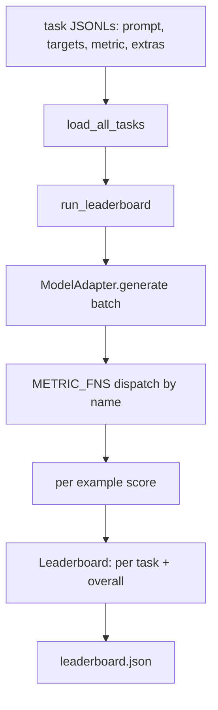
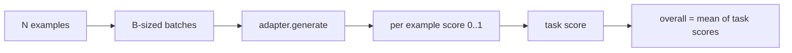

# Tạo dụng đánh giá mô hình ngôn ngữ

> Một mô hình làm tốt trong một nhiệm vụ mà bạn không thể xác định là một mô hình làm tốt trong một tình huống.

**Type:** Build
**Languages:** Python
**Prerequisites:** Phase 19 lessons 42 to 45
**Time:** ~90 minutes

## Mục tiêu học tập

- Định nghĩa một nhiệm vụ như một tệp JSONL với `prompt`- `targets`- `metric`, và tùy chọn `extras`Ví dụ:
- Thực hiện năm số liệu: phù hợp chính xác, rouge-l F1, kiểm tra thực thi, nhiều lựa chọn, và chứa chuỗi phụ.
- Xây dựng một bộ chạy bộ tập hợp các ví dụ cho mỗi nhiệm vụ và gửi đến một bộ chuyển đổi mô hình có thể thay đổi.
- Giả ra một bảng xếp hạng JSON với điểm số mỗi nhiệm vụ, độ trễ và trung bình tổng thể có thể tái tạo.

## Vấn đề

Một mô hình ngôn ngữ mới xuất hiện mỗi tuần. Người ta tuyên bố rằng nó hoạt động tốt. Câu hỏi trung thực là: tốt với cái gì? Câu trả lời trung thực là bảng xếp hạng mà bạn tự viết, bởi vì bảng xếp hạng của nhà cung cấp là những gì họ đã theo dõi.

Nếu không có một vòng xoáy trong repo của bạn bạn so sánh hai mô hình theo vibes. Với một vòng xoáy bạn so sánh chúng theo điểm số trên một bộ nhiệm vụ cố định với một métric cố định, trên một đầu ra JSON bạn có thể khác biệt.

Cái bẫy là quá phù hợp với một mô hình. Việc sửa chữa là cùng một cái bẫy ngược lại: vòng xoáy đủ nhỏ để đọc trong mười lăm phút, các nhiệm vụ đủ nhỏ để gửi vào repo, các số liệu được viết từ đầu để một đồng nghiệp có thể kiểm tra chúng, và bộ điều chỉnh là nơi duy nhất mã cụ thể mô hình sống. Thay đổi bộ điều chỉnh, bảng xếp hạng di chuyển; thay đổi các nhiệm vụ, bảng xếp hạng di chuyển. Không gì khác nên di chuyển.

## Khái niệm



### Tác phẩm đặc trưng

Mỗi ví dụ là một dòng JSONL:

```json
{"id": "arith-00", "prompt": "compute: 2 + 2", "targets": ["4"], "metric": "exact_match"}
```

Đối với các số liệu cần trợ lý ghi điểm,`extras`mang tải trọng hữu ích bên:

```json
{
  "id": "code-00",
  "prompt": "python: write a function f that doubles its input",
  "targets": ["ok"],
  "metric": "code_exec",
  "extras": {"io_pairs": [[1, 2], [3, 6]]}
}
```

Một nhiệm vụ là một nhiệm vụ.`.jsonl`tệp dưới `outputs/tasks/`Tên tập tin là tên nhiệm vụ. Tất cả các ví dụ trong một tập tin chia sẻ một métric.

### 5 nhiệm vụ cố định

| Task | Metric | What it tests |
|------|--------|---------------|
| arithmetic | exact_match | Token-level correctness on a deterministic answer |
| summary | rouge_l | Longest common subsequence F1 against a one-line reference summary |
| code-exec | code_exec | Executable test: the predicted function must satisfy a list of input-output pairs |
| multiple-choice | multiple_choice | First letter of the prediction must match an allowed letter |
| generation | substring_contains | Free-form text must contain at least one target substring |

### Hợp đồng metric

Mỗi métric là một hàm từ `(prediction, targets, extras) -> float in [0.0, 1.0]`. Các vòng xoáy trung bình điểm trên mỗi ví dụ để có được điểm số nhiệm vụ, sau đó trung bình điểm số nhiệm vụ để có được tổng thể. Các hàm số là nhỏ:

- `exact_match`: chữ nhỏ, không gian trắng sụp đổ, bình đẳng.
- `substring_contains`: bình thường hóa, thử nghiệm phụ.
- `multiple_choice`: nhân vật đầu tiên được đeo lên.
- `rouge_l`: LCS dài chia bằng độ dài dự đoán và tham chiếu, F1 độ chính xác và thu hồi.
- `code_exec`: thực hiện dự đoán trong một không gian tên hạn chế, gọi `f(x)`trên mỗi cặp đầu vào-tả ra, đếm các trận đấu.

Các code_exec métric chạy dự đoán trong một không gian tên builtin bị tẩy.`import os`nổ ra vì `os`không nằm trong không gian tên; bạn không thể truy cập hệ thống tệp từ dự đoán mã.

### Bộ chuyển đổi mô hình

```python
class ModelAdapter(Protocol):
    def generate(self, prompts: Sequence[str]) -> List[str]: ...
    @property
    def name(self) -> str: ...
```

Chuyện chuyển đổi là cái lắp ráp.`ToyAdapter`, một bộ kết hợp mô hình xác định học trả lời đúng cho mỗi cú nhắc trong năm nhiệm vụ cố định. Một bộ điều chỉnh thực sự gọi mô hình và trả lại đầu ra của nó.

### Người chạy

`run_task`hàng`batch_size`các yêu cầu tại một thời điểm và gửi đến hàm métric. `run_leaderboard`Đi theo mọi nhiệm vụ và trung bình. `write_leaderboard`phát JSON với một chuỗi schema để thay đổi định dạng trong tương lai không im lặng phá vỡ bảng điều khiển.



```figure
eval-harness-matrix
```

## Hãy xây dựng nó

`code/main.py`là vật cổ vật có thể chạy.

### Bước 1: nhiệm vụ cố định hạt giống

`seed_fixture_tasks(target_dir)`viết ra năm `.jsonl`Lần đầu tiên của `main.py`bồi hạt chúng khi thư mục trống.

### Bước 2: Nhiệm vụ tải

`load_all_tasks(task_dir)`đọc mọi thứ `.jsonl`và trả lại một lệnh từ tên nhiệm vụ cho một danh sách của `Example`ghi chép. dòng bình luận bắt đầu với `#`và các dòng trống được bỏ qua để người đóng góp có thể ghi chú các tệp.

### Bước 3: thực hiện các métrics

Mỗi thước đo là một hàm nhỏ với một unit test. Suite thử nghiệm của bài học bao gồm 13 trường hợp bao gồm bình thường hóa, che phủ một phần, thực thi mã và từ chối mã không an toàn.

### Bước 4: ghi tên chạy

`run_task`lặp lại các lô và tạo ra một `TaskResult`với điểm số, đếm đúng, tổng số và thời gian trễ. `run_leaderboard`đi tất cả các nhiệm vụ và tạo ra một `Leaderboard`với mức trung bình tổng thể.

### Bước 5: phát JSON

`write_leaderboard`- Nó sẽ làm cho bảng này trở nên liên tục.`--include-per-example`flag dumps các hồ sơ mỗi ví dụ để bạn có thể phân biệt dự đoán so với chạy trước khi điểm di chuyển.

Đi đi.

```bash
python3 code/main.py
```

Các kịch bản gieo hạt các thiết bị trên lần đầu tiên chạy, ghi điểm chúng với bộ điều chỉnh đồ chơi (được nhận được mọi thiết bị đúng), và viết `outputs/leaderboard.json`. Điểm tổng thể là 1.0 với bộ điều chỉnh đồ chơi; thử nghiệm bộ điều chỉnh vật liệu trong `test_main.py`cho thấy cùng một vòng xoáy tạo ra 0.0 khi bộ điều chỉnh không thể trả lời.

## Sử dụng nó

Để kết nối một mô hình thực sự, hãy viết một bộ chuyển đổi.

```python
class HttpAdapter:
    name = "vendor.v1"

    def __init__(self, endpoint, api_key):
        self.endpoint = endpoint
        self.api_key = api_key

    def generate(self, prompts):
        out = []
        for prompt in prompts:
            response = http_post(self.endpoint, prompt, self.api_key)
            out.append(response["text"])
        return out
```

Thay đổi `ToyAdapter`cho `HttpAdapter`ở đỉnh `main()`- Cải dây, nhiệm vụ, số liệu và bảng xếp hạng vẫn giống nhau.

Ba mô hình phải thực thi khi vận chuyển dây đeo trong một dự án thực:

- **Pin the task files.**Các bảng xếp hạng.json mang nội dung nhiệm vụ được gắn vào hash hoặc nó mang các JSONL bên cạnh; nếu không điểm số di chuyển khi các tệp nhiệm vụ làm, và bạn không thể nói được.
- **Diff predictions, not just scores.**- `--include-per-example`Flag cho phép bạn xem mô hình nói gì vào ngày điểm số giảm.
- **Cap the batch size.**Các bộ điều chỉnh thực sự có giới hạn tốc độ.

## Chuyển nó

`outputs/skill-lm-eval-harness.md`mang công thức: JSONL task spec, năm métrics, adapter swappable, batched runner, leaderboard JSON với chuỗi schema.`outputs/tasks/`là các thiết bị; sao chép chúng vào một dự án thực sự như một khởi đầu.

## Các bài tập

1. Thêm một nhiệm vụ thứ sáu với một số liệu tùy chỉnh bạn viết từ đầu (bên chồng chất giống BLEU, điểm tham chiếu giống BLEURT, bất cứ điều gì có hợp đồng rõ ràng).
2. Tăng `code_exec`để bắt được sự cố và chấp nhận một danh sách các sự cố dự kiến như là mục tiêu.
3. Thêm một lệnh phân biệt bảng xếp hạng: cho hai `leaderboard.json`các tập tin, in các nhiệm vụ chuyển động và bằng bao nhiêu.
4. Ví dụ: thời gian trễ giới hạn. Lói gọi bộ điều chỉnh trong một thời gian nghỉ; bề mặt riêng `timeouts`cột trong bảng xếp hạng.
5. Pin nội dung nhiệm vụ với sha256 trong bảng xếp hạng để một người đọc trong tương lai có thể xác minh họ đã ghi điểm cùng các nhiệm vụ.

## Các điều khoản chính

| Term | What people say | What it actually means |
|------|-----------------|------------------------|
| Task spec | "The eval format" | JSONL file with prompt, targets, metric, optional extras per example |
| Metric | "How you score" | Function from (prediction, targets, extras) to a float in [0, 1] |
| Adapter | "The model client" | Object with a generate(prompts) -> list[str] method; the only model-specific code |
| Leaderboard | "The scoreboard" | JSON with per-task scores, total counts, latency, and an overall average |
| Code exec metric | "Run it and check" | Execute the prediction in a restricted namespace, compare against input-output pairs |

## Đọc thêm

- Lợi dây đánh giá lm ban đầu cho tham chiếu sản xuất, lớn hơn nhiều nhưng cùng một hình dạng.
- HuggingFace đã đưa ra một thỏa thuận thay thế cho việc thực hiện cùng một hợp đồng.
- Giai đoạn 19 bài học 46 bao gồm các mô hình tích lũy gradient được sử dụng trong tập luyện xếp chồng điểm của vòng xoáy.
- Chương 47 của giai đoạn 19 bao gồm định dạng điểm kiểm soát mà bạn ghi điểm; ghi dấu hash điểm kiểm soát trong bảng xếp hạng.
- Giai đoạn 19 bài học 48 bao gồm các tập huấn phân tán đã tạo ra mô hình đang thử nghiệm.
