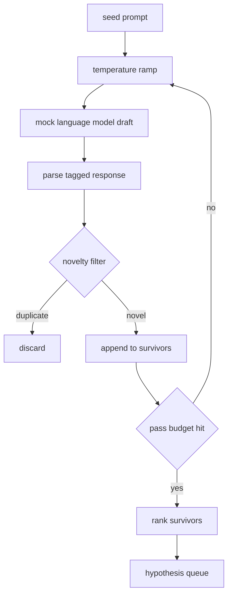

# Generator giả thuyết

> Một đại lý nghiên cứu hỏi cùng một câu hỏi hai lần là lãng phí token.

**Type:** Build
**Languages:** Python
**Prerequisites:** Phase 19 Track A lessons 20-29
**Time:** ~90 minutes

## Mục tiêu học tập
- Đưa một mẫu từ một mẫu hạt giống và biến các sản phẩm của nó thành các hồ sơ giả thuyết được đánh dấu.
- Tăng nhiệt độ mẫu trên mỗi lần đi để dự thảo tiếp theo di chuyển xa hơn so với dự thảo cuối cùng.
- Trình gần các bản sao với mô hình nhúng nhỏ và ngưỡng khoảng cách cosine.
- Đánh giá những người sống sót theo một chức năng điểm điểm kết hợp sự mới lạ, đặc biệt và khả năng kiểm tra.
- Giữ từng bước xác định để giống giống nhau luôn tạo ra hàng hàng.

## Tại sao tạo ra, sau đó lọc

Một nhà lập kế hoạch hỏi một mô hình một lần nhận được một giả thuyết. Điều đó tốt cho một ví dụ được làm việc. Đối với một vòng nghiên cứu nó là hình dạng sai. vòng muốn một hàng xếp hạng với độ sâu, vì vậy khi giả thuyết đầu tiên thất bại người chạy có một giả thuyết tiếp theo sẵn sàng mà không trả tiền cho một lần vượt qua mẫu đầy đủ khác.

Hai ý tưởng kết hợp để tạo ra hàng. Thứ nhất là nhiệt độ tăng: mỗi lần đi qua mẫu tăng nhiệt độ một đục, vì vậy các bản thảo sau này được khuyến khích lang thang. Thứ hai là lọc mới: sau mỗi bản thảo, máy phát điện đo khoảng cách nhúng từ mỗi người sống sót trước đó và từ chối bất cứ điều gì bên trong cụm.

Bài học gửi một mô hình ngôn ngữ giả mạo trả lại chuỗi mã thông báo kịch bản cho các lời nhắc cố định. Mô hình giả mạo là đủ để thực hành toàn bộ con đường: lời nhắc hạt giống vào, đường băng nhiệt độ được áp dụng, ứng cử viên phân tích, bộ lọc mới chạy, xếp hàng ra.

## Hình dạng giả thuyết

```text
Hypothesis
  id             : int           (monotonic within a run)
  text           : str           (the claim)
  variables      : list[str]     (what changes between conditions)
  metric         : str           (what the runner will measure)
  baseline_ref   : str | None    (which paper or run the comparison cites)
  draft_pass     : int           (which sampler pass produced this)
  temperature    : float         (the sampler setting at draft time)
  novelty_score  : float         (distance from prior survivors, 0..1)
  rank_score     : float         (weighted sum used for ordering)
```

`variables`và `metric`Các bài học này không phải là văn bản tự do. Các trình phân tích thu thập chúng từ một câu trả lời được gắn thẻ. người chạy trong bài học 52 đọc các trường này trực tiếp khi nó xây dựng cấu hình thí nghiệm.

`baseline_ref`Nếu giả thuyết bỏ qua một, người đánh giá sẽ quay lại chạy trước trên cùng một số liệu.

```figure
cg-novelty-ramp
```

## Kiến trúc



Phần thú vị là mỗi hộp có một hợp đồng khó khăn.

## Phạm nhiệt độ

Bắt đầu từ `t_min`, kết thúc tại `t_max`, bước `(t_max - t_min) / (n_passes - 1)`. Mỗi lần đi qua gọi mẫu ở nhiệt độ hiện tại, tạo ra `n_passes`Giá trị khoảng cách đồng đều từ `GeneratorConfig.schedule()`Mô hình giả tạo tôn trọng nhiệt độ bằng cách chuyển đổi giữa một bộ nhỏ của các câu trả lời kịch bản được khóa `(prompt, temp_bucket)`Các thùng chứa là khoảng thời gian mở do đó một sự thay đổi nhiệt độ nhỏ chọn một thùng chứa khác và tạo ra một bản thảo khác.`temperature=t`đã đi qua.

Lịch trình mặc định là 6 bước từ `0.2`đến`1.2`6 là đủ để lấp đầy hàng không phải trả tiền cho các mẫu mà bộ lọc mới sẽ từ chối bất cứ cách nào.`0.2`Mô hình lúa bạt quay lại hạt giống.`1.2`các câu trả lời có xu hướng đi xa khỏi chủ đề và thất bại trong trình phân tích.

## Bộ lọc mới

Sau khi mỗi bản thảo được phân tích, máy phát điện nhúng văn bản và so sánh với mọi giả thuyết được chấp nhận.`1 - dot(a, b)`Một dự thảo được chấp thuận nếu khoảng cách tối thiểu của nó với bất kỳ người sống sót trước đó là trên .`novelty_threshold`- Tầm là `0.25`- Tôi không biết.

Việc nhúng hash không phải là kỳ diệu. Nó là xác định, có không phụ thuộc, và đủ để bắt được trường hợp rõ ràng: hai bản thảo chia sẻ hầu hết các từ của họ. Một triển khai sản xuất sẽ thay đổi trong một mô hình câu nhỏ. giao diện vẫn giống nhau.

## Điểm xếp hạng

```text
rank_score = w_novelty * novelty_score
           + w_specificity * specificity_score
           + w_testability * testability_score
```

Ba điểm dưới.`novelty_score`là khoảng cách nhúng tối thiểu từ những người sống sót trước đó. `specificity_score`là số lượng các biến cụ thể trong giả thuyết chia bằng số mục tiêu. `testability_score`là một nếu giả thuyết chỉ định cả một métric và một đường cơ sở, một nửa nếu nó chỉ có một métric, không nếu không.

Đánh nặng mặc định là `0.4`- `0.3`- `0.3`Các trọng lượng sống trong bộ máy tạo nên một bài học theo dòng có thể chuyển chúng mà không cần phải chia sẻ mã.

## Mô hình ngôn ngữ giả

```python
class MockLLM:
    def sample(self, prompt: str, temperature: float, seed: int) -> str:
        ...
```

Các mẫu được xác định được đưa ra `(prompt, temperature, seed)`Triple. Phong cách giữ một bảng phản ứng kịch bản được khóa vào`(prompt_signature, temperature_bucket)`Nếu bảng không có mục nhập cho một khóa, người lấy mẫu trả lại một fallback mà không thể phát hiện được.

Hạt được trộn vào phản ứng để giống nhau`(prompt, temperature)`trong các thử nghiệm chúng tôi pin hạt để giữ cho kết quả có thể tái tạo. trong một triển khai thực tế hạt giống sẽ đến từ một đồng hồ hệ thống hoặc một con số.

## Đường xếp đầu ra

Kết quả là một danh sách của `Hypothesis`ghi chép được sắp xếp theo `rank_score`người chạy trong bài học 52 thổi đầu, chạy thí nghiệm, và người đánh giá trong bài học 53 viết lại phán quyết. nếu phán quyết nói giả thuyết là sai, người chạy lại sẽ thổi tiếp theo.

Khi trống, người dàn nhạc có thể mở rộng dòng hạt giống và chạy máy phát điện lại hoặc dừng lại và báo cáo ngân sách đã hết.

## Làm thế nào để đọc mã

`code/main.py`định nghĩa `Hypothesis`- `MockLLM`- `HypothesisGenerator`, và một bản demo xác định.`run(seed_prompt)`Phương pháp trả lại một hàng xếp hạng; số lượng vượt qua được đọc từ `GeneratorConfig.n_passes`thay vì được thông qua như là một lập luận. Việc nhúng là một túi mã thông báo được hashed. Bộ lọc tính mới là một hàm duy nhất. Điểm số hạng là một hàm duy nhất. Không có gì phụ thuộc vào`numpy`; việc tích hợp toán học là đơn giản, vì vậy bài học vẫn được di động.

`code/tests/test_generator.py`bao gồm đường dẫn tuyến tính, đường từ chối trùng lặp, đường thất bại phân tích, ranh giới đường nhiệt độ và thứ tự xếp hạng.

## Ở đâu đây là chỗ

Bài năm mươi tạo ra hàng đợi. Bài năm mươi một lấy đầu hàng đợi và chạy một tìm kiếm văn học để xác nhận hoặc bác bỏ nó. Bài năm mươi hai lấy cùng một đầu và chạy một thí nghiệm thực tế. Bài năm mươi ba đọc cả hai kết quả và viết phán quyết. Bốn bài học tạo thành một vòng lặp nghiên cứu mà không có con người trong đó; một con người có thể bước vào bất kỳ ranh giới nào.
