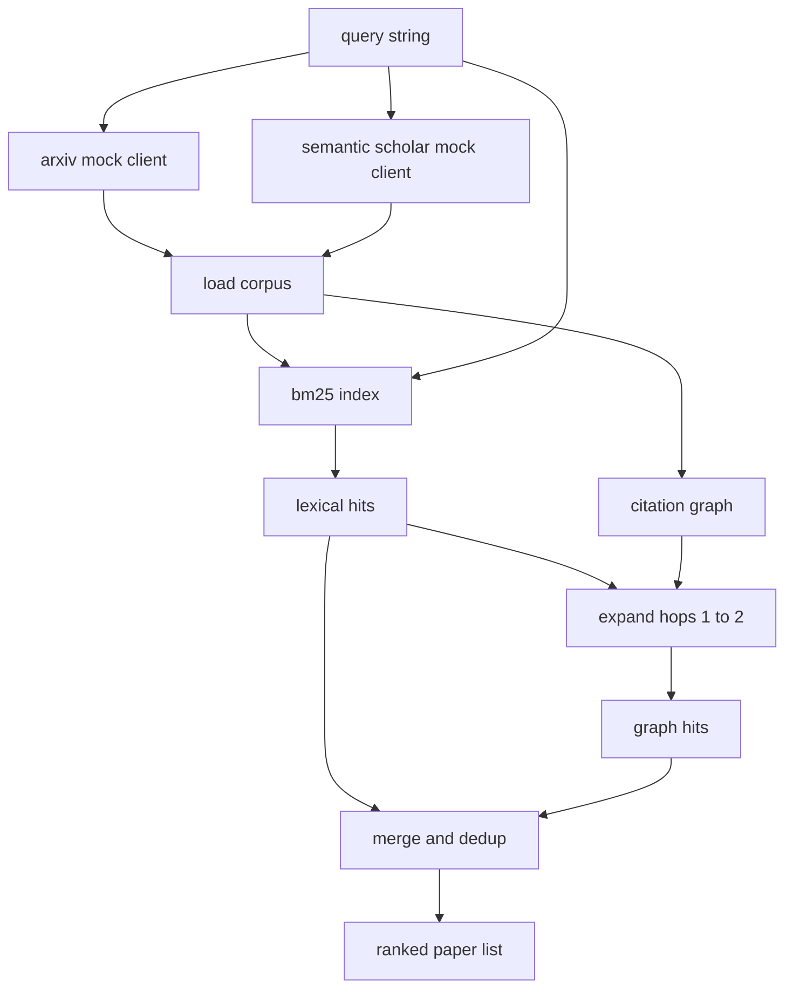

# Tìm lại các tác phẩm

> Một giả thuyết là rẻ tiền. Biết liệu ai đó đã chứng minh nó là phần đắt tiền. Hãy xây dựng lớp tìm kiếm trả lời câu hỏi đó trước khi người chạy đua quay một hộp cát.

**Type:** Build
**Languages:** Python
**Prerequisites:** Phase 19 Track A lessons 20-29
**Time:** ~90 minutes

## Mục tiêu học tập
- Mô hình một bản ghi nhỏ trên giấy với các trường vòng sẽ đọc dòng chảy xuống.
- Xây dựng chỉ số BM25 trên bản tóm tắt chỉ với cấu trúc dữ liệu stdlib.
- Đi qua biểu đồ trích dẫn để xuất hiện các bài báo mà tìm kiếm từ điển đã bỏ lỡ.
- Dedule hits qua từ điển và biểu đồ đi qua bằng giấy ID ổn định.
- Bị hai API bên ngoài giả mạo sau một khách hàng để trang web gọi lên dòng vẫn giống nhau khi các điểm cuối thực sự hạ cánh.

## Tại sao hai lần tìm kiếm

Một tìm kiếm từ khóa trên bản tóm tắt trả về các bài báo chia sẻ từ vựng với truy vấn. Nó bao phủ phần lớn bề mặt. Nó bỏ lỡ hai vụ. Đầu tiên là khi giấy nền tảng sử dụng từ vựng khác nhau; ví dụ: một truy vấn về "trong tâm ít" bỏ lỡ một bài báo có tiêu đề "đánh chọn khối trong định tuyến biến đổi".

Bài học xây dựng cả hai bài đi. BM25 trên bản tóm tắt bắt được các hit ngữ pháp. Một đoạn qua biểu đồ trích dẫn mở rộng hạt giống đi về phía trước và trở lại bằng một hoặc hai hop. Liên minh được sao chép bằng thẻ giấy và xếp hạng bằng điểm số kết hợp nhỏ.

## Hình dạng giấy

```text
Paper
  id          : str           (stable identifier, "p001" for the mock corpus)
  title       : str
  abstract    : str
  year        : int
  authors     : list[str]
  references  : list[str]     (paper ids this paper cites)
  citations   : list[str]     (paper ids that cite this paper)
  source      : str           (which mock api supplied it, "arxiv" or "s2")
```

Các trường tham chiếu và trích dẫn tạo thành biểu đồ trích dẫn hướng. Hai API giả trả về các trường chồng chéo nhưng không giống nhau, vì vậy người tải corpus kết hợp chúng trên `id`- Tôi không biết.

```figure
cg-citation-hops
```

## Kiến trúc



Khách hàng truy xuất sở hữu cả hai thông qua và sự kết hợp. Người gọi đưa cho nó một truy vấn và nhận lại một danh sách xếp hạng nơi mỗi mục có các trường điểm trên giấy (`bm25_score`- `graph_distance`- `recency_score`- `final_score`) giải thích xếp hạng.

## BM25 từ đầu

Việc thực hiện là tiêu chuẩn Okapi BM25 với các tham số mặc định `k1=1.5`- `b=0.75`Chỉ số này là hai từ điển:`term -> doc_frequency`và `term -> list of (doc_id, term_count)`. Dường dài tài liệu là số lượng mã thông báo của bản tóm tắt. Dường dài tài liệu trung bình được tính một lần tại thời gian xây dựng chỉ mục. Điểm truy vấn là tổng số các thuật ngữ truy vấn của `idf * tf_norm`nơi `tf_norm`là tần số tiêu chuẩn BM25 dài tiêu chuẩn hóa thuật ngữ.

Người làm chứng là `lower`Một hệ thống sản xuất sẽ thay đổi trong một voter nhỏ.

```text
idf(t)      = log((N - df + 0.5) / (df + 0.5) + 1.0)
tf_norm(t)  = (f * (k1 + 1)) / (f + k1 * (1 - b + b * dl / avgdl))
score(d, q) = sum over t in q of idf(t) * tf_norm(t)
```

## Quay trình biểu đồ trích dẫn

Chữ đồ thị được xây dựng một lần từ cơ thể. Biên phía trước đi từ một giấy đến tham chiếu của nó. Biên phía sau đi từ một giấy đến trích dẫn của nó.

Hai hop là một trần thượng cố ý. Một hop quá nông; đại lý thường muốn tổ tiên hoặc hậu duệ ngay lập tức. Ba hop làm tăng kích thước kết quả trên biểu đồ kết nối và có xu hướng trôi ra khỏi chủ đề. Bài học phơi bày giới hạn hop như một nút cấu hình để một vòng lặp dòng chảy xuống có thể thắt chặt nó.

## Dedude và xếp hạng

Hai bài vượt qua trả lại các tập chồng chéo. Các khóa hợp nhất trên giấy ID. Đối với mỗi giấy điểm cuối cùng là một hỗn hợp cân nặng.

```text
final_score = w_bm25 * bm25_score_norm
            + w_graph * graph_score
            + w_recency * recency_score
```

`bm25_score_norm`là điểm BM25 chia bằng điểm BM25 tối đa trong tập hợp hợp (vì vậy trường sống trong 0 đến 1). `graph_score`là một cho các cú đánh từ điển trực tiếp, sau đó `0.6`cho một cú nhảy, `0.3`Nếu không, không.`recency_score`là một đường dây từ 0 ở năm tối thiểu corpus đến 1 ở mức tối đa.

Đánh nặng mặc định là `0.5`- `0.3`- `0.2`Các trọng lượng là config; một chủ đề lỗi thời có thể làm giảm sự gần đây trong khi một chủ đề chuyển động nhanh nâng cao nó.

## Phong thể giả

Bộ phận này gồm 100 bài báo, được tạo ra bởi `build_corpus()`. Mỗi bài viết có tiêu đề và bản tóm tắt bằng tay về một trong năm chủ đề: sự ít chú ý, tăng cường thu hồi, bộ điều chỉnh cấp thấp, chưng cất tập dữ liệu và các vòng đánh giá.

Hai khách hàng API giả (`ArxivMockClient`- `SemanticScholarMockClient`(Arxiv trả lại tiêu đề, bản tóm tắt, năm, tác giả. Semantic Scholar thêm tham chiếu và trích dẫn. Các liên minh khách hàng tìm kiếm trên id; xử lý bất đồng giữa các lĩnh vực khách hàng được hoãn lại cho một bài học tiếp theo.

## Bài học 52 và 53 đọc

Người chạy trong bài học 52 đọc`paper.id`- `paper.title`, và ba câu đầu của bản tóm tắt như là bối cảnh cho thí nghiệm.`paper.year`và `paper.references`để gán một đường cơ sở cho một bài báo cụ thể.

Khách hàng truy xuất trả lại một `RetrievalResult`với cả danh sách xếp hạng và các métrics cho mỗi truy vấn: số lượng hit, điểm trung bình, điểm top, tổng thời gian tường. người chạy ghi lại những điều này để một thông qua quan sát theo dòng có thể vẽ chất lượng theo thời gian.

## Làm thế nào để đọc mã

`code/main.py`định nghĩa `Paper`- `ArxivMockClient`- `SemanticScholarMockClient`- `BM25Index`- `CitationGraph`- `RetrievalClient`, và một bản demo xác định. Các client giả và corpus đều trong cùng một file để bài học vẫn được di động.

`code/tests/test_retrieval.py`bao gồm đường từ điển, đường biểu đồ, kết hợp, dedup và truy vấn trống.

## Ở đâu đây là chỗ

Bài năm mươi tạo ra một giả thuyết. Bài năm mươi một tìm kiếm văn học để xem giả thuyết đó đã được giải quyết hay không. Bài năm mươi hai chạy thí nghiệm nếu không. Bài năm mươi ba đọc cả kết quả thu hồi và các số liệu thí nghiệm để viết phán quyết. Khách hàng thu hồi là rẻ nhất trong bốn giai đoạn và chạy đầu tiên trong dàn nhạc.
