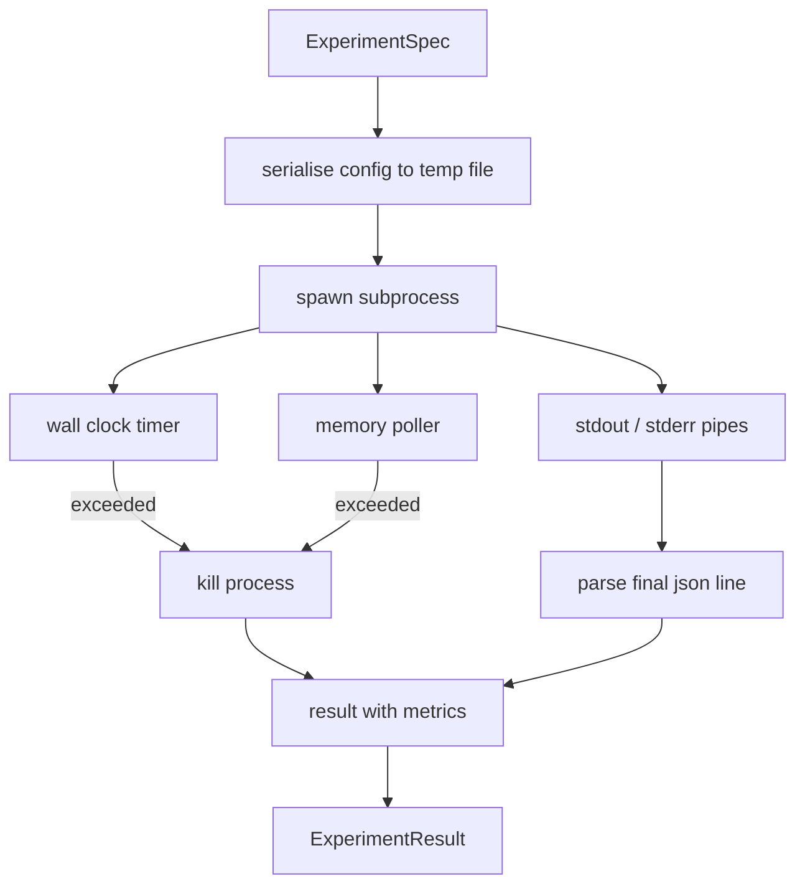

# Chuyện chạy thử nghiệm

> Loop chỉ là trung thực như các phép đo của nó. xây dựng runner lấy một spec, thực hiện nó trong một subprocess sandboxed, và phát ra một điểm số json mà người đánh giá có thể tin tưởng.

**Type:** Build
**Languages:** Python
**Prerequisites:** Phase 19 Track A lessons 20-29
**Time:** ~90 minutes

## Mục tiêu học tập
- Mã hóa một thí nghiệm như một mô hình mô tả được đánh dấu người chạy có thể phân tích theo chuỗi thành một quá trình phụ.
- Thả một quá trình phụ với một thời gian clock tường cứng và một nắp bộ nhớ mềm, và bề mặt cả hai như các điều kiện cuối cùng.
- Chụp stdout, stderr, và các metrics cấu trúc blob thành một hồ sơ kết quả duy nhất.
- Xây dựng một bảng ablation mà lau một nút cấu hình tại một thời điểm trên một đặc điểm cơ sở cố định.
- Giữ mọi kết quả xác định được cho một hạt giống để người đánh giá thấy các số tương tự trên các chạy.

## Tại sao một quá trình phụ

Một vòng lặp nghiên cứu chạy mã không tin cậy. giả thuyết đến từ một người lấy mẫu, kịch bản thí nghiệm đến từ cùng một con đường; xử lý một trong hai như an toàn trong quá trình là yêu cầu một vụ tai nạn khiến người dàn nhạc xuống. Các quá trình phụ là sự cô lập đơn giản nhất mà ngôn ngữ vận chuyển: một quá trình riêng biệt, không gian địa chỉ độc lập, một tay cầm tín hiệu ở phía mẹ.

Người chạy ở đây không thực hiện sandboxing đầy đủ. Không có cgroup, không có bộ lọc seccomp, không có việc tái lập không gian tên. Điều mà nó có là một thời gian đồng hồ tường, một vòng thăm dò để tăng trưởng bộ nhớ, và một con đường giết người kết thúc quá trình ở cả hai giới hạn. Đó là hợp đồng runtime mỗi khi hộp cát phức tạp hơn kéo dài. Bài học giữ hợp đồng đủ nhỏ để đọc trong một phiên.

## Hình dạng ExperimentSpec

```text
ExperimentSpec
  spec_id        : str            (stable id, "exp_001")
  hypothesis_id  : int            (link back to the queue from lesson 50)
  script_path    : str            (path to the python script to run)
  config         : dict           (passed to the script as one json arg)
  seed           : int            (deterministic seed for the experiment)
  wall_timeout_s : float          (hard timeout, killed on exceed)
  memory_cap_mb  : int            (soft cap, polled; killed on exceed)
  metric_keys    : list[str]      (which fields the evaluator will read)
```

Script sống trên đĩa; người chạy viết cấu hình cho một con đường tập tin tạm thời mà script đọc.`metric_keys`Bất cứ thứ gì khác trên Stdout được ghi lại nhưng bị phân tích metrics bỏ qua.

```figure
cg-runner-limits
```

## Kiến trúc



Người chạy là một lớp với một phương pháp chính. Người thăm dò là một chuỗi nhỏ thức dậy một lần mỗi khoảng thời gian thăm dò và đọc quá trình phụ`psutil`tương đương từ hệ thống hồ sơ proc khi có sẵn, rơi lại không hoạt động khi nền tảng không phơi bày nó.

## Tại sao một nắp nhớ mềm

Món ghi nhớ cứng cần `resource.setrlimit`Bài học cung cấp một cách tiếp cận di động: khảo sát kích thước thiết lập cư dân từ nền tảng và tiêu diệt các bộ phận nếu nó vượt quá giới hạn.

Trong các hệ thống không hỗ trợ kiểm tra quy trình, người khảo sát ghi lại cảnh báo một lần và tự tắt.

## Tận bắt Stdout và Stderr

Người chạy đọc cả hai ống thoát nước khi hoàn thành. Stdout được quét hàng xếp; dòng cuối cùng phân tích như json với tất cả các yêu cầu `metric_keys`được lấy như là điểm số.`intermediate_metrics`; người đánh giá có thể sử dụng chúng cho các đường cong học tập.

Stderr được bắt theo nghĩa đen vào kết quả. người chạy không bao giờ nâng lên mã thoát không bằng không; thay vào đó nó ghi lại mã trong kết quả. Bất kỳ lối thoát không bằng không nào được dán nhãn `"crash"`ngay cả khi kịch bản in metrics, do đó, người đánh giá xử lý chạy một phần như thất bại theo mặc định.

## Bảng phân hủy

```python
def ablate(base: ExperimentSpec, knob: str, values: list[Any]) -> list[ExperimentSpec]:
    ...
```

Với một đặc điểm cơ bản và tên nút, người trợ giúp trả lại một đặc điểm cho mỗi giá trị với `config[knob]`Mỗi spec có một derived`spec_id`(`f"{base.spec_id}_{knob}_{value}"`Người chạy bộ sẽ đưa một con tàu`AblationRunner`Điều đó sẽ khiến chúng trật tự và trả lại một `AblationTable`Đánh dấu bằng giá trị nút.

Tại sao một nút tại một thời điểm. Các lần quét thực tế đầy đủ bùng nổ theo cách thoáng lừng và tạo ra kết quả mà người đánh giá không thể giải thích. Một nút tại một thời điểm tạo ra một trục sạch mà người đánh giá có thể vẽ. Bài học hỗ trợ các lần quét đa nút chỉ như là các lần lặp lại một nút, được tạo thành bởi người gọi.

## Định nghĩa

Mỗi spec mang một hạt giống. người chạy chuyển hạt giống đến kịch bản thông qua định nghĩa cấu hình (`config["__seed"] = spec.seed` Các kịch bản thí nghiệm giả mạo trong `code/experiments/`Đánh giá trong bài học năm mươi ba phụ thuộc vào điều này; mà không có định nghĩa, một "sự lùi lại" có thể là một sự khởi đầu ngẫu nhiên khác.

## Kịch bản thí nghiệm giả

Bài học đưa ra một kịch bản thí nghiệm:`code/experiments/sparsity_experiment.py`Nó là một kịch bản thực sự đọc tập tin cấu hình của nó, mô phỏng một cuộc chạy huấn luyện nhỏ với một thông qua ngẫu nhiên numpy, và in một điểm metrics json.`sleep_s`nút để kiểm tra thời gian và một `allocate_mb`nút để kiểm tra bộ nhớ.

Kế toán này không phải là đào tạo thực tế. Nó là một tính toán số học bắt chước hình dạng của vòng đào tạo: một đường cong mất mát, một sự bối rối cuối cùng, một thời gian tường. Điểm của bài học là người chạy, không phải mô phỏng. Một kịch bản thí nghiệm thực sự sẽ nhập khẩu một mô hình.

## Hình dạng kết quả

```text
ExperimentResult
  spec_id              : str
  hypothesis_id        : int
  exit_code            : int
  terminal             : "ok" | "timeout" | "oom" | "crash"
  wall_time_s          : float
  peak_rss_mb          : float | None
  metrics              : dict
  intermediate_metrics : list[dict]
  stdout_tail          : str
  stderr_tail          : str
```

Người đánh giá đọc `metrics`và `terminal`Nếu đầu tiên là cái gì khác ngoài`"ok"`thí nghiệm được tính là một cuộc chạy thất bại và phán quyết của người đánh giá là tự động. Nếu không các métrics được vượt qua qua kiểm tra ý nghĩa.

## Làm thế nào để đọc mã

`code/main.py`định nghĩa `ExperimentSpec`- `ExperimentResult`- `ExperimentRunner`- `AblationRunner`, và một bản demo xác định. Quản lý phụ quy trình là một lớp. bộ nhớ poller là một chuỗi nhỏ. trợ lý ablation là một chức năng duy nhất.

`code/experiments/sparsity_experiment.py`là thí nghiệm giả sử được sử dụng trong các thử nghiệm. Nó đọc con đường tập tin cấu hình của nó từ argv và viết một dòng chỉ số json duy nhất khi hoàn thành.

`code/tests/test_runner.py`bao gồm con đường thành công, con đường thời gian nghỉ, con đường sụp đổ, bảng phân hủy, và kiểm tra định nghĩa trên hai chạy.

## Ở đâu đây là chỗ

Bài năm mươi tạo ra giả thuyết. Bài năm mươi một lọc ra bất cứ điều gì văn học đã giải quyết. Bài năm mươi hai chạy thí nghiệm cho những gì còn lại. Bài năm mươi ba đọc kết quả, chạy kiểm tra ý nghĩa, và viết phán quyết mà nhạc công lưu trữ chống lại giả thuyết id.
