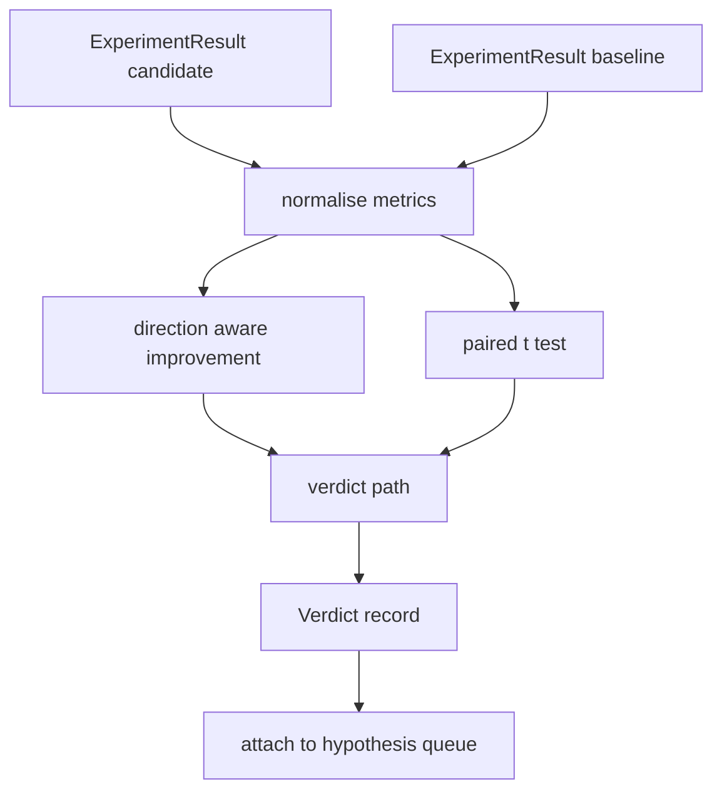

# Đánh giá kết quả

> Người chạy tạo ra số. Người đánh giá quyết định liệu số đó là cải thiện, trở lại hay tiếng ồn.

**Type:** Build
**Languages:** Python
**Prerequisites:** Phase 19 Track A lessons 20-29
**Time:** ~90 minutes

## Mục tiêu học tập
- So sánh một cuộc chạy ứng cử viên với một đường cơ sở sử dụng cải thiện hướng nhận thức và ngưỡng cố định.
- Thực hiện một thử nghiệm t cặp từ đầu trên mỗi hạt giống và đọc giá trị p kết quả.
- Tiêu chuẩn các số liệu theo quy mô hồ sơ để một báo cáo dòng chảy sau có thể pha trộn chúng với số liệu tuyến tính.
- Giả ra một phán quyết theo giả thuyết mà nhạc công có thể gắn vào hàng đợi từ bài học năm mươi.
- Giữ từng bước sạch sẽ để các thông tin nhập vào luôn đưa ra cùng một phán quyết.

## Tại sao một thử nghiệm đôi

Một số đơn từ người chạy bộ không nói ra liệu sự thay đổi có thật hay không. Sự cấu hình tương tự với một hạt giống khác nhau tạo ra sự phức tạp khác nhau. Thay đổi có thể là tiếng ồn. So sánh đúng là kết hợp: giống giống nhau với dữ liệu tương tự, chạy một lần với ứng cử viên và một lần với đường cơ bản. Mỗi hạt giống góp phần khác biệt. Tỷ lệ trung bình của những khác biệt đó là hiệu ứng. Sai lầm tiêu chuẩn của những khác biệt đó là sàn tiếng ồn.

Bài học thực hiện thử nghiệm từ đầu.`scipy.stats`Các toán học đủ nhỏ để đọc trong một màn hình.

```text
diffs    = [a_i - b_i for i in seeds]
mean     = sum(diffs) / n
variance = sum((d - mean) ** 2 for d in diffs) / (n - 1)
t_stat   = mean / sqrt(variance / n)
df       = n - 1
p_value  = two_sided_p(t_stat, df)
```

Giá trị p hai bên sử dụng một hàm beta không hoàn chỉnh được chuẩn hóa. Bài học đưa ra một thực hiện nhỏ sử dụng phần phần phần liên tục Lentz.

## Sự cải thiện nhận thức về hướng

Một số số liệu cải thiện khi tăng (sự chính xác, thông qua), những khác cải thiện khi giảm (sự mất mát, sự bối rối, thời gian tường).`direction`trường trên mỗi metric.

```text
if direction == "higher_is_better":
    improvement = (candidate - baseline) / abs(baseline)
elif direction == "lower_is_better":
    improvement = (baseline - candidate) / abs(baseline)
```

Sự cải thiện được ký kết. Một sự cải thiện tiêu cực trên một số lượng cao hơn là tốt hơn có nghĩa là ứng cử viên tồi tệ hơn.

Một ngưỡng phẳng (`improvement_threshold=0.02`, 2 phần trăm) quyết định liệu sự thay đổi có đủ lớn để gọi. bên dưới đó phán quyết là "ruy" bất kể giá trị p; vòng lặp không quan tâm đến những thay đổi người dùng không thể đo lường.

```figure
cg-paired-verdict
```

## Kiến trúc



Người đánh giá chạy ba tính toán độc lập và kết hợp chúng trong con đường phán quyết.

## Tự chuẩn hóa nhật ký

Sự bối rối là một sự sụt giảm về tổn thất. Một sự sụt giảm 0,1 trong tổn thất là một sự sụt giảm lớn hơn nhiều về sự bối rối. So sánh sự bối rối trực tiếp giữa hai cấu hình là tốt, nhưng kết hợp nó với các số liệu tuyến tính trong một báo cáo duy nhất đòi hỏi phải bình thường hóa.

Bài học bình thường hóa bất kỳ métric nào mà `scale`trường là `"log"`bằng cách lấy nhật ký tự nhiên trước khi tính toán sự cải thiện. ngưỡng sau đó được áp dụng trong không gian nhật ký.`log(28) - log(32) = -0.133`trên một mức thấp hơn là métric tốt hơn, đó là vượt quá ngưỡng hai phần trăm.

```text
if scale == "log":
    a = log(candidate)
    b = log(baseline)
else:
    a = candidate
    b = baseline
```

Các số liệu với `scale="linear"`(đặc định) bỏ qua chuyển đổi. cùng một đường mã xử lý cả hai.

## Kiểm tra cặp mỗi hạt

Người chạy từ bài học năm mươi hai phát ra một điểm số cuối cùng mỗi lần chạy. Đối với bài kiểm tra kết hợp, người đánh giá cần một điểm trên mỗi hạt giống cho ứng viên và một điểm trên mỗi hạt giống cho dòng cơ bản. Người dàn nhạc chạy cùng một thí nghiệm dưới cả hai cấu hình trên một danh sách hạt giống và trao cho người đánh giá hai danh sách của `ExperimentResult`hồ sơ.

Người đánh giá kết hợp chúng theo hạt giống (cây sống trong `result.metrics["seed"]`Nếu các hạt giống không phù hợp trên hai danh sách, người đánh giá sẽ đưa ra một `PairingError`- Người dàn nhạc nên chạy lại.

## Hình dạng của bản án

```text
Verdict
  hypothesis_id          : int
  metric                 : str
  direction              : "higher_is_better" | "lower_is_better"
  scale                  : "linear" | "log"
  candidate_mean         : float
  baseline_mean          : float
  improvement            : float       (signed, fraction; see direction rules)
  p_value                : float | None  (None if n < 2)
  significance_threshold : float
  improvement_threshold  : float
  verdict                : "improved" | "regressed" | "noise" | "failed"
  rationale              : str
```

Con đường phán quyết là một bảng quyết định nhỏ:

```text
1. If any candidate result has terminal != "ok": verdict = "failed"
2. else if |improvement| < improvement_threshold:  verdict = "noise"
3. else if p_value is None or p_value > significance: verdict = "noise"
4. else if improvement > 0:                          verdict = "improved"
5. else:                                             verdict = "regressed"
```

Lý luận là một câu có thể đọc được bởi con người một dòng mà người dàn nhạc có thể ghi lại chống lại giả thuyết id.

## Làm thế nào để đọc mã

`code/main.py`định nghĩa `MetricSpec`- `Verdict`- `Evaluator`, t thống kê và không đầy đủ beta trợ lý, và một bản demo xác định.

`code/tests/test_evaluator.py`bao gồm đường mòn cải thiện, đường mòn trở lại, đường mòn tiếng ồn (sự cải thiện nhỏ), đường lối tiếng ồn (n thấp), đường cuối thất bại, đường mòn chuẩn hóa nhật ký, thử t đối với một giá trị tham chiếu được biết và lỗi kết hợp.

## Ở đâu đây là chỗ

Bài 50 tạo ra hàng đợi giả thuyết. Bài 51 lọc ra bất cứ thứ gì mà văn học đã giải quyết. Bài 52 chạy thí nghiệm dưới sự cấu hình ứng cử viên và đường cơ sở trên hạt giống. Bài 53 đọc những lần chạy đó và viết phán quyết. Người dàn nhạc đan bốn cùng nhau:

```text
for hypothesis in queue:
    literature = retrieval.search(hypothesis.text)
    if literature_settles(hypothesis, literature):
        attach(hypothesis, verdict="settled")
        continue
    candidates = runner.run_all(specs_for(hypothesis))
    baselines  = runner.run_all(baseline_specs_for(hypothesis))
    metric_spec = MetricSpec("perplexity", direction=LOWER, scale=LOG)
    verdict = evaluator.evaluate(hypothesis.id, metric_spec, candidates, baselines)
    attach(hypothesis, verdict)
```

Người dàn nhạc đó không có trong bài học này; bốn bài học kết hợp vào nó mà không có bất kỳ dán ngoài các lớp dữ liệu mỗi định nghĩa.
