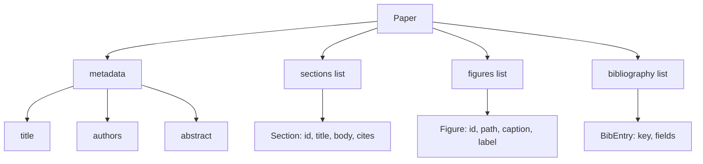
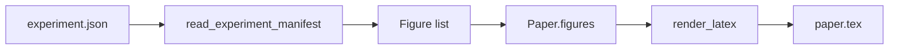
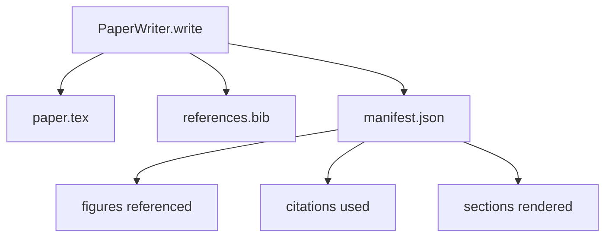

# Nhà văn giấy

> Một bộ xương LaTeX là một hợp đồng giữa nhà nghiên cứu và người đặt kiểu chữ. Nếu hợp đồng bị phá vỡ tài liệu không biên soạn, và sự thất bại là lớn.

**Type:** Build
**Languages:** Python
**Prerequisites:** Phase 19 lessons 50-53
**Time:** ~90 minutes

## Mục tiêu học tập

- Chế độ nghiên cứu như một vật cổ cấu trúc với biểu đồ phần được biết đến, không phải là một tài liệu dạng tự do.
- Tạo ra một bộ xương LaTeX tuyên bố trừu tượng, các phần, khe hình và khóa thư viện trước khi viết bài thơ.
- Nhổ các số liệu từ các kết quả thí nghiệm (các con đường và tiêu đề) vào xương thông qua một cơ chế khe xác định.
- Sợi dây một máy phát âm giả mạo mà lấp đầy mỗi phần từ một đường viền cấu trúc để vòng xoắn có thể kiểm tra mà không có mô hình.
- Đưa ra một đĩa đơn `paper.tex`+ a `references.bib`cộng với một biểu đồ liệt kê tất cả các con số tham khảo và tất cả các trích dẫn được sử dụng.

```figure
ch-paper-skeleton
```

## Tại sao đầu tiên là một bộ xương

Một bản thảo bắt đầu như văn bản văn bản tích lũy nợ cấu trúc. Kế hoạch giới thiệu tăng lên ba đoạn văn nên được trong công trình liên quan. Một con số được tham chiếu trước khi nó được xác định.

Một bộ xương đảo ngược điều đó. Cấu trúc được tuyên bố trước như dữ liệu. Các phần là các khe với tên và thứ tự. Số là khe với danh bạ và tiêu đề. Các khóa thư viện được công bố ở đầu cùng với các mục mà chúng chỉ ra. Các bài thơ được tạo ra trong các khe này một lần. Bộ đeo có thể xác nhận, trước khi viết bất kỳ bài thơ nào, rằng mỗi hình ảnh có một khe, mỗi trích dẫn có một mục nhập, và mỗi phần xuất hiện trong bảng nội dung.

Đây là kỷ luật tương tự như những bài học trước đó áp dụng cho kế hoạch, công cụ gọi, và dấu vết.

## Hình dạng giấy



Mỗi trường là dữ liệu Python đơn giản.`Paper`để một chuỗi LaTeX. Lợi dây có thể nhìn vào nội tâm giấy trước khi rendering: đếm các phần, liệt kê các tập tin số liệu thiếu, kiểm tra rằng mỗi `\cite{key}`có một sự phù hợp `BibEntry`- Tôi không biết.

## Hợp đồng chuyển giao

Máy trình chiếu đảm bảo ba tính chất. Thứ nhất, mỗi khe hình trong xương phát ra một`\begin{figure}`khối với nhãn ổn định của biểu mẫu `fig:<id>`Thứ hai, mỗi phần phát ra một`\section{}`Với nhãn ổn định của biểu mẫu `sec:<id>`Vì vậy, các tham chiếu chéo hoạt động.`\bibliography`khối của ai `references.bib`chứa chính xác các mục được ghi trên giấy, không nhiều hơn và không ít hơn.

Việc vi phạm bất kỳ điều gì trong số này là một sai lầm trong việc hiển thị, không phải là một cảnh báo.

## Đèn hình ảnh từ thí nghiệm

Các bài học trước đây trong bài hát này đã tạo ra các kết quả thí nghiệm khi JSON biểu lộ. Mỗi biểu lộ mang theo một danh sách các hiện vật với các con đường và tiêu đề ngắn.`Figure`hồ sơ.



Các hình ảnh ID được lấy từ tên thí nghiệm cộng với một bộ đếm đơn tần. Các tiêu đề xuất từ biểu hiện. Các đường dẫn được bình thường hóa so với thư mục đầu ra của giấy do đó LaTeX biên soạn ngay cả khi các đầu ra thí nghiệm nằm ở nơi khác trên đĩa.

## Bộ máy phát âm giả mạo

Bài học không gọi một mô hình.`MockProseGenerator`Bộ tạo bộ mở rộng chuỗi đó thành hai đoạn ngắn với tiêu đề phần được dệt vào. Các chữ viết được tạo ra là chữ chữ chữ và trích dẫn chính xác khi đường lối tuyên bố chúng.

Điều này đủ để kiểm tra mọi hành vi của nhà văn. Một thực hiện thực sự sẽ thay thế máy phát điện cho một cuộc gọi mô hình. Vành đai xung quanh nó không thay đổi. Đó là giá trị của việc tuyên bố máy phát điện văn bản là một cuộc gọi: thử nghiệm thay thế một định nghĩa, sản xuất thay thế một mô hình, phần còn lại của đường ống là giống nhau.

## Khả năng xuất hiện

Nhà viết phát ra ba tập tin vào thư mục đầu ra.



Các biểu đồ là những gì một đánh giá dòng thấp hoặc vòng phê bình đọc. Nó không phân tích LaTeX; nó đọc biểu đồ. Bài học tiếp theo, vòng phê bình, lấy biểu đồ này như đầu vào và tạo ra một danh sách phản hồi. Đó là lý do tại sao biểu đồ là một phần của hợp đồng và LaTeX không.

## Cổng xác thực

Nhà văn chạy bốn cổng trước khi viết bất kỳ tập tin nào.

1. Mỗi chữ số ID là độc đáo trong giấy.
2. Mỗi phần của chúng ta đều là`cites`trường tham chiếu một khóa thư viện được tuyên bố trên giấy.
3. Sự trừu tượng không trống rỗng.
4. Tiêu đề không trống rỗng.

Một cổng thất bại sẽ tăng lên`PaperValidationError`không có ghi phần nào: hoặc cả ba tập tin được phát ra, hoặc không có.

## Làm thế nào để đọc mã

`code/main.py`định nghĩa `Paper`- `Section`- `Figure`- `BibEntry`- `PaperValidationError`- `MockProseGenerator`- `PaperWriter`, và một `render_latex`chức năng.`write`Phương pháp lấy thư mục đầu ra và phát ra `paper.tex`- `references.bib`, và`manifest.json`- `read_experiment_manifest`assistant chuyển đổi một danh sách các biểu hiện thí nghiệm thành `Figure`hồ sơ.

`code/tests/test_paper_writer.py`bao gồm: hình ảnh hình ảnh xương không có phần, hình ảnh đầy đủ với hai phần và hai chữ số, cửa dẫn xuất thiếu, cửa nhận dạng chữ số trùng lặp, nội dung biểu hiện, và hợp đồng chuỗi LaTeX (mỗi phần phát ra một `\section{}`, mỗi con số phát ra một`\begin{figure}`().

## Đi xa hơn nữa

Hai phần mở rộng thực tế sẽ cần. Đầu tiên, render đa định dạng: giống nhau `Paper`hình thức biên soạn để Markdown cho bài đăng trên blog và HTML cho xem trước.`Paper`Thứ hai, làm giàu trích dẫn: nhà văn lấy các mục BibTeX từ một khóa trích dẫn, được cho một bộ nhớ cache địa phương của DOI. Cả hai có thể thêm giá trị, cả hai có thể được thêm mà không cần chạm vào hợp đồng xương.

Các phần, số liệu và trích dẫn được tuyên bố là dữ liệu, văn bản được tạo thành khe, biểu hiện được phát ra cùng với LaTeX.
