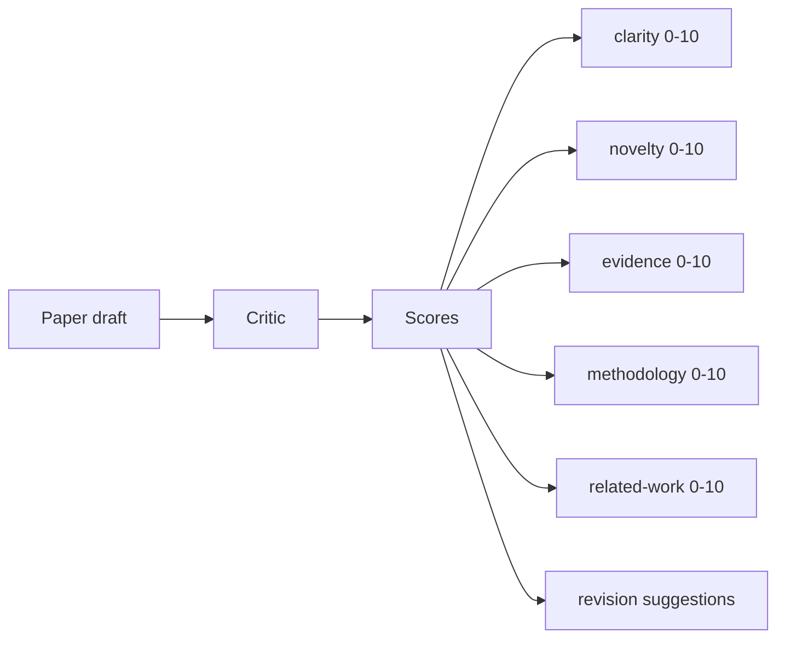
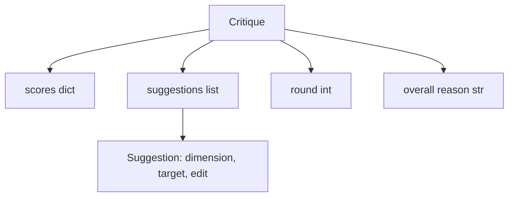
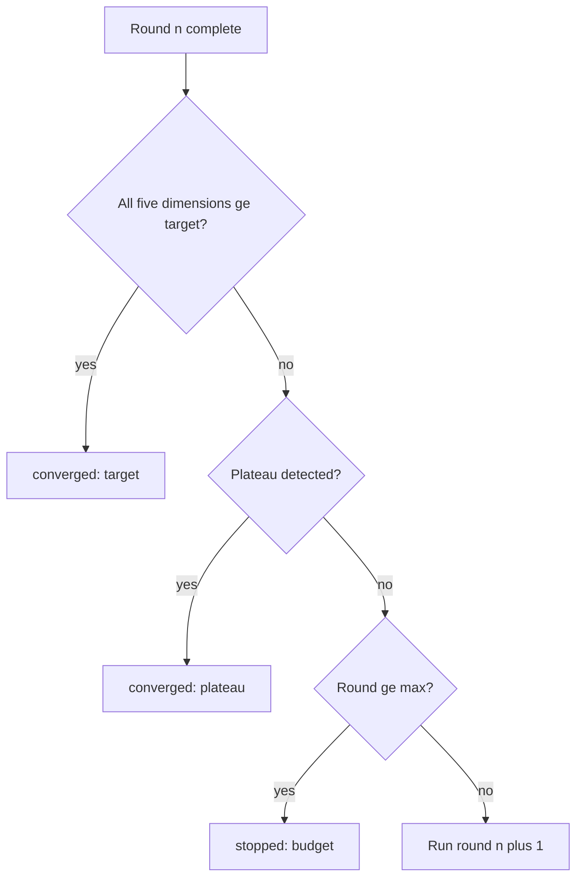
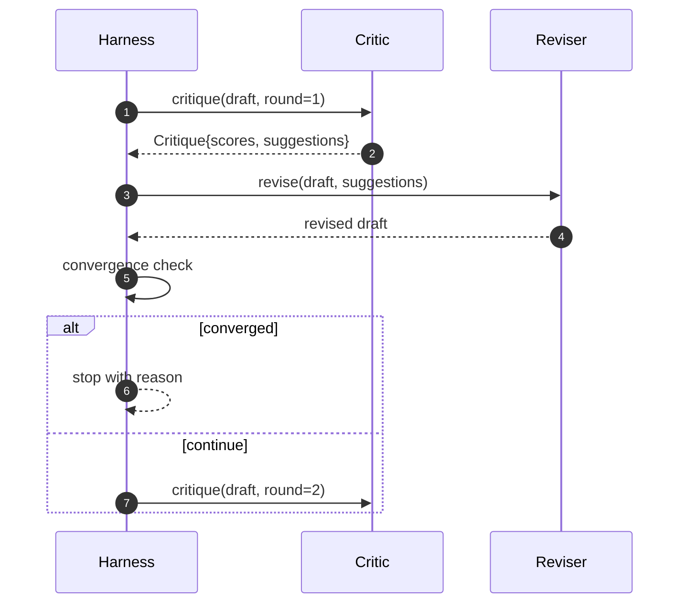

# Lòng phê bình

> Một nhà phê bình trả lời "có vẻ tốt" lần đầu tiên bị phá vỡ. Một nhà phê bình luôn trả lời "có cần làm việc" bị phá vỡ. Nhà phê bình thú vị là người hội tụ, và bạn phải thiết kế sự hội tụ.

**Type:** Build
**Languages:** Python
**Prerequisites:** Phase 19 lessons 50-53
**Time:** ~90 minutes

## Mục tiêu học tập

- Đánh điểm một bản thảo trên 5 chiều dài cố định: rõ ràng, tính mới, bằng chứng, phương pháp, công việc liên quan.
- Sử dụng chỉ trích của mỗi vòng như một sự khác biệt sửa đổi cấu trúc thay vì viết lại dạng tự do.
- Khám phá sự hội tụ bằng cách so sánh điểm số trong các vòng; dừng lại trên cao nguyên, mục tiêu đạt được hoặc ngân sách hết hạn.
- Thêm vào đó, giới hạn ngân sách là tối đa, vì vậy một nhà phê bình không hợp nhất sẽ không chạy mãi mãi.
- Giả ra một dấu vết mỗi vòng để bảng điều khiển hoặc giai đoạn tiếp theo có thể render quỹ đạo điểm số.

```figure
ch-critic-converge
```

## Tại sao 5 chiều không gian cố định

Một nhà phê bình tự do là một mô hình trả lại một đoạn đề xuất. Việc sửa đổi vòng tiếp theo xử lý đoạn như bối cảnh môi trường.

Năm chiều tạo ra một hợp đồng với dây đeo.



Điểm số là một vector. Vị đinh theo dõi từng chiều kích qua các vòng. Một sửa đổi nâng cao độ rõ ràng nhưng chứa bằng chứng là một sự lùi lại trên bằng chứng, và kiểm tra hội tụ thấy nó. Một nhà phê bình chỉ mô hình không thể cung cấp đảm bảo đó.

## Hình dạng của Critique



Mỗi đề xuất mang theo chiều kích nó cải thiện, phần nó nhắm mục tiêu, và một `edit`hướng dẫn người sửa đổi có thể áp dụng. Người sửa đổi cũng có thể gọi. Bài học gửi một người sửa đổi xác định học giải thích hướng dẫn chỉnh sửa như là một hoạt động phụ lục đến phần. Một người sửa đổi dựa trên mô hình sẽ giải thích cùng một trường như một lời nhắc. Hợp đồng không thay đổi.

## Quy tắc hội tụ, theo thứ tự

Chuyện liên kết kết thúc khi bất kỳ điều kiện nào trong ba điều kiện phát nổ.



Mục tiêu là trường hợp nghiêm ngặt nhất: mỗi một trong năm chiều kích (sự rõ ràng, tính mới, bằng chứng, phương pháp, liên quan_work) phải đạt được `>= target_score`(đặc định `8.0`(văn số) trước khi vòng lặp trả lại thành công. Một trung bình cao với một chiều yếu không đủ.`plateau_epsilon`(đặc định `0.1`) cho hai vòng liên tiếp, vòng thoát ra với `plateau`Ngân sách là một giới hạn cứng trên vòng (trọng yếu)`5`) và ra khỏi `budget`- Tôi không biết.

Trình tự quan trọng. mục tiêu thắng trên cao nguyên thắng trên ngân sách. Nếu vòng 3 chạm vào mục tiêu trên cùng một lặp lại mà cũng sẽ kích hoạt một cao nguyên, kết quả là`target`Không .`plateau`- Tôi không biết.

## Tại sao phát hiện cao nguyên chạy trên hai vòng

Một tròn cao nguyên là tiếng ồn. Một nhà phê bình thực sự trả lại một điểm số khác nhau một chút mỗi lần lặp lại ngay cả trên một bản thảo cố định, bởi vì điểm số xác định vẫn phụ thuộc vào những đề xuất nào đã được áp dụng và theo thứ tự nào.

## Người phê bình quyết định trong bài học này

Bài học không gọi một mô hình. Người phê bình được gửi là một người gọi ghi một bản thảo dựa trên ba tín hiệu: chiều dài cơ thể trung bình của phần (thì rõ), số liệu và số liệu trích dẫn (bằng chứng), và một số điểm.`originality_tag`trường trên giấy metadata (khởi nghiệp). người sửa đổi biết làm thế nào để đẩy mỗi điểm lên.

```text
clarity      grows when the average section body length increases
novelty      grows when originality_tag is set to "high"
evidence     grows when a section's figure_refs is non-empty
methodology  grows when a section titled "Method" exists with body
related-work grows when a section titled "Related Work" exists with body
```

Các bài kiểm tra sử dụng tính chất này để khẳng định vòng lặp giảm khoảng cách.

## Hợp đồng vòng tròn đầy đủ



Bộ đeo là chủ sở hữu của bộ đếm tròn, dấu vết và kiểm tra hội tụ. Nhà phê bình là chủ sở hữu của điểm số. Người sửa đổi là chủ sở hữu của sự khác biệt. Không có một trong ba chạm vào trạng thái của những người khác.

## Tạo ra Trace

Mỗi vòng phát ra một sự kiện dấu vết với số vòng, vector điểm số, số lượng gợi ý và phán quyết hội tụ. dấu vết đầy đủ được trả lại cùng với bản thảo cuối cùng. Một bảng điều khiển dòng chảy xuống có thể render biểu đồ điểm số mỗi vòng. Bài học tiếp theo, trình lập lịch lặp lại, đọc dấu vết để quyết định liệu chi nhánh có đáng để giữ.

## Các ngân sách bảo vệ chống lại những người chỉ trích xấu

Một nhà phê bình đưa ra những gợi ý không bao giờ cải thiện điểm số sẽ khóa vòng vào trần tối đa.`budget`Người dùng đọc rằng như một lỗi phê bình, không phải là một lỗi dự thảo. thay thế, chỉ xuất hiện trên bề mặt dự thảo cuối cùng, che giấu chẩn đoán.

## Làm thế nào để đọc mã

`code/main.py`định nghĩa `Critique`- `Suggestion`- `Critic`giao thức,`Reviser`giao thức,`CriticLoop`, và một `make_deterministic_critic_pair`nhà máy trả lại nhà phê bình xác định và một người sửa đổi phù hợp.`Paper`hình được bao gồm để bài học đứng riêng.

`code/tests/test_critic_loop.py`bao gồm: cải thiện đơn giản sau vòng một, hội tụ mục tiêu trên một bản thảo được điều chỉnh, phát hiện trũng sau hai vòng phẳng, kiệt sức ngân sách khi không có đề xuất cải thiện, ứng dụng đề xuất bởi người sửa đổi và hình dạng dấu vết.

## Đi xa hơn nữa

Hai phần mở rộng thực tế sẽ cần. Thứ nhất, trọng lượng kích thước: một bài báo cho một hội thảo trọng lượng mới hơn phương pháp; một tạp chí trọng lượng ngược lại. kiểm tra hội tụ trở thành một trung bình trọng lượng. Thứ hai, các nhà phê bình kết hợp: một nhà phê bình ghi điểm, một nhà phê bình thứ hai quyết định các đề xuất trước khi người sửa đổi nhìn thấy chúng. Cả hai thêm giá trị, cả hai sáng tác trên cùng một `Critique`hình dạng.

Đặt cược là vector điểm số. Một khi chỉ trích được cấu trúc, mọi cải tiến khác, quy tắc hội tụ, bảng điều khiển, chỉ trích kết hợp, rơi vào mà không thay đổi vòng lặp.
