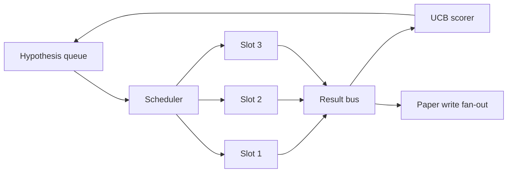
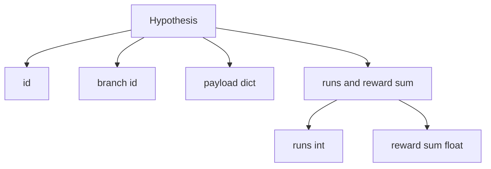
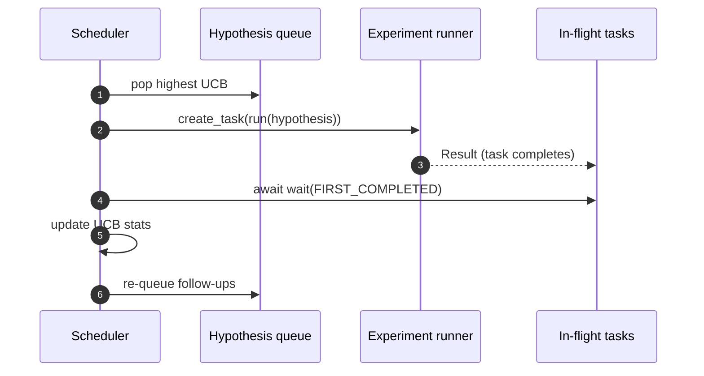

# Định trình lặp lại

> Một vòng nghiên cứu mà không có lập trình viên là một hàng xếp với ảo tưởng.

**Type:** Build
**Languages:** Python
**Prerequisites:** Phase 19 lessons 50-53
**Time:** ~90 minutes

## Mục tiêu học tập

- Mô hình một dòng công việc nghiên cứu như một hàng đợi giả thuyết cung cấp các khe thử nghiệm song song mà kết quả của nó trở lại.
- Thực hiện nhiều thí nghiệm đồng thời với asyncio để lập trình viên có thể giữ tất cả các khe cắm bận rộn.
- Đánh điểm mỗi chi nhánh giả thuyết với UCB để người lập lịch có thể cắt chi nhánh có năng suất thấp mà không bỏ cuộc khám phá.
- Chuyển kết quả hoàn thành đến một giai đoạn viết giấy và một giai đoạn xếp hàng lại để một chi nhánh có năng suất cao tạo ra giả thuyết tiếp theo.
- Đánh ra một dấu vết lặp đi lặp lại với điểm nhánh, chiếm chỗ và quyết định cắt.

```figure
ch-ucb-scheduler
```

## Tại sao phải lập lịch chứ không phải là danh sách làm việc

Một danh sách làm việc phẳng chạy các công việc theo thứ tự nộp. Điều đó tốt khi mỗi công việc độc lập. Nghiên cứu không độc lập: một phát hiện từ thí nghiệm ba thay đổi ưu tiên của thí nghiệm bốn và năm. Một lập trình viên đọc kết quả và sắp xếp lại hàng đợi sẽ có được nhiều công việc hữu ích hơn được thực hiện cho mỗi đơn vị tính toán.

Một người ghi bàn tham lam luôn chọn người dẫn đầu hiện tại và không bao giờ khám phá. Một người ghi bàn đồng bộ không bao giờ khai thác. UCB (tối đa độ tự tin) là con đường trung gian: khai thác người dẫn đầu trong khi lưu trữ khả năng cho các nhánh đã được thử ít hơn.

## Hình dạng hệ thống



Các dòng xếp hàng chứa giả thuyết. Người lập lịch chọn giả thuyết UCB cao nhất khi một khe tự do. Mỗi khe chạy một thí nghiệm không đồng bộ. Các thí nghiệm hoàn thành truyền kết quả của họ lên xe buýt. Xe buýt cập nhật số liệu thống kê UCB về nhánh bắt nguồn và các fan ra đến giai đoạn viết giấy khi năng suất của một nhánh vượt qua ngưỡng.

## Hình dạng giả thuyết



`branch`là chìa khóa cho thống kê UCB. Nhiều giả thuyết có thể chia sẻ một nhánh (nhánh là hướng nghiên cứu; giả thuyết là một thử nghiệm trong đó). `runs`là số lượng thí nghiệm hoàn thành cho ngành đó,`reward_sum`UCB đọc cả hai.

## Điểm UCB

Công thức UCB được sử dụng trong bài học này là UCB1 cổ điển.

```text
ucb(branch) = mean_reward(branch) + c * sqrt( ln(total_runs) / runs(branch) )
```

`total_runs`là số lượng tất cả các thí nghiệm được hoàn thành trên tất cả các ngành. `c`là trọng lượng khám phá; bài học không được phát hành`sqrt(2)`Một nhánh không chạy được .`+inf`Vì vậy, các nhánh chưa thử nghiệm luôn được lên lịch trước. Một nhánh có phần thưởng trung bình cao giữ điểm cao cho đến khi các nhánh khác bắt kịp; một nhánh chạy nhiều lần mà không có phần thưởng nhiều bị làm ngập bởi các lựa chọn thay thế ít chạy.

Cổng cắt cắt tách biệt với người thu hoạch. cắt cắt loại bỏ một nhánh khỏi lịch trình tương lai khi phần thưởng trung bình của nó giảm xuống dưới một tầng tuyệt đối (tầm Ước)`0.2`) ít nhất sau đó `prune_after_runs`thử nghiệm (phụ thể `3`Điều này giữ cho hàng đợi bị giới hạn.

## Các khe ngang với asyncio

Người lập lịch trình sẽ tiến hành các thí nghiệm với `asyncio.create_task`Mỗi nhiệm vụ chạy một thí nghiệm chạy (một `async def`được gọi) trả lại một `Result`. Loop chính chờ đợi trong tập hợp các nhiệm vụ trong chuyến bay với `asyncio.wait(..., return_when=asyncio.FIRST_COMPLETED)`và phát hiện cập nhật điểm số trên mỗi hoàn thành.



Ba khe chạy đồng thời. vòng lặp chính không bao giờ chặn trên một thí nghiệm duy nhất. Scheduler tiếp tục bắt đầu các nhiệm vụ mới ngay khi một khe được giải phóng, cho đến khi cả hai hàng rào trống và không có nhiệm vụ đang bay.

## Tải ra: kích hoạt giấy

Khi giá trị của một nhánh vượt qua`paper_threshold`(đặc định `0.7`) và ngành đó chưa sản xuất một bài báo, người lập lịch `paper.trigger`trong bài học 54 sẽ nhận được điều này. trong bài học này, kích hoạt được ghi lại như một danh sách để các bài kiểm tra có thể khẳng định nó.

## Phân tích: giả thuyết tiếp theo

Khi kết quả có hiệu suất cao hạ cánh, người lập lịch có thể gọi người dùng cung cấp `expander`để tạo ra một hoặc nhiều giả thuyết tiếp theo trên cùng một nhánh.`Result`đến`list[Hypothesis]`Bài học đưa ra một trình mở rộng xác định tạo ra hai tiếp theo cho bất kỳ kết quả nào mà phần thưởng vượt quá ngưỡng giấy.

## Ngân sách

Hai ngân sách bảo vệ người lập lịch khỏi các vòng trục trốn thoát.

```text
max_experiments    : total count of experiments run across all branches
max_seconds        : wall-clock cap (asyncio time)
```

Khi một trong hai nổ, người lập lịch ngừng lập lịch các nhiệm vụ mới, chờ đợi những nhiệm vụ trong chuyến bay, và trả lại dấu vết cuối cùng.`stop_reason`- Tôi không biết.

## Báo cáo và kết quả

Mỗi quyết định lập lịch (tôi, gửi, kết quả, cắt tỉa, ván-out) phát ra một sự kiện. Báo cáo cuối cùng tóm tắt các số liệu thống kê cho mỗi ngành, tổng chạy, tổng đồng hồ tường, và các tác động báo cáo được phát ra. Bài học tiếp theo, trình diễn cuối đến cuối, đọc báo cáo này để thúc đẩy nhà văn báo.

## Làm thế nào để đọc mã

`code/main.py`định nghĩa `Hypothesis`- `Result`- `BranchStats`- `IterationScheduler`, và một `make_deterministic_runner`Nhà máy trả lại một thí nghiệm chạy không đồng bộ với phần thưởng dự đoán được.`delay_ms`(đặc định `5ms`) để đồng thời có thể quan sát được.

`code/tests/test_scheduler.py`UCB chọn các nhánh chưa thử nghiệm trước, chiếm lượng khe ngang, kích hoạt giấy khi vượt ngưỡng, cắt nhánh sau các thử nghiệm có hiệu suất thấp, giả thuyết tiếp theo và thoát ngân sách (cả số thí nghiệm và đồng hồ tường).

## Đi xa hơn nữa

Ba phần mở rộng sẽ cần một thực hiện thực sự. Đầu tiên, số liệu thống kê UCB liên tục qua các phiên: số liệu thống kê hiện tại sống trong bộ nhớ; một lập trình viên thực sự sẽ kiểm tra chúng để khởi động lại bảo tồn ngân sách khám phá đã chi tiêu. Thứ hai, điểm số đa mục tiêu: thay vì một phần thưởng scalar, mỗi kết quả phát ra một vector và UCB trở thành một người chọn theo phong cách Pareto. Thứ ba, những tên cướp ngữ cảnh: các điều kiện chọn lọc về các tính năng giả thuyết (giãn dài, phức tạp) vì vậy các giả thuyết tương tự chia sẻ khám phá.

Các lập trình viên là nơi mà nghiên cứu trở thành nhiều hơn là một danh sách làm việc. Một khi UCB được dây và các khe chạy song song, mọi cải tiến khác kết hợp trên cùng.
