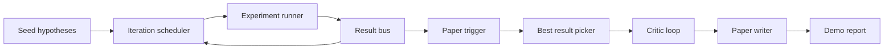
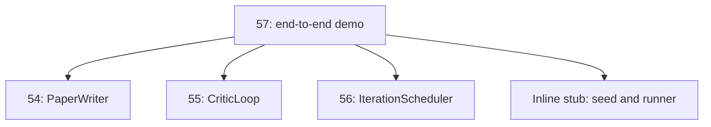
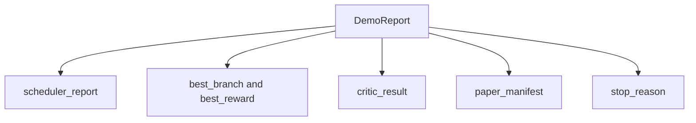

# End-to-End nghiên cứu Demo

> Một bản demo là nơi mà mọi hợp đồng mà bạn viết trước đó phải được viết ra. Nếu bất kỳ một trong số đó bị rò rỉ, bản demo là bài học bắt được nó.

**Type:** Build
**Languages:** Python
**Prerequisites:** Phase 19 lessons 50-53
**Time:** ~90 minutes

## Mục tiêu học tập

- Đưa dây vòng tự động nghiên cứu từ đầu đến cuối: hạt giống giả thuyết, người chạy thí nghiệm, lập lịch, vòng phê bình, nhà văn giấy.
- Sắp xếp các nguyên thủy từ bốn bài học Track D trước đó thông qua nhập khẩu Python đơn giản, không phải là một khung.
- Tiến vòng đến một kết thúc tự kết thúc và phát ra một báo cáo demo duy nhất liệt kê đầu ra của mỗi giai đoạn.
- Giữ các demo xác định để các bộ thử nghiệm có thể khẳng định hình dạng cuối cùng.
- Mở một chế độ thất bại rõ ràng khi hợp đồng của bất kỳ giai đoạn nào phá vỡ, vì vậy giai đoạn tiếp theo không chạy với đầu vào bị phá vỡ.

```figure
ch-research-pipeline
```

## Điều gì tạo nên ở đây



Các chương trình lập trình trình chạy sáu thí nghiệm trên các trường hợp này với ba khe ngang. Bus báo cáo một hoặc nhiều kích hoạt giấy. Người chọn chọn chọn kết quả tốt nhất. Loop phê bình lặp lại trên một bản thảo được xây dựng từ kết quả đó. Nhà viết giấy phát hành LaTeX cuối cùng, BibTeX và manifesto.

## Tại sao nhập khẩu, không sao chép

Mỗi bài học trước đó sẽ đưa ra một `main.py`Các lớp dữ liệu và chức năng công cộng.`sys.path`Đây không phải là hệ thống kết nối khung; đó là nhập các tập tin thử nghiệm trong các bài học trước đó đã sử dụng.



Thuốc inline là điểm thay thế cho bài học từ năm mươi đến năm mươi ba: một bộ tạo ra các giả thuyết hạt giống nhỏ và một chức năng thưởng đồng bộ. Người dùng có thể thay đổi thuốc inline cho các nguyên thủy thực sự từ những bài học đó bằng cách điều chỉnh hai nhập khẩu.

## Bảo đảm quyết định

Demos là xác định theo cấu trúc. Người chạy thí nghiệm được gieo numpy. Người sửa đổi vòng lặp phê bình đi bộ các chiều kích cố định theo thứ tự cố định. Máy tạo văn bản của nhà văn giấy là người đùa từ bài học năm mươi bốn. Người chọn UCB của người lập lịch phá vỡ liên kết theo thứ tự lặp lại, không phải sự lựa chọn ngẫu nhiên.

Với giống giống giống nhau, demo phát ra báo cáo tương tự.

## Hình dạng báo cáo demo



Mỗi trường được thực sự từ giai đoạn trên dòng. demo không chuyển đổi bất kỳ đầu ra; nó tạo ra chúng. Đó là bài kiểm tra demo là.

## Việc xử lý chế độ thất bại

Mỗi giai đoạn hoặc thành công hoặc gây ra lỗi gõ.

```text
Scheduler ........ returns SchedulerReport with stop_reason
                   in {queue_empty, max_experiments, deadline}
Best-result pick . raises NoTriggerError if no paper trigger fired
Critic loop ...... returns LoopResult with status converged or stopped
Paper writer ..... raises PaperValidationError on contract break
```

Một thất bại trong bất kỳ giai đoạn nào sẽ làm tắt các bản demo với một ngoại lệ được gõ.`test_no_triggers_raises_typed_error`và `test_best_picker_raises_when_no_triggers`khẳng định người chọn tăng `NoTriggerError`- `BestResultError`Khi không có một nhánh nào bắn một cái kích hoạt, và người viết không bao giờ được gọi.

## Người chọn kết quả tốt nhất

Người lập kế hoạch phát ra các tác động báo giấy cho mỗi nhánh. Người chọn chọn chọn nhánh với phần thưởng trung bình cao nhất trên tất cả các tác động viên. Các mối liên kết bị phá vỡ theo bảng chữ cái theo id nhánh vì vậy demo là xác định. Người chọn là một hàm tinh khiết nhỏ; các pin thử nó trên một báo cáo lập kế hoạch cố định.

## Cáp dây vòng quan trọng

Chuyện này được diễn ra trên một đường dẫn.`MiniPaper`. Demo xây dựng một `MiniPaper`từ nhánh được chọn bằng cách lấp đầy bản tóm tắt với id nhánh, gieo hai phần (Tạo và Kết quả), và đặt `originality_tag`từ phần thưởng trung bình của chi nhánh (tối cao nếu `>= 0.8`, trung bình nếu `>= 0.6`, thấp nếu không).

Người sửa đổi sau đó lặp lại bản thảo để hội tụ.

## Cáp cho nhà văn báo

Nhà văn bài báo trong bài học 54 đang làm việc đầy đủ`Paper`hình với các con số và thư viện.`MiniPaper`qua `mini_to_full_paper`, gắn một hình ảnh cho ngành được chọn và một tiểu thuyết tổng hợp nhỏ được xây dựng từ sự hợp nhất của các chìa khóa trích dẫn mà nhà phê bình đề xuất.

## Làm thế nào để đọc mã

`code/main.py`định nghĩa `BestResultError`- `NoTriggerError`- `DemoReport`- `pick_best_branch`- `build_mini_paper`- `mini_to_full_paper`, và`run_demo`. Dầu nhập khẩu ở mức cao nhất`sys.path`một lần và kéo `PaperWriter`- `CriticLoop`, và`IterationScheduler`từ những bài học của họ.

`code/tests/test_e2e.py`bao gồm: demo chạy từ đầu đến cuối và phát ra một báo cáo với tất cả năm trường được lấp đầy, xác định trên hai chạy, NoTriggerError khi không có nhánh nào vượt qua ngưỡng, PaperValidationError khi hợp đồng của nhà văn phá vỡ, biểu đồ giấy chứa con số của nhánh được chọn, và lý do dừng lịch là một trong những giá trị mong đợi.

## Đi xa hơn nữa

Ba phần mở rộng đáng để cáp một khi demo là xanh. Đầu tiên, trạng thái bền vững: kết quả của mỗi giai đoạn viết vào một kho lưu trữ JSON nhỏ để khởi động lại có thể tiếp tục mà không cần chạy lại các giai đoạn rẻ tiền. Thứ hai, một bảng điều khiển: các sự kiện theo dõi từ trình lập lịch và vòng lặp phê bình được hiển thị như một dòng thời gian duy nhất. Thứ ba, các cuộc gọi mô hình thực sự: thay đổi máy phát âm nói đùa và nhà phê bình xác định cho những người được điều khiển bởi mô hình; dây không thay đổi.

Việc của bản demo là chứng minh rằng cấu trúc là kiến trúc. 5 bài học, 4 nhập khẩu, một báo cáo. Lần sau khi bạn thêm một giai đoạn, dây phát triển bằng chính xác một dòng.
