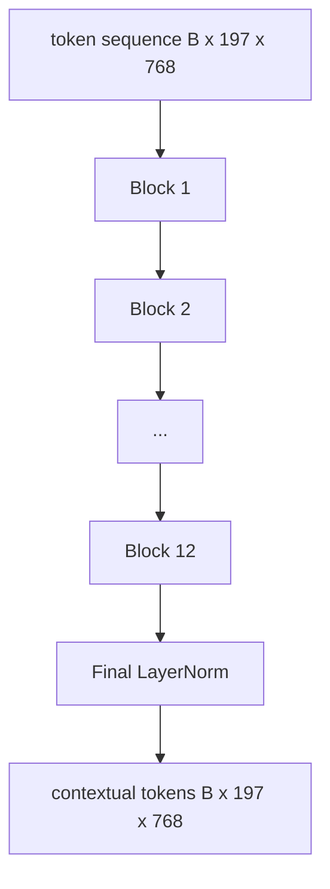
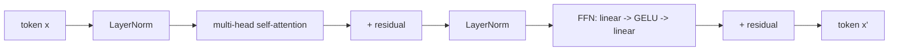

# Vision Transformer Encoder

> Patch một mình không thấy. Một bộ chuyển đổi pre-LN 12 lớp với 12 đầu chú ý biến chuỗi các mã thông báo vá thành một chuỗi các mã thông báo ngữ cảnh, với mã thông báo CLS hợp nhất các tính năng toàn bộ hình ảnh trong trạng thái ẩn cuối cùng của nó. Bài học này là phòng động cơ của mọi mô hình ngôn ngữ thị giác hiện đại.

**Type:** Build
**Languages:** Python
**Prerequisites:** Phase 19 lessons 30-37 (Track B foundations)
**Time:** ~90 minutes

## Mục tiêu học tập

- Thực hiện một khối biến thể trước LN với sự tự chú ý nhiều đầu và một lớp phụ chuyển tiếp.
- Lắp 12 khối với 12 đầu để tạo thành một bộ mã ViT-Base.
- Chuyên chuyển đầu của bản vá từ bài học 58 vào bộ mã hóa và chạy một bước đi về phía trước.
- Kiểm tra xem mã thông báo CLS tổng hợp thông tin từ mỗi bản vá.

## Vấn đề

Việc nhúng đệm tạo ra một chuỗi 197 token, mỗi một vector mà không nhận thức được bất kỳ đệm nào khác. Một bức tranh của một con mèo cần phải có từng vết bẩn để biết những vết bẩn nào chứa râu, những vết bẩn nào chứa nền, và những vết bẩn nào chứa mắt. Bộ biến đổi là cơ chế tạo ra nhận thức đó, một lớp chú ý một lúc. Nếu không có nó, đầu đầu của bản vá là một tokenizer thông minh mà không có sự hiểu biết.

Công thức tiêu chuẩn là 12 khối sâu, 12 đầu rộng, với vị trí trước LayerNorm, kích hoạt GELU, và mở rộng cấp dữ liệu 4x. Công thức đó là xương sống của CLIP ViT-L, SigLIP, DINOv2, gia đình Qwen-VL, InternVL, và mọi bộ mã hóa tầm nhìn trọng lượng mở khác từ năm 2025-2026. Công thức này đủ ổn định để bạn có thể đọc bất kỳ tờ nào và giả định hình dạng khối này trừ khi họ nói rõ ràng khác.

## Khái niệm





### Trước LN vs sau LN

Transformer gốc đặt LayerNorm sau phần còn lại. Pre-LN (LayerNorm trước mỗi tầng phụ) là phiên bản mà mọi mô hình ngôn ngữ thị giác hiện đại sử dụng, bởi vì nó đào tạo ổn định mà không cần các thủ thuật nóng lên tốc độ học tập. Sự khác biệt là một đường trong đường đi phía trước, và dòng chảy gradient ở độ sâu 12+ là đêm và ngày.

### Sự chú ý tự chủ nhiều đầu

Mỗi đầu sẽ chiếu các đường dẫn biểu tượng cho riêng mình `(query, key, value)`ba chiều kích `head_dim = hidden / num_heads`- Với `hidden = 768`và `heads = 12`, mỗi đầu đều có`dim = 64`. 12 đầu đi ngang, sau đó các đầu ra của chúng lại kết hợp với chiều 768 và đi qua một dự đoán đầu ra. Điểm của nhiều đầu là một đầu có thể học "ngắm nhìn mắt mèo" trong khi một đầu khác học "ngắm nhìn gradient nền" mà không bị can thiệp.

### Tại sao sự mở rộng 4x tiếp theo

FFN đi`hidden -> 4 * hidden -> hidden`Các yếu tố 4 là kinh nghiệm và đã giữ trên các biến đổi ngôn ngữ và tầm nhìn kể từ năm 2017. nhỏ hơn (2x) không phù hợp; lớn hơn (8x) vượt quá ngân sách dữ liệu cố định. MLP là nơi mô hình lưu trữ hầu hết các dữ liệu được học, và trung tâm rộng hơn là nơi họ ngồi.

| Component | Parameters at ViT-Base scale |
|-----------|------------------------------|
| qkv projection per block | `3 * 768 * 768 = 1.77M` |
| output projection per block | `768 * 768 = 590K` |
| FFN per block (4x expansion) | `2 * 768 * 4 * 768 = 4.72M` |
| LayerNorm per block | `4 * 768 = 3K` |
| Total per block | about 7.1M |
| 12 blocks | about 85M |
| Plus front end | about 86M total |

ViT-Base là một bộ mã hóa tham số 86M. Điều đó nhỏ đối với các tiêu chuẩn 2026 (SigLIP-So400M là 400M, Qwen-VL ViT là 675M), nhưng kiến trúc là giống nhau cho đến chiều rộng và chiều sâu.

### Mặt nạ nguyên nhân hay không?

Vision Transformers chỉ có mã hóa và hai chiều: token `i`có thể tham dự để token `j`Không có mặt nạ. Sự chú ý chéo bên giải mã trong bài học 61 sẽ sử dụng một mặt nạ nguyên nhân, nhưng bên trong bộ mã hóa thị giác, sự chú ý được kết nối hoàn toàn.

### Những gì token CLS học được

Các mã thông báo CLS bắt đầu như một tham số được học, không có nội dung bản vá riêng của mình, và tích lũy thông tin thông qua sự chú ý trên mỗi khối.

```figure
ch-cls-funnel
```

## Hãy xây dựng nó

`code/main.py`thực hiện:

- `MultiHeadSelfAttention`, với `qkv`và dự đoán đầu ra, toán học chú ý sản phẩm điểm quy mô, và khẳng định hình dạng.
- `FeedForward`, 4x mở rộng GELU MLP.
- `Block`, một khối trước LN bao gồm các lớp phụ trọng tâm và cấp dữ liệu tiếp theo với dư thừa.
- `ViT`, một đống 12 khối với một LayerNorm cuối cùng.
- `VisionEncoder`, những dây nào `VisionFrontEnd`Từ bài học 58 đến `ViT`đống và phơi bày một `forward()`trả lại chuỗi ngữ cảnh và vector CLS tập hợp.
- Một bản demo chạy một hình ảnh cố định tổng hợp 224x224 thông qua bộ mã hóa đầy đủ và in hình đầu vào, hình thức ra, số parameter và chuẩn CLS ở mỗi lớp khác.

Đi đi.

```bash
python3 code/main.py
```

Khả năng: thiết bị được mã hóa với `(1, 197, 768)`Tăng-sơ. Tỷ lệ CLS di chuyển lên khi các lớp kết hợp, sau đó ổn định tại LayerNorm cuối cùng.

## Sử dụng nó

Các mã hóa được định nghĩa ở đây là, cho đến chiều rộng và chiều sâu, cùng một khối khối mà được gửi vào bên trong mỗi VLM trọng lượng mở trong năm 2025-2026.

- **Width and depth.**ViT-Large là `hidden=1024, depth=24, heads=16`; SigLIP So400M là `hidden=1152, depth=27, heads=16`- Cùng một khu.
- **Pooling head.**CLS pooling (đọc bài này) vs trung bình pooling (SigLIP) vs tập trung sự chú ý (sau này VLMs).
- **Position handling.**Phương pháp toán khối không thay đổi.
- **Register tokens.**DINOv2 cung cấp thêm 4 token được học thêm một dòng mã.

Bảng khối này là nền, các bài học tiếp theo (60-63) đứng trên đó.

## Các thử nghiệm

`code/test_main.py`bao gồm:

- một khối duy nhất duy trì hình dạng và không thay đổi với kích thước lô nhập
- điểm chú ý tổng cộng đến một dọc theo trục chính (softmax sanity)
- Các đường residual được dây (tổng 0 vẫn tạo ra đầu ra không bằng 0 thông qua token CLS)
- Một 4 lớp xếp hàng đi trước tạo ra hình dạng đúng
- dòng chảy gradient đến dự đoán vá từ sản xuất CLS

Đi xem chúng:

```bash
python3 -m unittest code/test_main.py
```

## Các bài tập

1. Thêm mã đăng ký (4 vector học được prepend sau CLS) và chạy lại. So sánh độ mượt mà của bản đồ chú ý thông qua sự phân phối softmax trên lớp cuối cùng.

2. Thay đổi trước LN cho sau LN và đào tạo một thời đại trên một bộ phân loại hình tổng hợp.

3. Thực hiện che giấu nguyên nhân như một `attn_mask`Đối tượng này được sử dụng như một khối decoder.`(seq, seq)`, hình ba góc dưới.

4. Tạo hồ sơ một con đường đi trước ở kích thước lô 1, 8, 64 với `torch.profiler`MLP chiếm ưu thế thời gian tường, không phải sự chú ý.

5. Thay thế một đầu chú ý của các dự đoán q-k-v với một bộ điều chỉnh LoRA cấp thấp, đóng băng phần còn lại, và xác minh gradient chỉ chảy ở nơi bạn mong đợi.

## Các điều khoản chính

| Term | What it means |
|------|---------------|
| Pre-LN | LayerNorm applied before each sub-layer instead of after |
| Self-attention | Each token attends to every other token in the same sequence |
| Multi-head | The hidden dim is split across `H` independent attention heads |
| FFN expansion | The feed-forward layer widens to `4 * hidden` before contracting |
| CLS pooling | Use the first token's final hidden state as the image summary |

## Đọc thêm

- Một hình ảnh có giá trị 16x16 từ (ViT, 2021) cho công thức mã hóa.
- DINOv2 (2023) cho các token đăng ký và mục tiêu tự giám sát trước khi đào tạo.
- SigLIP (2023) cho biến thể chia sẻ trung bình và lỗ tương phản sigmoid được sử dụng trong bài học 62.
