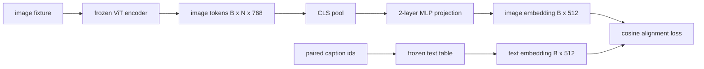

# Lớp chiếu cho sự sắp xếp của mô-đun

> Một mã hóa hình ảnh tạo ra các mã hóa hình ảnh. Một mã hóa văn bản tiêu thụ mã hóa văn bản. Hai người sống trong không gian vector khác nhau. Một MLP hai lớp nhỏ chiếu mã hóa hình ảnh vào không gian nhúng văn bản, và một sự mất cân bằng cosine đối với một tiêu đề được ghép đôi kéo hai không gian vào sự đồng thuận.

**Type:** Build
**Languages:** Python
**Prerequisites:** Phase 19 lessons 30-37 (Track B foundations)
**Time:** ~90 minutes

## Mục tiêu học tập

- Xây dựng một dự án MLP hai lớp mà lập bản đồ các tính năng hình ảnh vào không gian nhúng văn bản.
- Xây dựng một bảng nhúng văn bản giả (không có tokenizer được đào tạo trước, không có corpus thực).
- Xét mất sự sắp xếp cosine giữa các token hình ảnh dự đoán và một bản ghi kết kết hợp.
- Trình chiếu một mình với một bộ mã hóa tầm nhìn đóng băng và một bảng văn bản đóng băng.

## Vấn đề

Bạn có một bộ mã hóa tầm nhìn (các bài học 58-59) tạo ra các dấu hiệu kích thước .`vision_hidden = 768`Bạn có một máy giải mã văn bản mà bạn muốn gắn vào phía trên với kích thước nhúng`text_hidden = 512`Các mã mã hình ảnh không có hình chữ: chúng sống trong một cơ sở mà mã mã học trong quá trình luyện tập trước chỉ bằng thị giác, mà không có mối quan hệ với các đường dẫn từ của mã mã mã.

Dự án MLP hai lớp (lín, GELU, tuyến) làm cầu cho khoảng cách.`768 * 1024 + 1024 * 512 = 1.3M`Các bộ điều mã thị giác vẫn bị đóng băng. Bảng chứa văn bản vẫn bị đóng băng. Chỉ có chiếu chuyển động. Đây là công thức LLaVA được gửi vào năm 2023, mà BLIP-2 đã tái định dạng như một Q-Former, và mà mọi VLM có trọng lượng mở kể từ đó đã áp dụng một số hình thức.

## Khái niệm



### Tỷ tập trước khi chiếu

Bộ mã hóa hình ảnh phát ra 197 mã thông báo. Mặt văn bản có một bên chứa cấp tiêu đề duy nhất. Để sắp xếp chúng bạn cần một vector cấp hình ảnh cho mỗi mẫu. CLS hợp nhất là đơn giản nhất: lấy mã thông báo đầu tiên từ bộ mã thông báo và chiếu nó.

### Tại sao hai lớp chứ không phải một lớp?

Một chiếu tuyến tính duy nhất có thể xoay và tái quy mô nhưng không thể xác định cơ sở nếu hai không gian có sự không phù hợp cong. GELU giữa hai lớp tuyến tính cho dự đoán một đường cong không tuyến tính, đủ để phù hợp các tính năng kiểu CLIP với các mô hình ngôn ngữ. Các dự đoán sâu hơn (LLaVA-NeXT sử dụng GLU; Qwen-VL sử dụng một loạt các lớp chú ý) là mở rộng; MLP hai lớp là đường cơ sở chính và là những gì các tàu đầu tiên dự đoán Q-Former của BLIP-2 có dưới nắp.

| Layer | Shape | Parameters |
|-------|-------|------------|
| fc1 | `(vision_hidden, projection_hidden)` | `768 * 1024 + 1024` |
| activation | GELU | 0 |
| fc2 | `(projection_hidden, text_hidden)` | `1024 * 512 + 512` |

Khoảng 1.3M tham số cho một `768 -> 1024 -> 512`đầu.

### Thiệt độ sắp xếp cosine

Định nghĩa không có nghĩa là `image_emb == text_emb`- Định nghĩa là`image_emb`Đi theo cùng hướng như `text_emb`trong không gian khớp.`1 - cos_sim(image, text)`Bài học 62 tổng quát hóa đến một loạt tương phản (InfoNCE) nơi mỗi hình ảnh phải gần hơn với tiêu đề của riêng mình hơn bất kỳ tiêu đề nào khác trong loạt; bài học này sử dụng phiên bản mỗi cặp để năng động được nhìn thấy.

### Mã hóa đóng băng là thủ thuật

Bộ mã hóa tầm nhìn có các tham số 86M. Bảng văn bản có vài triệu người nữa. Trình luyện tất cả chúng từ một cơ thể giả mạo là một người không bắt đầu. Việc đóng băng cả hai đều có nghĩa là các tham số 1.3M của dự đoán là điều duy nhất thay đổi, và vài trăm bước trên cặp tổng hợp là đủ để giảm tổn thất. Đây chính xác là hình dạng hoạt động của mọi VLM dựa trên bộ chuyển đổi: các bộ phận nặng vẫn bị đóng băng, các tàu cầu nhẹ.

```figure
ch-projection-bridge
```

## Hãy xây dựng nó

`code/main.py`thực hiện:

- `MLPProjector(in_dim, hidden_dim, out_dim)`, hai lớp MLP tuyến tính với kích hoạt GELU.
- `MockTextEmbedding(vocab_size, dim)`, một bảng nhúng đóng băng với sự khởi đầu xác định từ một hạt giống.
- `make_pair(seed, vocab_size)`, tổng hợp một mẫu cặp (hình ảnh, caption). Các tiêu đề là chuỗi id ngắn; việc nhúng tiêu đề là trung bình được tập hợp trên các nhúng mã.
- `cosine_alignment_loss(image_emb, text_emb)`, mỗi cặp`1 - cos_sim`Mục tiêu.
- Một vòng tròn đào tạo chạy dự đoán trong 200 bước trên 32 cặp tổng hợp (thường chu kỳ), với mã hóa tầm nhìn và bảng văn bản đóng băng, và in mất mỗi 25 bước.

Đi đi.

```bash
python3 code/main.py
```

Kết quả: các báo cáo đào tạo giảm từ mất mát ban đầu khoảng 1,07 xuống còn khoảng 0,80 trong vòng 200 bước, chứng minh rằng chỉ đơn thuần tiên chiếu có thể kéo các mã thông báo hình ảnh về không gian văn bản.

## Sử dụng nó

Mô hình tương tự xuất hiện trong mọi VLM trọng lượng mở:

- **LLaVA 1.5.**Dự án GELU MLP hai lớp từ CLIP-ViT-L ẩn vào LLaMA nhúng mờ. Mã hóa thị giác đóng băng, LLM đóng băng, chỉ tập trung vào dự án (sau đó giải phóng LLM trong giai đoạn hai).
- **BLIP-2.**Q-Former lấy 32 mã thông báo truy vấn được học qua sự chú ý qua các mã thông báo hình ảnh, sau đó chiếu vào LLM embed dim.
- **MiniGPT-4.**Đánh chiếu tuyến tính đơn từ BLIP-2 Q-Former đầu ra đến Vicuna nhúng thâm.
- **Qwen-VL.**Chuyện thích hợp sự chú ý qua nhau với nhiều lớp, nhưng phần cuối cùng là một lần nữa một dự đoán cho LM nhúng mờ.

Hình dạng khác nhau nhưng vai trò là giống nhau: mã thông báo hình ảnh bể, dự án để văn bản nhúng mờ, chỉ có tàu.

## Các thử nghiệm

`code/test_main.py`bao gồm:

- hình thức đầu ra của máy chiếu phù hợp với cấu hình `out_dim`
- bảng nhúng văn bản đóng băng có 0 `requires_grad`Các tham số
- mất cosine là 0 trên các vector giống nhau và là 2 trên các vector chống song song
- dòng chảy gradient của máy chiếu sau một lần đi ngược
- vòng đào tạo giảm mất giữa bước 0 và bước 200

Đi xem chúng:

```bash
python3 -m unittest code/test_main.py
```

## Các bài tập

1. Thay thế CLS pooling bằng trung bình pooling trên 196 token patch và so sánh lỗ cuối cùng sau 200 bước. trung bình pooling thường tập trung nhanh hơn trên dữ liệu tổng hợp; CLS hiệu quả hơn trong việc lấy mẫu trên hình ảnh tự nhiên.

2. Thêm nhiệt độ scalar học được cho mất cosine (`cos / tau`) và quan sát những gì xảy ra khi `tau`là quá nhỏ (ruốt âm gradient) hoặc quá lớn (trường cao).

3. Thay đổi MLP hai lớp cho một lớp tuyến tính duy nhất và định lượng khoảng cách mất mát.

4. Thêm một hình phạt L2 nhỏ trên trọng lượng máy chiếu và xem nó tương tác như thế nào với sự sắp xếp cosine (cosine là không thay đổi quy mô, vì vậy hình phạt chủ yếu thu hẹp các hướng không được sử dụng).

5. Cung trọng đầu tiên của máy chiếu tiếp tục, sau đó tải lại và chạy suy luận mà không cần bộ mã hóa tầm nhìn để xác minh rằng chỉ cần đầu tiên là máy chiếu vào thời điểm triển khai.

## Các điều khoản chính

| Term | What it means |
|------|---------------|
| Modality alignment | The act of making image and text embeddings comparable in one shared space |
| Projection head | The small module that maps one space to another, usually a 2-layer MLP |
| Cosine similarity | Dot product divided by the product of L2 norms |
| Frozen encoder | The vision (or text) model has all parameters with `requires_grad=False` |
| Mock corpus | Synthetic pairs used so training has no dataset download dependency |

## Đọc thêm

- Bảng giấy LLaVA cho tàu hai giai đoạn (phương án, sau đó tháo LM).
- Bảng BLIP-2 cho Q-Former như là một thay thế chiếu học được.
- Báo cáo kỹ thuật Qwen-VL cho các bộ chuyển đổi độ chú ý chéo như đầu chiếu sâu hơn.
