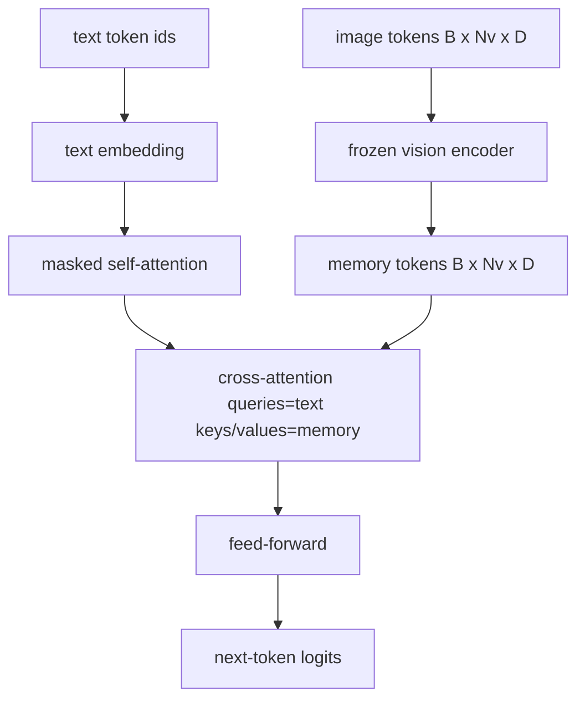
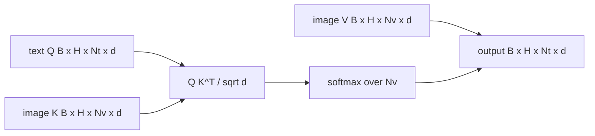

# Sự hợp nhất giữa sự chú ý

> Lớp chiếu sắp xếp một vector hình ảnh với một vector caption. Một decoder ngôn ngữ thị giác thực sự cần mỗi mã thông báo văn bản để theo dõi từng mã thông báo, để mô hình có thể đặt mỗi từ trong một khu vực. Sự chú ý qua nhau là cách mà việc hạ cánh đất xảy ra. Các câu hỏi văn bản; các chìa khóa và giá trị tầm nhìn trả lời. Bài học này xây dựng khối tập trung, tập trung vào bản thân, và hình dạng mặt nạ giữ cho cả hai đều hợp pháp.

**Type:** Build
**Languages:** Python
**Prerequisites:** Phase 19 lessons 30-37 (Track B foundations)
**Time:** ~90 minutes

## Mục tiêu học tập

- Thực hiện sự chú ý chéo đa đầu khi dòng truy vấn là văn bản và dòng khóa/đáng giá là hình ảnh.
- Sắp xếp một khối decoder: sự chú ý tự do nhân quả + sự chú ý qua nhau + chuyển tiếp.
- Hãy tạo ra hình dạng mặt nạ đúng: mặt nạ nhân quả cho sự chú ý tự, không có mặt nạ cho sự chú ý xuyên suốt.
- Thực hiện một thông qua đi trước với các mã thông báo văn bản đúc và một nhóm cố định của mã thông báo hình ảnh.

## Vấn đề

Kết hợp mã thông báo hình ảnh và mã thông báo văn bản thành một chuỗi là một tùy chọn hợp nhất (phương pháp hợp nhất sớm, theo hướng Chameleon và Emu3). Sự chú ý chéo là một lựa chọn khác (phương pháp hợp nhất muộn, theo hướng Flamingo được giới thiệu và mà mọi trình giải mã hình dạng Flamingo đã sao chép).

Lần kết hợp muộn có hai lợi thế. Thứ nhất, dòng văn bản vẫn sạch sẽ và mô hình duy trì khả năng chỉ văn bản. Thứ hai, dòng hình ảnh được tính toán một lần cho mỗi hình ảnh và được sử dụng lại cho mỗi bước giải mã, do đó việc tạo ra rẻ ngay cả cho các tiêu đề dài. Chi phí là một lớp phụ chú ý thêm cho mỗi khối.

## Khái niệm





### Hình dạng mặt nạ

Hai sự chú ý bên trong một khối decoder cần phải có mặt nạ khác nhau:

| Attention | Query length | Key length | Mask | Why |
|-----------|--------------|------------|------|-----|
| Self-attention | `Nt` (text) | `Nt` (text) | Causal: lower-triangular `(Nt, Nt)` | Text tokens may not look ahead during autoregression |
| Cross-attention | `Nt` (text) | `Nv` (vision) | No mask | The whole image is visible to every text position |

Bài học bao gồm một chức năng xác nhận hình dạng để sai lầm của việc trộn chúng lên bề mặt như một `ValueError`thay vì một đường cong thua lỗ bị phá vỡ lặng lẽ.

### Tại sao không có mặt nạ để thu hút sự chú ý

Hình ảnh được quan sát đầy đủ trước khi tạo ra bất kỳ văn bản nào.`t`Một số biến thể Flamingo thêm một mô hình che giấu mỗi mẫu khi để lại nhiều hình ảnh và các đoạn văn bản, nhưng cho một hình ảnh duy nhất cộng với một tiêu đề, sự chú ý chéo nhìn thấy tất cả.

### Caching khóa/đáng giá

Các phím hình ảnh và giá trị được tính toán một lần vào lúc bắt đầu giải mã và được giữ trong cache. Mỗi mã thông báo văn bản mới sử dụng cache mà không cần tính toán lại. Đây là điều làm cho việc ghi chú nhanh chóng: ViT nặng chạy một lần; sự chú ý chéo tái sử dụng các phím và giá trị của nó cho mỗi bước. Bài học phơi bày cache và kiểm tra con đường bị nhấn cache.

### Thành phần khối

Một khối decoder chạy: pre-LN -> tự chú ý -> dư -> pre-LN -> sự chú ý chéo -> dư -> pre-LN -> feed-forward -> dư. Ba tầng dưới, mỗi lớp có LayerNorm riêng. Bức giấy Flamingo thêm một cổng học về sự chú ý chéo để mô hình có thể chọn ra khỏi con đường hình ảnh với chi phí ổn định thời gian đào tạo; đường cơ sở kanonic (được sử dụng ở đây) không có cổng.

```python
class DecoderBlock:
  def forward(self, text_tokens, image_tokens, text_mask, cross_mask):
      text_tokens = text_tokens + self.self_attn(self.ln1(text_tokens),
                                                 mask=text_mask)
      text_tokens = text_tokens + self.cross_attn(self.ln2(text_tokens),
                                                  image_tokens,
                                                  mask=cross_mask)
      text_tokens = text_tokens + self.ffn(self.ln3(text_tokens))
      return text_tokens
```

```figure
ch-crossattn-fan
```

## Hãy xây dựng nó

`code/main.py`thực hiện:

- `CrossAttention(hidden, heads)`, nhiều đầu qua sự chú ý với riêng biệt `q`và `kv`dự đoán.
- `CausalSelfAttention(hidden, heads)`, sự chú ý tự động được che giấu từ một máy giải mã tiêu chuẩn.
- `DecoderBlock`, tạo thành ba lớp phụ với các chất còn lại trước LN.
- `VisionLanguageDecoder`, 4 lớp decoder được cung cấp bởi một phát mã hình ảnh giả và một bảng nhúng văn bản nhỏ.
- `causal_mask(length)`trả lại một `(length, length)`- Tăngzor boolean ba góc thấp.
- Một bản demo cung cấp một loạt hai chuỗi văn bản dài 10 với bộ nhớ hình ảnh dài 197 và in hình thức đầu ra, hình thức mặt nạ tự chú ý và tiêu chuẩn đầu ra sự chú ý chéo cho mỗi vị trí.

Đi đi.

```bash
python3 code/main.py
```

Khả năng: máy giải mã tạo ra một `(2, 10, text_vocab)`- Hình dạng mặt nạ là`(10, 10)`Kiểm tra tái sử dụng KV-cache xác nhận các logit giống nhau giữa các đường bộ được lưu trữ và không lưu trữ.

## Sử dụng nó

Sự chú ý chéo xuất hiện trong hai gia đình sản xuất:

- **Flamingo and IDEFICS.**Đặt một lớp phụ liên quan liên quan đến các khối mô hình ngôn ngữ K, với một LM đóng băng.
- **BLIP-2.**Q-Former sử dụng sự chú ý qua nhau từ một bộ cố định của 32 mã truy vấn vào các tính năng hình ảnh, sau đó chiếu các truy vấn vào không gian nhúng LM.

Hình dạng của khối trong bài học này được vẽ trực tiếp trên cả hai.

## Các thử nghiệm

`code/test_main.py`bao gồm:

- Mặt nạ nguyên nhân là hình ba góc thấp hơn và phù hợp với hình dạng boolean dự kiến
- hình thức phát ra sự chú ý qua nhau là `(B, Nt, hidden)`bất kể chiều dài khóa
- KV-cache path phù hợp với uncached path với float tolerance
- sự không phù hợp hình dạng giữa các dòng văn bản và hình ảnh làm cho một rõ ràng `ValueError`
- một đoạn chuyển tiếp giải mã đầy đủ tạo ra hình dạng lô và chuỗi đúng

Đi xem chúng:

```bash
python3 -m unittest code/test_main.py
```

## Các bài tập

1. Thêm một cổng tanh học được vào phần còn lại của sự chú ý chéo (trách thức Flamingo) và xác minh sự hội tụ tập từ cổng ban đầu gần bằng không. Cổng bắt đầu từ 0; mô hình phục hồi hành vi chỉ văn bản trước khi trộn dòng hình ảnh vào.

2. Thực hiện sự chú ý liên kết khi cùng một trình giải mã tiêu thụ nhiều hình ảnh cộng với nhiều phân đoạn văn bản. Xây dựng mặt nạ chú ý chéo mỗi mẫu ngăn chặn phân đoạn văn bản 2 tham gia vào hình ảnh 1.

3. Tạo hồ sơ sự chú ý qua nhau so với lớp chú ý tự mình tại `Nt=64, Nv=576`(một lưới 24x24 ở độ phân giải cao hơn).`Nt * Nv`và thống trị độ phân giải hình ảnh cao.

4. Thêm một dấu chấm dứt bên truy vấn trên bản đồ chú ý chéo và đo sự đa dạng của tiêu đề trên bản demo (sự khác biệt mẫu tiêu đề tăng khi dấu chấm dứt trong bản đồ chéo).

5. Thay đổi lớp chú ý chéo cho một khối chú ý kiểu Q-Former nơi một hồ sơ truy vấn 32 token cố định tham gia vào các tính năng hình ảnh một lần mỗi lớp.

## Các điều khoản chính

| Term | What it means |
|------|---------------|
| Late fusion | Text and vision stay in separate streams; cross-attention bridges them at every block |
| Cross-attention | Q comes from one stream, K and V from another |
| Causal mask | Lower-triangular boolean mask that prevents looking ahead during autoregression |
| KV cache | Image keys and values stored once and reused for every decode step |
| Memory tokens | The frozen image tokens that the decoder reaches into |

## Đọc thêm

- Flamingo (2022) cho thiết kế hợp nhất muộn theo quy luật với sự chú ý chéo bị khóa.
- BLIP-2 (2023) cho Q-Former, đó là một khối sự chú ý chéo được trang phục như một hồ bơi truy vấn học tập.
- IDEFICS (2023) cho một bản sao rộng của công thức Flamingo.
