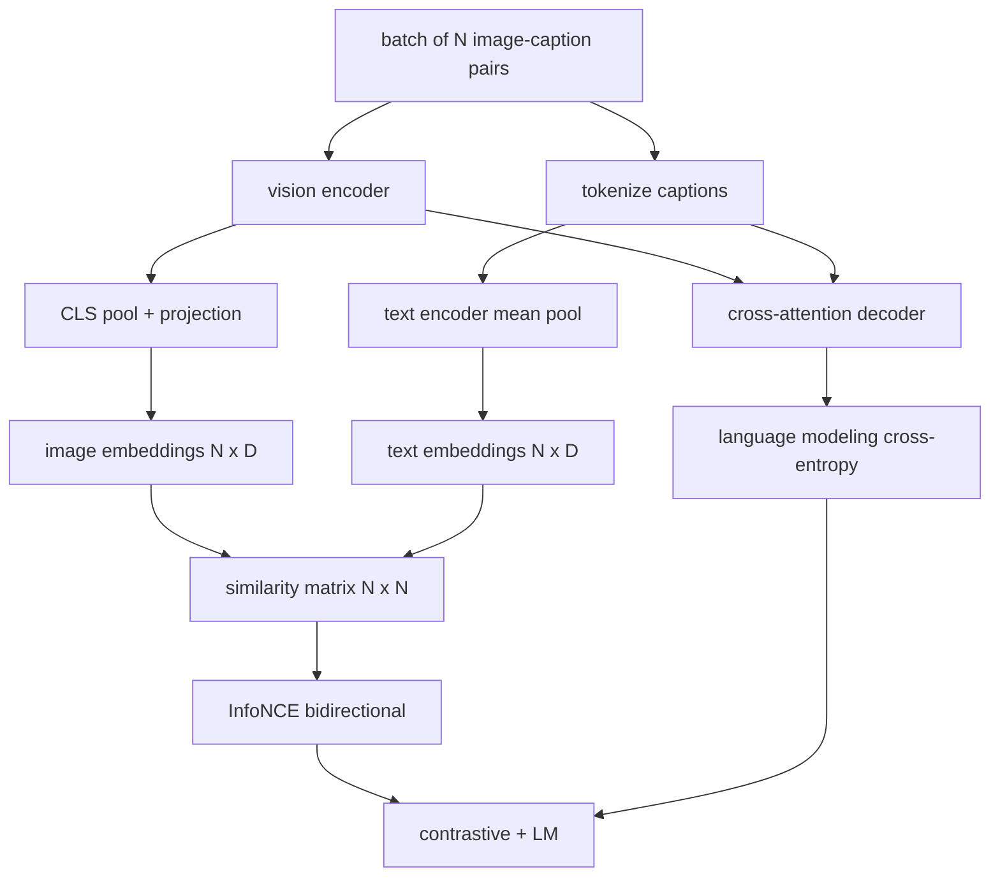

# Việc chuẩn bị cho ngôn ngữ thị giác

> Các bộ mã hóa, chiếu và decoder được dây kết nối. Bây giờ tập hợp chúng với nhau. Hai mục tiêu thúc đẩy học tập: một sự mất mát hình ảnh-môn văn bản tương phản (InfoNCE) kéo cặp phù hợp lại với nhau trong không gian nhúng chung, và một sự mất mát mô hình hóa ngôn ngữ yêu cầu trình giải mã để ghi chú từng hình ảnh. Kết hợp, chúng dạy mạng cả tìm thấy hình ảnh phù hợp cho một tiêu đề và viết tiêu đề cho hình ảnh.

**Type:** Build
**Languages:** Python
**Prerequisites:** Phase 19 lessons 30-37 (Track B foundations)
**Time:** ~90 minutes

## Mục tiêu học tập

- Thực hiện mất độ tương phản InfoNCE trên một loạt các cặp hình ảnh-chủ đề.
- Tạo lại sự mất mát tương phản với sự mất mát mô hình hóa ngôn ngữ tự rút.
- Kết hợp một bộ hình ảnh giả 200 cặp không có tải xuống dữ liệu thực tế.
- Hãy chạy vòng huấn luyện demo 50 bước và quan sát cả hai lỗ giảm.

## Vấn đề

Một mô hình ngôn ngữ thị giác cần hai kỹ năng. Nó phải xếp hạng: được đưa ra một tiêu đề, tìm thấy hình ảnh phù hợp trong số nhiều. Nó phải tạo ra: được đưa ra một hình ảnh, viết tiêu đề. Việc huấn luyện trước mô hình chỉ một kỹ năng cho bạn một nửa hệ thống. CLIP xếp hạng đóng móng nhưng không thể ghi tiêu đề. GPT-4V có thể ghi tiêu đề nhưng sử dụng một đầu lấy riêng biệt cho xếp hạng.

InfoNCE xử lý phân nửa xếp hạng. Đối với một loạt các cặp N, mô hình xử lý các cặp N phù hợp như tích cực và các `N^2 - N`cặp không phù hợp như âm, sau đó chạy một mất entropy chéo trên kết quả `(N, N)`LM mất xử lý nửa thế hệ: dự đoán chuẩn next-token tùy thuộc vào hình ảnh. Cả hai lỗ đều có thể phân biệt và có thể chia sẻ trọng lượng mã hóa, máy chiếu và mã hóa.

## Khái niệm



### InfoNCE trong một đoạn

Lắp xếp các hình ảnh N được nhúng như hàng và các văn bản N được nhúng như hàng. L2- bình thường hóa cả hai.`N x N`matrix `S = I T^T / tau`nơi `tau`là nhiệt độ được học. Các mục tiêu đường vạch là cặp phù hợp; các mục nhập ngoài đường vạch là âm.`argmax`đi xuống đường chọc: hàng `i`nên có mục cao nhất trong cột `i`- làm tương tự đối xứng dọc theo cột. tổng là trung bình của hai. Đây là lỗ CLIP trong tám đường.

### Nhiệt độ quan trọng

Nhiệt độ `tau`điều khiển mức độ cao của Softmax quá nhỏ (ví dụ:`tau = 0.01`(với độ tần suất cao nhất, độ tần suất cao nhất, độ tần suất cao nhất, độ tần suất cao nhất, độ tần suất cao nhất, độ tần suất cao nhất, độ tần suất cao nhất, độ tần suất cao nhất, độ tần suất cao nhất, độ tần suất cao nhất, độ tần suất cao nhất, độ tần suất cao nhất, độ tần suất cao nhất, độ tần suất cao nhất, độ tần suất cao nhất, độ tần suất cao nhất, độ tần suất cao nhất, độ tần suất cao nhất, độ tần suất cao nhất, độ tần suất cao nhất, độ tần suất cao nhất, độ tần suất cao nhất, độ tần suất cao nhất, độ tần suất cao nhất, độ tần suất cao nhất, độ tần suất cao hơn, độ tần suất cao hơn, độ tần suất biến mất. CLIP học `tau`như một tham số; demo ở đây cũng làm như vậy.

### Thiệt hại mô hình hóa ngôn ngữ

Bộ giải mã tiêu thụ các mã ký ức hình ảnh thông qua sự chú ý chéo và dự đoán mã ký ức văn bản tiếp theo tại mọi vị trí. Loss là sự tham gia chéo tiêu chuẩn với mục tiêu vị trí tiếp theo.

### Kết hợp các tổn thất

`total = contrastive + lm_weight * lm`nơi `lm_weight`là một đường độ (thường là 1.0). hai lỗ chia sẻ gradient vào mã hóa và chiếu; chỉ có decoder nhận gradient mất LM. Đây là công thức đa nhiệm mà các mô hình kiểu CoCa, BLIP và SigLIP đều sử dụng, với trọng lượng khác nhau.

| Component | Loss surface | Affects |
|-----------|--------------|---------|
| InfoNCE | Pair ranking in the joint space | Encoder + projection + text head |
| LM | Token prediction conditioned on image | Encoder + projection + decoder |
| Combined | Multi-task | Whole stack |

### Tại sao 50 bước là đủ cho một bản demo

Bộ giả tạo là một bộ 200 cặp tổng hợp với hình ảnh ngẫu nhiên và ID caption ngẫu nhiên. Sau 50 bước SGD với kích thước lô 16, cả hai lỗ giảm đáng nhìn thấy ngay cả khi các giá trị tuyệt đối ở trên những gì mô hình dữ liệu thực sẽ đạt được. Điểm của bản demo là để xác nhận các công việc ống nước gradient kết thúc và việc thêm mất LM không gây bất ổn cho mục tiêu tương phản.

```figure
ch-infonce-diagonal
```

## Hãy xây dựng nó

`code/main.py`thực hiện:

- `MultimodalModel`, kết hợp một bộ mã hóa ViT nhỏ, máy chiếu MLP, một bộ mã hóa bên văn bản nhỏ (đối đa các ID nhúng), và bộ mã hóa sự chú ý chéo từ bài học 61.
- `info_nce_loss(image_emb, text_emb, temperature)`, lỗ tương phản kiểu CLIP hai chiều.
- `lm_loss(logits, target_ids, padding_id)`, che giấu next-token cross-entropy.
- `make_mock_corpus(seed, n_pairs)`, trả lại 200 cặp xác định (hình ảnh, caption_ids).
- Một vòng tròn đào tạo chạy 50 bước với kích thước lô 16, tối ưu hóa Adam, và một tham số nhiệt độ nhật ký được học.

Đi đi.

```bash
python3 code/main.py
```

Tạo ra: giảm tổn thất tương phản từ khoảng `ln(16) = 2.77`về 2.4; LM mất giảm từ một đường cơ sở ngẫu nhiên đồng nhất của `ln(512) ≈ 6.24`Các mô hình thực tế tập luyện hàng triệu bước; động lực là giống nhau.

## Sử dụng nó

Đây là công thức của người mất mát:

- **CLIP (2021).**Chỉ có hình ảnh- văn bản tương phản, với một bộ phận đóng băng-encoder đầu tư riêng biệt.
- **CoCa (2022).**Phân biệt hình ảnh-tông văn cộng với ảnh ghi chú mất LM trong một mô hình.
- **BLIP (2022) and BLIP-2.**Tăng độ cộng LM cộng hình ảnh-đọc kết hợp đầu.
- **SigLIP (2023).**Đổi InfoNCE cho một cặp sigmoid mất; cùng một vai trò tương phản, hình thức chức năng khác nhau.
- **LLaVA family.**Trình huấn luyện hai giai đoạn trong đó giai đoạn một là sự sắp xếp (các bên trên một LM đông lạnh) và giai đoạn hai thêm mất LM với một LM không đông lạnh. Bài học 60 bản đồ giai đoạn một; bài học này bản đồ giai đoạn hai.

## Các thử nghiệm

`code/test_main.py`bao gồm:

- InfoNCE mất tích là đối xứng trên các dòng hình ảnh / văn bản
- InfoNCE mất trả lại 0 khi các matrix tương tự là một đường vạch hoàn hảo của các số tích cực lớn
- LM mất đúng cách che giấu vị trí lấp
- mô hình chuyển tiếp tạo ra cả hai lỗ mà không có lỗi
- 5 bước vòng đào tạo giảm mất tích kết hợp

Đi xem chúng:

```bash
python3 -m unittest code/test_main.py
```

## Các bài tập

1. Thay thế InfoNCE bằng cách mất cặp sigmoid kiểu SigLIP và so sánh sự hội tụ trên cơ thể giả.

2. Thêm một bước khai thác âm tính cứng: mỗi lô khác, chọn cặp cứng nhất ngoài đường viền từ lô trước đó và thêm nó.

3. Thêm một đầu nhị phân phù hợp hình ảnh-tin nhắn trên đầu nhúng chung (true/false: do these match?) để mất thứ ba, sao chép thiết lập ba đầu của BLIP.

4. Thay thế các bản ghi giả bằng các chuỗi mã ghi chú được rút ra từ chuỗi Markov mà các matrix chuyển tiếp được điều kiện trên hash hình ảnh.

5. Đào tạo cùng một mô hình với `lm_weight = 0`và một lần nữa với `lm_weight = 1`- So sánh tổn thất tương phản; tổn thất LM không nên lùi lại mục tiêu xếp hạng.

## Các điều khoản chính

| Term | What it means |
|------|---------------|
| InfoNCE | Noise contrastive estimation: cross-entropy on a similarity matrix |
| Temperature | Scalar that controls how peaked the contrastive softmax is |
| Hard negative | An off-diagonal pair the model finds confusing, useful for sampling |
| LM loss | Standard next-token cross-entropy on the captioning side |
| Joint embedding space | The shared space where image and text vectors live after projection |

## Đọc thêm

- Bảng giấy CLIP cho công thức tương phản ban đầu.
- Bảng giấy CoCa cho sự tương phản cộng với chú thích trong một mô hình.
- Bảng giấy SigLIP cho biến thể mất cặp sigmoid và lý do tại sao nó cân bằng tốt hơn.
