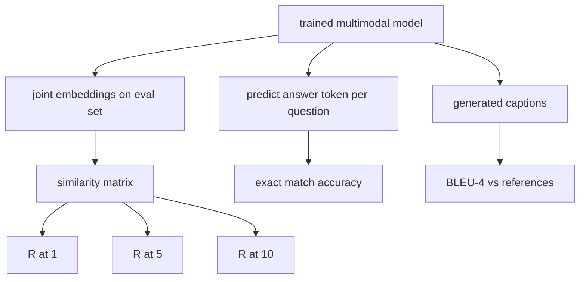

# Đánh giá đa phương thức

> Việc đào tạo là một nửa vòng lặp. Một nửa khác là đo lường. Bài học này xây dựng ba bề mặt đánh giá từ nguyên thủy: lấy lại hình ảnh-chủ đề được báo cáo là R@1, R@5, R@10; trả lời câu hỏi trực quan được báo cáo là độ chính xác phù hợp chính xác; và ghi chú hình ảnh được báo cáo là BLEU-4.

**Type:** Build
**Languages:** Python
**Prerequisites:** Phase 19 lessons 58-62 (Track E foundations: encoder, transformer, projection, cross-attention fusion, pretraining)
**Time:** ~90 minutes

## Mục tiêu học tập

- Xét Recall@K từ một matrix tương đồng giữa các bản ghi hình ảnh và bản ghi.
- Xét độ chính xác VQA phù hợp chính xác từ một mô hình lập bản đồ (hình ảnh, câu hỏi) cặp với một từ vựng trả lời cố định.
- Xét BLEU-4 từ các chuỗi mã thông báo được tạo và tham chiếu mà không cần bất kỳ thư viện bên ngoài nào.
- Thử cả ba bài đánh giá với một bộ tổng hợp được xây dựng trên trên mô hình được đào tạo từ bài học 62.

## Vấn đề

Sự cám dỗ là tuyên bố mô hình đa phương thức đã hoàn thành khi các vùng cao nguyên mất tập luyện. Các thước đo mất tập luyện phù hợp với phân phối đào tạo; nó không đo liệu mô hình có thể xếp hạng cặp trong một loạt dài, trả lời một câu hỏi hoặc viết một tiêu đề mà con người sẽ chấp nhận không. Ba bề mặt đánh giá là tiêu chuẩn:

- **Retrieval (R@1, R@5, R@10).**Xây dựng kết hợp nhúng cho một tiêu đề truy vấn; xếp hạng mọi hình ảnh trong hồ sơ đánh giá theo cosine; báo cáo liệu hình ảnh phù hợp có rơi vào đầu 1, đầu 5, đầu 10.
- **Visual question answering (exact match).**Được đưa ra (hình ảnh, câu hỏi), mô hình đưa ra một mã thông báo trả lời. Sự phù hợp chính xác là một bit cho mỗi mẫu: liệu câu trả lời dự đoán bằng với câu trả lời tham khảo không?
- **Captioning (BLEU-4).**Tạo một tiêu đề. Xét trung bình hình học của 1 gram đến độ chính xác 4 gram so với tiêu đề tham khảo, với một hình phạt ngắn gọn.

Mỗi thước đo là một hàm mỏng. Bài học xây dựng tất cả chúng trong mã để toán học là cụ thể và bề mặt vẫn nằm dưới sự kiểm soát của bạn. Đồ chuẩn thực sự (MS-COCO, VQA v2, GQA, OK-VQA) cắm vào các hình dạng hàm tương tự.

## Khái niệm



### Recall@K từ một matrix tương tự

Xây dựng `(N, N)`Matrix tương đồng cosine giữa các hình ảnh và bản ghi nhúng. Đối với mỗi hàng, sắp xếp các cột bằng cách giảm tương tự. Recall@K là phần của các hàng mà chỉ số cột đường chéo nằm trong các vị trí K trên cùng. Symmetric Recall@K (caption-to-image) được tính trên các matrix được chuyển giao. Cả hai số đều được báo cáo. Đối với một đánh giá N = 100, R@1 = 0,6 có nghĩa là 60 trong số 100 tiêu đề đã lấy lại hình ảnh chính xác của họ như kết hợp trên cùng.

### VQA phù hợp chính xác

Đối với mỗi hình ảnh (hình ảnh, câu hỏi, câu trả lời), mã hóa hình ảnh, nhúng câu hỏi, kết hợp thông qua máy giải mã, và đọc ra biểu tượng tiếp theo. ID token dự đoán được so sánh với ID tham chiếu; chính xác nếu bằng. Tỷ lệ trung bình trên tập hợp đánh giá. Các tập dữ liệu VQA thực sự cung cấp nhiều câu trả lời được ghi chú bởi con người cho mỗi câu hỏi và sử dụng công thức chính xác mềm (1.0 nếu ít nhất 3 trong số 10 người ghi chú đồng ý, quy mô dưới đây); bài học sử dụng sự phù hợp chính xác của câu trả lời đơn cho sự rõ ràng.

### BLEU-4

```text
BLEU-4 = BP * exp(mean(log p1, log p2, log p3, log p4))
```

Ở đâu `p_n`là độ chính xác n-gram được sửa đổi (đếm số n-gram được tạo ra trong bất kỳ tham chiếu nào, chia bằng tổng n-gram được tạo ra), và `BP`là hình phạt ngắn hạn:

```text
BP = 1                if generated length > reference length
   = exp(1 - r/g)     otherwise, where r is reference length and g is generated
```

Mới lỏng là cần thiết cho các mẫu nhỏ nơi một số `p_n`thực hiện sử dụng Chen và Cherry "chế độ 1" (làm thêm 1 cho số và tên cho bất kỳ số không), đó là mặc định an toàn nhất cho chế độ số thấp.

### Phòng đánh giá tổng hợp

Một bộ đánh giá 50 mẫu được xây dựng trong bộ nhớ từ cùng một mẫu corpus giả sử được sử dụng trong bài học 62, với một hạt giống được giữ. Ba danh sách tạo thành bộ:

- `pairs`: 50 cặp (phần, caption_ids) để lấy lại.
- `vqa`: 50 (hình ảnh, câu hỏi, câu trả lời) gấp ba lần.
- `caps`: 50 (hình, [reference_caption_ids, ...]) mục có tối đa 3 tham chiếu cho mỗi hình ảnh.

Bộ đồ là xác định từ hạt giống và được giữ ra từ tập thể đào tạo, vì vậy các métrics được tính trên dữ liệu mà mô hình chưa bao giờ thấy.

| Metric | Range | Random baseline (N=50) |
|--------|-------|------------------------|
| R@1 | 0 to 1 | 0.02 (1 / N) |
| R@5 | 0 to 1 | 0.10 |
| R@10 | 0 to 1 | 0.20 |
| VQA EM | 0 to 1 | 1 / vocab |
| BLEU-4 | 0 to 1 | small but nonzero |

Đối với một cuộc đào tạo 50 bước trên dữ liệu tổng hợp, các số liệu không được dự kiến là cao; chúng được dự kiến sẽ vượt trên đường cơ sở ngẫu nhiên, đó là những gì kiểm tra demo.

```figure
ch-recall-window
```

## Hãy xây dựng nó

`code/main.py`thực hiện:

- `recall_at_k(sim_matrix, k)`, trả lại một chiếc xe nổi trong `[0, 1]`cho cả hai hướng.
- `vqa_exact_match(predictions, references)`, trả lại trung bình qua `int`bình đẳng.
- `bleu4(generated, references, smoothing=True)`, với hỗ trợ đa tham chiếu.
- `build_eval_suite(seed, n_samples, vocab_size, max_len)`, trả lại ba danh sách đánh giá xác định.
- `evaluate(model, suite)`, chạy cả ba số liệu và trả lại một `dict`của số.
- Một bản demo tải một mô hình đa phương thức mới được khởi tạo từ bài học 62, đánh giá nó, sau đó đào tạo nó trong 50 bước và đánh giá lại, in các métrics trước / sau.

Đi đi.

```bash
python3 code/main.py
```

Kết quả: bảng số trước/sau cho thấy việc lấy lại cải thiện từ gần ngẫu nhiên đến tín hiệu được học của mô hình, VQA cải thiện trên ngẫu nhiên, và BLEU-4 cải thiện (lưu cấu tổng hợp đủ cho một thang máy nâng độ chính xác 4 gram).

## Sử dụng nó

Mỗi số liệu chỉ số được lập trực tiếp trên một chỉ số chuẩn sản xuất:

- **Retrieval.**MS-COCO 5K val, Flickr30K, ImageNet zero-shot là tất cả các vấn đề R@K trên cùng một matrix tương tự. Thay thế các tập tin thực với các tập tin tổng hợp và chữ ký chức năng không thay đổi.
- **VQA.**VQA v2, GQA, OK-VQA sử dụng cùng một hình dạng phù hợp chính xác (với acc mềm thay vì EM trả lời đơn cho VQA v2).
- **BLEU-4.**MS-COCO captioning, NoCaps, Flickr30K captioning tất cả sử dụng BLEU-4 cộng với CIDEr và METEOR.

Đối với các điểm chuẩn thực, trao đổi `build_eval_suite`và giữ các cơ quan chức năng. toán học là điểm chuẩn-người không biết.

## Các thử nghiệm

`code/test_main.py`bao gồm:

- recall@k trả về 1.0 trên một matrix tương tự danh tính hoàn hảo và 0.0 trên một đảo ngược cho k < N
- recall@k tôn trọng `k <= N`đường trên
- bleu4 trả về 1.0 khi được tạo bằng một trong các tham chiếu chính xác
- bleu4 trả lại 0,0 trên từ vựng không liên kết
- vqa phù hợp chính xác bằng với phần của cặp bằng nhau
- build_eval_suite trả về số lượng cặp dự kiến, các mục vqa và mục tiêu tiêu đề

Đi xem chúng:

```bash
python3 -m unittest code/test_main.py
```

## Các bài tập

1. Thêm CIDEr vào các métrics captioning. CIDEr sử dụng trọng lượng TF-IDF trên n-gram, mà thưởng cho các token thông tin.

2. Thực hiện độ chính xác mềm VQA: nhiều câu trả lời của con người cho mỗi câu hỏi, độ chính xác là `min(human_count / 3, 1)`Nếu có phù hợp, sao chép VQA v2.

3. Thêm một biến thể NaN an toàn của `bleu4`xử lý các chuỗi tạo trống mà không bị đập.

4. Lập trung bình tính toán cấp độ tương đối (MRR) bên cạnh R@K. MRR nhạy cảm với nơi mục chính xác rơi ra ngoài K trên; R@K nhạy cảm với việc liệu nó rơi vào K trên.

5. Thực hiện đánh giá trên mô hình tại năm điểm kiểm soát trong quá trình đào tạo (giải 0, 10, 20, 30, 40, 50) và vẽ đường cong học tập.

## Các điều khoản chính

| Term | What it means |
|------|---------------|
| R@K | Fraction of queries where the correct match lands in the top K results |
| Exact match | The simplest VQA scoring: predicted answer equals reference |
| BLEU-4 | Geometric mean of 1- to 4-gram precisions, with brevity penalty |
| Multi-reference | A captioning metric accepts several reference captions per image |
| Held-out | The eval set is sampled from a seed disjoint from the training corpus |

## Đọc thêm

- VQA v2 giấy cho công thức chính xác mềm và thống kê tập dữ liệu.
- Bức giấy CIDER cho các tiêu đề n-gram cân nặng TF-IDF.
- BLEU gốc (Papineni et al., 2002) cho các biến thể làm mượt.
- MS-COCO captioning eval script cho việc thực hiện tham chiếu kinh điển.
