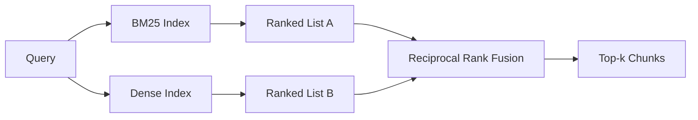

# Phục hồi lai với BM25 và Thiết bị nhúng dày đặc

> Việc tìm kiếm từ ngữ và ngữ nghĩa thất bại trên phân phối truy vấn đối lập. Việc tìm kiếm lai với sự hợp nhất cấp bậc tương đối không liên quan, nó bỏ phiếu - và phiếu bầu thắng trên mọi lớp truy vấn.

**Type:** Build
**Languages:** Python
**Prerequisites:** Phase 11 lessons 04 (embeddings), 06 (RAG); Phase 19 Track B foundations (lessons 20-29); Phase 19 lesson 64 (chunking strategies)
**Time:** ~90 minutes

## Mục tiêu học tập
- Thực hiện BM25 từ đầu từ công thức Robertson và Sparck Jones, với trọng lượng trường, bình thường hóa chiều dài tài liệu và điều chỉnh k1 và b.
- Xây dựng một bộ thu hồi dày đặc trên một xác định tính giả mạo nhúng để vòng lặp chạy offline.
- Thực hiện sự hợp nhất cấp bậc tương ứng chính xác như Cormack, Clarke và Buettcher đã xuất bản nó vào năm 2009, và giải thích tại sao nó thống trị sự phân cực cân nặng điểm.
- Định chỉnh các RRF k liên tục và trọng lượng mỗi modality và đọc các trade-off trên một bộ phận cố định nhỏ.

## Vấn đề

Tìm kiếm từ ngữ thắng khi truy vấn mang một nhận dạng theo nghĩa đen corpus chứa chữ cái.`AbortMultipartOnFail`trả lại hàm Go đúng qua BM25 trong microsecond. cùng một truy vấn, nhúng, nằm ở biên giới của ba cluster tương đồng và một bộ truy xuất dày đặc xếp hạng các tập tin sai trước.

Tìm kiếm dày đặc thắng khi truy vấn được phrased ra khỏi các mã thông báo từ ngữ của corpus. Một người dùng hỏi "còn thế nào chúng tôi xử lý tải lên bị hủy bỏ" không bao giờ gõ chữ hủy bỏ hoặc đa phần. BM25 trả về phần tài liệu trên "sắp lên các tệp lớn" vì trang đó chứa từ tải lên.

Sự lựa chọn giữa hai không phải là một sự lựa chọn tĩnh. Phân bố truy vấn là biến. Một hệ thống sản xuất RAG xử lý cả hai lớp từ cùng một điểm cuối, vì vậy việc tìm kiếm phải xử lý cả hai cùng một lúc. Đó là tìm kiếm lai. Bước hợp nhất là phần phải đúng.

## Khái niệm



### BM25 trong một đoạn

BM25 ghi một cặp truy vấn-tài liệu bằng cách tổng hợp, trên các thuật ngữ truy vấn, một nhân tố tần suất tài liệu ngược nhân bằng một nhân tố tần suất định nghĩa bão hòa bao gồm một sự điều chỉnh bình thường hóa chiều dài. Hai nút. `k1`điều khiển độ bão hòa tần số thuật ngữ; mặc định 1.5 là khuyến nghị được công bố và bạn không nên di chuyển nó mà không có một điểm tham chiếu. `b`kiểm soát bao nhiêu dài tài liệu quan trọng; mặc định 0.75 nói tài liệu dài hơn được phạt, nhưng không phải theo đường thẳng.

Công thức IDF sử dụng định nghĩa Robertson và Sparck Jones trơn tru, đó là `log((N - df + 0.5) / (df + 0.5) + 1)`+ 1 bên trong nhật ký giữ cho IDF tích cực khi một thuật ngữ xuất hiện trong hơn một nửa các corpus.

Tỷ lệ trọng lượng trường cho phép bạn nói với BM25 rằng một trận đấu trên tên biểu tượng có nhiều điểm hơn một trận đấu trong cơ thể. Thực hiện là một nhân số trên các thuật ngữ đếm trong quá trình lập chỉ mục, chứ không phải tại thời điểm ghi điểm. Điều này giữ cho toán học giống nhau và tránh một điểm riêng biệt cho mỗi trường.

### Phục hồi mật độ trong một đoạn

Đưa từng phần vào một vector định chiều với một mô hình nhúng. Vào thời điểm truy vấn, nhúng truy vấn, xếp hạng cosine mỗi phần theo sự tương tự, và trả lại top-k. Mô hình là biến quyết định chất lượng.

Bài học này sử dụng một kết hợp dựa trên hash xác định để bạn có thể đọc toán kết hợp mà không cần gọi mạng. Hash tổng hợp các khoá mã hóa vào một vector 96 chiều và bình thường hóa. Các hàng cosine là xác định trên các chạy, đó là những gì mà bộ thử nghiệm yêu cầu.

### Sự hợp nhất cấp độ đối phương, công thức được công bố

Hai danh sách xếp hạng. Đối với mỗi ứng cử viên xuất hiện trong cả hai danh sách, tổng cộng các đóng góp cấp bậc tương đối của họ.`1 / (k + rank)`với k bằng 60 như là mặc định. sắp xếp theo điểm số tổng. Đó là toàn bộ thuật toán.

Các nhà báo đã đưa ra các kết quả kết quả của các ứng cử viên tham gia vào các cuộc bầu cử.

Hai nút điều chỉnh trong việc thực hiện của chúng tôi.`k`Một cặp cân mỗi phương thức để bạn có thể tăng BM25 hoặc dày đặc khi bạn có bằng chứng trước đó một là tốt hơn trên cơ thể của bạn.

### Tại sao sự hợp nhất vượt qua sự phân cực cân bằng điểm số

Điểm số BM25 không giới hạn và phụ thuộc vào corpus.`alpha * bm25 + (1 - alpha) * cosine`cần phải điều chỉnh alpha per corpus và nghỉ mỗi khi bạn tái lập chỉ mục. Phù hợp dựa trên xếp hạng không. Hai xếp hạng có thể so sánh qua các phương pháp.

Đây là cùng một lập luận mà bạn nghe về RankFusion vs RRF trong tài liệu Vespa và Weaviate. Họ đã đi đến cùng một kết luận: giữ vững dựa trên xếp hạng trừ khi bạn có bằng chứng rất mạnh để phân tích điểm số.

```figure
rrf-fusion
```

## Hãy xây dựng nó

`code/main.py`thực hiện:

- `tokenize(text)`- một token regex nhanh.
- `BM25Index`- trọng lượng trường, với `add`và `search`và điều chỉnh k1, b.
- `mock_embed`- `DenseIndex`- cùng một sự nhúng định nghĩa như bài học 64 để các khối tương đương.
- `rrf(rankings, k, weights)`- sự kết hợp được công bố với trọng lượng đa phương thức.
- `HybridRetriever`- kết hợp BM25 và dense.
- Một bản demo`main()`mà tải một bộ đồ vật nhỏ, chạy ba truy vấn nhắm vào sức mạnh và điểm yếu của mỗi máy thu hồi, và in các thứ hạng mỗi phương thức được sản xuất cộng với danh sách hợp nhất.

Đi đi.

```bash
python3 code/main.py
```

Đọc các kết quả demo bên cạnh. truy vấn nhận dạng theo nghĩa đen hạ cánh tại BM25 hạng 1, mật hạng 4, RRF hạng 1. truy vấn được diễn tả hạ cánh tại BM25 hạng 6, mật hạng 1, RRF hạng 1. truy vấn mơ hồ hạ cánh tại BM25 hạng 3, mật hạng 3, RRF hạng 1. Sự hợp nhất không phải là một tie-breaker; nó là hệ thống chiến thắng trên mỗi lớp truy vấn.

## Định hướng các nút

| Knob | Default | Move it up when | Move it down when |
|------|---------|----------------|------------------|
| BM25 k1 | 1.5 | Terms repeat in documents and you want frequency to matter more | Documents are short and term repetition is noise |
| BM25 b | 0.75 | Long documents really do say less per word | Document length is uncorrelated with topic |
| RRF k | 60 | Deep candidates should keep voting | The top-1 should dominate |
| BM25 weight | 1.0 | Your corpus contains literal identifiers and queries match them | Your queries are user-paraphrased |
| Dense weight | 1.0 | Queries are paraphrased | Queries are literal |

Định hướng bằng cách chạy lại bài học 68 của đánh giá của bạn trên bộ truy vấn đã được giữ, không phải bằng trực giác.

## Các chế độ thất bại demo sẽ ẩn

**Out-of-vocabulary tokens.**BM25 IDF được tính từ corpus, do đó chỉ có các thuật ngữ trong truy vấn đóng góp không. Thiết lập mật độ ảo giác một vector cho cùng một thuật ngữ. Trên các định danh ngoài corpus, phương thức mật độ trả về những người hàng xóm có vẻ hợp lý nhưng sai. Sự hợp nhất hấp thụ điều này bởi vì BM25 không trả lại gì và đóng góp cấp bậc giảm đi, nhưng chỉ khi bạn làm sao chép bằng tài liệu, chứ không phải bằng mảnh.

**Stop-token domination.**BM25 chống lại từ "the" tạo ra một thứ hạng đồng nhất trên corpus. lọc các mã dừng trong chỉ số hoặc chấp nhận rằng các thuật ngữ IDF cao tự nhiên thống trị.

**Identical content across modalities.**Nếu cơ thể của bạn đủ nhỏ để top-1 của BM25 cũng là top-1 của mật, RRF cho bạn cùng top-1 với cùng những hàng xóm. Đó là hành vi chính xác, không phải là một thất bại, nhưng nó làm cho sự hợp nhất trông vô hình. Thêm một cặp truy vấn đối lập vào đánh giá của bạn để xác minh sự hợp nhất thực sự hoạt động.

## Sử dụng nó

Các mô hình sản xuất:

- Chỉ số BM25 trong quá trình; nút thắt là từ điển tần số thuật ngữ, không phải các vector.
- Chỉ số các vector mật độ trong một cửa hàng riêng biệt (trong bài học này chúng tôi sử dụng danh sách phẳng; trong sản xuất bạn sẽ sử dụng HNSW).
- Thực hiện cả hai truy vấn song song; sự hợp nhất là sự hợp nhất liên tục trên liên minh.
- Cung cấp các phương thức của mỗi lần thu hồi để một người xếp hạng lại có thể xem phương thức nào đã bỏ phiếu cho nó.

## Chuyển nó

Bài học 66 lấy top-k hợp nhất từ bài học này và xếp lại với một mã hóa chéo. Bài học 68 đánh giá toàn bộ đường ống với độ chính xác, nhớ lại, MRR và nDCG. Máy thu hồi lai trong bài học này là giai đoạn đầu tiên của hệ thống kết thúc đến kết thúc trong bài học 69.

## Các bài tập

1. Thay thế `mock_embed`với một mô hình thực từ nhà cung cấp của bạn. chạy lại demo và báo cáo cách xếp hạng chỉ mật độ thay đổi trên truy vấn được phác thảo.
2. Thêm một cách thứ ba: tổng kết phân đoạn được lập chỉ mục riêng biệt và hợp nhất như một danh sách thứ ba xếp hạng.
3. Xét RRF k qua 10, 30, 60, 100, 200. Chụp đường cong recall@k từ bài học 68. Báo cáo giá trị của k nơi đường cong đạt đỉnh trên cơ thể của bạn.
4. Thực hiện BM25F đúng cách (tự bình thường hóa chiều dài mỗi trường thay vì thủ thuật nhân) và so sánh trên một cơ quan mà các biểu tượng phù hợp quan trọng nhất.

## Các điều khoản chính

| Term | What people say | What it actually means |
|------|-----------------|------------------------|
| BM25 | "Lexical search" | Probabilistic ranking with idf x saturating tf x length normalization |
| RRF | "Rank fusion" | Sum of 1 / (k + rank) across ranked lists; k = 60 default |
| k1 | "TF saturation" | Controls how fast a repeated term stops adding more score |
| b | "Length penalty" | 0 means ignore document length, 1 means full normalization |
| Field weighting | "Symbol boost" | Repeat tokens during indexing to boost matches in that field |
| Rank-based vs score-based fusion | "Why RRF beats linear" | Ranks are comparable across modalities; scores are not |

## Đọc thêm

- Cormack, Clarke, Buettcher, "Thiết hợp cấp độ tương ứng vượt qua Condorcet và phương pháp học cấp độ cá nhân", SIGIR 2009
- Robertson, Walker, Beaulieu, Gatford, Payne, "Okapi tại TREC-3" (màn giấy BM25 ban đầu)
- [Vespa: Hybrid Retrieval with BM25 and Embeddings](https://docs.vespa.ai/en/tutorials/hybrid-search.html)
- [Weaviate: Hybrid Search](https://weaviate.io/developers/weaviate/search/hybrid)
- Giai đoạn 11 Bài học 06 - Các cơ bản RAG
- Giai đoạn 19 bài học 64 - chunkers có sản lượng được chỉ mục ở đây
- Giai đoạn 19 bài học 66 - cross-encoder reanker tiêu thụ top-k hợp nhất
