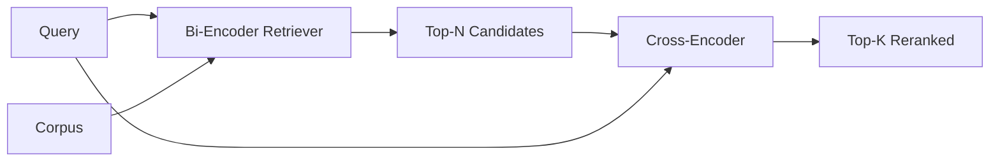

# Cross-Encoder Reranker

> Một bộ mã hóa hai chữ cái nhúng truy vấn và tài liệu độc lập. Một bộ mã hóa chéo kết nối chúng và đọc cả hai cùng một lúc. Bộ mã hóa chéo là người đọc thông minh nhất và chậm nhất. Được sử dụng như một giai đoạn thứ hai trên top-k của bộ mã hóa hai chữ cái, nó tự trả tiền cho chính nó.

**Type:** Build
**Languages:** Python
**Prerequisites:** Phase 11 lesson 06 (RAG), Phase 11 lesson 07 (advanced RAG); Phase 19 Track B foundations (lessons 20-29); Phase 19 lesson 65 (hybrid retrieval feeding this stage)
**Time:** ~90 minutes

## Mục tiêu học tập
- Hóa ra một máy lấy lại bộ mã hóa hai từ một bộ phân định lại bộ mã hóa chéo bằng hình dạng đầu vào, số lượng tham số và chi phí cho mỗi truy vấn.
- Thực hiện một mã hóa chéo nhỏ từ đầu như một khối biến thể tiêu thụ một chuỗi đóng gói (query, tài liệu) và phát ra một quy mô liên quan duy nhất.
- Đưa dây một đường ống thu hồi sau đó xếp hạng lại hai giai đoạn: lấy top-N với một retriever rẻ, xếp hạng lại N lên top-K với cross-encoder, trả lại K.
- Đo sự đổi giá giữa độ trễ và chất lượng trên một bộ đồ cố định nhỏ và chọn đúng N cho một ngân sách độ trễ nhất định.

## Vấn đề

Một bộ mã hóa hai mã hóa lập bản đồ truy vấn và tài liệu vào cùng một không gian vector và xếp hạng theo cosine. Hai mã hóa không bao giờ nhìn thấy nhau. Mô hình phải nén tất cả những gì hữu ích về một tài liệu thành một vector duy nhất, mù quai. Điều này nhanh chóng - một nhúng mỗi tài liệu tại thời gian chỉ mục và một trong mỗi truy vấn tại thời gian truy vấn - và đó là cách duy nhất để xếp hạng ở quy mô corpus.

Chi phí là độ chính xác. Hai tài liệu có cùng chủ đề chung có thể có nội dung gần giống nhau ngay cả khi một trong số họ trả lời câu hỏi và người khác không. Bi-encoder không thể phân biệt chúng.

Một mã hóa chéo giải quyết vấn đề này bằng cách đọc truy vấn và tài liệu cùng nhau. Mô hình nhận `[query] [SEP] [document]`như một chuỗi đơn, chạy sự chú ý đầy đủ trên toàn bộ kết hợp, và tạo ra một biểu tượng liên quan.

Chi phí là thông qua. Khi bộ mã hóa hai lần nhúng một lần và truy vấn mãi mãi, bộ mã hóa chéo chạy một lần cho mỗi cặp ( truy vấn, tài liệu). Đối với một tập hợp tài liệu 10 triệu là 10 triệu thông qua trước mỗi truy vấn. Không thể chạy trong ngân sách yêu cầu.

Giải pháp là giai đoạn. Sử dụng bộ mã hóa hai để lấy top-N. Sử dụng bộ mã hóa chéo để xếp hạng lại N lên top-K. N nhỏ (50 đến 200) và nâng chất lượng của bộ mã hóa chéo tập trung ở nơi có ý nghĩa. Tổng thời gian trễ vẫn nằm trong ngân sách yêu cầu.

## Khái niệm



### Hình dạng đầu vào của cross-encoder

Bao bì tiêu chuẩn là `[CLS] query_tokens [SEP] document_tokens [SEP]`. Các đầu ra CLS- vị trí được đưa vào một đầu tuyến tính duy nhất mà xuất phát các tính chất liên quan. Một số thực hiện sử dụng trung bình-pooling thay vì CLS; sự khác biệt là nhỏ. Điểm là mô hình tạo ra một số cho mỗi cặp.

Một mã hóa chéo tham số 22M (được xuất bản `ms-marco-MiniLM-L-6-v2`(trung trọng) là điểm sản xuất điển hình.`bge-reranker-v2-m3`ở 568M tham số) được dành cho việc xếp hạng lại ngoài khơi hoặc cho xếp hạng lại trang đầu tiên khi K là nhỏ.

### Tại sao bài học này dạy một đứa nhỏ

Một mã hóa chéo thực sự là một bộ biến đổi mã hóa được điều chỉnh tốt. Trong sản xuất bạn tải một điểm kiểm soát và chạy nó. Trong bài học này mục tiêu là để cho bạn thấy hình dạng của mô hình và hình dạng của đường cong chất lượng trễ, không phải để đào tạo một ranker hiện đại. Vì vậy chúng tôi xây dựng một nhỏ `nn.Module`với một khối biến đổi, chú ý nhiều đầu (4 đầu mặc định) và một đầu hồi quy. Nó được khởi tạo theo cách xác định từ một hạt giống để demo có thể tái tạo mà không có trọng lượng trên đĩa.

Mô hình đồ chơi học hình dạng đúng từ bộ phận cố định: các cặp truy vấn-tài liệu có liên quan có điểm số dự đoán cao hơn so với các cặp không liên quan.

### Tốc độ tương đương chất lượng

Các đường ống hai giai đoạn có một điều chỉnh: N. Thanh N từ 5 đến 100 trên một bộ truy vấn kéo dài và bạn có đường cong.

| N | Recall@1 of stage 2 | Cross-encoder forward passes per query | Latency |
|---|--------------------|---------------------------------------|---------|
| 5 | 0.62 | 5 | low |
| 20 | 0.81 | 20 | medium |
| 50 | 0.86 | 50 | high |
| 100 | 0.86 | 100 | very high |

Những con số trên là minh họa cho hình dạng, không phải là các thước đo từ thiết bị này. hình dạng là thực. luôn có một đầu gối khoảng 20 đến 50 ứng cử viên nơi nâng cấp xếp hạng lại bão hòa.

Chọn N từ đường cong đánh giá cộng với ngân sách độ trễ. Cross-encoder không thể nâng hồi tưởng lên trên hồi tưởng của bi-encoder tại N, vì vậy một N thấp giới hạn chất lượng, không chỉ độ trễ.

```figure
rerank-funnel
```

## Hãy xây dựng nó

`code/main.py`thực hiện:

- `CrossEncoder`- một cái nhỏ `torch.nn.Module`: embedding token, một khối biến đổi với nhiều đầu chú ý và feedforward, trung bình đầu được tích hợp sản xuất một scalar.
- `tokenize_pair(query, document)`- đóng gói hai chuỗi thành một chuỗi id duy nhất với các loại id đánh dấu ranh giới, xác định và stdlib.
- `train_tiny(pairs)`- một lần qua đào tạo được giám sát trên một danh sách ba được dán nhãn bằng tay (query, tài liệu, liên quan), do đó mô hình tạo ra điểm số hợp lý trên thiết bị.
- `rerank(query, candidates, top_k)`- giao diện sản xuất.
- `pipeline(query, retriever, top_n, top_k)`- dòng chảy hai giai đoạn.
- Một bản demo`main()`Nó tải các tập hợp từ mô hình bài học 65, lấy top-N, rranks lên top-K, in cả hai danh sách bên cạnh nhau, và báo cáo thời gian trễ của mỗi giai đoạn.

Đi đi.

```bash
python3 code/main.py
```

Kết quả xuất hiện cho thấy N trên cùng của bộ mã hóa hai, K trên cùng của bộ mã hóa chéo, và một bản tóm tắt thời gian. Bộ mã hóa chéo mất nhiều thời gian hơn mỗi cuộc gọi nhưng không chạy trên toàn bộ bộ. Tổng hai giai đoạn vẫn nằm trong ngân sách yêu cầu trong khi chọn câu trả lời mà bộ mã hóa chéo xếp hạng thứ hai hoặc thứ ba.

## Các chế độ thất bại demo sẽ ẩn

**Cross-encoder is not symmetric.** `rerank(q, d)`và `rerank(d, q)`Nếu bạn không tình cờ đổi, thì nhớ lại sẽ sụp đổ.

**N is too low to expose the bug.**Nếu bạn đặt N = K, cross-encoder không thể sắp xếp lại; nó chỉ có thể cân nặng lại. thang máy trông giống như không. chọn N ít nhất ba lần K.

**Training data leaks into the eval.**Nếu các cặp huấn luyện được dán nhãn bằng tay bao gồm các truy vấn đánh giá, xếp hạng lại trông kỳ diệu.

**Production weights are dense.**Một mã hóa chéo tham số 22M là 88MB tại float32.

**Batching matters.**Một mã hóa chéo thực sự chạy các ứng cử viên N trong một lô. Bài học này làm điều đó trong`_batch_encode`, tạo ra các tensor ID và type-id với `torch.tensor(...)`và chạy một lần đi trước. Trượt batching và độ trễ nhân bằng N.

## Sử dụng nó

Các mô hình sản xuất:

- Đặt bi-encoder, cross-encoder và N cùng nhau.
- Cache đầu ra của re-ranker bằng (query, document_id) hash. cùng một truy vấn đối với một corpus ổn định rranks với cùng một thứ tự; cache hits mua cho bạn một cắt giảm độ trễ miễn phí.
- Đăng điểm mã hóa chéo cấp 1. Một truy vấn có điểm số top-1 dưới ngưỡng cụ thể của corpus là một hit ngoài lĩnh vực; hiển thị nó cho LLM như "Tôi không tự tin".

## Chuyển nó

Bài học 68 đánh giá đường ống hai giai đoạn này từ đầu đến cuối. Bài học 69 dây này tái xếp sau máy thu hồi lai từ bài học 65 và phía trước máy phát điện câu trả lời.

## Các bài tập

1. Miêu tả N từ 5 đến 50 và vẽ recall@1 của đầu ra được xếp hạng lại. Tìm đầu gối trên thiết bị này.
2. Cử lý mã hóa chéo cho mười thời đại thay vì một thời đại.
3. Thay thế trung bình chia sẻ bằng một CLS-token đầu. So sánh sự hội tụ trên thiết bị này.
4. Thêm một đầu mã hóa chéo thứ hai dự đoán một nhãn nhị phân "có câu trả lời này trong tài liệu". Sử dụng cả hai đầu khi suy luận; một để xếp hạng, một để ngưỡng.
5. Thay thế định nghĩa giả định bi-encoder với một từ bài học 65 và chuỗi hai giai đoạn. đo sự thay đổi trong top-K so với bi-encoder một mình.

## Các điều khoản chính

| Term | What people say | What it actually means |
|------|-----------------|------------------------|
| Bi-encoder | "Vector retriever" | Encodes query and doc independently; cosine ranks them |
| Cross-encoder | "Reranker" | Encodes (query, doc) jointly; outputs one relevance scalar |
| Two-stage pipeline | "Retrieve and rerank" | Cheap retriever returns N, expensive reranker keeps K |
| N (candidate budget) | "Rerank pool" | The number of candidates the cross-encoder scores per query |
| Mean-pooling head | "Mean of last hidden" | Average the encoder's last-layer outputs into one vector |

## Đọc thêm

- Nogueira, Cho, "Passage Re-ranking with BERT", 2019 - giấy xếp hạng mã hóa chéo truyền thống
- Reimers, Gurevych, "Sentence-BERT: Embeddings Sentence using Siamese BERT-Networks", 2019 - về các bộ mã hóa hai so với các bộ mã hóa chéo
- [SentenceTransformers Cross-Encoders documentation](https://www.sbert.net/examples/applications/cross-encoder/README.html)
- [BGE Reranker v2 model card](https://huggingface.co/BAAI/bge-reranker-v2-m3)
- Giai đoạn 19 bài học 65 - máy thu hồi lai nuôi dưỡng giai đoạn xếp hạng lại này
- Giai đoạn 19 bài học 68 - đánh giá đo lường nâng cấp này xếp hạng lại cung cấp
