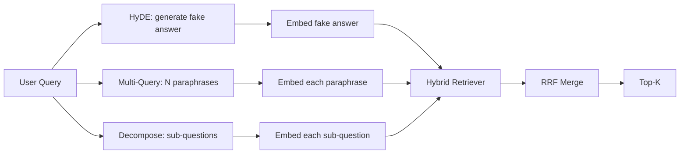

# Query Rewriting: HyDE, Multi-Query, và Decomposition

> Câu hỏi mà người dùng nhập không phải là câu hỏi mà máy tìm kiếm của bạn muốn. Việc viết lại làm cầu nối khoảng cách trước khi tìm kiếm, vì vậy chỉ mục thấy một cái gì đó gần hơn với câu trả lời trông như thế nào.

**Type:** Build
**Languages:** Python
**Prerequisites:** Phase 11 lessons 04 (embeddings), 06 (RAG); Phase 19 Track B foundations (lessons 20-29); Phase 19 lessons 64 and 65
**Time:** ~90 minutes

## Mục tiêu học tập
- Thực hiện HyDE (Hypothetic Document Embeddings): tạo ra câu trả lời giả, nhúng nó, lấy lại đối với vector đó thay vì vector truy vấn.
- Thực hiện mở rộng nhiều truy vấn: viết lại một truy vấn thành N phác thảo, lấy lại với mỗi câu, hợp nhất bằng sự hợp nhất cấp bậc tương đối.
- Thực hiện phân hủy truy vấn: chia câu hỏi phức tạp thành các câu hỏi phụ, lấy lại mỗi câu hỏi phụ, hợp nhất.
- So sánh ba người viết lại một cách trực tiếp trên một thiết bị và giải thích khi nào mỗi chiến lược chiến thắng.
- Đưa ra một LLM giả tạo tạo ra các kết quả xác định, trên thiết bị để vòng lặp viết lại chạy offline.

## Vấn đề

Một người dùng gõ "những gì nhóm của chúng tôi làm khi tải xuống thất bại và ngân sách đã đi?". Bộ phận chứa một tài liệu nói "AbortMultipartOnFail phá sản một tải lên đa phần S3 trong chuyến bay và giảm ngân sách thử lại mỗi thùng khi tải lên thất bại". Câu hỏi và tài liệu không chia sẻ cụm từ danh từ. BM25 bị bỏ lỡ. Bi-encoder xếp hạng tài liệu thứ ba hoặc thứ tư vì vector truy vấn đặt trong một khu vực của không gian nhúng thích doc về các công việc bị hủy bỏ, chứ không phải doc về các tải lên bị phá hủy. Việc xếp hạng lại hai giai đoạn từ bài học 66 có thể cứu câu trả lời nếu nó nằm ở trên cùng N, nhưng nếu nó thậm chí không đạt đến trên cùng N, người xếp hạng lại sẽ không bao giờ thấy nó.

Giải pháp là viết lại truy vấn trước khi nó chạm vào máy thu hồi. Bài báo năm 2023 "Precise Zero-Shot Dense Retrieval without Relevance Labels" (Gao et al.) giới thiệu HyDE: yêu cầu một LLM viết tài liệu sẽ trả lời câu hỏi, nhúng tài liệu giả thuyết đó, và sử dụng nhúng của nó như là vector tìm kiếm. Tài liệu giả thuyết nằm ở vùng phải của không gian nhúng vì nó được viết bằng giọng nói của corpus. Vêctor truy vấn không làm.

Hai kỹ thuật của anh em họ kết hợp với HyDE. Sự mở rộng nhiều truy vấn (từ được sử dụng bởi Microsoft's GraphRAG) tạo ra N phác thảo của truy vấn và lấy lại với mỗi truy vấn, sau đó sáp nhập. Sự phân hủy (được phổ biến như "sự phân hủy các truy vấn" trong nghiên cứu DSPy của Stanford năm 2024) chia "những gì nhóm của chúng tôi làm khi tải lên thất bại và ngân sách đã mất" thành hai câu hỏi: "làm gì khi tải lên thất bại" và "làm gì khi ngân sách thử lại đã mất". Hai lần tìm kiếm, một kết quả hợp nhất, cả hai phần của câu trả lời có thể đạt được.

Bài học này thực hiện cả ba và chạy chúng chống lại cùng một vật cố định.

## Khái niệm



### HyDE chi tiết

HyDE thay thế vector truy vấn của người dùng bằng vector tài liệu giả định được viết bằng LLM.

```
You are a domain expert. Write a one-paragraph passage that answers the question
below. Use the same vocabulary and phrasing the documentation in this domain would
use. Do not refuse. Do not say you do not know.

Question: {user_query}

Passage:
```

Câu trả lời của LLM là sai lầm như một câu trả lời thực tế bởi vì LLM không biết cơ quan của bạn. Không sao đâu. Người tìm kiếm không quan tâm đến sự chính xác thực tế, chỉ về phân phối mã thông báo. Đoạn giả thuyết chứa các từ "cái thai", "những phần", "bàn", "khu ngân sách", bởi vì đó là những gì một đoạn tài liệu về chủ đề này sẽ nói. Đưa vào đoạn đó. Dòng tàu di chuyển hạ cánh gần lối đi thực sự.

Trong sản xuất, bạn giới hạn tài liệu giả thuyết thành hai hoặc ba câu. các giả thuyết dài hơn thu thập nhiều tiếng ồn hơn. Những giả thuyết ngắn hơn mất đi tín hiệu từ điển HyDE cần.

### Sự mở rộng nhiều truy vấn chi tiết

Tạo N phác thảo của truy vấn của người dùng.

```
Rewrite the following question in {N} different ways. Each rewrite must preserve
the original intent. Number them 1 to {N}. Do not add explanations.
```

Nhận top-k cho mỗi câu. Thủy lại các danh sách xếp hạng N với RRF (những thuật toán tương tự từ bài học 65).

Multi-query thắng khi cụm từ của người dùng là một trong nhiều cách thức cũng hợp lệ để đặt câu hỏi, và bất kỳ bản viết lại nào sẽ hỏi tốt hơn.

### Sự phân hủy chi tiết

Một lần tìm kiếm duy nhất không thể đáp ứng được một câu hỏi đa mặt. Việc phân hủy yêu cầu LLM chia câu hỏi thành các câu hỏi phụ và hệ thống tìm kiếm cho mỗi câu hỏi phụ.

```
The following question may require information from multiple distinct topics.
Decompose it into a list of sub-questions. Each sub-question must be answerable
independently. If the question is already atomic, return it unchanged.

Question: {user_query}
```

Thu thập theo phụ câu hỏi. Thủy. Phân hủy là công cụ phù hợp cho các câu hỏi có chứa kết hợp, so sánh nhiều khoản, hoặc hai chủ đề không liên quan. Công cụ sai đối với các câu hỏi nguyên tử; công việc của người phân hủy là trả lại câu hỏi đơn và không phát minh ra các phụ câu giả.

### Tại sao cả ba đều tồn tại

Ba thứ này là bổ sung. HyDE làm nắp khoảng cách mã thông báo truy vấn-cơ quan. Multi-query bao gồm sự khác biệt phác thảo. Decomposition bao gồm các truy vấn đa chủ đề. Một hệ thống sản xuất chạy cả ba và chọn chiến lược cho mỗi truy vấn ( hệ thống đầu đến cuối của bài học 69 cho thấy chọn).

## Các Phụ kiện LLM giả

Bài học chạy offline. LLM giả là một bảng tìm kiếm nhỏ được khóa trên truy vấn của người dùng, cộng với một fallback cho các truy vấn mà người dùng đã không thấy.

- Đối với mỗi truy vấn cố định: một đoạn văn giả thuyết, ba đoạn phác thảo và một phân hủy.
- Đối với một truy vấn không rõ: một biến đổi xác định: lấy các từ nội dung của truy vấn, mở rộng chúng thông qua một bản đồ đồng nghĩa và trả lại kết quả.

hình dạng của giả mạo là quan trọng, không phải dữ liệu. Trong sản xuất bạn thay đổi giả mạo cho một cuộc gọi mô hình thực.

```figure
cd-hyde-vector
```

## Hãy xây dựng nó

`code/main.py`thực hiện:

- `MockLLM`- sự thay thế xác định được mô tả ở trên.
- `HyDERewriter`- gọi LLM để viết tài liệu giả thuyết, trả lại kết quả viết lại như `RewriteResult`với văn bản giả thuyết và truy vấn mà retriever nên sử dụng.
- `MultiQueryRewriter`- gọi LLM cho N phrases, trả lại một danh sách các câu hỏi.
- `DecomposeRewriter`- gọi LLM phân hủy, trả lại các câu hỏi phụ.
- `retrieve_with_rewriter`- lấy một máy viết lại và một máy lấy lại, chạy các bản viết lại, hợp nhất kết quả.
- Một bản demo chạy ba trình viết lại trên một thiết bị và in chiến lược trả lại tài liệu trả lời vàng đầu tiên.

Hình dạng của máy thu hồi được sử dụng lại từ bài học 65 (BM25 + mật độ lai). Sự hợp nhất là cùng một RRF. Hình dạng mới duy nhất là giao diện viết lại, nhỏ.

Đi đi.

```bash
python3 code/main.py
```

Kết quả là một bảng xếp hạng theo chiến lược và một bản tóm tắt cuối cùng. HyDE thắng trên câu hỏi không phù hợp cụm từ. Multi-query thắng trên câu hỏi biến thể cụm từ. Decomposition thắng trên câu hỏi đa chủ đề. Fallback (không có người viết lại) thua trên ít nhất một trong ba.

## Các chế độ thất bại demo sẽ ẩn

**HyDE hallucinates corpus-specific identifiers wrong.**Mô hình phát minh ra một tên hàm. điểm số BM25 của giả thuyết trên tài liệu bên phải sụp đổ vì tên được phát minh hiện ra là một mã thông báo trọng lượng cao mà không xuất hiện trong chỉ số.

**Multi-query rewrites all converge.**Một mô hình yếu tạo ra ba đoạn phrases gần giống hệt nhau. Các bản thu hồi N trả lại cùng một top-k. Việc sáp nhập RRF không tốt hơn một bản thu hồi duy nhất. Thêm một hướng dẫn đa dạng rõ ràng vào lời nhắc viết lại và phát hiện các bản sao của Jaccard.

**Decomposition over-splits.**Các trình phân hủy biến một câu hỏi nguyên tử thành một danh sách. Tất cả các truy xuất đều trả lại cùng một tài liệu nhưng với cấp bậc giảm. Sự kết hợp tồi tệ hơn so với bản gốc. Khám phá điều này bằng cách "có đủ các phụ câu hỏi khác biệt" trước khi phát tán.

**Latency multiplies.**HyDE chi phí một cuộc gọi LLM. Query đa chi phí một cuộc gọi LLM để tạo ra N viết lại, sau đó là N lấy lại.

## Sử dụng nó

Các mô hình sản xuất:

- Chọn chiến lược theo chiều dài truy vấn: truy vấn ngắn nguyên tử có nhiều truy vấn, truy vấn phức tạp có nhiều quy tắc có phân hủy, truy vấn nặng tiếng nói có HyDE.
- Cache đầu ra của rewriter bằng query hash. Nhiều truy vấn lặp lại.
- Tiếp tục tất cả ba điều này song song và hợp nhất ba kết quả với một RRF. Chi phí là ba cuộc gọi LLM và một hợp nhất; chất lượng là sự hợp nhất của cả ba chiến lược.

## Chuyển nó

Bài học 69 dẫn dắt giai đoạn viết lại này trước khi lấy lại từ bài học 65 và xếp hạng lại từ bài học 66. Bài học 68 đánh giá nâng cao mà người viết lại thêm vào hồi tưởng lấy lại.

## Các bài tập

1. Thực hiện RAG-Fusion (một biến thể 2024 của nhiều truy vấn) khi các đoạn phác thảo của người viết lại có ý định đa dạng, sau đó bước xếp hạng lại (câu 66) chọn danh sách cuối cùng.
2. Thêm một chiến lược thứ tư: nhắc nhở trở lại (hỏi LLM cho câu hỏi chung hơn, lấy lại về đó, sau đó hẹp).
3. Trình luyện người phân hủy để nhận ra các truy vấn nguyên tử bằng cách thêm một tiêu đề "có vấn đề là nguyên tử".
4. Thay thế bằng cách gọi một mô hình thực tế, đo lường độ trễ theo chiến lược của bạn.
5. Thêm điểm tin cậy cho mỗi lần viết lại. Giảm các lần viết lại dưới ngưỡng. đo tác động đến việc thu hồi.

## Các điều khoản chính

| Term | What people say | What it actually means |
|------|-----------------|------------------------|
| HyDE | "Fake-document retrieval" | LLM writes the answer; embed and retrieve on that instead of the query |
| Multi-query | "Paraphrase expansion" | N rewrites of the query; retrieve N times, merge by RRF |
| Decomposition | "Subquery split" | Multi-topic queries split into sub-questions, retrieved separately |
| Atomic query | "Single-topic" | Cannot be decomposed without inventing fake sub-questions |
| Step-back | "Abstract the query" | Ask the more general question, retrieve, then narrow |

## Đọc thêm

- Gao, Ma, Lin, Callan, "Cũng xác nhận mật độ không bắn không có nhãn liên quan" (HyDE), 2023
- Microsoft Research, "Multi-Query Expansion for Retrieval"
- Stanford DSPy, "Sự phân hủy phụ đề cho Multi-Hop QA"
- [LlamaIndex query transformations documentation](https://docs.llamaindex.ai/en/stable/optimizing/advanced_retrieval/query_transformations/)
- Giai đoạn 11 bài học 07 - mô hình RAG tiên tiến
- Giai đoạn 19 bài học 65 - máy quay lại mà máy viết lại này cung cấp
- Giai đoạn 19 bài học 68 - đánh giá đo lường nâng máy viết lại
