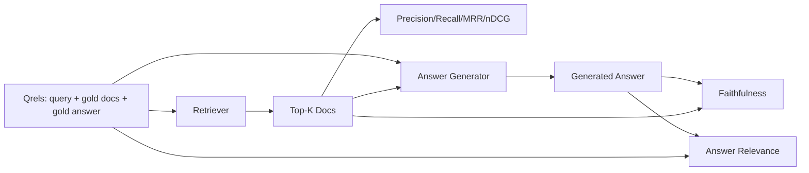

# Đánh giá RAG: Độ chính xác, nhớ lại, MRR, nDCG, Sự trung thành, Tính liên quan đến câu trả lời

> Nếu bạn không thể đánh giá tìm kiếm của bạn và câu trả lời của bạn cùng một lúc, bạn không thể vận chuyển hệ thống. Hai không phải là metric giống nhau và cùng một lời nhắc thất bại trên các trục khác nhau.

**Type:** Build
**Languages:** Python
**Prerequisites:** Phase 11 lessons 06 (RAG), 10 (evaluation); Phase 19 Track B foundations (lessons 20-29); Phase 19 lessons 64, 65, 66, 67
**Time:** ~90 minutes

## Mục tiêu học tập
- Xét bốn số liệu lấy lại từ các qrels vàng: precision@k, recall@k, MRR (đường trung bình cấp độ tương ứng) và nDCG@k.
- Xét hai chỉ số điểm điểm trả lời: độ trung thành (mỗi tuyên bố dựa trên bối cảnh được lấy lại) và độ liên quan của câu trả lời (phản ứng giải quyết câu hỏi).
- Xây dựng một tệp qrels cố định (queries, gold doc id, gold answer text) mà eval đọc hết cuối.
- Đọc các giá trị métric để chẩn đoán nơi một đường ống đang thất bại: lấy lại, xếp hạng, sản xuất hoặc đặt đất.

## Vấn đề

Một hệ thống RAG có ít nhất bốn bộ phận di chuyển: chunker, retriever, reranker, generator.

Người dùng báo cáo một câu trả lời sai. Có phải vì chunker cắt giảm khoảng thời gian trả lời? Có phải vì retriever không bao gồm phần trong top-k? Có phải vì reanker đẩy phần phải qua vị trí một? Có phải vì máy phát điện đã bỏ qua phần và tạo ra một cái gì đó? Bạn không thể biết từ câu trả lời một mình. Bạn cần:

- Các số liệu lấy lại để đánh giá những gì đã xuất hiện từ máy lấy lại.
- Đánh xếp các số liệu để xếp hạng nơi phần phải nằm trong thứ tự.
- Sự trung thành để đánh giá liệu máy phát điện có ở trong bối cảnh được lấy lại hay không.
- Đáp sự liên quan để đánh giá liệu câu trả lời có giải quyết câu hỏi không.

Bài học này xây dựng tất cả sáu trên trên một tập tin qrels cố định. đánh giá là ngoại tuyến và xác định; trong sản xuất bạn trao đổi LLM giả như một thẩm phán cho một thực.

## Khái niệm



### Precision@k

Trong số các tài liệu top-k mà máy thu hồi trả lại, phần nào trong bộ vàng? Nếu vàng có ba tài liệu và top-3 trả lại hai trong số đó và một sai, độ chính xác@3 là 2 / 3. Sử dụng độ chính xác khi chi phí của một phần không liên quan được lấy lại cao (cơ máy phát điện lãng phí token trên nó, hoặc phần độc trả lời).

### Recall@k

Trong số các tài liệu vàng, phần nào trong top-k? Nếu vàng có ba tài liệu và top-5 chứa cả ba, recall@5 là 1.0. Sử dụng recall khi chi phí của một câu trả lời bị bỏ lỡ cao (bạn sẽ thích thấy một phần sai hơn một phần sai hơn là bỏ lỡ phần trả lời hoàn toàn).

Trong sản xuất RAG người dùng thường trích dẫn là recall@k. Thế hệ có thể dễ dàng thả các mảnh không liên quan; nó không thể phát minh ra một câu trả lời từ một mảnh mà nó chưa bao giờ thấy.

### MRR (Tỷ lệ trung bình đối tác)

Đối với mỗi truy vấn, tìm vị trí của tài liệu có liên quan đầu tiên trong danh sách xếp hạng. Tỷ lệ tương ứng là 1 / vị trí. Tỷ lệ trên toàn bộ bộ bộ truy vấn. MRR là một bản tóm tắt đơn số về cách tốt nhất mà máy tìm kiếm đặt câu trả lời tốt nhất ở đầu.

MRR cân nặng vị trí-1 rất nặng. Một truy vấn nơi tài liệu vàng ở vị trí 1 đóng góp 1.0. vị trí 2 đóng góp 0.5. vị trí 10 đóng góp 0.1.

### nDCG@k

Thị thức hoàn chỉnh gán lợi nhuận cho mỗi tài liệu được lấy (thường là 1 cho liên quan, 0 cho không), giảm giá theo nhật ký của vị trí, tổng số và chia bằng DCG lý tưởng (DCG bạn sẽ có nếu bạn xếp hạng hoàn hảo).

nDCG có thể chứa độ liên quan: vàng có thể nói "doc A là 3, doc B là 2, doc C là 1". MRR và recall@k làm phẳng mọi thứ thành nhị phân. Sử dụng nDCG khi các kho chứa nhiều tài liệu liên quan một phần cho mỗi truy vấn.

### Sự trung thành

Đối với mỗi yêu cầu trong câu trả lời được tạo, kiểm tra xem yêu cầu có được hỗ trợ bởi bối cảnh được thu hồi hay không. Việc thực hiện tiêu chuẩn sử dụng một yêu cầu LLM-as-judge lấy (bồi thường, bối cảnh) và trả lại có hoặc không.

Sự trung thành bắt được chế độ thất bại máy phát triển nơi mô hình phát minh ra nội dung. Ngay cả khi máy thu hồi trả lại các mảnh đúng, một máy phát triển ảo giác bị phá vỡ.

Bài học này thực hiện sự trung thành với một thẩm phán giả định xác định học kiểm tra xem các token của mỗi yêu cầu có trùng với bối cảnh được thu hồi bằng ngưỡng hay không. Trong sản xuất bạn thay đổi sang một cuộc gọi mô hình thực.

### Đáp sự liên quan

Câu trả lời thực sự giải quyết câu hỏi? Sự trung thành hỏi "có câu trả lời dựa trên bối cảnh không?" Sự liên quan trả lời hỏi "có câu trả lời dựa trên câu hỏi không?". Một câu trả lời trung thành nhưng không liên quan đến chủ đề có điểm trung thành cao và không liên quan. Một câu trả lời ngắn gọn, liên quan đến chủ đề mà bỏ qua bối cảnh có điểm trung thành cao và không liên quan đến sự trung thành.

Việc thực hiện tiêu chuẩn cũng sử dụng LLM-as-judge: take (question, answer) và hỏi liệu câu trả lời có giải quyết câu hỏi không. Bài học này thực hiện một token-overlap-plus-judge stand-in.

## Thiết bị đính kèm

```python
{
  "qid": "q1",
  "query": "what is the abort threshold for multipart uploads",
  "gold_doc_ids": ["d1", "d3"],
  "gold_answer_substring": "three failed parts",
  "graded_relevance": {"d1": 3, "d3": 2},
}
```

Mỗi truy vấn chứa:
- chuỗi truy vấn,
- một bộ ID tài liệu vàng (để xác định / thu hồi / MRR),
- một lệnh liên quan được xếp hạng (cho nDCG),
- chuỗi trả lời vàng (được giữ như siêu dữ liệu tham chiếu trên mỗi qurel; độ trung thành trong bài học này được tính bằng cách đánh giá các yêu cầu thu được dựa trên bối cảnh được lấy lại, chứ không phải đối với chuỗi phụ này).

Trong sản xuất, bạn dán nhãn những thứ này. Bài học này gửi một thiết bị được chế tạo bằng tay để đánh giá chạy ra khỏi hộp.

```figure
ci-rag-metric-ladder
```

## Hãy xây dựng nó

`code/main.py`thực hiện:

- `precision_at_k(retrieved, gold, k)`- định nghĩa theo nghĩa đen.
- `recall_at_k(retrieved, gold, k)`- định nghĩa theo nghĩa đen.
- `mean_reciprocal_rank(retrieved_list_of_lists, gold_list)`- là người có tính trung bình về các câu hỏi.
- `ndcg_at_k(retrieved, graded_relevance, k)`- DCG / IDCG với lợi nhuận nhị phân hoặc xếp hạng.
- `extract_claims(answer)`- chia câu trả lời thành các yêu cầu hình chữ.
- `faithfulness(claims, context_texts, judge)`- phần nhỏ các yêu cầu được đánh giá là được hỗ trợ.
- `answer_relevance(question, answer, judge)`- đánh giá liệu câu trả lời có giải quyết câu hỏi hay không.
- `MockJudge`- định nghĩa đánh giá token-overlap để đánh giá chạy offline.
- `evaluate_pipeline(pipeline_fn, qrels, ks)`- người dàn nhạc điều khiển mọi métric.
- Một bản demo chạy ba biến thể đường ống (chunker baseline, hybrids retrieval, hybrid + re-rank) chống lại các qrels và in một bảng số liệu.

Đi đi.

```bash
python3 code/main.py
```

Kết quả xuất hiện cho thấy độ chính xác@k, recall@k, MRR, nDCG@k, độ trung thành và liên quan đến câu trả lời cho mỗi biến thể trong một bảng chỉ số duy nhất. Dòng lấy lại lai mầm vượt qua đường cơ sở chunker khi gọi lại; dòng xếp hạng lại vượt qua lai mầm trên MRR.

## Đọc các số liệu để chẩn đoán thất bại

| Symptom | Likely cause | What to fix |
|---------|-------------|-------------|
| Low recall@k, low precision@k | Chunker cut the answer or retriever cannot find it | Chunker boundaries (lesson 64) or retriever modality (lesson 65) |
| Decent recall@k, low MRR | Right chunk is in top-k but not at position 1 | Reranker (lesson 66) |
| High MRR, low faithfulness | Generator invents content despite right context | Generation prompt; force-cite-or-refuse |
| High faithfulness, low relevance | Answer is grounded but off-topic | Query rewriter (lesson 67) or generation prompt |
| All four high, users still complain | Eval set is unrepresentative | Expand qrels with real user queries |

## Các chế độ thất bại demo sẽ ẩn

**LLM-as-judge bias.**Một mô hình đánh giá sản phẩm của mình như là trung thành hơn họ. sử dụng một gia đình mô hình khác cho thẩm phán hơn là máy phát điện, hoặc đánh giá tay một mẫu.

**Qrels rot.**Các câu trả lời vàng chuyển hướng khi cơ thể thay đổi. Một tài liệu là vàng cho q1 vào tháng 1 năm 2024 không còn là câu trả lời đúng vào tháng 10 năm 2024 vì nhóm đổi tên chức năng.

**Faithfulness micro-checks miss macro-claims.**Sự trung thành của mỗi câu có thể đi qua trong khi cấu trúc tổng thể của câu trả lời gây sai lầm. Thêm một đánh giá chất lượng cấp mẫu trên cùng với số liệu tự động.

**Recall@k masks per-query failures.**Một trung bình 90% nhớ lại có thể che giấu rằng một lớp truy vấn luôn luôn bị bỏ lỡ.

## Sử dụng nó

Các mô hình sản xuất:

- Thực hiện đánh giá trên mỗi thay đổi máy tìm kiếm hoặc máy phát điện.
- Cố gắng giữ dấu vết métric cho mỗi truy vấn. Khi một người dùng phàn nàn, tìm kiếm mục qrels phù hợp và xem nó có bị bắt hay không.
- Định trình các qurels: một bộ khói gồm 20 truy vấn chạy trong CI; một bộ hồi quy 200 chạy mỗi đêm; một bộ sâu 2000 chạy mỗi tuần.

## Chuyển nó

Bài học 69 dây toàn bộ đường ống (chunker, retriever, rerenker, máy phát điện) và chạy đánh giá này chống lại hệ thống cuối đến cuối.

## Các bài tập

1. Thêm một số liệu thu hồi thứ năm: hit-rate@k. So sánh nó với recall@k. Giải thích khi nào chúng khác nhau.
2. Thực hiện một độ trung thành được xếp hạng: 0 (không hỗ trợ), 1 (được hỗ trợ một phần), 2 (được hỗ trợ hoàn toàn). Cập nhật số liệu phù hợp.
3. Thay thế thẩm phán giả bằng một cuộc gọi mô hình thực sự.
4. Thêm một đoạn lớp truy vấn ("biểu chữ", "định nghĩa", "multi-topic").
5. Thêm một số liệu "giờ trả lời" và tương quan nó với độ trung thành.

## Các điều khoản chính

| Term | What people say | What it actually means |
|------|-----------------|------------------------|
| Precision@k | "Hit rate over retrieved" | Fraction of top-k that are gold |
| Recall@k | "Hit rate over gold" | Fraction of gold in top-k |
| MRR | "First-hit position" | Mean of 1 / rank of first relevant document |
| nDCG@k | "Graded ranking quality" | DCG over the top-k divided by ideal DCG |
| Faithfulness | "Groundedness" | Fraction of answer claims supported by retrieved context |
| Answer relevance | "Did it address the question?" | Whether the answer matches the question's intent |
| Qrels | "Gold labels" | The labeled set of queries and their gold documents and answers |

## Đọc thêm

- Buckley, Voorhees, "Evaluating Evaluation Measure Stability", SIGIR 2000 - bài báo kinh điển về các chỉ số xếp hạng
- Jarvelin, Kekalainen, "Học tích về lợi nhuận dựa trên đánh giá các kỹ thuật IR" - bài báo của nDCG
- [Ragas: Automated Evaluation of RAG Pipelines](https://docs.ragas.io)
- [Anthropic, Evaluating RAG](https://www.anthropic.com/news/evaluating-rag)
- Giai đoạn 11 Bài học 10 - Cơ sở khung đánh giá
- Các bài học giai đoạn 19 64-67 - các thành phần được đánh giá ở đây
- Giai đoạn 19 bài học 69 - đường ống kết thúc kết thúc đánh giá này điểm
