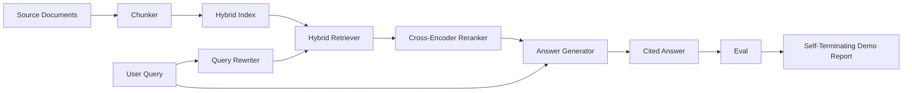

# Hệ thống RAG đầu đến cuối

> 6 bài học về các thành phần, một đường ống, một vòng đánh giá, một bản demo tự kết thúc.

**Type:** Build
**Languages:** Python
**Prerequisites:** Phase 11 lessons 06 (RAG), 10 (evaluation); Phase 19 Track B foundations (lessons 20-29); Phase 19 lessons 64, 65, 66, 67, 68
**Time:** ~90 minutes

## Mục tiêu học tập
- Sắp xếp chunker, bộ truy xuất hybrid, trình viết lại truy vấn, trình xếp hạng lại mã hóa chéo và máy phát điện câu trả lời thành một đường ống kết thúc.
- Thực hiện một máy phát điện câu trả lời trích dẫn các yêu cầu của mình bằng các phần neo, với từ chối-được-được-được-được-được-được-được-được-được-được-được-được-được-được-được-được-được-được-đã-đã-đã-đã-đã-đã-đã-đã-đã-đã-đã-đã-đã-đã-đã-đã-đã-đã-đã-đã-đã-đã-đã-đã-đã-đã-đã-đã-đã-đã-đã-đã-đã-đã-đã-đã-đã-đã-đã-đã-đã-đã-đã-đã-đã-đã-đã-đã-đã-đã-đã-đã-đã-đã-đã-đã-đã-đã-đã-đã-đã-đã-đã-đã-đã-đã-đã-đã-đã-đã-đã-đã-đã-đã-đã-đã-đã-đã-đã-đã-đã-đã-đã-đã-đã-đã-đã-đã-đã-đã-đã-đã-đã-đã-đã-đã-đã-đã-đã-đã-đã-đã-đã-đã-đã-đã-đã-đã-đã-đã-đã-đã-đã-đã-đã-đã-đã-đã-đã-đã-đã-đã-đã-đã-đã-đã-đã-đã-đã-đã-đã-đã-đã-đã-đã-đã-đã-đã-đã-đã-đã-đã-đã-đã
- Lấy bài học 68 đánh giá với đường ống được lắp ráp và chứng minh sự xây dựng giai đoạn thắng trên mỗi thước đo trên các thành phần tương tự một cách riêng biệt.
- Xây dựng một bản demo CLI tự kết thúc mà nuốt một bộ đồ cố định, chạy một bộ truy vấn cố định, và thoát khỏi 0 với một báo cáo tóm tắt.

## Vấn đề

6 thành phần trong cách ly không chứng minh gì cả. Chunker có thể thắng trên recall@5 chống lại corpus và thua trên hệ thống recall@5 bởi vì retriever không thể xếp hạng những gì chunker phát ra. Các tái xếp hạng có thể nâng MRR trên một hồ sơ ứng cử viên tổng hợp và thất bại trên các ứng cử viên bi-encoder thực sự bởi vì sự thu hồi của bi-encoder tại ngân sách tái xếp hạng là quá thấp. Người viết lại truy vấn có thể quảng bá tài liệu vàng trên một truy vấn và phá vỡ trên tiếp theo bởi vì giả thuyết LLM trả về một giả thuyết thoái hóa.

Thử nghiệm tích hợp là toàn bộ đường ống chạy từ đầu đến cuối với cùng một bộ máy cố định, với cùng một số liệu, với một tệp nhạc cụ kết nối tất cả mọi thứ. Đó là những gì bài học này xây dựng. Nếu các số liệu trên đường ống tích hợp đánh bại các số liệu trên mỗi giai đoạn demo riêng biệt, bạn đã chứng minh hệ thống.

## Khái niệm



### Các lựa chọn dây

Các đường ống là một biểu đồ nhỏ. Mỗi giai đoạn là một hàm với một chữ ký rõ ràng.

| Stage | Input | Output |
|-------|-------|--------|
| Chunker | Document text | List of Chunk records |
| Retriever | Query string | Top-N Chunk records |
| Rewriter (optional) | Query string | List of rewrites + hypothetical |
| Reranker | Query, candidates | Top-K Chunk records with cross scores |
| Generator | Query, top-K Chunk records | Answer string with citations |

Sự kết hợp của nó là đơn giản khi mỗi chữ ký đều ổn định.`Pipeline`lớp có 5 giai đoạn và một `query`mỗi giai đoạn đều có thể thay đổi: vượt qua một chunker khác, retriever, rewriter, reanker, hoặc máy phát và đường ống vẫn chạy.

### Cung cấp trả lời với trích dẫn

Máy phát điện là giai đoạn cuối cùng và dễ nhất để phá vỡ.

1. Lấy những mảnh được xếp hạng lại ở trên cùng.
2. Chọn lên đến hai khối có văn bản chứa mã nội dung cao nhất chồng chéo với truy vấn.
3. Giả lời là một chuỗi một câu từ mỗi phần được chọn, với mỗi câu tiếp theo bởi một `[doc_id:chunk_index]`neo.
4. Nếu không có mảnh nào chồng chéo trên ngưỡng rác, phát ra "Tôi không biết" mà không trích dẫn.

Trong sản xuất bạn đổi giả mạo cho một cuộc gọi LLM thực sự với mẫu đơn giản:

```
You are answering a question using only the snippets below.
Cite every claim with the anchor in parentheses.
If the snippets do not answer the question, say "I do not know".

Question: {query}

Snippets:
{enumerated chunks with anchors}

Answer:
```

Đường lối từ chối-trong-sự tin thấp là lý do toàn bộ điểm số ranh-được ghi lại. Nếu nó nằm dưới ngưỡng corpus, máy phát điện từ chối. Đây là van an toàn chống lại câu trả lời ảo giác.

### Đạo diễn tự hủy diệt

Demos chạy mọi thứ từ đầu đến cuối. Nó in một phân đoạn từng giai đoạn của một truy vấn, chạy eval trên bốn quý vị cố định, in một bảng số liệu, và thoát với trạng thái không nếu tất cả các số liệu bài học 68 đáp ứng ngưỡng được đặt trong demo. Nếu bất kỳ số liệu nào dưới ngưỡng, demo thoát với trạng thái không bằng không và một thông điệp đặt tên cho số liệu không thành công.

Đây là hình dạng của một thử nghiệm khói CI. đường ống chạy offline, nhanh chóng, xác định. ngưỡng cố ý bị chặt chẽ trên thiết bị để một sự lùi lại trong bất kỳ sáu bài học nào thất bại trong demo.

```figure
rag-pipeline-flow
```

## Hãy xây dựng nó

`code/main.py`thực hiện:

- `Chunk`- hồ sơ được thực hiện trong tất cả các giai đoạn (đã mở rộng hình dạng bài học 64 với một chunk_index và nguồn doc_id).
- `Chunker`- chọn một chiến lược từ bài học 64 (đánh phân tích thu hồi mặc định).
- `HybridIndex`- BM25 + dense + RRF từ bài học 65.
- `Rewriter`(tự chọn) - chọn một HyDE, đa truy vấn, phân hủy từ bài học 67 theo chiều dài truy vấn và sự hiện diện của các kết nối.
- `Reranker`- bộ mã hóa chéo được đào tạo từ bài học 66, với một bộ huấn luyện thiết bị nhỏ hơn để nó hội tụ trong vài giây.
- `Generator`- máy phát điện giả định định với các trích dẫn và từ chối-trong-đảm tin.
- `Pipeline`- tạo nên 5 giai đoạn với một`query(question)`Phương pháp trả lại `Result(answer, top_k, latency_ms_per_stage)`- Tôi không biết.
- `run_demo()`- ngâm trong corpus, chạy ba truy vấn thiết bị, chạy đánh giá, in kết quả, đặt mã thoát theo ngưỡng.

Đi đi.

```bash
python3 code/main.py
```

Kết quả là một dấu vết truy vấn in, bảng đánh giá đầy đủ và trạng thái vượt qua/không thành công cuối cùng.

## Các chế độ thất bại demo sẽ ẩn

**Chunker boundary drift.**Nếu bạn đổi chiến lược chunker giữa đánh giá qrels nhãn thông qua và demo, các ID doc vàng không còn xếp hàng. khóa chiến lược chunker trong tệp qrels. demo bao gồm một tiêu đề tên của chunker.

**Reranker training set leaks into the eval.**Các khóa học 14 lần trong bài học 66 bao gồm các truy vấn giống như các truy vấn đánh giá. Trong sản xuất, thực hiện các truy vấn đánh giá nghiêm ngặt. Các truy vấn đánh giá của demo cố ý tách rời khỏi bộ đào tạo xếp hạng lại.

**Mock generator hides hallucination risk.**Phong cách không thể ảo giác bởi vì nó chỉ phát ra văn bản từ các mảnh thu hồi. Bài học ghi nhận điều này và chỉ đường chuyển đổi sản xuất đến một mô hình thực.

**No streaming.**Các hệ thống phát điện sẽ phát ra nguồn phát của máy phát điện. Streaming là ngoài phạm vi; các số liệu cấp độ trả lời hoạt động trên chuỗi cuối cùng theo cả hai cách.

**Latency is offline.**Các cuộc gọi LLM giả là thời gian liên tục. Các cuộc gọi LLM thực sự thống trị.

## Sử dụng nó

Các mô hình sản xuất:

- Chuyển tập tin đường ống dưới một trình diễn viên với giao diện giai đoạn rõ ràng.
- Thử đánh giá trước mỗi lần sáp nhập liên quan đến một giai đoạn. Nếu đánh giá giảm, sự sáp nhập sẽ không hạ cánh.
- Cố gắng giữ dấu vết métric cho mỗi IC chạy để bạn có thể gán sự lùi lại cho một chuyển đổi giai đoạn.
- Thêm một bộ khói gồm 20 truy vấn (đối hợp của bộ quay trở) chạy trong vòng dưới 30 giây; bộ quay trở hoàn chỉnh chạy mỗi đêm.

## Chuyển nó

Các tập tin đường ống trong bài học này là hình dạng mà phần còn lại của các bài học Track F của giai đoạn 19 đảm nhận. Các bài học tiếp theo sẽ thêm tự động hóa tiêu thụ, chỉ số lại tăng, viễn số và một lớp phục vụ ở trên.

## Các bài tập

1. Thêm một lựa chọn chiến lược cho mỗi truy vấn bên trong trình viết lại: Heuristics từ bài học 67 (giờ dài, kết hợp, tỷ lệ tiếng nói) chọn HyDE, đa truy vấn, hoặc phân hủy.
2. Thêm một cuộc gọi LLM thực sự cho bộ phát điện đằng sau một lá cờ env.
3. Lớn hơn để chụp một `--corpus path`Lập lại đánh giá và kiểm tra ngưỡng.
4. Thêm một `--strategy`Đánh dấu cho chunker. đo lường đóng góp của mỗi chiến lược cho việc thu hồi cuối đến cuối.
5. Thêm một giao diện phát phát trực tuyến và đưa nó vào eval. xác nhận rằng độ trung thành được tính trên chuỗi cuối cùng và không phải trên tiền tố phát trực tuyến.

## Các điều khoản chính

| Term | What people say | What it actually means |
|------|-----------------|------------------------|
| Pipeline | "RAG pipeline" | The composed stages from ingestion to cited answer |
| Citation anchor | "Source link" | The (doc_id, chunk_index) reference attached to each claim |
| Refuse-on-low-confidence | "I do not know" | Generator returns no answer when the reranker top-1 score sits below threshold |
| Smoke set | "CI eval" | The minimal qrels subset that runs in every PR check |
| Stage interface | "Function signature" | The stable input and output type of each pipeline stage |

## Đọc thêm

- [Anthropic, Building search and retrieval](https://www.anthropic.com/news/contextual-retrieval)
- [Pinterest, MCP internal search](https://medium.com/pinterest-engineering)- kiến trúc sản xuất tham chiếu
- [Ragas: Automated Evaluation of RAG Pipelines](https://docs.ragas.io)
- Giai đoạn 11 Bài học 06 - Các cơ bản RAG
- Giai đoạn 19 bài học 64-68 - các thành phần được tạo thành ở đây
