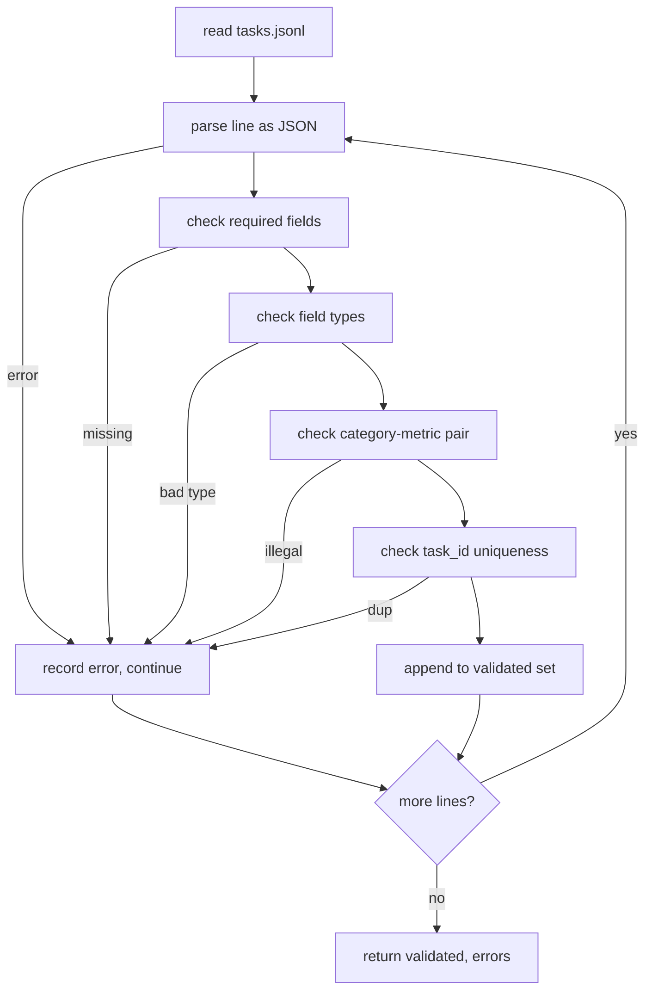

# Tự hình đặc điểm nhiệm vụ

> Một value harness chỉ tốt như hợp đồng các nhiệm vụ của nó tôn vinh. đóng băng hình dạng JSONL và từ vựng métric trước khi bạn viết một chức năng điểm điểm duy nhất.

**Type:** Build
**Languages:** Python
**Prerequisites:** Phase 19 Track B foundations
**Time:** ~90 min

## Mục tiêu học tập

- Định nghĩa một sơ đồ ghi chép nhiệm vụ JSONL bao gồm toán học, nhiều lựa chọn, thực thi mã, phân loại và tổng hợp văn bản tự do trong một hình dạng.
- Đặt một từ vựng kín của các tên métric để các bài học tiếp theo (71-73) có thể gửi trên một lĩnh vực duy nhất.
- Định nghĩa các ví dụ chụp ít và các quy tắc xử lý sau như là một phần của nhiệm vụ, chứ không phải là người chạy, vì vậy cùng một prompt tạo ra mục tiêu tương tự trên tất cả các mô hình.
- Thực hiện một bộ xác nhận nghiêm ngặt từ chối các hồ sơ bị hình thành sai trước khi chúng đạt đến người chạy.
- Đưa một bộ thiết bị 10 nhiệm vụ tập luyện mọi nhánh của các thông số kỹ thuật để xác thực viên có một cái gì đó thực sự để nhai trên.

```figure
ci-task-spec-gate
```

## Tại sao một spec đóng băng

Một cơ sở mã nghiên cứu sẽ tích lũy các kịch bản đánh giá nhanh hơn so với việc tích lũy các thử nghiệm. Trong sáu tháng, mỗi sổ ghi chép sẽ có hình dạng JSON riêng của nó, mỗi thước đo sẽ được triển khai lại hai lần, và không có gì có thể so sánh trên các lần chạy. Việc khắc phục là nhàm chán. Chọn một sơ đồ. Hãy viết một trình xác thực. Hãy từ chối mọi thứ khác. Đó là điều bài học này làm.

Hình dạng vay ra ý tưởng từ các dây đeo kiểu BIG-bench, HELM và lm-eval, nhưng tên trường là của chúng tôi. Mỗi trường có một chủ sở hữu duy nhất. Người chạy đọc nhiệm vụ. Métric đọc mục tiêu. Bước sau quá trình bình thường hóa thế hệ. Không có trường biến đổi giữa đường ống.

## Hình dạng ghi

Một nhiệm vụ là một đối tượng JSON trên một dòng.`tasks.jsonl`và xác nhận từng dòng một cách độc lập. Một dòng xấu phá vỡ kỷ lục đó, không phải là chạy.

```json
{
  "task_id": "arith_001",
  "category": "arithmetic",
  "prompt": "Compute the result. Question: 17 + 24\nAnswer:",
  "targets": ["41"],
  "metric_name": "exact_match",
  "few_shot_examples": [
    {"prompt": "Question: 2 + 2\nAnswer:", "completion": "4"}
  ],
  "post_process": "strip_whitespace",
  "metadata": {"difficulty": "easy"}
}
```

Các trường cần thiết là `task_id`- `category`- `prompt`- `targets`- `metric_name`- `post_process`- `few_shot_examples`và `metadata`Các trường cấp cao không được biết không xác nhận.

## Quy tắc lĩnh vực

`task_id`là một chuỗi không có không gian trắng.

`category`là một trong những `arithmetic`- `mcq`- `code_exec`- `classification`- `summary`. Các loại hạn chế mà cặp métric và hậu quá trình là hợp pháp.`code_exec`nhiệm vụ phải sử dụng `metric_name = code_exec`và một `mcq`nhiệm vụ phải sử dụng `metric_name = exact_match`chống lại một mục tiêu đơn chữ.

`prompt`là một chuỗi không trống. Người xác nhận cấm không gian trắng sau và từ chối các bản ghi đã chứa một vài khối trong cơ thể prompt.

`targets`là một danh sách không trống của chuỗi.`exact_match`, bất kỳ yếu tố phù hợp nào được tính.`f1`và `rouge_l`, mục tiêu ghi điểm cao nhất sẽ thắng.`mcq`, danh sách chứa chính xác một yếu tố.

`metric_name`là một trong những `exact_match`- `f1`- `bleu_4`- `rouge_l`- `accuracy`- `code_exec`Từ vựng đã bị đóng lại, một số liệu mới cần một bài học mới và một mục mới ở đây.

`few_shot_examples`là một danh sách của `{prompt, completion}`Các cặp. người xác nhận đóng cửa danh sách ở tám mục để giữ cho các yêu cầu được giới hạn.

`post_process`là một trong những `none`- `strip_whitespace`- `lower`- `extract_letter`- `extract_code_block`- `extract_first_line`Mỗi quy tắc có một hành vi xác định duy nhất.

## Hành vi của chất xác nhận



Người xác nhận trả lại hai danh sách: ghi chép xác nhận và ghi chép lỗi với dòng vi phạm, quy tắc vi phạm và trường lỗi. Người chạy từ chối bắt đầu nếu danh sách lỗi không trống trừ khi một rõ ràng `--allow-bad-tasks`Đường cờ đã được đặt.

## Tải lại ít ảnh

Người chạy kết nối một vài ví dụ chụp trước lời nhắc với một bộ tách đường trống. Chặng đường mã tương tự chạy cho mọi mô hình, vì vậy nguồn duy nhất của sự khác biệt là mô hình. Các tác giả viết ví dụ một lần, không phải một lần cho mỗi nhà cung cấp.

```python
def render(task):
    parts = []
    for ex in task.get("few_shot_examples", []):
        parts.append(ex["prompt"] + " " + ex["completion"])
    parts.append(task["prompt"])
    return "\n\n".join(parts)
```

## Quy tắc sau quá trình xử lý

Bước sau quá trình chạy theo thế hệ, trước métric. Nó là xác định và không có quốc gia.

- `none`trả lại chuỗi không thay đổi.
- `strip_whitespace`Dải dẫn và sau không gian trắng.
- `lower`làm giảm dây.
- `extract_letter`trả lại ký tự đầu tiên phù hợp `[A-E]`, được sử dụng cho MCQ.
- `extract_code_block`trả lại cơ thể của khối bao bì ba đệm đầu tiên, được sử dụng để code-exec.
- `extract_first_line`trả lại dòng không trống đầu tiên, được sử dụng để phân loại tổng quát.

Một nhiệm vụ cần một quy tắc bên ngoài danh sách này thuộc về một bài học mới.

## Bài học này không làm gì

Nó không ghi điểm, nó không gọi mô hình, nó không chạy mã. Những người đến trong bài học 71, 72, và 75. Bài học này đóng băng hợp đồng mà tất cả họ tôn trọng.

Các 10 nhiệm vụ cố định bao gồm hai mục toán học, hai mục MCQ, hai mục code-exec, hai mục phân loại và hai mục tổng kết.`tasks_bad.jsonl`) làm sai mọi quy tắc và người xác nhận trả lại chính xác số lỗi đó.

## Làm thế nào để đọc mã

`main.py`định nghĩa `TaskSpec`- `validate_task`- `validate_file`, và một điểm nhập CLI.`load_fixtures`Các trợ lý render và sau quá trình sống bên cạnh xác nhận vì vậy người chạy trong bài học 75 nhập một mô-đun duy nhất.

Đọc `main.py`Từ trên xuống dưới.`code/tests/test_spec.py`Các thử nghiệm ghi lại mọi quy tắc xác thực và mọi hành vi sau quá trình.`main.py`xác nhận thiết bị kết hợp và in bản tóm tắt.

## Đi xa hơn nữa

Các bộ đánh giá thực sự phát triển các loại như các chương trình phát triển các cột. Động thái tỉnh táo là từ chối thêm một loại mà không thêm một phép đo, quy tắc sau quá trình và ít nhất một nhiệm vụ cố định. Hãy đối xử với các thông số như một di chuyển cơ sở dữ liệu. Mỗi thay đổi được xem xét, phiên bản, và đi kèm với các thử nghiệm. Người xác thực trong bài học này là cổng.
