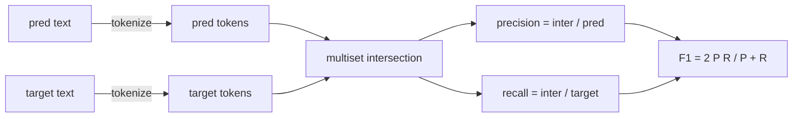
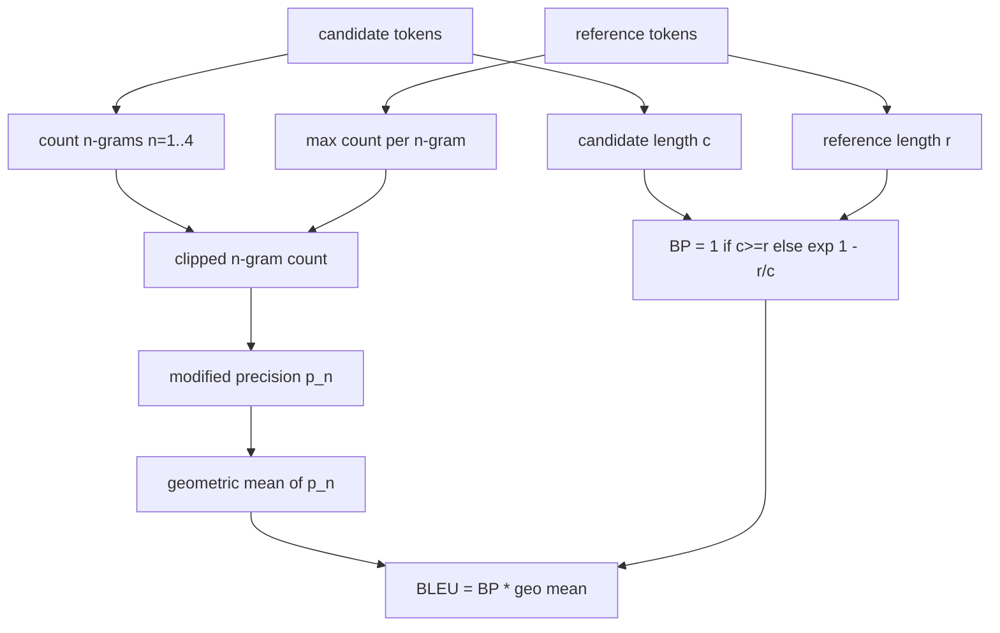

# Các số liệu cổ điển

> Bleu, ROUGE-L, F1, sự phù hợp chính xác, độ chính xác. Năm số liệu vẫn chiếm hầu hết số đánh giá LLM được xuất bản. Thực hiện mỗi từ các nguyên tắc đầu tiên để bạn biết số nghĩa là gì.

**Type:** Build
**Languages:** Python
**Prerequisites:** Phase 19 Track B foundations, lesson 70
**Time:** ~90 min

## Mục tiêu học tập

- Thực hiện phù hợp chính xác, F1 ở cấp độ token và chính xác với các quy tắc token hóa rõ ràng.
- Thực hiện BLEU-4 từ cõi đầu: độ chính xác n-gram được sửa đổi, trung bình hình học trên n bằng 1 đến 4, phạt ngắn hạn.
- Thực hiện ROUGE-L sử dụng chuỗi phụ phổ biến dài nhất, với sự kết hợp F-beta của độ chính xác và thu hồi.
- Đưa vào trường metric_name từ bài học 70 để người chạy vẫn là người không biết về metric.
- Đặt hành vi với các vector tham chiếu được lấy từ các ví dụ được làm việc, chứ không phải từ thư viện bên thứ ba.

```figure
cd-bleu-overlap
```

## Tại sao thực hiện lại

Bạn sẽ đọc các bài báo báo báo cáo BLEU 28.3 và một bài báo khác báo cáo BLEU 0.283. Bạn sẽ thấy điểm số ROUGE-L khác nhau mười điểm trên hai thư viện bởi vì một trong số đó cắt giảm thành chữ nhỏ và một số khác không. Cách nhanh nhất để ngừng bị nhầm lẫn là tự viết số liệu, sau đó chỉ vào đường mà tokeniser được quyết định và đường mà smoothing được áp dụng. Sau đó, so sánh số trên các giấy trở thành vấn đề đọc các thiết lập métric, không tranh luận về thư viện.

Stdlib cộng numpy là đủ. BLEU là đếm và một clamp. ROUGE-L là lập trình năng động. F1 là một giao diện được đặt trên token. Phần khó nhất là chọn một tokeniser và cam kết với nó.

## Đánh dấu

Chiếc token là `re.findall(r"\w+", text.lower())`. chữ viết lách, chữ số bảng chữ cái, dấu chấm giảm. mỗi metric trong bài học này sử dụng chính xác tokenizer này. người chạy không được chọn. nếu bạn trao đổi tokenizers, bạn đang chạy một tiêu chuẩn khác.

```python
TOKEN_RE = re.compile(r"\w+", re.UNICODE)
def tokenize(text):
    return TOKEN_RE.findall(text.lower())
```

Đây là một sự đơn giản hóa cố ý. Các thiết lập sản xuất sẽ quan tâm đến CJK, thu hẹp, và các mã xác định. Điểm của bài học là tokenizer là một hợp đồng, không phải là một nút.

## Đúng như nhau

```python
def exact_match(pred, targets):
    return float(any(pred.strip() == t.strip() for t in targets))
```

Nó trả lại 1.0 hoặc 0.0 cho mỗi nhiệm vụ. tổng số trên một tập dữ liệu là trung bình. Đây là con ngựa làm việc cho toán học, MCQ và các nhiệm vụ phân loại ngắn.

## Tỷ giá F1

Thiết lập multiset token cho dự đoán và mục tiêu. Độ chính xác là giao điểm multiset được chia bằng multiset của dự đoán. nhớ lại là cùng một giao điểm được chia bằng multiset của mục tiêu. F1 là trung bình hài hòa. Việc thực hiện xử lý các trường hợp dự đoán trống và cạnh mục tiêu trống.



Đối với các nhiệm vụ đa mục tiêu, chúng tôi chọn F1 tốt nhất trên danh sách mục tiêu. Điều đó phù hợp với hành vi kiểu SQuAD được báo cáo rộng rãi trong văn học.

## BLEU-4

BLEU là phép đo dịch máy tính của truyền thống và nó vẫn xuất hiện trong công việc tổng kết. Công thức chúng tôi sử dụng là BLEU-4 với mức độ corpus với hình phạt ngắn hạn tiêu chuẩn và thanh trơn thêm-một trên số n-gram sửa đổi để một gram thiếu sót duy nhất không đẩy điểm số xuống 0.

Đối với mỗi cặp tham khảo ứng cử viên, chúng ta đếm độ chính xác n-gram sửa đổi cho n bằng 1, 2, 3, 4. Độ chính xác sửa đổi clip số n-gram ứng cử viên bằng số n-gram tối đa của n-gram đó trong bất kỳ tham khảo nào, vì vậy một ứng cử viên không thể bồng lên bằng cách lặp lại một cụm từ.



Quy tắc thanh thẳng là phương pháp mà Lin và Och gọi là phương pháp 1: thêm một cho cả số và tên của mỗi n-gram chính xác trước khi lấy log.`log 0`khi một tham chiếu không có 4 gram phù hợp và ở gần giá trị không được làm mượt trên các ứng viên dài.

## ROUGE-L

ROUGE-L so sánh chuỗi tương tự chung dài nhất của chuỗi mã thông báo ứng cử viên và tham chiếu. LCS ghi lại thứ tự từ mà không buộc phải liên tục, đó là lý do tại sao nó là métric tổng hợp mặc định. Chúng tôi tính toán chiều dài LCS bằng bảng lập trình động tiêu chuẩn, sau đó lấy nhớ như `lcs / reference length`, độ chính xác như `lcs / candidate length`, và kết hợp với F-beta nơi beta bằng một cho hình thức F1 đối xứng.

```python
def lcs_length(a, b):
    n, m = len(a), len(b)
    dp = numpy.zeros((n + 1, m + 1), dtype=int)
    for i in range(n):
        for j in range(m):
            if a[i] == b[j]:
                dp[i+1, j+1] = dp[i, j] + 1
            else:
                dp[i+1, j+1] = max(dp[i+1, j], dp[i, j+1])
    return int(dp[n, m])
```

Bảng numpy làm cho việc thực hiện dễ đọc; danh sách Python tinh khiết cũng sẽ hoạt động. Các nhiệm vụ chọn ROUGE-L trả chi phí O(n m) cho mỗi nhiệm vụ. Đối với độ dài tổng kết điển hình ở dưới một millisecond.

## Độ chính xác

Đối với các nhiệm vụ phân loại đa mục tiêu, độ chính xác giảm xuống để phù hợp chính xác với một mục tiêu chuẩn hóa duy nhất. Chúng tôi phơi bày nó như một chức năng riêng biệt để người phát sóng có thể phát sóng trên`metric_name`mà không cần phải đi qua các so sánh chuỗi bên trong người chạy.

## Hợp đồng vận chuyển

Điểm nhập cảnh duy nhất là `score(metric_name, prediction, targets)`Nó đưa một con tàu bay vào.`[0, 1]`Người chạy không nhánh vào tên métric. Nó đưa ra cuộc gọi và viết kết quả. Đây là bề mặt mà bài học 75 sẽ dán vào đặc điểm nhiệm vụ từ bài học 70.

```python
def score(metric_name, pred, targets):
    if metric_name == "exact_match":
        return exact_match(pred, targets)
    if metric_name == "f1":
        return max(f1_score(pred, t) for t in targets)
    if metric_name == "bleu_4":
        return max(bleu4(pred, t) for t in targets)
    if metric_name == "rouge_l":
        return max(rouge_l(pred, t) for t in targets)
    if metric_name == "accuracy":
        return accuracy(pred, targets)
    raise ValueError(f"unknown metric_name: {metric_name}")
```

`code_exec`được xử lý trong bài học 72 và được ghi vào máy phát sóng ở đó.

## Bài học này không làm gì

Nó không gọi một mô hình. Nó không bình thường hóa các thế hệ vượt quá những gì các quy tắc sau quá trình từ bài học 70 đã làm. Nó không tính toán khoảng thời gian tin cậy. Nó không làm BLEURT hoặc BERTScore (những người cần một mô hình và sống trong một bài học khác). Điểm là sàn: năm métrics, một tokenizer, một bảng gửi.

## Làm thế nào để đọc mã

`main.py`định nghĩa mỗi métric như một hàm tự do cộng với các nhà phát phát.`_reference_examples`Các bài kiểm tra trong các bài kiểm tra trên các mẫu và các bài kiểm tra trên các mẫu.`code/tests/test_metrics.py`Pin các vector tham chiếu và nhấn mạnh mỗi trường hợp cạnh (bản tiên đoán trống, tham chiếu trống, không có mã thông báo được chia sẻ, phù hợp chính xác, cắt cụm từ lặp đi lặp lại).

Đọc `main.py`Các chức năng được sắp xếp theo độ phức tạp. exact_match và độ chính xác là một dòng mỗi dòng. F1 là sáu dòng. BLEU và ROUGE-L là các bộ phận nặng và chúng bao gồm các bình luận chi tiết về quy tắc làm trơn và tái phát LCS.

## Đi xa hơn nữa

Các số liệu cổ điển là cần thiết, không đủ. Chúng thưởng cho sự chồng chéo bề mặt và bỏ lỡ ý nghĩa. Giải pháp là để xếp các số liệu dựa trên mô hình lên trên (BLEURT, BERTScore, GEval) một khi bạn tin tưởng vào sàn cổ điển. Đó là một bài học sau đó. Cho đến bây giờ: làm cho năm điều này hoạt động, gắn chúng với các thử nghiệm, và bạn có một khối lượng số liệu có thể kiểm tra, nhanh chóng và tái tạo.
