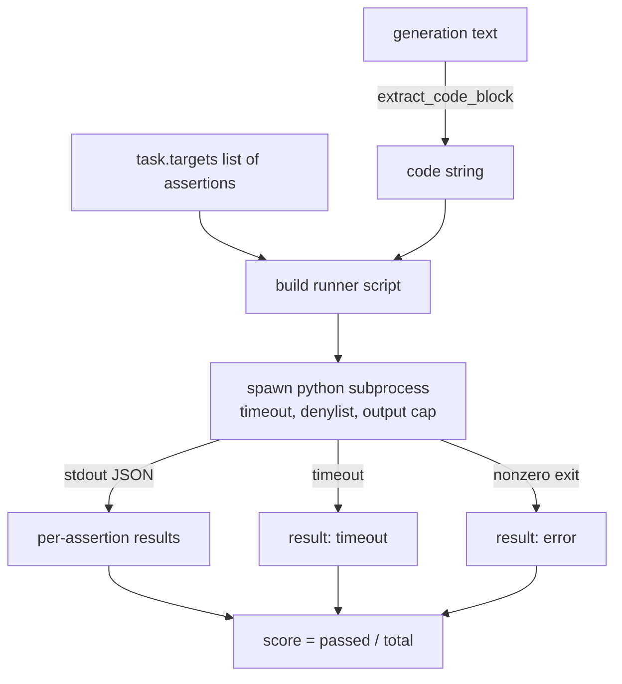
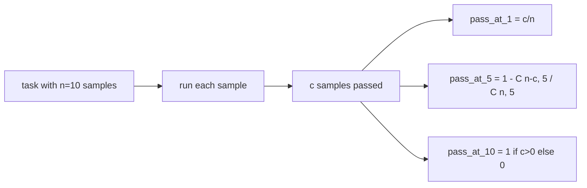

# Mã Exec Metric

> Mã được tạo là đúng khi nó vượt qua các bài kiểm tra. Vật liệu đánh giá phải trích xuất mã, chạy nó mà không bị hỏng máy chủ, và đếm tỷ lệ vượt qua một cách trung thực. Bài học này xây dựng bề mặt đó.

**Type:** Build
**Languages:** Python
**Prerequisites:** Phase 19 Track B foundations, lessons 70 and 71
**Time:** ~90 min

## Mục tiêu học tập

- Tạo ra một khối mã từ một hệ thống tự do theo cách phù hợp với quy tắc sau quá trình từ bài học 70.
- Thực hiện mã ứng cử viên trong một quá trình phụ tách biệt với thời gian clock tường, nắp đầu ra và danh sách nhập khẩu.
- Đánh điểm một nhiệm vụ như phần của chuỗi khẳng định được cung cấp mà đi ngược lại với ứng cử viên.
- Lập toán pass-at-k cho các nhiệm vụ lấy mẫu nhiều thế hệ từ một mô hình.
- Chống các vụ tai nạn sandbox, lỗi tổng hợp và thời gian ra như các chế độ thất bại hạng nhất với mã thoát khác nhau mà người chạy có thể đăng nhập.

```figure
sandbox-runner
```

## Tại sao một quá trình phụ bị cô lập

Đường trong`exec`là một mối nguy hiểm an ninh và ổn định.`while True: pass`chặn đánh giá mãi mãi.`import shutil; shutil.rmtree('/')`là hoàn toàn thảm khốc như nghe có vẻ. giải pháp là tạo ra một phiên dịch Python mới cho mỗi ứng viên, thông qua mã trên stdin, viết kết quả khẳng định cho stdout, và tiêu diệt quá trình nếu nó vượt quá.

Các bản đánh giá thực sự như HumanEval, MBPP, BigCodeBench và LiveCodeBench đều sử dụng một hộp cát phụ quy trình. Một số lớp Docker ở trên. Chúng tôi dừng lại tại các bộ quy trình vì một lý do: nó là di động, nó là stdlib, và nó bắt được các chế độ thất bại quan trọng cho đánh giá giáo dục. Việc triển khai sản xuất thêm seccomp, cách ly mạng và một hệ thống tệp chỉ đọc. Bài học tiếp theo về làm cứng cuộc sống bên ngoài đường này.

## Hình dạng của nhiệm vụ code-exec

A `code_exec`task mang string khẳng định trong `targets`Người chạy bộ lấy một khối mã được bao vây từ thế hệ, xây dựng một vòng kiểm tra xung quanh nó, và chạy kết quả.



Điểm số là một phần trong `[0, 1]`. Một nhiệm vụ với ba khẳng định trong đó hai điểm vượt qua là 0,667. Người chạy trả lại cùng một hình dạng bất kể thất bại gì: các vụ tai nạn của các quá trình phụ được lập bản đồ đến một mã lỗi bình thường, không phải là một Python traceback bong lên đến vòng xoáy.

## The Denylist

Danh sách denyl là dựa trên nhập khẩu. Trước khi chạy mã ứng cử viên, kịch bản chạy lại nhập khẩu các mô-đun nguy hiểm đến một đoạn mà nâng `ImportError("denied")`Danh sách này là một sự bảo thủ:`os.system`- `subprocess`- `socket`- `requests`- `urllib`- `urllib.request`- `urllib.error`- `urllib.parse`- `ctypes`- `shutil`- `http.client`- `asyncio.subprocess`- Tôi không biết.

Chúng tôi không giả vờ rằng đây là không đạn. mã đối kháng xác định có thể thoát khỏi bất kỳ hộp cát trong quá trình nào trong Python. Denylist là một backstop. Thời gian clock tường và nắp đầu ra là các điều khiển chịu tải.

```python
DENIED = {
    "os.system": True,
    "subprocess": True,
    "socket": True,
    "shutil": True,
    "requests": True,
    "urllib": True,
    "ctypes": True,
}
```

Chúng ta sẽ kết thúc bằng cách đặt trước.`import sys`Và một người bảo vệ đeo đeo đeo ơi.`os.system`Toàn bộ mẫu là trong `main.py`- Tôi không biết.

## Thời gian clock tường

Mỗi bộ phận sẽ được dự báo là 3 giây.`subprocess.run(..., timeout=t)`Nếu thời gian nghỉ cháy, người chạy sẽ bắt được.`TimeoutExpired`, giết chết quá trình, và ghi lại một `timeout`lý do để rời khỏi nhiệm vụ điểm số cho nhiệm vụ đó là không. người chạy tiếp tục.

Thời gian dừng có thể được cấu hình theo mỗi nhiệm vụ từ `task.metadata.timeout_s`Các thử nghiệm đơn vị dài có thể yêu cầu nhiều hơn; người xác nhận từ bài học 70 giới hạn giá trị ở ba mươi giây để giữ cho bộ bị giới hạn.

## Tấm sản xuất

Các quá trình phụ có thể lụt lụt, làm mệt mỏi bộ nhớ máy chủ. Người chạy chạy lụt vào một bộ đệm và giết chết đứa trẻ ngay khi tổng số chạy vượt qua 256 KB. Kết quả được ghi lại như `exit_code = error`với chuỗi chi tiết `"output overflow"`Điều này xuất hiện trong thực tế khi một thế hệ vô tình viết một vòng lặp vô hạn để in.

## - Đi qua

Pass-at-k là ước tính không thiên vị được sử dụng bởi HumanEval và bạn bè.`n`mẫu độc lập cho mỗi nhiệm vụ và `c`của chúng đi qua, khả năng một mẫu kích thước `k`từ `n`chứa ít nhất một dung dịch thông qua là:

```
pass_at_k(n, c, k) = 1 - C(n - c, k) / C(n, k)
```

Khi nào `n - c < k`số không xác định và giá trị là `1`Việc thực hiện sẽ xử lý vụ án trực tiếp.`pass_at_k(n, c, k)`cho sử dụng bởi lớp bảng xếp hạng trong bài học 74.



## Mã thoát

Người chạy trả lại một trong năm kết quả cho mỗi nhiệm vụ:

- `pass`Khi mọi lời nói đều trôi qua.
- `assertion_fail`khi mã chạy nhưng ít nhất một tuyên bố thất bại.
- `syntax_error`khi mã không nhập hoặc có lỗi SyntaxError.
- `timeout`Khi đồng hồ tường hết hạn.
- `error`cho bất kỳ vụ tai nạn nào khác, bao gồm các đòn denylist và tràn ra (mất độ tràn ra với chi tiết `"output overflow"`().

Điểm số vẫn là một phần nhỏ. Mã thoát là metadata. Bài học theo dòng có thể quyết định xem phải tính thời gian như không hoặc như dữ liệu thiếu.

## Bài học này không làm gì

Nó không cung cấp cho bạn một hộp cát thực sự. Nó không chạy mã không đáng tin cậy từ web mở. Nó không xử lý các nhiệm vụ trạng thái như file I / O hoặc cuộc gọi mạng. Những người đó cần một container hoặc một microVM. Điểm của bài học này là hợp đồng: một quá trình phụ tách biệt, một denylist, một thời gian nghỉ, một nắp đầu ra, một từ vựng mã thoát sạch, và pass-at-k toán học.

## Làm thế nào để đọc mã

`main.py`định nghĩa `extract_code`- `run_candidate`- `score_code_exec`, và`pass_at_k`. Các trình tự chạy bộ phụ quy trình được xây dựng như một chuỗi và được chuyển như `-c`cho một phiên dịch Python mới.`code/tests/test_exec.py`thực hiện bốn mã thoát y cộng với pass-at-k đối với các ví dụ được làm từ phong cách HumanEval.

Đọc `main.py`top to bottom. runner template là phần chịu tải. nhìn vào vòng lặp khẳng định cho đến khi bạn có thể dự đoán bao bì JSON nó viết trở lại quá trình gốc.

## Đi xa hơn nữa

Một khi hình dạng phụ quy trình hoạt động, mối quan tâm tiếp theo là khả năng di chuyển. Các phiên bản Python khác nhau xử lý SIGKILL khác nhau trên Windows. Cách tốt nhất là đưa người chạy vào hình ảnh Docker. Điều tiếp theo sau đó là thay thế chuỗi khẳng định bằng các tệp thử nghiệm đơn vị thực tế để đánh giá phù hợp với CI sản xuất. Ngừng gọi các chuỗi khẳng định là thử nghiệm tại thời điểm đó; chúng là thử nghiệm đồ chơi và chúng có chế độ thất bại đồ chơi.
