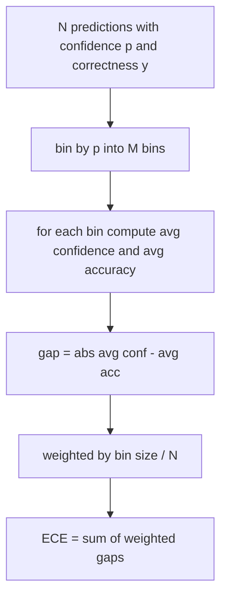
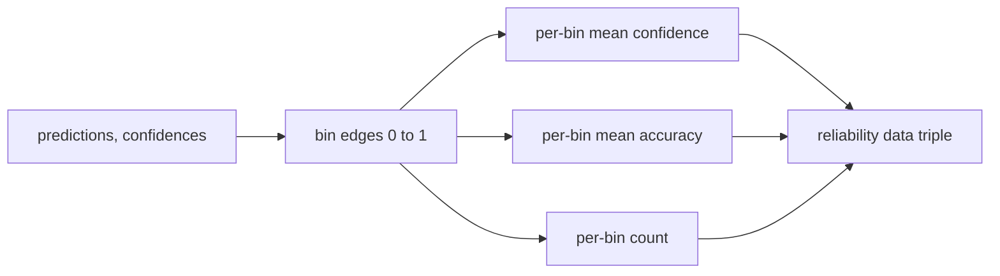

# Sự bối rối và điều chỉnh

> Nếu mô hình của bạn nói 90% tự tin với một ngàn câu trả lời và có sáu trăm đúng, nó không được chuẩn bị tốt. Định vị là một nửa của đánh giá đáng tin cậy. Một nửa khác là bối rối, cho bạn biết liệu mô hình nghĩ văn bản được giữ là hợp lý hay không.

**Type:** Build
**Languages:** Python
**Prerequisites:** Phase 19 Track B foundations, lessons 70 and 71
**Time:** ~90 min

## Mục tiêu học tập

- Xét độ phức tạp cấp token trên một corpus được giữ từ các xác suất log tiêu cực token được cung cấp bởi bộ điều chỉnh mô hình.
- Xét toán lỗi hiệu chuẩn dự kiến (ECE) của một phân loại hoặc đánh giá nhiều lựa chọn từ các xác suất dự đoán được dự đoán.
- Xét điểm Brier (sự sai lầm bình phương trung bình so với chỉ số chính xác) và giải thích khi nào nó làm điều mà ECE không làm.
- Xây dựng dữ liệu biểu đồ độ tin cậy cần thiết để vẽ một đường cong sự tin tưởng đối với độ chính xác.
- Cụm cả ba vào dây đánh giá để người chạy có thể gắn .`perplexity`- `ece`, và`brier`số cho một báo cáo mô hình.

```figure
cd-reliability-diagram
```

## Sự bối rối cho bạn biết gì

Sự bối rối là tỷ lệ trung bình âm tính của log-choáng lẽ mỗi token. Tối thấp hơn là tốt hơn. Sự phức tạp của một nghĩa là mô hình gán xác suất một cho mỗi token thực tế. Sự phức tạp về quy mô từ vựng có nghĩa là mô hình là đồng nhất và không học được gì. Số lượng thực nằm giữa hai: mô hình cơ sở mạnh mẽ năm 2026 trên WikiText-103 nằm khoảng tám đến mười hai. Một người xấu trên cùng một văn bản ngồi ở năm mươi cộng.

Các kết nối không tính toán xác suất log tự nó. Những người đến từ bộ điều chỉnh mô hình. Các kết nối harness: nó lấy một danh sách xác suất log mỗi token, một danh sách số lượng token mỗi chuỗi, và trả lại sự phức tạp của corpus.

```python
def perplexity(neg_log_probs, token_counts):
    total_nll = sum(neg_log_probs)
    total_tokens = sum(token_counts)
    return math.exp(total_nll / total_tokens)
```

Việc thực hiện xử lý các trường hợp cạnh không mã thông báo và khẳng định rằng các khả năng log âm là không âm. Một sai lầm phổ biến là quên đi sự phủ nhận: một bộ điều chỉnh trả về `log p`thay vì `-log p`hàm này sẽ bắt được nó như là vi phạm hợp đồng.

## Các biện pháp của ECE

Các lỗi hiệu chuẩn dự kiến nhóm dự đoán bằng sự tin tưởng của họ vào một số hộp cố định, sau đó đo khoảng cách trung bình giữa sự tin tưởng và độ chính xác trên các hộp, cân bằng bằng kích thước hộp.



Công thức chuẩn sử dụng 10 thùng cùng chiều rộng trên `[0, 1]`Việc thực hiện hỗ trợ bất kỳ số nguyên tích tích cực nào.`bins`tham số để người chạy có thể chọn giữa công ước xuất bản (10) và công ước so sánh (15).

ECE bị thiên vị bởi số lượng thùng và kích thước mẫu. Với mười thùng và một trăm dự đoán, bạn không thể phân biệt 0,02 ECE từ tiếng ồn ngẫu nhiên. Việc thực hiện trả lại số lượng thùng đông dân cùng với ECE để người chạy có thể từ chối báo cáo một số duy nhất trên quá ít mẫu.

## Điểm Brier nào mà ECE không

ECE chỉ quan tâm đến khoảng cách trung bình. Một mô hình tự tin quá nhiều về một nửa thùng rác và không tự tin về một nửa khác có thể có ECE thấp trong khi được chuẩn bị kém tại địa phương. Điểm Brier đo lường lỗi vuông so với kết quả thực cho mỗi dự đoán, vì vậy nó phạt lây lan trực tiếp.

Đối với kết quả nhị phân, Brier là `mean((p_i - y_i)^2)`Nó phân hủy thành độ tin cậy, độ phân giải và sự không chắc chắn. Chúng tôi tính toán điểm số và phân hủy. Người chạy báo cáo về scalar nhưng ghi lại phân hủy cho bảng điều khiển.

```python
def brier(p, y):
    return float(np.mean((p - y) ** 2))
```

## Dữ liệu biểu đồ độ tin cậy

Một biểu đồ độ tin cậy dự đoán sự tin cậy chống lại độ chính xác thực nghiệm trong mỗi bin. Chân cọc là hiệu chuẩn hoàn hảo. Chức năng trả lại ba mảng: độ tin cậy trung bình mỗi bin, độ chính xác trung bình mỗi bin và số lượng mỗi bin. Mã biểu đồ sống dòng chảy; bài học này dừng lại ở hình dạng dữ liệu.



Tuple được trả lại là những gì một lớp gọi cần để vẽ bản đồ hoặc tính toán một biến thể ECE tùy chỉnh (ECE thích nghi, quét ECE, vv).

## Nguồn tin cậy

Bộ đeo không giả định sự tự tin đến từ Softmax.`[0, 1]`Đối với các nhiệm vụ đa lựa chọn, sự tự tin tự nhiên là `softmax over option log-likelihoods`Đối với văn bản tự do sự tự tin tự nhiên là xác suất tự báo cáo của mô hình hoặc số nhân của xác suất log trung bình.

## Các trường hợp cạnh

- Tất cả dự đoán sai: ECE là mức độ tự tin trung bình, Brier là cao, sự bối rối là bất cứ điều gì mô hình nghĩ về văn bản.
- Tất cả các dự đoán đều chính xác với sự tin tưởng cao: ECE gần không, Brier gần không.
- Tự đoán hoàn toàn không chắc chắn ở p = 0,5: ECE là 0,5 trừ độ chính xác, Brier là 0,25 trừ một thuật ngữ sửa chữa.
- Lập vào trống: ECE, Brier, và độ tin cậy trả lại `0.0`(hoặc các mảng không đầy).`NaN`cho trường hợp mã số không. Không có một con đường nào phát ra cảnh báo; người chạy kiểm tra các giá trị và quyết định báo cáo hay bỏ qua.

Một mô hình thực sự trên một điểm chuẩn thực sự sẽ không tấn công chúng, nhưng một bộ chuyển đổi lỗi hoặc một mẫu nhỏ sẽ làm, và người chạy không nên bị tai nạn.

## Đưa ra

Định vị không phải là một số liệu cho mỗi nhiệm vụ như F1.`(confidence, correct)`Các phân tích được tính toán trên một tập tin văn bản được giữ, tách biệt với việc ghi điểm từng nhiệm vụ.

Giao diện là:

```python
report = CalibrationReport.from_predictions(confidences, correct)
report.ece          # float
report.brier        # float
report.reliability  # tuple of three numpy arrays
report.populated_bins  # int
```

`PerplexityResult.from_token_nll(neg_log_probs, token_counts)`trả lại sự phức tạp và tỷ lệ log âm trung bình cho mỗi token.

## Bài học này không làm gì

Nó không gọi một mô hình. Nó không thực hiện softmax. Nó không ước tính sự tin cậy từ các token đầu ra; đó là công việc của bộ điều chỉnh. Nó không làm quy mô nhiệt độ hoặc quy mô Platt; đó là các sửa chữa hậu hoc sống trong một bài học khác. Mục đích của bài học này là làm cho ba số (đật rối, ECE, Brier) đáng tin cậy và có thể tái tạo.

## Làm thế nào để đọc mã

`main.py`định nghĩa `perplexity`- `expected_calibration_error`- `brier_score`- `reliability_diagram`, và `CalibrationReport`- `PerplexityResult`Các mô hình này được thực hiện trên các dự đoán tổng hợp nơi mà sự thật căn bản được biết đến: mô hình được chuẩn bị tốt, một mô hình quá tự tin và một mô hình không tự tin.`code/tests/test_calibration.py`Pin mỗi trường hợp cạnh cộng với các giá trị tham chiếu cho các dự đoán tổng hợp.

Đọc `main.py`hàm sắp xếp đi từ scalar đến vector để báo cáo. mỗi hàm có một chuỗi tài liệu ngắn với toán học và hợp đồng.

## Đi xa hơn nữa

Tích chuẩn là trục bị bỏ qua nhiều nhất trong đánh giá được xuất bản. Hầu hết các bảng xếp hạng báo cáo một số chính xác và gọi nó đã hoàn thành. Một mô hình chiến thắng về độ chính xác và thua Brier là một triển khai sản xuất tồi tệ hơn so với một mô hình ghi điểm thấp hơn một vài điểm về độ chính xác nhưng đáng tin cậy báo cáo sự không chắc chắn của nó. Khi bạn có ống nước chuẩn lập được đặt, thêm quy mô nhiệt độ trên một miếng xác thực kéo dài, tính lại ECE, và xem khoảng cách thu hẹp. Đó là một bài học riêng biệt, nhưng sàn sống ở đây.
