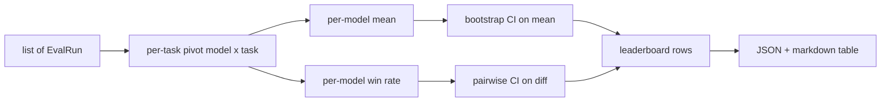
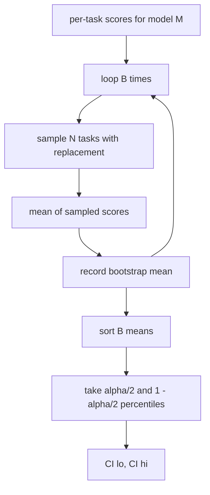

# Kết hợp bảng xếp hạng

> Điểm số mỗi nhiệm vụ là dễ dàng. Định vị hàng mẫu trên các nhiệm vụ đa dạng khó hơn. Tầm quan trọng thống kê trên bảng xếp hạng hàng ngàn dự đoán là phần mọi người bỏ qua. Bài học này không bỏ qua nó.

**Type:** Build
**Languages:** Python
**Prerequisites:** Phase 19 Track B foundations, lessons 70, 71, 73
**Time:** ~90 min

## Mục tiêu học tập

- Kết hợp điểm số mỗi nhiệm vụ trên nhiều mô hình và nhiều nhiệm vụ thành một hàng đơn giản cho mỗi mô hình.
- Tiêu chuẩn các điểm khác nhau để tỷ lệ vượt qua và giá trị BLEU không ảnh hưởng quá nhiều đến tổng số.
- Đánh giá các mô hình theo trung bình và tỷ lệ thắng, và giải thích khi nào mỗi mô hình là bản tóm tắt đúng.
- Xét khoảng thời gian độ tin cậy bootstrap trên điểm trung bình cho mỗi mô hình và trên sự khác biệt theo cặp.
- Tạo bảng xếp hạng như một báo cáo JSON và như một bảng đánh dấu, người chạy trong bài học 75 có thể dán vào bình luận CI.

```figure
ci-leaderboard-ci
```

## Hình dạng đầu vào

Bộ tổng hợp tiêu thụ một danh sách của `EvalRun`hồ sơ:

```python
@dataclass
class EvalRun:
    model_id: str
    task_id: str
    metric_name: str
    score: float          # in [0, 1]
    category: str
```

Người chạy trong bài học 75 phát ra một kỷ lục mỗi `(model, task)`cặp. tổng hợp không quan tâm đến cách điểm được tạo ra. nó mong đợi bình thường hóa đã xảy ra: mỗi điểm là trong`[0, 1]`- Tôi không biết.

## Tạo ra

Ba bàn được đưa ra:



Dòng bảng xếp hạng bao gồm: `model_id`- `mean_score`- `mean_ci_lo`- `mean_ci_hi`- `win_rate`- `tasks_completed`, và tùy chọn `categories`bản đồ cho trung bình mỗi loại.

## Tự bình thường hóa

Nếu một nhiệm vụ ghi điểm trong `[0, 1]`và một cái khác trong `[0, 100]`, thứ hai lặng lẽ thống trị trung bình. tổng hợp xác nhận rằng mỗi điểm nhập nằm trong`[0, 1]`và từ chối chạy nếu không. Fix sống trên dòng chảy: métric đã trả lại một phần. Bài học 71 đến 73 thực thi hợp đồng đó.

## Tỷ lệ trung bình và tỷ lệ thắng lợi

Hai kế hoạch xếp hạng phục vụ các mục tiêu khác nhau.

Điểm trung bình là trung bình điểm số mỗi nhiệm vụ cho một mô hình. Đây là báo cáo số lượng hàng đầu của bảng xếp hạng. Nó nhạy cảm với các điểm khác biệt và sự mất cân bằng nhiệm vụ.

Tỷ lệ thắng tính toán một mô hình đánh bại mỗi mô hình khác trong cùng một nhiệm vụ. Đối với mỗi nhiệm vụ, mô hình có điểm số cao nhất thắng (các kết nối chia). Tỷ lệ thắng bằng với chiến thắng chia bằng số lượng nhiệm vụ mà mô hình có điểm số. Nó ít nhạy cảm với các điểm khác biệt và quy mô nhưng mất thông tin.

```python
def win_rate(model_id, runs_by_task, all_models):
    wins, total = 0, 0
    for task_id, runs in runs_by_task.items():
        scores = {r.model_id: r.score for r in runs if r.model_id in all_models}
        if model_id not in scores:
            continue
        total += 1
        best = max(scores.values())
        if scores[model_id] >= best:
            wins += 1
    return wins / total if total else 0.0
```

Các báo cáo của vòng xoay cả hai. người chạy trong bài học 75 xếp hạng theo trung bình theo mặc định; cột đánh dấu xuống cho tỷ lệ chiến thắng là ngay ở đó nếu người dùng thích nó.

## Bootstrap confidence intervals

Mỗi mô hình có nghĩa là đến với một khoảng thời gian tín nhiệm được ước tính bằng bootstrap lấy lại mẫu trên các nhiệm vụ.`B`lần, và lấy khoảng phần trăm ở mức độ `alpha`- Tôi không biết.



Đối với so sánh cặp chúng ta khởi động sự khác biệt cho mỗi nhiệm vụ `score_A - score_B`, lấy khoảng phần trăm, và báo cáo nó. Người dùng đọc xem khoảng không loại trừ không. Nếu nó làm, sự khác biệt là đáng kể ở mức alpha. Nếu nó không làm, bảng xếp hạng xử lý các mô hình như liên kết.

Những người giúp đỡ cấp thấp (`bootstrap_mean_ci`- `bootstrap_pairwise_diff`) không thành công `B=1000`; các nhà tổng hợp công cộng (`aggregate`- `pairwise_diffs`) không thành công `b=500`Vì vậy, các bài demo và thử nghiệm vẫn nhanh. Alpha mặc định là 0.05. Bài học giữ cho bootstrap tinh khiết numpy, không có scipy.

## Các loại

Nếu`EvalRun.category`được thiết lập, tổng hợp cũng báo cáo trung bình cho từng loại. Đây là cột trên mỗi bảng xếp hạng nói `math`- `reasoning`- `code`- `safety`Nó cho phép người chạy thấy liệu mô hình có tốt tổng thể nhưng yếu trong mã, đó là thông tin tiêu đề có nghĩa là ẩn.

## Đánh giá theo dấu

bảng xếp hạng được trình bày như một bảng điểm:

```text
| Rank | Model | Mean | 95% CI | Win rate | Tasks |
|------|-------|------|--------|----------|-------|
| 1    | gpt   | 0.78 | 0.74-0.82 | 0.62 | 50 |
| 2    | claude| 0.75 | 0.71-0.79 | 0.34 | 50 |
| 3    | random| 0.10 | 0.07-0.13 | 0.04 | 50 |
```

Bảng được sắp xếp theo điểm trung bình. CI được hiển thị với hai chữ thập.

## Bài học này không làm gì

Nó không chạy mô hình. Nó không gọi lớp métric. Nó không thực hiện ECE thích nghi hoặc các biến thể hiệu chuẩn khác; đó là bài học 73. Nó không thực hiện trọng lượng nhiệm vụ. Mỗi nhiệm vụ đều được tính giống nhau ở đây. bảng xếp hạng sản xuất trọng lượng nhiệm vụ; chúng ta để lại cái móng mở thông qua các Ứng dụng của các công cụ.`weight`nhưng bỏ qua nó trong tổng hợp. Thêm trọng lượng trong một bài học tiếp theo nếu bạn cần nó.

## Làm thế nào để đọc mã

`main.py`định nghĩa `EvalRun`- `LeaderboardRow`- `aggregate`- `bootstrap_mean_ci`- `bootstrap_pairwise_diff`, và`render_markdown`. Demo xây dựng một bộ tổng hợp của ba mô hình và mười hai nhiệm vụ, tổng hợp và in bảng xếp hạng cộng với bảng phân biệt đôi.`code/tests/test_leaderboard.py`Pin bootstrap, rendering down, các trường hợp lợi nhuận và hành vi nhập trống.

Đọc `main.py`hình dạng dữ liệu (EvalRun, LeaderboardRow) đi đầu tiên, tổng hợp tiếp theo, bootstrap thứ ba, rendering cuối cùng.

## Đi xa hơn nữa

Bước tiếp theo là quan trọng công việc đôi thay vì bootstrap không đôi. Nếu mô hình A và B đều chạy cùng một trăm nhiệm vụ, thử nghiệm thích hợp là bootstrap kết hợp về sự khác biệt nhiệm vụ theo nhiệm vụ, mà chúng tôi thực hiện. Ngoài ra, bạn muốn một bootstrap hàng bậc tôn trọng các gia đình nhiệm vụ (vấn đề toán học không độc lập với nhau; một mô hình sai lầm toán học ảnh hưởng đến mười trong số họ). Đó là một sự tiếp tục. Mục đích của bài học này là để có được sàn đúng để đánh giá báo cáo một số bạn có thể bảo vệ.
