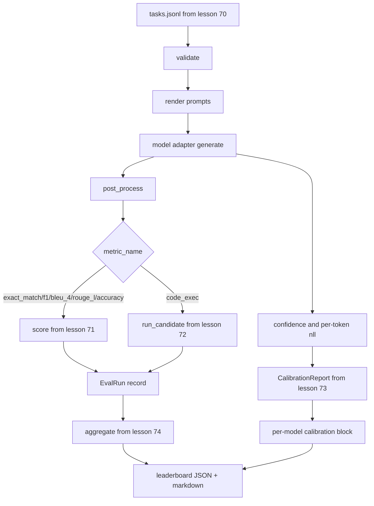

# Người chạy đua Eval End-to-End

> Năm bài học về ống nước, một bài học để dán chúng. Người chạy đọc thông số kỹ thuật nhiệm vụ từ bài học 70, gọi một mô hình thông qua một bộ điều chỉnh, ghi điểm với bài học 71 và 72, gắn báo cáo hiệu chuẩn từ bài học 73, và phát ra bảng xếp hạng từ bài học 74. Demo tự kết thúc.

**Type:** Build
**Languages:** Python
**Prerequisites:** Phase 19 Track B foundations, lessons 70 through 74
**Time:** ~90 min

## Mục tiêu học tập

- Định nghĩa một `ModelAdapter`giao diện mà bất kỳ mô hình nào (mô hình, địa phương, API) có thể đáp ứng với một bề mặt phương pháp nhỏ.
- Thực hiện đánh giá trên một tập tin JSONL cố định với việc thực hiện nhiệm vụ song song trên một nhóm công nhân.
- Sắp xếp lớp métric (exact_match, F1, BLEU-4, ROUGE-L, code_exec) với lớp hiệu chuẩn trong một lần.
- Phát hành theo mô hình `EvalRun`ghi lại và đưa chúng vào tổng hợp bảng xếp hạng.
- Tạo cả báo cáo JSON và bảng đánh dấu; tự kết thúc với thoát 0 trên một chạy sạch, không bằng 0 trên xác thực hoặc lỗi thời gian chạy.

```figure
eval-grid
```

## Đường ống



Người chạy là điểm tích hợp. Mỗi bài học 70 đến 74 sở hữu một mô-đun mà người chạy tạo ra. Người chạy không sao chép bất kỳ logic nào từ các mô-đun đó: nó nhập khẩu chúng.

## Giao diện bộ chuyển đổi

Máy điều chỉnh là đường nối giữa máy chạy và bất kỳ mô hình nào.

```python
class ModelAdapter:
    model_id: str

    def generate(self, prompt: str, task: TaskSpec) -> Generation: ...
```

`Generation`là một lớp dữ liệu với:

- `text`: đầu ra dạng tự do của mô hình
- `confidence`: một con tàu nổi trong `[0, 1]`đại diện cho xác suất tự báo cáo của mô hình cho câu trả lời
- `token_nll`: tổng số tùy chọn của các khả năng log âm đối với các token được tạo ra
- `token_count`: số tùy chọn của các token được tạo

Các bộ chuyển đổi giả trong bộ chạy bộ cung cấp ba hương vị: `RuleBasedAdapter`(định nghĩa, gần hoàn hảo),`NoisyAdapter`(sự tin tưởng quá mức, thường sai lầm), và`BiasedAdapter`(tốt trong một thể loại, khủng khiếp trong một thể loại khác) Demo chạy cả ba trên bài học 70 cố định.

## Thực hiện song song

Người chạy chạy sử dụng `concurrent.futures.ThreadPoolExecutor`để chạy các nhiệm vụ song song theo mỗi mô hình. Số lượng người lao động mặc định là nhỏ hơn tám và số lượng nhiệm vụ. Các chuỗi là đủ vì nút thắt cho các cuộc gọi mô hình thực là mạng I / O. Chặng đường code-exec tạo ra một bộ phận riêng bên trong nhiệm vụ và người thực thi chỉ lên lịch chờ đợi.

Đối với các thử nghiệm xác định, người chạy bộ phơi bày `run_eval(adapters, tasks, parallel=False)`để các xét nghiệm có thể xác định lệnh hành quyết.

## Loop ghi điểm một lần

Đối với mỗi nhiệm vụ:

1. Đưa ra lệnh (một vài cú ảnh tiền đề cộng với cơ thể yêu cầu).
2. Hãy gọi cho bộ chuyển đổi và định thời cho cuộc gọi.
3. Sau quá trình tạo ra theo quy tắc của nhiệm vụ.
4. Đưa lên lớp mét.
5. Xây dựng một `EvalRun`ghi lại với điểm số và metadata métric.
6. Thêm vào `(confidence, correct)`cặp với bộ đệm hiệu chuẩn.

- `correct`tín hiệu là `score >= 1.0`cho các metrics kiểu exact_match (`exact_match`- `accuracy`- `code_exec`) và `score >= 0.5`cho các số liệu được xếp hạng.`_correct_from_score`và người chạy không thể lộ ra một sự vượt trội công khai.

## Tổng hợp

Sau khi mỗi nhiệm vụ có kết quả, người chạy gọi`aggregate`và `pairwise_diffs`Từ bài học 74 và `CalibrationReport.from_predictions`Từ bài học 73. Tạo ra là một phong bì JSON duy nhất:

```json
{
  "leaderboard": [...],
  "pairwise": [...],
  "calibration": {
    "model_id_a": {"ece": 0.04, "brier": 0.10, "populated_bins": 8, ...},
    ...
  },
  "summary": {
    "tasks": 10,
    "models": 3,
    "wall_seconds": 1.2
  }
}
```

Người chạy cũng viết một bảng đánh dấu xuống để stdout để người dùng có thể dán kết quả vào một đánh giá PR.

## Demos tự hủy

Demos chạy ba bộ chuyển đổi giả trên 10 nhiệm vụ cố định từ bài học 70. Thời gian tường nên nằm dưới 10 giây. Mã thoát là 0 trên một chạy sạch.

Các tiêu chí hoạt động sạch là:

- Mỗi nhiệm vụ được xác nhận theo bài học 70.
- Mỗi nhiệm vụ được ghi điểm dưới bài học 71 và 72.
- Báo cáo hiệu chuẩn được tổng hợp theo bài học 73 mà không có lỗi.
- bảng xếp hạng xếp hạng bộ điều chỉnh dựa trên quy tắc nghiêm ngặt trên bộ điều chỉnh ngẫu nhiên.

Nếu bất kỳ một trong những phá vỡ, runner thoát khỏi không bằng 0 với một lỗi cấu trúc trong phong bì JSON.

## Bài học này không làm gì

Nó không gọi một mô hình thực tế. Nó không thực hiện một API key flow hoặc xử lý giới hạn tốc độ. Nó không thực hiện phát trực tuyến hoặc phát một phần; bộ điều chỉnh trả lại một thế hệ mỗi cuộc gọi. Nó không thực hiện thử nghiệm lại hoặc lưu trữ trước. Những mối quan tâm đó sống tại lớp bộ điều chỉnh; người chạy là metric-agnostic và nhà cung cấp-agnostic.

## Làm thế nào để đọc mã

`main.py`Nó nhập từ năm mô-đun bài học khác thông qua một mô-đun nhỏ.`_load_sibling`trợ lý giải quyết chúng bằng cách tương đối.`Generation`- `EvalReport`, và`ModelAdapter`Các bộ chuyển đổi giả mạo ở cuối tập tin.

Đọc `main.py`Từ trên xuống dưới.`run_eval`, sau đó `_score_one`Dòng demo ở cuối là điểm vào.

Các thử nghiệm trong `code/tests/test_runner.py`Pin giao diện bộ điều chỉnh, vòng lặp một lần, tương đương song song với thứ tự, bộ đệm hiệu chuẩn và hình dạng phong bì JSON.

## Đi xa hơn nữa

Đây là sàn. Một hệ thống đánh giá sản xuất thêm: một cache kết quả được khóa bởi `(task_id, model_id, model_version)`, một sổ cái chi phí theo dõi đô la và token mỗi lần chạy, một lớp thử lại để giảm hạn mức, một chính sách lấy mẫu cho các nhiệm vụ pass-at-k, và một định dạng phát ra trực tuyến cho các bộ dài.

Thêm một bộ điều chỉnh cho một nhà cung cấp thực sự sau khi bạn có các giả mạo làm việc. chọn một với một lớp miễn phí, viết ba mươi dòng dán, xem bảng xếp hạng chiếu sáng.
