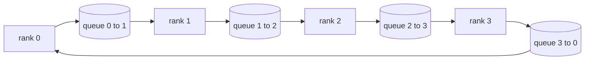

# Các hoạt động tập thể từ đầu

> Bốn hoạt động tập thể giữ tập huấn phân tán cùng nhau là allreduce, broadcast, allgather, and reduce_scatter.`multiprocessing.Queue`lưới, xác minh chúng chống lại một thực hiện tham chiếu, và phần còn lại của đường ray trở thành ống nước.

**Type:** Build
**Languages:** Python
**Prerequisites:** Phase 19 Track C lessons 42-49
**Time:** ~90 min

## Mục tiêu học tập

- Thực hiện vòng allreduce trong hai lần đi qua (đảm-scatter sau đó allgather) và chứng minh khối lượng truyền thông mỗi cấp là 2(N-1) / N byte mỗi yếu tố.
- Xây dựng phát sóng, thu thập tất cả, và giảm_scatter trên đầu điểm đến điểm gửi trên `multiprocessing.Queue`- Tôi không biết.
- Kiểm tra mọi nguyên thủy với một `torch.distributed`- Nhớ tham chiếu cho cùng một đầu vào.
- Bảo vệ sự lựa chọn của vòng so với cây trên hình dạng cluster, sàn trễ, và lề thượng băng thông.

## Vấn đề

Một tất cả giảm ngây thơ trên N hàng gửi N lần tensor đến một gốc và phát N lần trở lại. Tải băng là O(N) cho mỗi bậc, gốc trở thành nút thắt, và sàn tường-clock là liên kết chậm nhất nhân N. Ring allreduce flattens thành 2 ((N-1) khối kích thước T/N, do đó các byte mỗi cấp bậc giảm xuống 2T ((N-1) /N bất kể kích thước cluster. Cây allreduce thắng trên các liên kết nhỏ N và độ trễ cao vì độ sâu là log2(N) hop thay vì 2(N-1). Chọn topology sai cho hình dạng cluster và GPU chậm nhất chỉ ra thời gian bước.

Mỗi khung đào tạo phân tán mà bạn sẽ đọc bài hát này phụ thuộc vào bốn nguyên thủy này. PyTorch DDP đồng bộ hóa gradient với một allreduce mỗi bình tham số. ZeRO cắt giảm trạng thái tối ưu bằng cách giảm_scatter và phát sóng các tham số cập nhật bởi allgather. FSDP biến toàn bộ phía trước thành allgather cộng với reduce_scatter. Các nhu cầu song song đường ống phát sóng cho các hoạt động trên các nhóm giai đoạn. Nếu bạn không thể thực hiện bốn tập thể, bạn không thể lý luận về lý do tại sao các tập luyện dừng lại, tại sao sự không phù hợp của gradient xuất hiện ở cấp 3, hoặc tại sao bong bóng đường ống tăng gấp đôi khi bạn trao đổi các topology.

## Khái niệm



### Nhẫn tất cả giảm trong hai lần đi

Chia tensor thành N bằng các mảnh được chỉ mục 0..N-1. Mỗi cấp bậc đều có chỉ số phân tử bằng cấp bậc của nó. Đi qua 1, giảm-scatter, chạy bước N-1. Ở bước s, rank r gửi chunk (r - s) mod N đến rank (r + 1) mod N và nhận chunk (r - s - 1) mod N từ rank (r - 1) mod N, tích lũy phần nhận được vào bản sao địa phương của nó. Sau các bước N-1, cấp r sở hữu tổng đầy đủ cho phần r. Pass 2, allgather, chạy một bước N-1 khác và xoay các mảnh hoàn thành xung quanh vòng cho đến khi mỗi bậc giữ tổng đầy đủ cho mỗi mảnh.

| Primitive | Per-rank bytes | Steps | When to use |
|-----------|---------------|-------|-------------|
| Ring allreduce | 2T(N-1)/N | 2(N-1) | Large T, fat-pipe homogeneous cluster |
| Tree allreduce | T log2(N) | 2 log2(N) | Small T or high-latency links |
| Broadcast | T | log2(N) tree | Parameter init, scalar config |
| Allgather | T(N-1)/N | N-1 | Sharded forward, ZeRO unshard |
| Reduce_scatter | T(N-1)/N | N-1 | ZeRO gradient sharding |

### Trải xếp hàng như là một thay thế cho NCCL

NCCL chạy trên PCIe và NVLink với giảm tải phần cứng.`multiprocessing.Queue`mỗi cạnh vòng cung cấp cho bạn giao hàng điểm đến điểm được đặt hàng với một nhà sản xuất và một người tiêu dùng duy nhất. Việc giảm xảy ra trong không gian người dùng, vì vậy bạn trả phí chung Python, nhưng mô hình dây giống hệt như NCCL ring allreduce. Lý do về sự chính xác trên phiên bản hàng rào và hành vi cluster tiếp theo.

### Kiểm tra chống lại gloo

Mỗi nguyên thủy đều có một thử nghiệm đơn vị so sánh sản lượng của nó với `torch.distributed`Nếu vòng của bạn allreduce khác biệt với gloo bằng nhiều hơn float32 epsilon, thử nghiệm thất bại.

```figure
ci-ring-allreduce
```

## Hãy xây dựng nó

`code/main.py`thực hiện:

- `Mesh`lớp mà dây N `multiprocessing.Queue`trường hợp vào một vòng và phơi bày `send(dst, tensor)`và `recv(src)`cho mỗi cấp.
- `ring_allreduce(mesh, rank, world_size, tensor)`chạy thuật toán hai bước đi.
- `broadcast(mesh, rank, world_size, tensor, src)`trên một cây logarithmic.
- `allgather(mesh, rank, world_size, tensor)`sử dụng vòng quay N-1.
- `reduce_scatter(mesh, rank, world_size, tensor)`như nửa đầu của allreduce.
- `_gloo_reference(op, world_size, tensor)`mà chạy thông qua cùng một đầu vào `torch.distributed`với gloo để so sánh bằng byte.

Đi đi.

```bash
python3 code/main.py
```

Kết quả: bảng xác minh đầu tiên so sánh các kết quả hàng rào-mạng và bóng tối, tiếp theo là một bộ đếm byte mỗi cấp độ chứng minh quy mô 2T(N-1) / N.

## Các mô hình sản xuất trong tự nhiên

Ba mô hình làm cứng những nguyên thủy đủ để vận chuyển.

**Bucket gradients before allreduce.**Một mô hình tham số 1B có hàng chục ngàn tensor gradient. Một allreduce mỗi tensor trả giá cho tầng độ trễ N lần. DDP buckets gradients thành ~ 25 MB các mảnh và phát hành một allreduce mỗi bucket; các tensor nhỏ đi trên mặt sau của những lớn. Không bucketing độ trễ trên chiếm ưu thế bước.

**Overlap communication with computation.**Trở lại tính toán gradient lớp theo lớp theo thứ tự ngược. Khi gradient của lớp cuối cùng đã sẵn sàng, bắt đầu allreduce trong khi lớp tiếp theo tiếp tục tính toán. PyTorch DDP dây này với các cái nát sẵn sàng.

**Pick ring or tree by message size, not religion.**NCCL gửi một bộ phát hiện topology chọn nhẫn cho các tin nhắn trên ~ 1 MB và cây dưới. Crossover là băng thông-trái độ: trên 1 MB, thuật ngữ băng thông 2T(N-1) / N thống trị và thắng; dưới 1 MB, số lượng hop log2(N) thắng. Hard-coding một topology chi phí thông qua trên sai kích thước tin nhắn.

## Sử dụng nó

Các mô hình sản xuất:

- **PyTorch DDP.**Gọi`dist.all_reduce`kích thước bucket có thể điều chỉnh; mặc định 25 MB là hợp lý cho 100Gbit Ethernet.
- **DeepSpeed ZeRO.**Các vấn đề giảm_scatter để phân mảnh gradients và tất cả tập hợp để tái cấu trúc các tham số đầy đủ trước khi tiếp tục.
- **FSDP.**Tiếp tục bắt đầu với allgather để phân mảnh lớp, tính toán, sau đó giảm với reduce_scatter và loại bỏ unshard.

## Chuyển nó

Sử dụng các nguyên thủy lưới hàng rào trong bài học 77-81. Bài học 77 dây tất cả giảm thành DDP. Bài học 78 dây giảm_scatter thành ZeRO. Bài học 79 dây phát sóng thành hoạt động đường ống. Bài học 81 kết hợp tất cả bốn trong bản demo đầu đến cuối.

## Các bài tập

1. Thêm một cây tất cả giảm biến thể và chuyển đổi giữa vòng và cây theo kích thước thông điệp.
2. Thêm một `recv_timeout_ms`Vì vậy, một thứ hạng bị đình trệ sẽ xuất hiện một lỗi thời hạn thay vì bị treo mãi mãi.
3. Thay thế `multiprocessing.Queue`với các ổ cắm TCP cho bốn nguyên thủy.
4. Thêm một nút bấm dụng cụ băng thông để số lượng byte mỗi cấp tính ghi lại vào JSONL.
5. So sánh thời gian đồng hồ tường của vòng so với cây trên 4 hàng cho các tensor kích thước 1KB, 1MB, 16MB. Bảo vệ crossover bằng kinh nghiệm.

## Các điều khoản chính

| Term | What people say | What it actually means |
|------|----------------|------------------------|
| Allreduce | "Sum across ranks" | After the call every rank holds the same reduced tensor |
| Ring | "The fast topology" | N-1 chunks of size T/N flow around the cycle twice |
| Tree | "The log topology" | Reduction follows a binary tree; depth is log2(N) hops |
| Allgather | "Concatenate shards" | Every rank ends with every other rank's shard |
| Reduce_scatter | "Split the sum" | Each rank ends with the sum of one chunk only |
| Bucket | "Fuse small tensors" | Coalesce N small allreduces into one large one |

## Đọc thêm

- [PyTorch Distributed: NCCL collectives](https://pytorch.org/docs/stable/distributed.html#collective-functions)
- [Horovod ring allreduce paper](https://arxiv.org/abs/1802.05799)
- [NCCL topology and algorithm selection](https://docs.nvidia.com/deeplearning/nccl/user-guide/docs/index.html)
- [Patarasuk and Yuan, Bandwidth optimal allreduce algorithms](https://www.cs.fsu.edu/~xyuan/paper/09jpdc.pdf)
- Giai đoạn 10 Bài học 05 - tổng quan về đào tạo phân phối
- Giai đoạn 19 Bài học 77 - DDP được cáp trên đầu những nguyên thủy này
