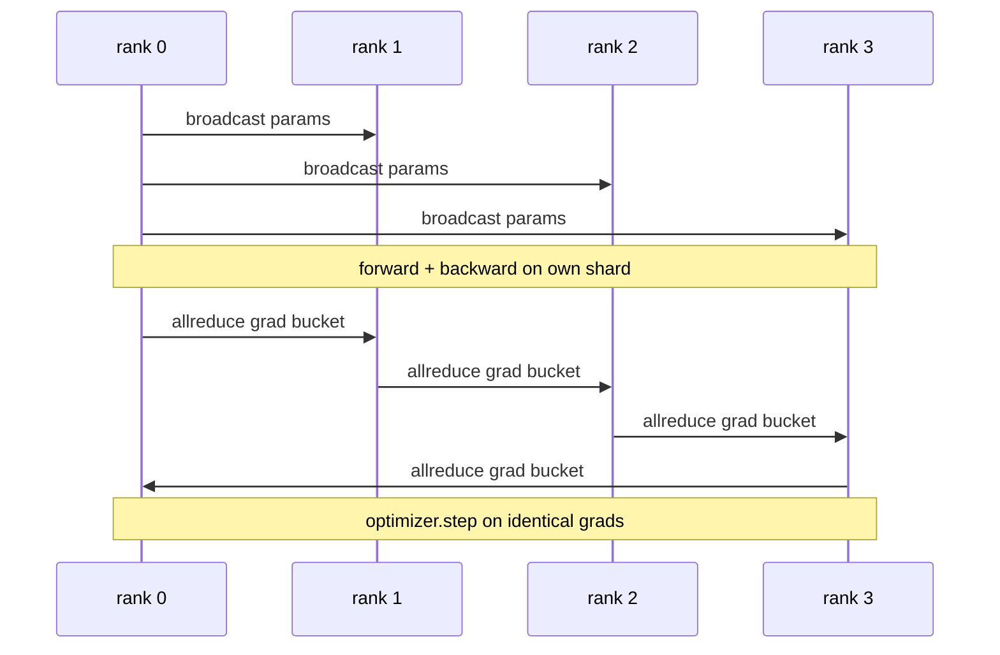

# DDP Dữ liệu song song từ đầu

> DistributedDataParallel là một cái nón trên đỉnh allreduce. Bị gói một mô hình, phát các tham số ban đầu từ hàng không 0 để mỗi hàng không bắt đầu giống nhau, lắp đặt một cái nón ngược trên mỗi tham số phát ra một allreduce của gradient, và phần còn lại là giảm gradient.

**Type:** Build
**Languages:** Python
**Prerequisites:** Phase 19 Track C lessons 42-49
**Time:** ~90 min

## Mục tiêu học tập

- Đưa dây a `DistributedDataParallel`-mở hình dạng đưa ra các tham số ban đầu và giảm độ nghiêng sau khi quay trở lại.
- Spawn N CPU xếp hạng với `torch.multiprocessing.spawn`trên nền đen tối với tập tin dựa trên cuộc hẹn.
- Hiển thị độ đúng của tần số-tự đồng bộ bằng cách đào tạo cùng một mô hình trên cùng một dữ liệu theo trình tự và hiển thị sự tương đương của các tham số mỗi bước.
- Bảo vệ việc sử dụng các thùng (sự hợp nhất gradient) và chồng chéo (comm trong thời gian ngược) như hai thay đổi biến một DDP làm việc thành một DDP sản xuất.

## Vấn đề

Một mô hình 1 tỷ tham số với 12 GB kích hoạt không phù hợp với một GPU tiêu dùng. Ngay cả khi phù hợp, đào tạo mất vài tuần. Dữ liệu song song chia các lô trên các hàng N, mỗi hàng tính toán về phía trước và phía sau trên mảnh của nó, và tại mỗi bước các gradient của mỗi hàng được tổng hợp để tất cả các N sao chép vẫn giống nhau.

Nếu không có sự đồng bộ hóa gradient, các bản sao N sẽ phân biệt theo bước 2. Mô hình không còn là "một mô hình được đào tạo trên nhiều dữ liệu" nữa, nó là N mô hình riêng biệt mà xảy ra chia sẻ trọng lượng ban đầu. Với sự đồng bộ hóa gradient được thực hiện kém (một allreduce mỗi tham số, không có chồng chéo, không có bucketing) mạng lưới là nút thắt và GPU đang chờ đợi dây. Công trình của DDP đang làm cho sự đồng bộ hóa gradient gần như tự do so với tính toán. PyTorch DDP theo quy luật đạt được điều đó bằng cách lấp lánh gradient, chồng chéo tất cả giảm với lớp tiếp theo trở lại, và sử dụng NCCL trên NVLink. Chúng ta có thể làm cả ba trên CPU với Glow và học cùng một bài học.

## Khái niệm



### Ba hoạt động cần thiết của DDP

| Stage | Collective | Why |
|-------|-----------|-----|
| Init | broadcast from rank 0 | Every rank starts with the same parameters |
| After backward | allreduce of each grad | The mean gradient is what the optimiser steps on |
| Sometimes | broadcast of buffers | Batchnorm running stats stay synchronised |

### Tại sao có nghĩa là không có tổng

Allreduce-SUM chia bằng world_size cho phép chuyển đổi tỷ lệ trung bình. Trung bình không thay đổi với world_size: một tỷ lệ học tập được điều chỉnh ở một bậc làm việc tại bốn bậc bởi vì độ lớn của gradient mỗi bước không thay đổi. Allreduce-SUM mà không có phân chia buộc bạn phải điều chỉnh lại tỷ lệ học tập mỗi khi bạn thay đổi kích thước cluster. DDP lật SUM và chia; làm tương tự trong bài học.

### Tại sao các gradient vỏ

Một biến thể có hàng ngàn tensor tham số. Một allreduce mỗi tensor trả giá cho tầng độ trễ tối đa hàng ngàn lần. DDP nhóm gradient thành ~ 25 MB bucket và phát hành một allreduce mỗi bucket. cùng tổng byte di chuyển qua dây nhưng độ trễ được giảm trên bucket. Đối với mô hình nhỏ của bài học chúng tôi nhóm mọi thứ thành một bucket; cấu trúc là những gì mang lại qua.

### Tại sao lại đập hạt giống

Mỗi cấp bậc phải gọi`torch.manual_seed(seed + rank)`để trộn nhưng `torch.manual_seed(seed)`cho parameter init. Một hạt giống chia sẻ duy nhất có nghĩa là mỗi cấp độ thấy cùng một thứ tự hàng loạt (trận bại dữ liệu song song; một hạt giống cụ thể cho các parameter có nghĩa là các tham số ban đầu không đồng ý bởi float epsilon và sự đồng bộ hóa gradient không còn làm cho các bản sao giống nhau.

```figure
ci-ddp-grad-sync
```

## Hãy xây dựng nó

`code/main.py`thực hiện:

- `MiniMLP`: một MLP 3 lớp đủ nhỏ để hội tụ trong vài giây, đủ lớn để phơi bày dây.
- `DistributedDataParallel(model, world_size)`: phát sóng các thông tin trong thời gian xây dựng, trả lại một gói mà `sync_grads`chia tích lũy tất cả giảm tổng các sinh viên tốt nghiệp theo kích thước thế giới.
- `worker(rank, world_size, ...)`: vòng đào tạo đầy đủ với `torch.distributed`init over gloo, đi về phía trước, trở lại, đồng bộ, bước.
- `_reference_single_process_loop(...)`: tập hợp cùng một mô hình trên cùng một dữ liệu theo trình tự trên một bậc, được sử dụng bởi thử nghiệm cho bằng bằng số bằng các tham số sau mỗi bước.

Đi đi.

```bash
python3 code/main.py
```

Kết quả: một bảng đào tạo từng bước so sánh mất mát và số kiểm tra tham số của một quá trình với chạy DDP trên 4 hàng. Hai con đường tạo ra các đường cong mất mát giống nhau để lơ lửng epsilon, chứng minh sự đồng bộ hóa gradient là chính xác.

## Các mô hình sản xuất trong tự nhiên

Ba mô hình làm DDP cứng đủ để vận chuyển.

**Find unused parameters.**Một số đường dẫn tiến qua các tham số theo điều kiện (từ sớm, hỗn hợp các chuyên gia router). các tham số bị bỏ qua không có gradient, nhưng cái nón sẵn sàng của DDP vẫn chờ đợi chúng và tất cả giảm bớt các ổ cắm. `find_unused_parameters=True`DDP sẽ xem các tham số nào có gradient trước khi giảm. chi phí là một bước đi biểu đồ mỗi bước, vì vậy hãy bỏ nó trừ khi các chi nhánh phía trước của bạn.

**Static graph optimisation.**Khi phía trước ổn định qua các bước, `static_graph=True`DDP tính toán trước lịch trình rác. Optimize quan trọng ở quy mô: tính toán trước tiết kiệm một vài ms mỗi bước mà hợp lại trên 10000 bước.

**Gradient accumulation needs care.**Tiếp tục tích lũy gradient trên K microbatch mà không đồng bộ hóa mỗi microbatch là một chiến thắng 10x thông qua. DDP phơi bày `no_sync()`như một người quản lý bối cảnh dừng lại tất cả mọi thứ sau khi lùi lại.

## Sử dụng nó

Các mô hình sản xuất:

- **PyTorch DDP.**Việc thực hiện theo luật pháp. `torch.nn.parallel.DistributedDataParallel(model)`Các dây bucketing, chồng chéo, và không_sync ngữ cảnh.
- **HuggingFace Accelerate.**Thêm một máy phóng để xử lý `torchrun`Vị trí và hình mẫu, cùng một DDP dưới nắp.
- **Megatron-LM data parallel.**Kết hợp DDP với song song tensor cho các mô hình lớn; mảnh song song dữ liệu là mô hình tất cả giảm sau trở lại.

## Chuyển nó

Bài học 78 (ZeRO sharding) thay thế các tham số allreduce bằng reduce_scatter để mỗi cấp chỉ lưu trữ các mảnh của trạng thái tối ưu hóa. Bài học 81 kết hợp DDP với ZeRO vào demo cuối đến cuối.

## Các bài tập

1. Thêm các bình gradient có kích thước có thể cấu hình và đo tốc độ so với một tất cả giảm-per-pharameter trên một mô hình sâu hơn.
2. Thực hiện`no_sync()`như một người quản lý bối cảnh và xác minh sự tích lũy gradient phù hợp với một đường cơ sở đơn quá trình trên K microbatches.
3. Thêm một `find_unused_parameters`chế độ khi người đi trước đôi khi bỏ qua một trong các lớp MLP; mà không có cờ chạy nên bị tắc nghẽn.
4. Thay thế gloo bằng `torch.distributed.barrier()`- chỉ đồng bộ hóa để cảm nhận sự khác biệt giữa đồng bộ hóa dựa trên allreduce và dựa trên rào cản.
5. Đánh giá chi phí chung của tần suất đồng bộ hóa như là một phần thời gian bước cho kích thước lô 1, 16, 256 và giải thích quy mô.

## Các điều khoản chính

| Term | What people say | What it actually means |
|------|----------------|------------------------|
| DDP | "Data parallel" | Wrapper that broadcasts params and allreduces grads each step |
| Bucket | "Fuse grads" | Group N small allreduces into one large one |
| Overlap | "Hide comm" | Issue allreduce while later layers still computing backward |
| no_sync | "Accumulate" | Skip the post-backward allreduce for gradient accumulation |
| find_unused | "Branchy forward" | Detect parameters with no grad before reducing |

## Đọc thêm

- [PyTorch DistributedDataParallel docs](https://pytorch.org/docs/stable/generated/torch.nn.parallel.DistributedDataParallel.html)
- [PyTorch DDP internals tutorial](https://pytorch.org/tutorials/intermediate/ddp_tutorial.html)
- [Li et al, PyTorch Distributed: Experiences on Accelerating Data Parallel Training](https://arxiv.org/abs/2006.15704)
- Giai đoạn 19 Bài học 76 - các tập thể DDP được xây dựng trên
- Giai đoạn 19 Bài học 78 - ZeRO chia nhỏ thay thế per-param allreduce bằng reduce_scatter
