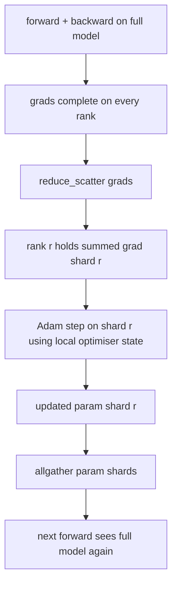

# ZeRO Optimizer State Sharding

> Adam lưu trữ hai ước tính thời gian cho mỗi tham số, cả hai trong float32. Một mô hình có tham số 7B mang 56 GB trạng thái tối ưu hơn. ZeRO giai đoạn 1 cắt giảm các bậc N; mỗi bậc sở hữu 1/N của tối ưu hóa. Sau khi bước địa phương các đoạn tham số được cập nhật phát lại, mỗi cấp bậc tái tạo mô hình đầy đủ, và bước tiếp theo bắt đầu. Chiến thắng là một sự giảm bộ nhớ tuyến tính trên phân bổ đơn lẻ lớn nhất trong tập luyện.

**Type:** Build
**Languages:** Python
**Prerequisites:** Phase 19 Track C lessons 42-49
**Time:** ~90 min

## Mục tiêu học tập

- Tương tự tối ưu hóa mảnh (thời khắc đầu tiên, thời điểm thứ hai, fp32 bản sao chủ) trên các hàng N do đó mỗi hàng sở hữu 1/N.
- Sử dụng reduce_scatter để cung cấp cho mỗi cấp bậc chỉ số gradient của phân mảnh của nó, sau đó tất cả tập hợp để phát sóng các phân đoạn tham số cập nhật trở lại.
- Xét bảng lưu trữ bộ nhớ cho giai đoạn 1, giai đoạn 2, giai đoạn 3 với DDP vanila.
- Bảo vệ sự lựa chọn của giai đoạn 1 vs giai đoạn 2 vs giai đoạn 3 về kích thước mô hình và ngân sách băng thông.

## Vấn đề

Vanilla DDP sao chép mọi thứ: các tham số, gradient và trạng thái tối ưu hóa đều có mặt đầy đủ trên mọi bậc. Đối với một mô hình tham số 7B trong fp16 có nghĩa là 14 GB các tham số, 14 GB của gradient, và 28 GB trạng thái tối ưu hóa mỗi bậc.

ZeRO giai đoạn 1 làm giảm trạng thái tối ưu hóa. Mỗi bậc chứa 1/N của thời điểm Adam. Sau khi quay trở lại, thay vì giảm độ sốc đầy đủ và bước lên địa phương, ZeRO giảm_scatters vì vậy mỗi cấp nhận chỉ độ sốc tổng của mảnh của nó. Các cấp độ áp dụng bước tối ưu hóa hơn cho mảnh của các tham số chủ yếu. Các parameter được cập nhật chia nhỏ sau đó tất cả được tập hợp lại để mỗi cấp có mô hình đầy đủ cho tiếp theo tiến lên. Tưởng thức tối ưu hóa giảm N. Giao thông dây mỗi bước là giống như DDP: một reduce_scatter cộng với một allgather bằng một allreduce bằng băng thông. Tưởng thức thắng, thông lượng giữ vững.

## Khái niệm



### Các giai đoạn của ZeRO

| Stage | What is sharded | Memory per rank | Comm per step |
|-------|----------------|------------------|---------------|
| DDP | nothing | params + grads + optim | 1x allreduce |
| ZeRO-1 | optimiser state | params + grads + optim/N | 1x reduce_scatter + 1x allgather |
| ZeRO-2 | optim + grads | params + grads/N + optim/N | 1x reduce_scatter + 1x allgather |
| ZeRO-3 | optim + grads + params | params/N + grads/N + optim/N | 1x allgather per layer + 1x reduce_scatter per layer |

Giai đoạn 1 là chiến thắng rẻ nhất vì trạng thái tối ưu hóa chiếm ưu thế trong ngân sách. Giai đoạn 2 cần logic tích lũy gradient-shard nhưng băng thông là giống nhau. Giai đoạn 3 (FSDP) trả cho mỗi lớp truyền thông cho mỗi phía trước và phía sau, đạt được parameter-shard memory drop. Bài học thực hiện toàn bộ giai đoạn 1.

### Các toán học bộ nhớ, số thực

Đối với mô hình có các tham số P được đào tạo với Adam trong độ chính xác hỗn hợp:

| Term | Vanilla | ZeRO-1 | Why |
|------|---------|--------|-----|
| fp16 params | 2P bytes | 2P bytes | needed for forward |
| fp16 grads | 2P bytes | 2P bytes | needed for backward |
| fp32 master copy | 4P bytes | 4P/N bytes | only the optim uses it |
| fp32 first moment | 4P bytes | 4P/N bytes | only the optim uses it |
| fp32 second moment | 4P bytes | 4P/N bytes | only the optim uses it |
| Total | 16P bytes | 4P + 12P/N bytes |   |

Ở N=8: vanilla 16P, ZeRO-1 5.5P, giảm 65%. ở N=64: vanilla 16P, ZeRO-1 4.19P, giảm 74%.

### Tại sao reduce_scatter đánh tất cảreduce-then-shard

Allreduce cho mỗi cấp độ toàn bộ gradient tổng cộng. Nếu bạn chỉ cần r phân mảnh, (N-1) / N của gradient đã được giảm là lãng phí ở cấp độ r. Reduce_scatter cung cấp chính xác các mảnh từng cấp bậc sở hữu; các byte mỗi cấp bậc là giống như allreduce (vì allreduce là reduce_scatter + allgather) nhưng nửa thứ hai được thay thế bởi các tham số-shard allgather sau đó. Cáp lưới giống như DDP, bộ nhớ được chia.

```figure
cd-zero-shard
```

## Hãy xây dựng nó

`code/main.py`thực hiện:

- `flatten_params(module)`và `unflatten_into(module, flat)`là những gì làm cho phân mảnh theo thứ hạng một mảnh đơn giản.
- `ZeroOptimizer(model, world_size, rank, lr)`là chủ sở hữu của các phân mảnh cấp bậc của bản sao chủ và thời gian Adam.
- `step()`chạy reduce_scatter trên gradient phẳng, áp dụng Adam cho mảnh của cấp bậc, và thu thập tất cả các tham số cập nhật trở lại.
- Một bản demo đào tạo một MLP 3 lớp trong 20 bước và in ngân sách bộ nhớ mỗi bước cùng với một dải cơ sở DDP vani.

Đi đi.

```bash
python3 code/main.py
```

Kết quả: mất mỗi bước và bảng bộ nhớ cho thấy ZeRO-1 giữ 1/N của trạng thái tối ưu hóa trên mỗi cấp độ so với bản sao đầy đủ của DDP.

## Các mô hình sản xuất trong tự nhiên

Ba mô hình làm ZeRO cứng đủ để vận chuyển.

**Sharded checkpointing matters.**Tiểu bang tối ưu hóa của ZeRO-1 được chia thành các bậc; điểm kiểm soát phải ghi lại hạng nào sở hữu cái gì. Bài học 80 xây dựng biểu lộ điểm kiểm soát bị chia nhỏ nối lại một cuộc chạy ZeRO trên cùng một kích thước thế giới. Không có nó, trạng thái được lưu lại không thể đọc được khi khởi động lại.

**Mixed precision is the point.**ZeRO là một kỹ thuật chính xác hỗn hợp; bản sao fp32 là những gì được phân mảnh. chạy ZeRO mà không có chính xác hỗn hợp trả thuế bộ nhớ trên fp32 master mà không có sự tương ứng của fp16 chiến thắng phía trước.

**Stage 1 is a near-free win.**Các thông tin liên lạc giống nhau với DDP theo băng thông. Tiết kiệm bộ nhớ là tuyến tính trong N. Chi phí duy nhất là việc lưu trữ sổ sách cho chip tối ưu hóa.

## Sử dụng nó

Các mô hình sản xuất:

- **DeepSpeed ZeRO.**Việc thực hiện tham chiếu. `deepspeed_config.json`chọn bước 1/2/3 và kích thước phân vùng.
- **PyTorch FSDP.**Tương đương với bản địa PyTorch.`ShardingStrategy.SHARD_GRAD_OP`là ZeRO-2; `FULL_SHARD`là ZeRO-3.
- **HuggingFace Accelerate.**Chuẩn bị cả DeepSpeed và FSDP dưới một cấu hình đồng bộ.

## Chuyển nó

Bài học 79 (hình song đường ống) là trục phân mảnh thẳng thắn: thay vì phân mảnh trạng thái tối ưu hóa trên cùng một mô hình, đường ống phân mảnh các lớp trên các hàng. Bài học 81 tạo nên DDP + ZeRO trên bản demo đầu đến cuối.

## Các bài tập

1. Tăng đến ZeRO-2 bằng cách phân mảnh gradient: mỗi cấp chỉ lưu trữ gradient cho phân mảnh của nó, đạt được bằng cách phân loại phần không phân mảnh sau khi quay trở lại.
2. Thêm một trình phím bộ nhớ in sử dụng byte fp32 thực tế trên thứ hạng 0 so với dự đoán công thức.
3. Đo thời gian tường-clock mỗi bước của vanilla DDP so với ZeRO-1 và phân hủy thành phía trước, phía sau, giao tiếp.
4. Thực hiện cắt gradient dưới ZeRO-1: chuẩn L2 phải được tính trên tất cả các mảnh bằng cách allreduce của chuẩn địa phương bình phương.
5. Thực hiện một "Zero ngây thơ" với allreduce thay vì reduce_scatter, đo sự khác biệt thời gian dây. Bảo vệ lựa chọn reduce_scatter bằng số.

## Các điều khoản chính

| Term | What people say | What it actually means |
|------|----------------|------------------------|
| ZeRO-1 | "Shard the optimiser" | Each rank holds 1/N of fp32 master + Adam moments |
| ZeRO-2 | "Shard grads too" | Each rank also drops the non-shard gradients after reduce_scatter |
| ZeRO-3 | "Shard params" | Each rank holds 1/N of fp16 params; allgather per layer in forward |
| Master copy | "fp32 weights" | The high-precision parameter copy the optimiser updates |
| Reduce_scatter | "Split the sum" | Deliver each rank only its shard's summed gradient |

## Đọc thêm

- [Rajbhandari et al, ZeRO: Memory Optimizations Toward Training Trillion Parameter Models](https://arxiv.org/abs/1910.02054)
- [DeepSpeed ZeRO documentation](https://www.deepspeed.ai/tutorials/zero/)
- [PyTorch FSDP documentation](https://pytorch.org/docs/stable/fsdp.html)
- Giai đoạn 19 Bài học 76 - giảm_scatter và tất cả tập hợp bài học này đứng trên
- Giai đoạn 19 Bài học 80 - các điểm kiểm soát từng mảnh nhà nước ZeRO phải sử dụng
