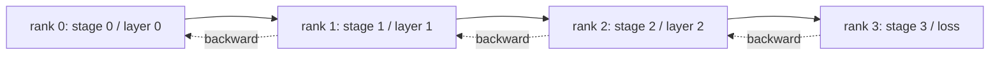

# Phân tích song song đường ống và bong bóng

> Sự song song tensor chia các matrix nhân qua hàng ngũ. Sự song song đường ống dẫn đường chia mô hình qua hàng ngũ, một giai đoạn cho mỗi hàng ngũ. Các microbatch chảy qua đường ống dẫn đường. Thời gian trống ở đầu và cuối là bong bóng; giảm thiểu nó là toàn bộ tàu.

**Type:** Build
**Languages:** Python
**Prerequisites:** Phase 19 Track C lessons 42-49
**Time:** ~90 min

## Mục tiêu học tập

- Chia mô hình theo trình tự thành N giai đoạn và mô phỏng một đường ống dẫn phía trước qua các hàng N.
- Bước M microbates thông qua đường ống bằng cách sử dụng lịch GPipe (chỉ đi trước, sau đó đi ngược) và tính toán phần hạt bong bóng.
- So sánh bong bóng với lịch trình 1F1B được sử dụng trong Megatron-LM và PipeDream.
- Đề xuất giai đoạn bảo vệ: tính toán bằng nhau cho mỗi giai đoạn quan trọng hơn là số lượng tham số bằng nhau cho mỗi giai đoạn.

## Vấn đề

Một mô hình 70B trong fp16 chỉ cần 140 GB các tham số. Không có GPU nào của người tiêu dùng có thể giữ được nó. ZeRO-3 cắt giảm các thông số qua các bậc nhưng vẫn cần mỗi bậc để thu thập toàn bộ lớp cho mỗi bước tiến, trả log ((N) hops cho mỗi lớp. Phương song đường ống dẫn đường đi một tuyến đường khác: cắt mô hình thành N giai đoạn và đặt một giai đoạn trên mỗi bậc. Trước của lớp 1 kết thúc ở cấp 0 và trao tensor kích hoạt cho cấp 1; cấp 1 chạy lớp 2 và bàn tay cho cấp 2; v.v. Lối chảy ngược lại. Khoảnh khắc giảm theo đường thẳng bởi vì mỗi bậc chỉ giữ một giai đoạn; tính toán là theo trình tự, đó là vấn đề bong bóng.

bong bóng là thời gian trống rỗng ở đầu đường ống dẫn (ngợi đợi microbatch đầu tiên đến giai đoạn cuối cùng) và ở cuối (ngợi đợi microbatch cuối cùng thoát ra trở lại). Với các microbatches M và các giai đoạn N, tỷ lệ bong bóng mỗi giai đoạn là (N-1) /(M+N-1). Ở M=8, N=4 là 27%. Ở M=64, N=4 nó là 4,5%. bong bóng sẽ thu hẹp khi bạn có nhiều microbatch mỗi bước, có nghĩa là kích thước nhỏ mỗi microbatch, đó là sự hạn chế thúc đẩy thiết kế microbatch.

## Khái niệm



### Chương trình GPipe

Đấp ống dẫn phía trước với tất cả các microbates M trước khi bắt đầu bất kỳ trở lại; sau đó thoát nước trở lại ngược lại. Các hoạt động từ mỗi microbatch phải được giữ cho đến khi nó trở lại, để bộ nhớ phát triển theo đường thẳng với M. Trước đi phải có các chu kỳ M+N-1, ngược lại phải có một chu kỳ M+N-1. Công việc hữu ích mỗi giai đoạn là 2M chu kỳ; mỗi giai đoạn bong bóng là 2 ((N-1) chu kỳ. Phân tích bong bóng là (N-1) / ((M+N-1) khi mỗi bước về phía trước và ngược mất một đơn vị thời gian. Chọn M lớn hơn N ẩn được bong bóng.

### Chương trình 1F1B

Interleave: ngay khi microbatch đi trước đạt đến giai đoạn cuối cùng, bắt đầu ngược lại và để nó chảy lại. Chương trình thay đổi một bước đi trước và một bước trở lại mỗi giai đoạn. Bubble vẫn là N-1 nhưng bộ nhớ kích hoạt được giới hạn bởi độ sâu đường ống, không phải số microbatch. Các đường ống sản xuất sử dụng 1F1B (Megatron, PipeDream). Bài học thực hiện GPipe trước tiên vì nó đơn giản hơn, và 1F1B như một bài tập.

### Tại sao tính toán bằng nhau cho mỗi giai đoạn quan trọng

Nếu giai đoạn 0 mất 50 ms và giai đoạn 1 mất 100 ms, mỗi chu kỳ được khóa vào giai đoạn 1. Các giai đoạn khác không hoạt động 50 ms mỗi chu kỳ chờ đợi giai đoạn 1 được phát hành. Số lượng tham số tương đương là trục sai: tính toán của một biến thể bị chi phối bởi sự chú ý cộng với MLP mỗi lớp, và các lớp nhúng có nhiều tham số nhưng ít tính toán. Việc gán giai đoạn nên bằng FLOP mỗi giai đoạn, chứ không phải trọng lượng mỗi giai đoạn.

### Microbatch vs batch

Một đường ống chạy các microbath M kích thước B mỗi. kích thước lô hiệu quả là M*B. Độ nghiêng ở cuối một bước đường ống là độ nghiêng trên các ví dụ M*B kết hợp. Phần bong bóng phụ thuộc vào M; người tối ưu hóa thấy M*B. Định chỉnh M có nghĩa là giao dịch bong bóng (hấp hơn với M cao) với bộ nhớ mỗi microbath (thức nhớ kích hoạt cao hơn với M cao cho GPipe).

```figure
cd-pipeline-bubble
```

## Hãy xây dựng nó

`code/main.py`thực hiện:

- `PipelineStage`: một nhỏ `nn.Module`có các tham số của một giai đoạn và phơi bày `forward(activation)`- Tôi không biết.
- `Pipeline(stages, num_microbatches)`: dàn xếp lịch trình GPipe trên các giai đoạn mô phỏng bằng cách sử dụng đồng hồ tường mô phỏng cho mỗi giai đoạn.
- `bubble_fraction(num_stages, num_microbatches)`: hình thức đóng (N-1) / M+N-1).
- Một bản demo 4 giai đoạn in dấu vết mỗi microbatch và phân tích bong bóng được đo.

Đi đi.

```bash
python3 code/main.py
```

Kết quả: một biểu đồ Gantt từng giai đoạn và tỷ lệ phần trăm bong bóng so với dự đoán hình thức đóng.

## Các mô hình sản xuất trong tự nhiên

Ba mô hình làm cứng đường ống ngang đủ để vận chuyển.

**Activation checkpointing pairs with pipeline.**Với M microbatches trên chuyến bay trên GPipe, bộ nhớ kích hoạt là M nhân một microbatch.

**Stage balance is measured, not assumed.**Các nhóm sản xuất chạy một thông qua hồ sơ đo lường tính toán thực tế mỗi lớp (FLOPs và đồng hồ tường) trên phần cứng mục tiêu, sau đó phân vùng theo đo đó.`--num-layers-per-stage`cờ chấp nhận một danh sách để cho phép đếm các lớp không đồng đều khi các giai đoạn có chi phí mỗi lớp khác nhau.

**Send-recv schedule must avoid deadlock.**Một đường ống dẫn có mỗi giai đoạn gửi trước khi nhận được ổ cắm trên dây. Phác thảo tiêu chuẩn là để giao lưu: giai đoạn xếp hạng bằng nhau gửi trước sau đó recv, giai đoạn xếp hạng lẻ recv trước sau đó gửi. Các lịch trình bài học xếp hạng rõ ràng để mô hình được nhìn thấy.

## Sử dụng nó

Các mô hình sản xuất:

- **Megatron-LM.**Các tham chiếu cho đường ống song song trên quy mô. sử dụng 1F1B và hỗ trợ tensor + đường ống + dữ liệu song song kết.
- **DeepSpeed Pipeline.**Thép nối với ZeRO; đường ống ZeRO-1 + là một kết hợp phổ biến cho các mô hình mở lớn nhất.
- **PyTorch Pipe.**Lớp lưng đường ống PyTorch, được xây dựng trên `torch.distributed.pipeline.sync.Pipe`- Tôi không biết.

## Chuyển nó

Bài học 80 lưu trữ các đoạn tham số từng giai đoạn trong điểm kiểm soát bị chia nhỏ. Bài học 81 tạo DDP + ZeRO + đường ống trên bản demo đầu đến cuối (trong tinh thần; bản demo giữ đường ống được mô phỏng cho thời gian chạy).

## Các bài tập

1. Thực hiện 1F1B và xác minh các hạt bong bóng phù hợp với GPipe nhưng bộ nhớ kích hoạt bị giới hạn.
2. Tạo hồ sơ thời gian thực mỗi giai đoạn trên mô hình sâu hơn và cân bằng lại các giai đoạn bằng đồng hồ tường được đo.
3. Thêm sự tích lũy gradient trên các microbatch đường ống và kiểm tra gradient bằng gradient của tương đương toàn bộ batch về phía trước.
4. Kết hợp đường ống với kiểm tra kích hoạt và đo lường sự sụt giảm bộ nhớ so với chi phí tính toán.
5. Kết hợp đường ống với DDP (mỗi cấp độ đường ống được sao chép trên một nhóm song song dữ liệu) và lý luận thông qua lịch 2D.

## Các điều khoản chính

| Term | What people say | What it actually means |
|------|----------------|------------------------|
| Pipeline | "Model parallel along depth" | One stage per rank, activations flow stage to stage |
| Bubble | "Pipeline idle time" | (N-1) steps at start + end where some stages have no work |
| Microbatch | "Slice of the batch" | One forward/backward unit; bubble shrinks as M grows |
| GPipe | "Fill then drain" | All M forwards before any backward; high activation memory |
| 1F1B | "Interleaved schedule" | One forward one backward per stage; bounded activation memory |

## Đọc thêm

- [Huang et al, GPipe: Efficient Training of Giant Neural Networks](https://arxiv.org/abs/1811.06965)
- [Narayanan et al, PipeDream: Generalized Pipeline Parallelism for DNN Training](https://arxiv.org/abs/1806.03377)
- [Megatron-LM pipeline parallel docs](https://github.com/NVIDIA/Megatron-LM)
- Giai đoạn 19 Bài học 76 - các nguyên tắc gửi/tháo lại lịch sử sử dụng
- Giai đoạn 19 Bài học 78 - ZeRO là thẳng thắn với đường ống và thường được kết hợp
