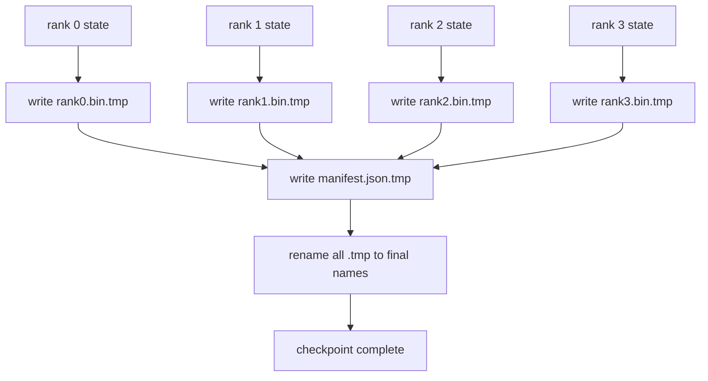

# Địa điểm kiểm soát và hồ sơ sơ hạt nhân

> Một công việc đào tạo thông số 70B bị tạm dừng bởi một sự thất bại của nút mỗi vài giờ. Khung điểm kiểm soát sẽ quyết định liệu bạn có mất 30 phút hay 30 giờ. Một điểm kiểm soát bị phân mảnh viết từng phân mảnh của mỗi cấp bậc song song và ghi lại quyền sở hữu trong một bản ghi. Thử nghiệm tải các mảnh từng cấp bậc từ hồ sơ của riêng mình, tái tạo trạng thái trên cùng một kích thước thế giới, và các bước tối ưu hơn như thể không có gì xảy ra. Atomic writing giữ cho một điểm kiểm soát bán hoàn thành khỏi bị nhiễm độc vào hồ sơ tiếp theo.

**Type:** Build
**Languages:** Python
**Prerequisites:** Phase 19 Track C lessons 42-49
**Time:** ~90 min

## Mục tiêu học tập

- Hãy lưu một điểm kiểm soát nhiều cấp bậc như một tập tin phân mảnh mỗi cấp bậc cộng với một biểu đồ ghi lại thứ hạng nào sở hữu cái gì.
- Sử dụng mô hình viết nguyên tử (tập vào một con đường tạm thời sau đó đổi tên) để một sự cố giữa viết không bao giờ tạo ra một điểm kiểm tra bán kết thúc.
- Thử tiếp từ biểu hiện, xác minh trạng thái bằng bằng byte cho cả hai tham số fp16 và trạng thái tối ưu ZeRO trên mỗi cấp bậc.
- Bảo vệ sơ đồ hiển thị chống lại ba chế độ thất bại: thay đổi kích thước thế giới, số lượng mảnh vỡ không phù hợp và viết một phần.

## Vấn đề

Một điểm kiểm soát vanilla đọc tất cả các tham số và trạng thái tối ưu hóa vào hạng 0, thu thập, và viết một tập tin duy nhất. Đối với mô hình 70B là 1,1 TB của trạng thái thông qua cổng mạng của một cấp bậc. Những người viết chặn mọi cấp bậc khác bởi vì họ đang chờ đợi sự tập hợp. Độ băng thông IO là liên kết mạng chậm nhất của GPU đơn lẻ, không phải tổng cộng. Trong một cluster thực tế, bước tập hợp và viết có thể mất nhiều thời gian hơn giờ đào tạo trước đó, có nghĩa là việc làm sẽ được đưa ra ít hơn một điểm kiểm soát mỗi ngày đào tạo.

Các điểm kiểm soát bị chia cắt làm đảo ngược mô hình: mỗi cấp bậc viết một mảnh riêng của mình vào tập tin riêng của mình song song. Các hồ sơ rõ ràng về vị trí sở hữu của mảnh vỡ nào để tiếp tục có thể đưa mỗi mảnh vỡ trở lại nơi nó đến. Tổng cộng viết bandwidth scale với cluster. Một điểm kiểm tra 1 TB mất 4 giờ để đi qua một hàng, mất 4 phút để đi qua 64 hàng. Thêm vào đó, bản biểu diễn cung cấp cho bạn một hợp đồng cho các sơ yếu lý lịch không tương thích: thay đổi kích thước thế giới có thể được phát hiện, viết một phần có thể được phát hiện, và con đường tải có thể thất bại lớn hơn là im lặng bằng cách sử dụng dữ liệu lỗi thời.

## Khái niệm



### Chế hoạch biểu hiện

```json
{
  "world_size": 4,
  "step": 1234,
  "wall_clock_seconds": 4521,
  "shards": [
    {"rank": 0, "path": "rank0.bin", "sha256": "...", "param_shard_offset": 0, "param_shard_numel": 65536},
    {"rank": 1, "path": "rank1.bin", "sha256": "...", "param_shard_offset": 65536, "param_shard_numel": 65536}
  ],
  "schema_version": 1
}
```

Ba cánh đồng có thể mang tải.`world_size`làm cho một hồ sơ về một kích thước khác lớn lớn thất bại lớn hơn là lặng lẽ tham nhũng. `sha256`mỗi mảnh bắt được phần hoặc bị hư hỏng viết. `param_shard_offset`và `param_shard_numel`cho mỗi mảnh để bộ tải tái tạo tensor tham số phẳng ở vị trí chính xác.

### Viết nguyên tử

Mô hình tiêu chuẩn: viết mỗi mảnh thành `<name>.tmp`, viết bản báo cáo cho `manifest.json.tmp`, fsync mỗi, sau đó đổi tên. POSIX đổi tên trong cùng một hệ thống tệp là nguyên tử; hoặc tệp mới hoàn toàn hiện diện hoặc cũ là. Một vụ tai nạn trước khi đổi tên cuối cùng rời khỏi điểm kiểm soát trước đó như là một cuộc sống. Không viết nguyên tử một vụ tai nạn có thể để lại một mảnh vỡ một phần với một biểu hiện hiện hiện đang chỉ ra nó, và tải làm hỏng trạng thái tối ưu hóa trên resume.

### Ba chế độ thất bại mà schema phải bảo vệ chống lại

| Failure | Symptom | Defence |
|---------|---------|---------|
| World-size change | resume on N=8 with manifest from N=4 | world_size mismatch in manifest, fail loudly |
| Shard count mismatch | resume sees fewer rank*.bin files than shards in manifest | enumerate shards, verify every one exists |
| Partial write | shard file truncated mid-flush | sha256 verification on load |

Mỗi phòng thủ từ chối tải trọng xấu sớm; thay thế là tham nhũng im lặng xuất hiện 100 bước sau khi mất đi cho NaN.

### Tại sao mỗi file cấp, không phải một file lớn

Đồng thời viết cho một tệp thông qua `O_APPEND`làm việc trên POSIX cho các bản ghi liên kết byte, nhưng trong thực tế các bộ trục trong một shard trải dài các khu vực kích thước MB và khóa chiếm ưu thế. Các tệp theo cấp không có tranh chấp và có lợi từ việc dẻo dẻo khi hệ thống tệp cơ bản song song (Lustre, GPFS).

```figure
ci-sharded-checkpoint
```

## Hãy xây dựng nó

`code/main.py`thực hiện:

- `ShardManifest`Dataclass với schema trên cộng với `to_json`- Không.`from_json`- Tôi không biết.
- `save_sharded(state_dict_per_rank, dir, step)`viết trạng thái nhị phân của mỗi cấp bậc vào tập tin của riêng nó bằng cách sử dụng mô hình nguyên tử tạm thời sau đó đổi tên, sau đó viết biểu thức.
- `load_sharded(dir, expected_world_size)`đọc bản báo, xác minh sha256 của mỗi mảnh, và trả lại các lệnh trạng thái theo cấp.
- Một thử nghiệm đi về và đi: xây dựng trạng thái mỗi cấp bậc, lưu, tải, khẳng định bằng byte.

Đi đi.

```bash
python3 code/main.py
```

Khả năng: 4 file shard cộng với biểu đồ được viết, sau đó tải lại bằng bằng chứng bằng byte.

## Các mô hình sản xuất trong tự nhiên

Ba mô hình làm cứng điểm kiểm soát đủ để vận chuyển.

**Async write.**Các đống sản xuất phát hành điểm kiểm tra viết trên một chuỗi hoặc quá trình riêng biệt để đào tạo tiếp tục.`async_io`Flag làm chính xác điều này. Bài học giữ cho viết đồng bộ để các bước được nhìn thấy.

**Local fast disk first, then async upload.**Viết đến NVMe địa phương (quá) sau đó tải lên async đến S3 hoặc GCS. Mô hình hai cấp giữ điểm kiểm soát trong cụm nhanh chóng để tiếp tục trong khi gửi một bản sao bền ngoài cụm cho lưu trữ. Bản biểu diễn mang theo con đường địa phương; bản biểu diễn tải lên mang theo con đường từ xa.

**Rotation matters.**Các hoạt động sản xuất giữ các điểm kiểm tra K cuối cùng (thường là 3-5) và xoay các điểm kiểm tra lâu đời nhất. Nếu không xoay, đĩa sẽ điền vào giữa và điểm kiểm tra tiếp theo sẽ thất bại.

## Sử dụng nó

Các mô hình sản xuất:

- **DeepSpeed checkpointing.** `deepspeed.save_checkpoint(tag=step)`viết các tệp theo cấp và một `latest`tập tin chỉ ra thẻ hoạt động.
- **PyTorch FSDP checkpointing.** `torch.distributed.checkpoint`tiết kiệm trạng thái mảnh vỡ với một `Planner`đó quyết định bố cục cấp.
- **NeMo.**Thập DeepSpeed và FSDP với đồng phục `save_to_checkpoint`API thêm metadata.

## Chuyển nó

Bài học 81 lưu lại một điểm kiểm soát từng mảnh của DDP+ZeRO chạy từ đầu đến cuối và tải lại nó trên cùng một kích thước thế giới để chứng minh hợp đồng tiếp tục tồn tại.

## Các bài tập

1. Thêm async write: bắt đầu lưu trong một thread và để đào tạo tiếp tục. Bấm lưu tiếp theo cho đến khi kết thúc trước đó.
2. Thêm một `last_5_steps`quay: giữ 5 điểm kiểm soát gần đây nhất, xóa lỗi thời nhất trước khi lưu một cái mới.
3. Thêm một đường xác minh nhanh chỉ có CRC cho việc tái tải vòng trong (cuộn quay một điểm kiểm soát trở thành điểm kiểm soát mới hoạt động mà không có sha256 đầy đủ).
4. Thêm một tải trọng kích thước xuyên thế giới: tái cân bằng mảnh từ N = 4 đến N = 8 bằng cách đọc biểu hiện, kết nối và chia lại.
5. Thêm một upload vào một S3 giả (một thư mục thứ hai) và viết biểu lộ upload. Bảo vệ chính sách lưu trữ hai cấp.

## Các điều khoản chính

| Term | What people say | What it actually means |
|------|----------------|------------------------|
| Sharded checkpoint | "Per-rank save" | Each rank writes its own shard file in parallel |
| Manifest | "Index" | JSON file recording shard paths, offsets, and sha256 |
| Atomic write | "tmp then rename" | Write to .tmp then POSIX rename so a crash leaves the previous file live |
| Partial write | "Truncated shard" | A crash during write produces a corrupt shard; sha256 catches it |
| Rotation | "Keep last K" | Delete oldest checkpoint before writing new one to bound disk usage |

## Đọc thêm

- [DeepSpeed checkpointing](https://deepspeed.readthedocs.io/en/latest/model-checkpointing.html)
- [PyTorch torch.distributed.checkpoint](https://pytorch.org/docs/stable/distributed.checkpoint.html)
- [POSIX rename atomicity](https://pubs.opengroup.org/onlinepubs/9699919799/functions/rename.html)
- Giai đoạn 19 Bài học 78 - ZeRO nói rằng điểm kiểm soát này được hình thành để tiết kiệm
- Giai đoạn 19 Bài học 81 - trình diễn kết thúc đến kết thúc đi lại và đi lại trạng thái được lưu
