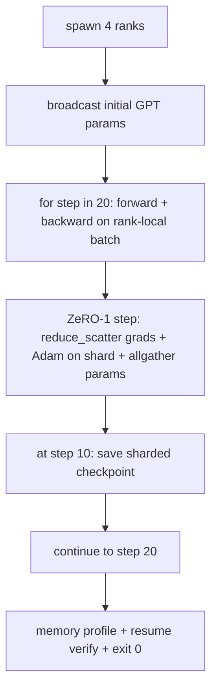

# Việc đào tạo phân tán từ đầu đến cuối

> Bài học 76 đến 80 mỗi lần xây dựng một mảnh. Đây là sự lắp ráp: một GPT nhỏ được đào tạo qua 4 hàng ngũ mô phỏng với DDP cho đồng bộ sáp nhập độ, ZeRO-1 cho phân mảnh tối ưu hóa, và một điểm kiểm soát phân mảnh tại dấu nửa đường.

**Type:** Build
**Languages:** Python
**Prerequisites:** Phase 19 Track C lessons 42-49
**Time:** ~90 min

## Mục tiêu học tập

- Kết hợp DDP (câu 77) cộng với ZeRO-1 (câu 78) cộng với các điểm kiểm soát phân mảnh (câu 80) thành một vòng lặp đào tạo.
- Trén mô hình ngôn ngữ biến đổi 2 lớp trên một cơ thể tổng hợp nhỏ trong 20 bước qua 4 hàng ngũ mô phỏng.
- Bác in một bảng mất tích mỗi bước, một hồ sơ bộ nhớ mỗi cấp bậc, và một biểu đồ kiểm soát điểm tiếp tục bằng byte trên cùng một kích thước thế giới.
- Bảo vệ thành phần: mỗi tác phẩm có thể kiểm tra độc lập trong các bài học trước đó và bài học này chứng minh họ đã sáng tác.

## Vấn đề

Một tảng đá là bằng chứng cho thấy các mảnh vỡ phù hợp với nhau. Bài học 76 tập thể thực hiện. Bài học 77 đã đưa chúng vào DDP. Bài học 78 trạng thái tối ưu hóa được chia nhỏ với reduce_scatter. Bài học 79 phân tích đường ống. Bài học 80 đã cứu được một trạm kiểm soát bị phá vỡ. Mỗi bài học đều có thử nghiệm riêng của nó. Một cuộc tập luyện thực sự sử dụng tất cả các nguyên thủy cùng một lúc; nếu thành phần sai, mất mát khác nhau, điểm kiểm soát từ chối tiếp tục, hoặc bộ nhớ mỗi cấp độ tăng lên khi nó nên thu hẹp.

Bài học này chạy trình diễn từ đầu đến cuối và xác minh bốn không biến: (a) mất mát giảm một cách đơn giản trong 20 bước trong tiếng ồn nổi, (b) mỗi bậc giữ nguyên chuẩn tham số tương tự ở mỗi bước, (c) bộ nhớ tối ưu hóa mỗi bậc bằng với công thức ZeRO-1 12P / N bytes, và (d) điểm kiểm soát ở bước 10 tải lại bằng byte-tương đương khi khởi động lại. Demo tự kết thúc: 20 bước, chỉ huy đơn, thoát 0

## Khái niệm



### Mini GPT

Mô hình này là nhỏ theo mục đích: 2 khối biến thể, nhúng dim 32, 4 đầu chú ý, từ ngữ 64, chiều dài chuỗi 16, lô 4. Một vài ngàn tham số. Đủ lớn để thực hiện mọi quyết định dây (trong tâm nhiều đầu chạy theo con đường che giấu tiêu chuẩn; LayerNorm có trọng lượng để đồng bộ hóa; đầu LM là một dự án tuyến tính riêng biệt trở lại từ ngữ). Đủ nhỏ để 20 bước trên 4 CPU xếp hạng hoàn thành trong vài giây.

### Quy tắc thành phần

| Lesson piece | What it owns | What it leaves to the loop |
|--------------|--------------|----------------------------|
| DDP broadcast | Initial parameter sync | One call at construct time |
| ZeRO-1 step | Gradient sync, master copy update, parameter broadcast | One call per step replacing optimiser.step |
| Sharded checkpoint | Persist per-rank state, manifest with sha256 | Called on rank 0 with state collected via allgather |
| Training loop | Forward, backward, loss logging | Calls the three above in order |

Các mô-đun ZeRO và điểm kiểm soát phơi bày các giao diện hẹp mà vòng lặp tạo ra.

### Tại sao một GPT nhỏ hơn là một MLP

MLP từ bài học 77 là đủ để xác minh sự đồng bộ hóa gradient. Một GPT nhỏ thêm ba thứ: một đầu LM riêng biệt trên từ ngữ (trong bài học này, không được gắn để rõ ràng; GPT đầy đủ thường gắn đầu với việc nhúng mã thông báo), softmax + cross-entropy như mất mát (các trường hợp cạnh số hơn MSE), và một phía trước không đối xứng (nhúng rồi chú ý sau đó là MLP mỗi lớp). Nhắm vào một MLP cho đá cuối sẽ che giấu liệu sự kết hợp có xử lý LayerNorm hay hình dạng grad của lớp nhúng đúng không.

### tự hủy nghĩa là thoát 0

Loop chạy 20 bước và ra khỏi.`while True`Một miếng đá cuối bạn có thể để lại chạy không có sự giám sát và tìm thấy một nhật ký hoàn chỉnh khi nó hoàn thành là một miếng đá cuối chứng minh hệ thống được cáp đúng. Nếu bất kỳ mảnh nào đóng cửa demo không bao giờ trở lại và thiết bị thử nghiệm bắt nó.

```figure
ci-distributed-assembly
```

## Hãy xây dựng nó

`code/main.py`thực hiện:

- `MiniGPT`: 2 lớp biến đổi với tự chú ý che đậy và đầu LM riêng biệt.
- `make_corpus(seed, total_tokens)`: dữ liệu dự đoán định nghĩa của token tiếp theo.
- `_train_worker`: được tạo ra theo cấp bậc; phát sóng init params, chạy vòng lặp, gọi ZeRO bước, viết các điểm kiểm soát từng mảnh ở bước 10.
- `verify_resume`: sau khi chạy chính, tải lại điểm kiểm soát bước 10 trong quá trình và khẳng định các phân đoạn chủ được lưu giữ phù hợp với ảnh chụp nhanh trong bộ nhớ byte-for-byte.
- `main`: dàn xếp toàn bộ bản demo, in bảng mất mát, hồ sơ bộ nhớ và kết quả xác minh.

Đi đi.

```bash
python3 code/main.py
```

Kết quả: một bảng mất mát 20 hàng, một hồ sơ bộ nhớ 4 hàng cho mỗi cấp bậc, một biểu đồ kiểm tra điểm, và một dòng "Hãy tiếp tục xác minh" về thành công.

## Các mô hình sản xuất trong tự nhiên

Ba mô hình hoàn thành thành phần cho các chạy thực.

**Checkpoint every K minutes, not every K steps.**Thời gian bước thay đổi theo chiều dài của các bộ và số lượng microbatch. Một chuỗi kiểm tra thời gian 10 phút bắt được tính toán tương tự bất kể kích thước của mô hình. Bài học sử dụng dựa trên bước để đơn giản hóa; sản xuất sử dụng dựa trên đồng hồ tường.

**Detect divergence early.**Các hoạt động sản xuất thêm một bộ bảo vệ NaN sau khi quay trở lại và một bộ dò tăng lỗ; nếu lỗ nhảy hơn 2 lần trong một bước, lăn trở lại điểm kiểm soát trước đó thay vì để cho người tối ưu hóa tiến vào trạng thái suy thoái.

**Aggregate the memory profile across ranks.**Khoảnh khắc mỗi bậc khác nhau theo cấp độ trong các chạy thực (trang với giai đoạn đường ống lớn nhất có nhiều hoạt động hơn).

## Sử dụng nó

Các mô hình sản xuất:

- **DeepSpeed.**Kết hợp DDP + ZeRO + đường ống + kiểm tra kích hoạt dưới một cấu hình.
- **PyTorch FSDP.**Tương đương với người bản địa.`FullyShardedDataParallel`với `ShardingStrategy.SHARD_GRAD_OP`là ZeRO-2.
- **NeMo and Megatron-LM.**Thêm tensor song song cho các mô hình rất lớn; nếu không sự kết hợp là cùng một hình dạng.

## Chuyển nó

Các bài học 6 cùng nhau là hệ thống phân phối đào tạo phụ mà một nhóm thực sự sẽ xây dựng trước khi áp dụng DeepSpeed; sự trừu tượng đã được chứng minh chống lại độ nhạt và các chế độ thất bại đã được thực hiện.

## Các bài tập

1. Thêm một phân chia đồng đều tensor của đầu chú ý và xác minh sự mất mát phù hợp với đường cơ sở hạng nhất. Hai bậc: một nửa đầu mỗi bậc, tất cả giảm đầu ra chú ý.
2. Thêm sự tích lũy gradient trên 4 microbatch và chứng minh gradient bằng gradient của một lô lớn.
3. Thêm một đường dẫn từ bước 10 tiếp tục tập luyện đến bước 20 và tạo ra cùng một tổn thất cuối cùng như chạy ban đầu.
4. Thêm một số liệu xuất khẩu (sự mất mát, chuẩn cấp, thời gian bước) vào JSONL để chạy có thể được hình ảnh hóa sau khi thực tế.
5. Thêm một bảo vệ NaN quay trở lại điểm kiểm soát trước đó trên một đỉnh lỗ, và buộc một đỉnh với một nhân LR một bước để thực hiện việc quay trở lại.

## Các điều khoản chính

| Term | What people say | What it actually means |
|------|----------------|------------------------|
| End-to-end | "Wire it all up" | One run composes every piece, not a unit test per piece |
| Memory profile | "GB per rank" | Bytes held on each rank for params, grads, optimiser state |
| Resume contract | "Save and load" | Per-rank state byte-equal after a checkpoint round-trip |
| Self-terminating | "Bounded run" | Fixed step count, exit 0 on completion, no human in the loop |

## Đọc thêm

- [DeepSpeed end-to-end training tutorial](https://www.deepspeed.ai/getting-started/)
- [PyTorch FSDP advanced tutorial](https://pytorch.org/tutorials/intermediate/FSDP_advanced_tutorial.html)
- [Megatron-LM training script reference](https://github.com/NVIDIA/Megatron-LM)
- Giai đoạn 19 Bài học 76-80 - mỗi phần bài học này tạo nên
- Giai đoạn 17 - chuyển thành phần sang một cluster thực
