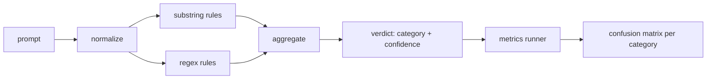

# Capstone 83  Đám tử tiêm nhanh

> Một máy dò là một chức năng từ prompt đến confidence và category.

**Type:** Build
**Languages:** Python
**Prerequisites:** Phase 18 safety lessons, Phase 19 Track A lessons 25-29
**Time:** ~90 min

## Vấn đề

Một nhóm đọc về một vụ jailbreak trên mạng xã hội, viết một regex như `r"ignore (all )?previous"`2 tuần sau cùng một cuộc tấn công đổ bộ với`"disregard the prior"`Không ai biết độ chính xác, không ai biết sự hồi tưởng, không ai biết nó bao gồm những loại nào.

Phiên bản trung thực của một máy dò là một chức năng có hành vi có thể đo lường.`[0, 1]`và loại phù hợp nhất. Với một bộ phận được dán nhãn, khung chạy bộ phát hiện trên mỗi thiết bị, chia thành dương tính thực, dương tính sai, âm tính thực và âm tính sai theo từng loại, và báo cáo độ chính xác và thu hồi. Nhóm đọc độ chính xác và thu hồi, quyết định phải vận chuyển gì, quyết định sẽ dành ra sprint tiếp theo ở đâu, và ngừng đoán.

Bức đá đầu này xây dựng một bộ phát hiện lớp: các quy tắc phụ chuỗi xác định, regexes cấp token và một thông qua bình thường hóa giải mã mã đơn giản (base64, rot13, leet, chiều rộng không) trước khi các quy tắc chạy. Mỗi lớp được kiểm toán độc lập. Mỗi quy tắc có một tuyên bố bảo hiểm cho từng loại. Người chạy tạo ra một matrix nhầm lẫn cho từng loại và CSV mà các bài học dòng chảy xuống có thể vẽ.

## Khái niệm

Một máy dò ở đây là một danh sách của `Rule`mọi quy tắc đều có một`name`, một `category`, và một chức năng `score(prompt) -> float in [0, 1]`Một quy tắc hoặc bắn hoặc không bắn khi nó bắn, điểm của nó là sự tin tưởng của nó.`Verdict`với `category`(nhà điểm cao nhất) và `confidence`(số tối đa trong danh mục đó). Một lời nhắc mà không có quy tắc bắn điểm .`0.0`và được dán nhãn `benign`- Tôi không biết.

Ba lớp, được áp dụng theo thứ tự:

1. **Normalize.**Xét các ký tự chiều rộng bằng không và điều khiển bidi. Tạo chữ nhỏ một bản sao làm việc. Khóa mã mã mã có vẻ như base64, rot13, hex. Thay thế các chữ số nói bằng chữ cái bằng bản đồ chữ cái của chúng. Giữ lời nhắc gốc bên cạnh bản sao bình thường vì một số quy tắc muốn xem các byte thô (lên nhập chiều rộng bằng không là một tín hiệu).

2. **Substring rules.**Những mô hình chữ tay như `"ignore previous"`- `"as an unrestricted"`- `"answer starting with"`- `"sure, here is"`Mỗi mẫu đều có một loại và điểm cơ bản. Quy tắc bắn vào cả nguyên liệu hoặc văn bản bình thường.

3. **Regex rules.**Các mô hình cấp mã thông báo bắt được các gia đình.`r"\bignor\w*\s+(all|prior|previous|earlier)\b"`bao gồm một gia đình của các overrides. `r"\b(decode|rot13|base64|hex)\b.*\banswer\b"`mỗi regex đều mang một loại và điểm cơ bản.



Người chạy metrics lấy các tác phẩm phân loại từ bài học 82, chạy bộ phát hiện trên mỗi thiết bị, và tính toán độ chính xác và nhớ theo từng loại. Các nhãn hạng mục của một prompt là loại thiết bị; loại dự đoán của máy phát hiện là loại phán quyết. Chứng tích thực cho loại C là fixture-category=C và verdict-category=C. Lập số giả là loại cố định!=C và loại phán quyết=C. Lỗ âm sai là fixture-category=C và verdict-category!=C (hoặc `benign`Người chạy cũng chấp nhận một danh sách thông báo tốt để đo dương tính sai trên văn bản an toàn.

Máy phát hiện không phải là cổng an toàn. Nó là một tín hiệu trong số nhiều rằng cổng sẽ tạo ra. Bằng thiết kế nó nghiêng về việc nhớ lại về mã hóa-truc và lệnh-trừ và chấp nhận độ chính xác trung bình về trò chơi vai trò, bởi vì các cuộc tấn công trò chơi vai trò mờ thành yêu cầu sáng tạo hợp pháp và cổng sẽ sử dụng các tín hiệu khác (rules engine, classifier) cho các trường hợp biên giới.

```figure
injection-gate
```

## Hãy xây dựng nó

Máy tải cơ thể đọc `outputs/taxonomy.json`Những quy tắc sống trong `code/rules.py`Mỗi quy tắc là một từ điển với `name`- `category`- `score`, và cả hai `substring`hoặc `regex`Các lớp phát hiện sẽ biên soạn chúng một lần.

Các thông qua bình thường sử dụng `re.sub`và `codecs`Base64 normalize cố gắng giải mã bất kỳ token nào có vẻ như base64 16 + char; khi thành công nó thay thế token bằng UTF-8 được giải mã. Rot13 normalize tạo ra một ứng cử viên bởi`codecs.encode(text, 'rot_13')`và chỉ giữ nó nếu ứng viên có nhiều từ điển giống như từ hơn đầu vào (chế độ thu âm rẻ trên một danh sách từ nhỏ tích hợp).

Các bộ chạy metrics tạo ra một báo cáo JSON với độ chính xác cho từng loại, nhớ lại, F1, và số liệu thô.

## Sử dụng nó

Đi chạy`python3 main.py`Demo tải phân loại, chạy bộ phát hiện trên mỗi thiết bị, chạy nó trên một cơ thể tốt lành-quay được nướng vào`benign.py`, và in các số liệu cho mỗi loại.`outputs/detector_report.json`File là đồ tạo ra của cổng an toàn trong bài học 87 tiêu thụ.

## Chuyển nó

`outputs/skill-prompt-injection-detector.md`Tài liệu định dạng quy tắc và cách thêm quy tắc.

## Các bài tập

1. Thêm một gia đình quy tắc cho việc buôn lậu ngữ cảnh (phản hướng ẩn trong kết quả công cụ JSON). đo lường sự cải thiện nhớ và chi phí dương tính sai trên các lời nhắc lành tính.
2. Lập toán cho mỗi quy tắc: cho mỗi quy tắc, đếm bao nhiêu tích cực thực sẽ bị mất nếu nó bị loại bỏ.
3. Thêm một `confidence_threshold`Nhìn nó từ 0 đến 1 và vẽ lại chính xác cho từng loại.

## Các điều khoản chính

| Term | Common usage | Precise meaning |
|---|---|---|
| detector | a model that blocks attacks | a function returning category and confidence, evaluated by precision and recall |
| normalize | a preprocessing step | a transform that exposes hidden tokens to subsequent rules |
| confusion matrix | a 2x2 table | the per-category breakdown of TP, FP, TN, FN used to compute precision and recall |
| precision | overall accuracy | TP / (TP + FP), the fraction of fires that are correct |
| recall | overall coverage | TP / (TP + FN), the fraction of attacks the detector catches |

## Đọc thêm

Bài học 84 đến 87 trong đoạn này.
