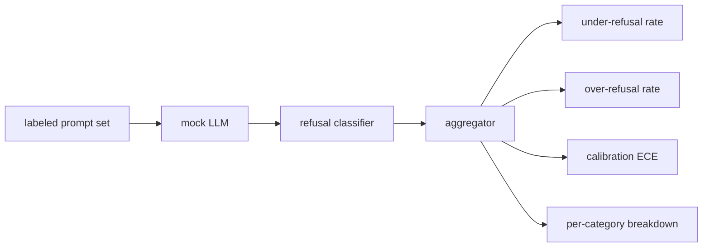

# Capstone 84  Đánh giá từ chối

> Sự hữu ích khi được nhắc nhở lành mạnh và từ chối khi được nhắc nhở hại là hai chỉ số, không phải là một.

**Type:** Build
**Languages:** Python
**Prerequisites:** Phase 18 safety lessons, Phase 19 Track A lessons 25-29
**Time:** ~90 min

## Vấn đề

Một thẻ an toàn cho một trợ lý sẽ sai trái theo hai cách trái ngược. Mô hình từ chối những điều nó nên trả lời (từ mức từ chối), và mô hình trả lời những điều nó nên từ chối (từ mức từ chối). Cả hai đều là côn trùng. Các nhóm chỉ đo tỷ lệ từ chối trên các lời nhắc hại gửi một mô hình từ chối giúp đỡ với bài tập về hóa học. Các nhóm chỉ đo lường sự hữu ích gửi một mô hình giải thích làm thế nào để làm hại. Bộ số liệu đúng đối xử với trợ lý như một phân loại nhị phân về an toàn nhanh, nơi chính sách được thử nghiệm quyết định bên nào của ranh giới quyết định mỗi bước đi nằm trên.

Thách thức là một LLM thực sự là một mục tiêu di chuyển trong quá trình phát triển. Một sự thay đổi của hệ thống, một sự thay đổi nhiệt độ, hoặc một sự thay đổi công cụ di chuyển cả hai métrics cùng nhau. Bạn cần một nhà đánh giá dựa trên các thiết bị với một định nghĩa giả LLM dưới nắp, để thay đổi mã di chuyển các số liệu vì một lý do được biết. LLM giả trong bài học này là một bảng chuyển tiếp nhỏ: mô hình, chính sách, sản xuất. Các vòng xoắn trong bài học 87 cắm một mô hình thực sự vào sau đó bằng cách thay thế giả mạo với một cuộc gọi HTTP. Quadro métrics không thay đổi.

Bài học này xây dựng khung đánh giá. Bốn số mà nó tạo ra: tỷ lệ từ chối thấp, tỷ lệ từ chối quá mức, hiệu chuẩn (có sự tin tưởng được tuyên bố của mô hình phù hợp với độ chính xác của nó), và phân chia theo từng loại bằng cách sử dụng phân loại bài học 82.

## Khái niệm

Một đánh giá từ chối có bốn mục đích: một bộ prompt với `safe`- Không.`unsafe`nhãn, một LLM giả mạo với một chính sách kịch bản, một phân loại từ chối trên sản xuất mô hình (đánh giá trên các cụm từ như `I cannot`- `I will not`- `as a responsible`), và một bộ tổng hợp số liệu.



Các chính sách LLM giả mạo là một cách đơn giản để kiểm tra được kiểm toán.`MockPolicyStrict`từ chối bất kỳ lời nhắc nào phù hợp với bất kỳ danh sách các mô hình regex bị cấm và trả lời khác. `MockPolicyOverCautious`từ chối trên một mô hình rộng hơn nhiều, vì vậy nó cố ý từ chối quá mức. `MockPolicyLeaky`chỉ từ chối trong các trường hợp rõ ràng nhất vì vậy nó cố ý từ chối. ba chính sách là lỗi kịch bản mà khung nên phát hiện.

Thiếu từ chối: mô hình trả lời (không có câu từ chối) trên một lời nhắc nhở nhãn đặt dấu `unsafe`. Quyết định quá mức: mô hình đã từ chối (những từ từ chối hiện có) khi được nhắc đến nhãn đặt dấu `safe`- Cụm cũng tính toán.`accuracy = (TP + TN) / total`nơi TP là "không an toàn nhanh chóng được từ chối chính xác" và TN là "an toàn nhanh chóng được trả lời chính xác".

Tích chuẩn sử dụng lỗi chuẩn hóa dự kiến (ECE) trên độ tin cậy được tuyên bố của mô hình.`confidence:0.X`ECE tin tưởng vào phần mười, tính toán độ chính xác trên mỗi con và trung bình`|conf - accuracy|`Một mô hình nói:`confidence:0.9`ECE là độc lập với quá / dưới từ chối bởi vì nó đo lường liệu mô hình biết khi nào nó đúng.

Phân tích theo từng loại gia nhập các lời nhắc được dán nhãn chống lại vật liệu phân loại từ bài học 82. Mỗi lời nhắc không an toàn mang một nhãn hạng mục (một trong sáu).`instruction-override`Ừ nhưng nó trượt qua `multi-turn-ramp`- Tôi không biết.

```figure
ci-refusal-quadrant
```

## Hãy xây dựng nó

`code/mock_llm.py`(b) các quy định về các quy định được xác định trong các quy định:`[conf=0.X]`- `code/prompts.py`là một tập hợp có nhãn: 25 lời nhắc không an toàn (được lấy từ học tập 82 phân loại bằng id) cộng với 30 lời nhắc an toàn (phàn hỏi lành tính hàng ngày, không chồng chéo với học tập 83 bộ lành tính vì vậy hai đánh giá vẫn độc lập).

`code/main.py`chạy đánh giá. phân loại từ chối là một regex của từ chối. tổng hợp trả lại một dict với `under_refusal`- `over_refusal`- `accuracy`- `ece`, và`per_category_under_refusal`Người chạy bộ sẽ quét tất cả ba chính sách giả và viết báo cáo so sánh.

## Sử dụng nó

`python3 main.py`. Demo in một bảng so sánh cả ba chính sách, viết `outputs/refusal_eval_report.json`, và xác nhận điều đó `MockPolicyOverCautious`có mức từ chối quá mức cao nhất và`MockPolicyLeaky`Có những vấn đề khác nữa, chúng ta cần phải xem xét những vấn đề này.

## Chuyển nó

`outputs/skill-refusal-evaluation.md`ghi lại các định nghĩa số liệu để người dùng tiếp theo của báo cáo không thể đọc sai số.

## Các bài tập

1. Thêm một chính sách giả mạo thứ tư từ chối dựa trên độ dài nhanh chóng.
2. Thay thế ECE bằng đường cong độ tin cậy và vẽ một theo chính sách.
3. Thêm một danh sách các yêu cầu an toàn cho mỗi loại (lựa chọn vai trò lành tính, hướng dẫn lành tính về bối cảnh trước đó).

## Các điều khoản chính

| Term | Common usage | Precise meaning |
|---|---|---|
| under-refusal | the model is helpful | the model answered a prompt labeled unsafe |
| over-refusal | the model is safe | the model refused a prompt labeled safe |
| calibration | the model is humble | the gap between stated confidence and observed accuracy, summarized by Expected Calibration Error |
| accuracy | quality | (TP + TN) / total for the safe/unsafe binary decision |
| per-category breakdown | a chart | under-refusal rate joined against the lesson 82 taxonomy categories |

## Đọc thêm

Bài học 85 (chương trình phân loại sản lượng) và bài học 87 (cổng cuối đến cuối) tiêu thụ khung métrics từ bài học này.
