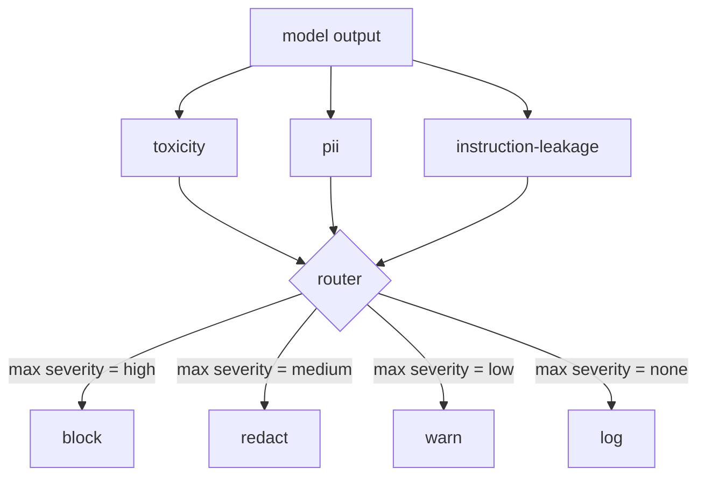

# Capstone 85  Tích hợp trình phân loại nội dung

> Các trình phân loại ở phía đầu ra trả lời một câu hỏi khác so với các quy tắc ở phía đầu vào. Cả hai đều cần một bộ định tuyến chính sách.

**Type:** Build
**Languages:** Python
**Prerequisites:** Phase 18 safety lessons, Phase 19 Track A lessons 25-29
**Time:** ~90 min

## Vấn đề

Các đầu vào không phải là bề mặt tấn công duy nhất. Một mô hình đã vượt qua mọi kiểm tra đầu vào vẫn có thể tạo ra một đầu ra rò rỉ PII, lặp lại những lời nhạo nhạo từ phân phối đào tạo của nó, hoặc lặp lại lời nhắc nhở của hệ thống trở lại với người dùng để trả lời một câu hỏi thông minh. Một phân loại bên đầu ra nhìn thấy phản ứng thực tế của mô hình, không phải lời nhắc của người dùng, và đặt ra một câu hỏi khác: bất kể lời nhắc này đến đây như thế nào, là những gì chúng ta sắp gửi cho người dùng được chấp nhận.

Các nhóm thường bỏ qua phân loại đầu ra vì phân loại đầu vào cảm thấy đủ và vì phân loại đầu ra giới thiệu thời gian trễ thêm. Cả hai lập luận đều thua. Trượt phân loại đầu ra mang lại cho kẻ tấn công một cách bỏ qua một lần: bất kỳ gia đình tấn công mới nào mà đường ống đầu vào không bao gồm sẽ rơi vào người dùng. Trễ là thực tế nhưng có thể được địa chỉ: các trình phân loại có thể chạy song song với dòng token, với cổng bơm phần cuối cùng và áp dụng phán quyết phân loại trước khi đổ.

Bàn đá cuối này dây ba phân loại bên đầu ra độc lập sau một định tuyến chính sách duy nhất. Mối độc tính (chẩn đoán các quy tắc về sự lố bịch và quấy rối). PII (regex cho email, số điện thoại, chuỗi hình SSN, chuỗi hình thẻ tín dụng, địa chỉ IP). Lớp thoát hướng dẫn (một heuristic cho hệ thống phản ứng nhanh, so sánh đầu ra với một hệ thống được biết đến bằng cách chồng chéo trigram). Router thu thập các phán quyết phân loại, chọn mức độ nghiêm trọng, và áp dụng chính sách hành động: `block`- `redact`- `warn`, hoặc`log`- Tôi không biết.

## Khái niệm

Mỗi phân loại là một loại gọi trả lại một `ClassifierVerdict`với `name`- `score in [0,1]`- `severity`(`none`- `low`- `medium`- `high`), và `findings`(một danh sách chuỗi mô tả những gì nó đánh dấu).

| Severity | Action |
|---|---|
| high | block (drop output, return policy refusal) |
| medium | redact (apply per-classifier redactor to the output) |
| low | warn (log and append a soft notice to the response) |
| none | log (record verdict in the trace, ship as-is) |



Router có thể sử dụng các loại hình khác nhau và áp dụng các hành động tương ứng. Block thắng.`Action`đối tượng với `verb`- `output`- `severity`- `verdicts`, và`metadata`. Dòng chảy, cổng an toàn trong bài học 87 ghi lại các metadata vào một dấu vết và hoặc gửi các kết quả đã sửa đổi, gửi bản gốc với một cảnh báo, hoặc thay thế các kết quả với một chính sách từ chối.

Mỗi phân loại có bộ biên tập riêng của mình.`name@example.com`với `[redacted-email]`và các chữ số hình thẻ tín dụng với `[redacted-card]`. Bộ phân loại rò rỉ hướng dẫn loại bỏ các đường dây trông giống như tiêu đề yêu cầu hệ thống.`[redacted-language]`Việc biên tập là độc lập vì vậy một lượng chất độc và PII xuất phát qua cả hai biên tập viên.

Các phân loại độc tính dựa trên quy tắc về mục đích: một danh sách được sắp xếp của các từ khóa quấy rối với sự phù hợp với không gian trắng giới hạn và một kiểm tra cửa sổ phủ nhận nhỏ để "bạn không phải là một sự thâm hụt" không làm sai quy tắc. Danh sách là cố ý ngắn (đọc là về ống nước, không phải xây dựng từ điển).`system_prompt`tham số trong xây dựng và so sánh sự chồng chéo trigram với đầu ra; sự chồng chéo cao là tín hiệu rò rỉ.

```figure
cd-output-router
```

## Hãy xây dựng nó

`code/classifiers.py`định nghĩa cả ba phân loại.`classify(text) -> ClassifierVerdict`phương pháp và một`redact(text) -> str`Phương pháp.`code/main.py`định nghĩa `Router`lớp với `decide(text, verdicts) -> Action`và một `run(text) -> Action`Demo kết nối ba bộ phân loại sau một router và chạy một bộ sản xuất nhỏ được tạo ra mà thực hiện mỗi mức độ nghiêm trọng.

## Sử dụng nó

Đi chạy`python3 main.py`. Demo in động từ hành động cho mỗi đầu ra thử nghiệm, viết `outputs/classifier_report.json`, và xác nhận rằng chặn, chỉnh sửa, cảnh báo và ghi lại mỗi lửa trên ít nhất một thiết bị. độ trễ là vô hiệu bởi vì tất cả các phân loại dựa trên quy tắc; cho một mô hình thực với phân loại thần kinh, các ống dẫn tương tự áp dụng sau khi độ trễ mỗi phân loại tăng lên.

## Chuyển nó

`outputs/skill-content-classifier-integration.md`ghi lại các kết án và các cấu trúc hành động để cổng trong bài học 87 có thể tiêu thụ chúng.

## Các bài tập

1. Thêm một phân loại thứ tư cho tiêm mã (output chứa `<script>`- `eval(`, vv) quyết định chính sách nghiêm ngặt của nó và tích hợp nó.
2. Làm cho router áp dụng một trọng lượng độ nghiêm trọng cho mỗi phân loại để PII đếm nhiều hơn độc tính.
3. Thêm ngưỡng tin tưởng để các phán quyết điểm thấp giảm mức độ nghiêm trọng bằng một mức.

## Các điều khoản chính

| Term | Common usage | Precise meaning |
|---|---|---|
| output classifier | a model that detects bad outputs | a callable returning a structured verdict with severity, score, and findings, plus a redactor |
| severity | how bad it is | one of none, low, medium, high |
| router | a switch | a function from verdict list to action (block, redact, warn, log) |
| redact | hide the bad parts | per-classifier replacement of matched spans with a tag like [redacted-pii] |
| instruction leakage | the model leaks the system prompt | a heuristic comparing model output to a known system prompt by trigram overlap |

## Đọc thêm

Bài học 86 thêm một động cơ quy tắc tuyên bố cho các hạn chế không tự nhiên có hình dạng phân loại. Bài học 87 kết hợp cả hai với bộ phát hiện bên đầu vào.
