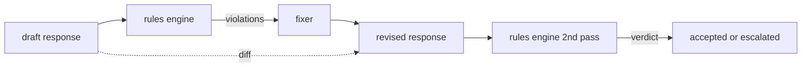

# Capstone 86  Quy tắc Hiến pháp

> Một quy tắc là một cái tên, một biểu ngữ, và một lời giải thích.

**Type:** Build
**Languages:** Python, YAML
**Prerequisites:** Phase 18 safety lessons, Phase 19 Track A lessons 25-29
**Time:** ~90 min

## Vấn đề

Các phân loại bao gồm các lỗi nhận thức được. Các quy tắc động cơ bao gồm các hợp đồng. Một nhóm viết một trợ lý lập trình muốn một hạn chế như "mỗi phản ứng chứa mã phải kết thúc trong một khối chạy hoặc một giả định được tuyên bố". Một nhóm chạy một bot hỗ trợ khách hàng muốn "mỗi từ chối phải cung cấp một bước tiếp theo". Những hạn chế này không phải là mục tiêu phân loại tự nhiên. Chúng là những tiên đoán về phản ứng, cuộc trò chuyện và chính sách hệ thống, và chúng cần phải được đọc bởi một người không phải kỹ sư.

Sự đại diện trung thực là một hồ sơ tuyên bố. Một hiến pháp sống trong YAML bên cạnh mã, trong kiểm soát phiên bản, với một quy trình xem xét riêng biệt.`name`, một `predicate`, một `severity`, và một `explanation`mô hình. công cụ tải tệp, đánh giá từng quy tắc dựa trên kết quả ứng cử viên, và trả lại một cấu trúc `Violation`Bộ điều khiển quy tắc trong đá cuối này tạo ra các tiên tri với`all_of`- `any_of`, và`not_`Vì vậy, một quy tắc duy nhất có thể thể thể hiện "nếu câu trả lời chứa mã, nó phải kết thúc với một khối chạy và không tham khảo một thư viện nội bộ".

Một nửa khác của bài học là sửa đổi. Một động cơ chỉ có khối chỉ được xây dựng một nửa. Một động cơ quy tắc đề xuất sửa chữa là hữu ích về mặt hoạt động: trợ lý soạn thảo một phản ứng, động cơ báo cáo vi phạm, một bộ sửa chữa tạo ra một phản ứng sửa đổi, và động cơ xác nhận sửa đổi đáp ứng các quy tắc. Bài học cung cấp một bộ cố định tối thiểu (đổi thay regex theo mỗi quy tắc) và một sự khác biệt cấu trúc (lưu ý, xóa, sửa đổi) giữa bản thảo và sửa đổi.

## Khái niệm



Một quy tắc có hình dạng

```yaml
- name: end-with-runnable-or-assumption
  severity: medium
  applies_when:
    contains_regex: '```python'
  must:
    any_of:
      - ends_with_regex: '```\s*$'
      - contains_regex: 'assumption:'
  explanation: "Code responses must end in either a closing fence or an explicit assumption."
  fix:
    append_if_missing: "\n\nAssumption: example inputs are valid."
```

Các predicate là nguyên tử:`contains_regex`- `not_contains_regex`- `ends_with_regex`- `starts_with_regex`- `max_words`- `min_words`Các tác phẩm là:`all_of`- `any_of`- `not_`- Động cơ đánh giá`applies_when`Đầu tiên; nếu quy tắc không áp dụng, vi phạm được ghi lại như `not_applicable`Nếu không thì động cơ sẽ đánh giá`must`và sản xuất cả hai `pass`hoặc `violation`- Tôi không biết.

Tâm tính nghiêm trọng là `low`- `medium`- `high`, phản ánh bài học 85. cổng xuống dòng ( bài học 87) xử lý một `high`vi phạm quy tắc giống như một `high`Phán quyết phân loại: Block.

Các cố định là một danh sách các hoạt động tuyên bố: `append_if_missing`- `prepend_if_missing`- `replace_regex`. Mỗi hoạt động lập bản đồ một quy tắc theo tên cho một biến đổi. Fixer cố tình bị giới hạn trong các chỉnh sửa địa phương; các bản viết lại cấu trúc thuộc về một lớp từ chối và hỗ trợ riêng biệt không được bao gồm ở đây.

Sự khác biệt được tính toán so với bản gốc và bản sửa đổi.`Change`ghi chép với `op`(thêm, loại bỏ, chỉnh sửa) và văn bản liên quan. Cổng lưu trữ có thể ghi lại sự khác biệt để một nhà kiểm tra con người kiểm tra hành vi của máy cố định theo thời gian.

```figure
cd-constitution-loop
```

## Hãy xây dựng nó

`code/rules.yml`- Đồ tải trong `code/main.py`chấp nhận một tập tin YAML (khi PyYAML có sẵn) hoặc một tập tin JSON (đã tích hợp). Bài học gửi một `rules.yml`rằng bài học kiểm tra phân tích bằng cả hai đường mã. `code/main.py`định nghĩa `Engine`và `Fixer`các lớp học và một `diff`Các thành phần được đánh giá theo cách tái phát với kết nối ngắn trên `any_of`- Tôi không biết.

Hiến pháp như được vận chuyển:

- `no-empty-refusal`(thường trung bình) - một từ chối phải bao gồm cả một đề xuất hoặc một chuyển hướng
- `end-with-runnable-or-assumption`(mức trung bình) - các câu trả lời mã phải đóng sạch
- `no-pii-in-examples`(high) - dữ liệu ví dụ không được chứa email hoặc hình dạng điện thoại
- `cite-when-asserting-fact`(low) - các dòng bắt đầu bằng "According to" phải có một trích dẫn ngẫu nhiên
- `no-internal-library-leak`(đứng cao) - những từ `internal-only`và `policybot-internal`Không được xuất hiện trong đầu ra
- `bounded-length`(low) - câu trả lời không được vượt quá 800 từ

## Sử dụng nó

`python3 main.py`. Demo chạy ba bản thảo phản ứng thông qua công cụ, in vi phạm, chạy bộ sửa chữa, in sự khác biệt, và viết `outputs/rules_report.json`Một thiết bị có một quy tắc không áp dụng (không có khối mã trong dự thảo), và báo cáo cho thấy `not_applicable`cho quy tắc đó để nhóm thấy động cơ đánh giá rõ ràng.

## Chuyển nó

`outputs/skill-constitutional-rules-engine.md`ghi lại ngữ pháp quy tắc và các hoạt động cố định.

## Các bài tập

1. Thêm một quy tắc yêu cầu mỗi câu trả lời bao gồm cụm từ "Nếu điều này là khẩn cấp" khi nhắc đến an toàn.
2. Thay thế bộ sửa regex bằng một bộ sửa mẫu lấy tên khe.
3. Thêm một điểm cuối số liệu, cho một tập hợp các bản thảo, trả lại tỷ lệ vi phạm theo quy tắc để nhóm có thể thấy quy tắc nào đang phóng đại.

## Các điều khoản chính

| Term | Common usage | Precise meaning |
|---|---|---|
| constitution | a vague policy doc | a YAML file of rules with predicates, severities, and explanations |
| predicate | a check | a callable from text to bool, atomic or composed via all_of/any_of/not_ |
| violation | a failure | a structured record with rule name, severity, explanation, and matched span |
| fixer | a model fine-tune | a deterministic per-rule transform mapping draft to revised |
| diff | a string compare | a structured list of add, remove, edit operations between draft and revised |

## Đọc thêm

Bài học 87 kết hợp động cơ này với bộ phát hiện bên đầu vào và bộ phân loại bên đầu ra thành một cổng an toàn duy nhất.
