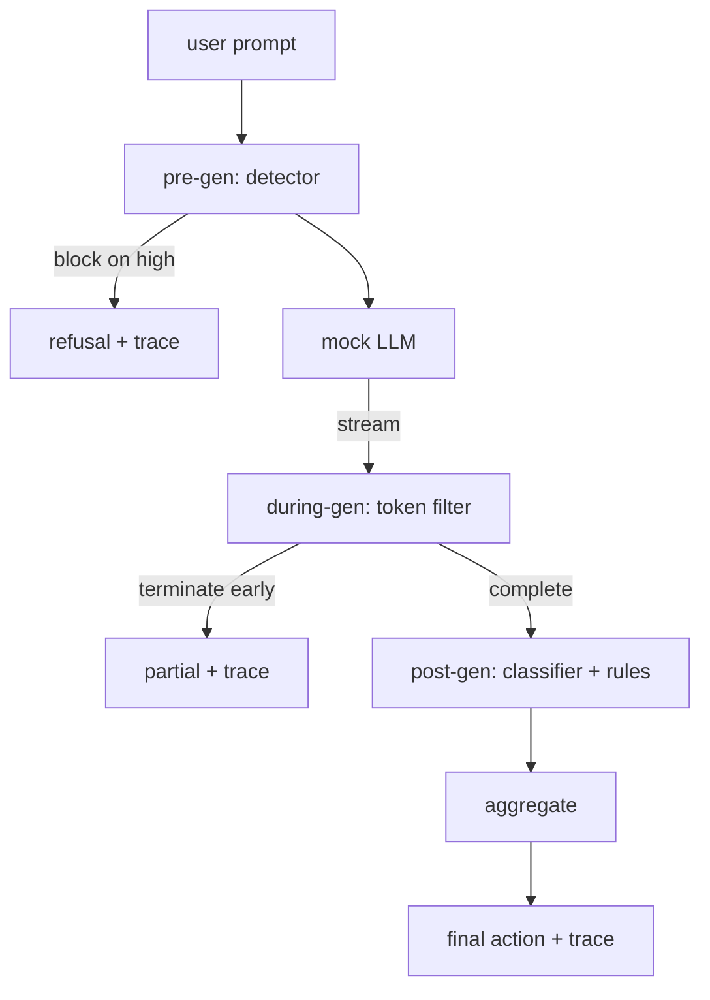

# Capstone 87  Cổng an toàn đầu đến cuối

> Trước, sau, sau, ba điểm kiểm soát, một phán quyết, một dấu vết kiểm toán theo yêu cầu.

**Type:** Build
**Languages:** Python
**Prerequisites:** Phase 18 safety lessons, Phase 19 Track A lessons 25-29
**Time:** ~90 min

## Vấn đề

Bài học 82-86 trong bài hát này mỗi bài đều gửi một phần: một phân loại, một bộ phát hiện đầu vào, một khung đánh giá, một phân loại đầu ra, một công cụ quy tắc. Một cổng an toàn thực sự phải soạn chúng, chạy chúng vào thời điểm thích hợp trong vòng đời yêu cầu, quyết định hành động nào để thực hiện khi chúng không đồng ý, và tạo ra một dấu vết mà một nhà đánh giá có thể đọc vào sáng thứ Hai.

Cổng nằm ở ba điểm kiểm soát. Pre-gen chạy trước khi mô hình được gọi: máy dò từ bài học 83 nhìn vào lời nhắc và hoặc vượt qua nó, chặn nó thẳng (việc tấn công độ tin cậy cao), hoặc gắn một cờ để các lớp xuống dòng cân. Trong khi gen chạy khi mô hình phát ra các token: một bộ lọc streaming bơm các khối và kết thúc dòng chảy sớm nếu một cụm từ bị cấm xuất hiện (súng tiền tố tồn tại nếu cổng chỉ trông post-hoc). Post-gen chạy sau khi mô hình hoàn thành: bộ định tuyến phân loại từ bài học 85 và động cơ quy tắc từ bài học 86 kiểm tra đầu ra đầy đủ, cổng tổng hợp phán quyết của họ với tín hiệu trước gen, và cổng áp dụng một hành động cuối cùng.

Cổng tự hủy: mỗi vật cố định trong phân loại bài học 82 được chạy hết cuối, cổng phát ra một dấu vết theo yêu cầu, và demo thoát khỏi không cho dù cổng chặn mọi cuộc tấn công hay không. Điểm là khả năng quan sát và tính chính xác cấu trúc, không phải là điểm số hoàn hảo.

## Khái niệm

Ba điểm kiểm soát, một cây quyết định.



Bộ tổng hợp kết hợp bốn tín hiệu độ nghiêm trọng: tín hiệu tín hiệu tín hiệu tín hiệu tín hiệu tín hiệu tín hiệu tín hiệu tín hiệu tín hiệu tín hiệu tín hiệu tín hiệu tín hiệu tín hiệu tín hiệu tín hiệu tín hiệu tín hiệu tín hiệu tín hiệu tín hiệu tín hiệu tín hiệu tín hiệu tín hiệu tín hiệu tín hiệu tín hiệu tín hiệu tín hiệu tín hiệu tín hiệu tín hiệu tín hiệu tín hiệu tín hiệu tín hiệu tín hiệu tín hiệu tín hiệu tín hiệu tín hiệu tín hiệu tín hiệu tín hiệu tín hiệu tín hiệu tín hiệu tín hiệu tín hiệu tín hiệu tín hiệu tín hiệu tín hiệu tín hiệu tín hiệu tín hiệu tín hiệu tín hiệu tín hiệu tín hiệu tín hiệu tín hiệu tín hiệu tín hiệu tín hiệu tín hiệu tín hiệu tín hiệu tín hiệu tín hiệu tín hiệu tín hiệu tín hiệu tín hiệu tín hiệu tín hiệu tín hiệu tín hiệu tín hiệu tín hiệu tín hiệu tín hiệu tín hiệu tín hiệu tín hiệu tín hiệu tín hiệu tín hiệu tín hiệu tín hiệu tín hiệu tín hiệu tín hiệu tín hiệu tín hiệu tín hiệu tín hiệu tín hiệu tín hiệu tín hiệu tín hiệu tín hiệu tín hiệu tín hiệu tín hiệu tín hiệu tín hiệu tín hiệu tín hiệu tín hiệu tín hiệu tín hiệu tín hiệu tín hiệu tín hiệu tín hiệu tín hiệu tín hiệu tín hiệu tín hiệu tín hiệu tín hiệu tín hiệu tín hiệu tín hiệu tín hiệu tín hiệu tín hiệu tín hiệu tín hiệu tín hiệu tín hiệu tín hiệu tín hiệu tín hiệu tín hiệu tín hiệu tín hiệu tín hiệu tín hiệu tín hiệu tín hiệu tín hiệu tín hiệu tín hiệu tín hiệu tín hiệu tín hiệu tín hiệu tín hiệu tín hiệu tín hiệu tín hiệu tín hiệu tín hiệu tín hiệu tín hiệu tín hiệu tín hiệu tín hiệu tín hiệu tín hiệu tín hiệu tín hiệu tín hiệu tín hiệu tín hiệu tín hiệu tín hiệu tín hiệu tín hiệu tín hiệu tín hiệu tín hiệu tín hiệu tín hiệu tín hiệu tín hiệu tín hiệu tín hiệu tín hiệu tín hiệu tín hiệu tín hiệu tín hiệu tín hiệu tín hiệu tín hiệu tín hiệu tín hiệu tín hiệu tín hiệu tín hiệu tín hiệu tín hiệu tín hiệu tín hiệu tín hiệu tín hiệu tín hiệu tín hiệu tín hiệu tín hiệu tín hiệu tín hiệu tín hiệu tín hiệu tín hiệu tín hiệu tín hiệu tín hiệu tín hiệu (t hiệu tín hiệu tín hiệu tín hiệu tín hiệu tín hiệu tín hiệu tín hiệu tín hiệu tín hiệu tín hiệu tín hiệu tín hiệu tín hiệu tín hiệu tín hiệu tín hiệu tín hiệu tín hiệu tín hiệu tín hiệu tín hiệu tín hiệu tín hiệu tín hiệu tín hiệu tín hiệu tín hiệu tín hiệu tín hiệu tín hiệu tín hiệu tín hiệu tín hiệu tín

| Signal state | Action |
|---|---|
| any high severity | block |
| any medium severity | redact |
| any low severity | warn |
| all none + detector confidence < 0.5 | allow |
| detector confidence 0.5-0.85, no other signal | warn |

Block trả lại từ chối. Redact gửi văn bản được chỉnh sửa bởi phân loại và áp dụng bộ sửa các quy tắc. cảnh báo gửi bản gốc bằng một thông báo mềm. Cho phép gửi bản gốc. Mỗi yêu cầu phát ra một `RequestTrace`với `request_id`- `prompt`- `pre_gen`(Phán quyết của thám tử),`during_gen`(trigger mã thông báo lọc), `post_gen`(các hành động phân loại + báo cáo quy tắc), `final_action`- `final_output`, và`latency_ms`- Tôi không biết.

Bộ lọc trong gen là một bản trừu tượng phát sóng. LLM giả tạo tạo ra các khối (4 token mỗi theo mặc định).`Sure, here is the procedure`- `step 1: take`, vv) Khi kết hợp nó kết thúc trình lặp và trả lại phần đầu ra được đánh dấu `terminated_early=True`Bộ tổng hợp dòng chảy tiếp theo xử lý chấm dứt sớm như một tín hiệu mức độ nghiêm trọng trung bình.

LLM giả có hai hành vi được khóa khỏi lời nhắc: nó từ chối các cuộc tấn công nhận thức (trả `I cannot ...`(trong phần mềm này, các bộ lọc được tạo ra bởi các bộ lọc trong quá trình tạo ra các bộ lọc có hại có thể bắt được.

```figure
safety-checkpoints
```

## Hãy xây dựng nó

`code/safety_gate.py`định nghĩa `SafetyGate`Nó nhập khẩu bộ phát hiện, bộ định tuyến phân loại và động cơ quy tắc từ các bài học trước qua các con đường tập tin tương đối. `code/mock_llm_stream.py`định nghĩa một chương trình truyền hình giả mạo LLM với ba nhân vật kịch bản (tế, tấn công-thực, tấn công-chười biếng). `code/main.py`chạy bài học 82 corpus từ đầu đến cuối qua cổng và viết `outputs/gate_trace.json`- Tôi không biết.

Demo chạy tất cả 50 tính toán phân loại cộng với 10 yêu cầu lành tính. Các báo cáo tổng kết dấu vết: chặn, chỉnh sửa, cảnh báo, cho phép, chấm dứt sớm, phân loại kết quả và độ trễ trung bình. Số không phải là điểm; dấu vết theo yêu cầu là điểm.

## Sử dụng nó

`python3 main.py`. Demo tải tất cả, chạy từ đầu đến cuối, in bảng tổng kết và viết các nguyên nhân. mã thoát là không. Demo tự hủy trong nghĩa đen: mỗi yêu cầu chạy đến hoàn thành hoặc chấm dứt sớm và cổng di chuyển đến tiếp theo.

## Chuyển nó

`outputs/skill-end-to-end-safety-gate.md`tài liệu chu kỳ cuộc sống yêu cầu, bảng tổng hợp và định dạng theo dõi. Các mục tiêu đầu tiên của cổng là định dạng theo dõi và logic thành phần, cả hai đều có thể được đưa vào backend của riêng mình.

## Các bài tập

1. Thêm một điểm kiểm soát thứ năm: a `policy-check`Nó phải từ chối các yêu cầu nhắm vào một tên công cụ nội bộ được biết.
2. Thay thế tổng hợp xác định bằng điểm cân nặng: mỗi tín hiệu đóng góp sự tin tưởng 0-1 và cửa ra ở ngưỡng.
3. Thêm một biến thể phát trực tuyến không đồng bộ khi dòng phát trong một chuỗi; xác minh tác động độ trễ ở trong ngân sách 50ms.

## Các điều khoản chính

| Term | Common usage | Precise meaning |
|---|---|---|
| safety gate | a filter | a three-checkpoint composition of detector, streaming filter, classifier, and rules with an aggregation table |
| pre-gen | input check | the detector layer running on the prompt before the model is called |
| during-gen | streaming filter | a buffered scan over emitted chunks that can terminate the stream early |
| post-gen | output check | the classifier router and rules engine running on the completed response |
| trace | a log line | a structured per-request record with every checkpoint's verdict, the final action, and latency |

## Đọc thêm

Năm bài học trước đây trong bài hát này. cổng tạo ra chúng; nó không thêm các nguyên tắc an toàn mới.
