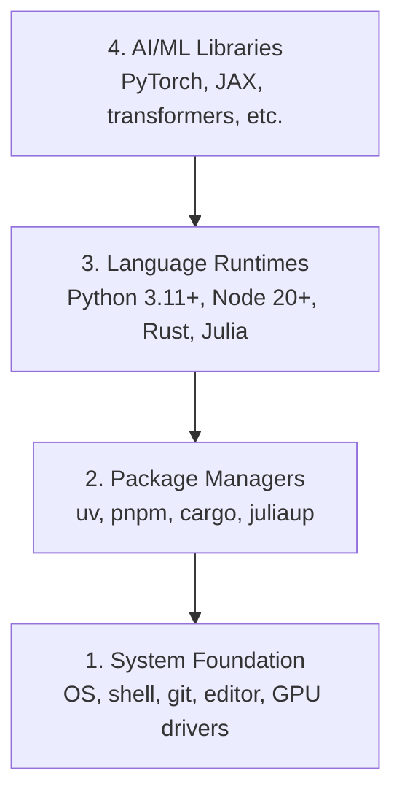

# 开发环境

> 你的工具塑造了你的思维, 设置它们一次,设置它们正确.

**Type:** Build
**Languages:** Python, Node.js, Rust
**Prerequisites:** None
**Time:** ~45 minutes

## 学习目标

- 设置Python 3.11+,Node.js 20+,以及Rust工具链从零开始
- 配置可复制的构建的虚拟环境和包管理器
- 通过CUDA/MPS验证GPU访问并执行测试子操作
- 了解四层堆:系统,包,运行时间,人工智能库

## 问题

你即将学习人工智能工程,使用Python,TypeScript,Rust和Julia的500多个课程. 如果你的环境被破坏,

大多数人会跳过环境设置,然后花费数小时检查进口错误,版本冲突,以及缺失的CUDA驱动程序.

## 概念

人工智能工程环境有四层:



我们安装下层,每个层取决于下层.

```figure
s0-env-stack
```

## 建立它

### 步骤1:系统基础

检查系统,安装基本知识.

```bash
# macOS
xcode-select --install
brew install git curl wget

# Ubuntu/Debian
sudo apt update && sudo apt install -y build-essential git curl wget

# Windows (use WSL2)
wsl --install -d Ubuntu-24.04
```

### 步骤2:使用UV的Python

我们使用`uv`它比Pip快10-100倍,并且自动处理虚拟环境.

```bash
curl -LsSf https://astral.sh/uv/install.sh | sh

uv python install 3.12

uv venv
source .venv/bin/activate  # or .venv\Scripts\activate on Windows

uv pip install numpy matplotlib jupyter
```

检查:

```python
import sys
print(f"Python {sys.version}")

import numpy as np
print(f"NumPy {np.__version__}")
a = np.array([1, 2, 3])
print(f"Vector: {a}, dot product with itself: {np.dot(a, a)}")
```

### 步骤3: Node.js 与 pnpm

对于TypeScript课程 (代理,MCP服务器,网络应用).

```bash
curl -fsSL https://fnm.vercel.app/install | bash
fnm install 22
fnm use 22

npm install -g pnpm

node -e "console.log('Node', process.version)"
```

**macOS / Apple Silicon (M1/M2/M3/M4):**如果安装器停止使用`Error: Cannot install under Rosetta 2 in ARM default prefix (/opt/homebrew)`您的终端正在Rosetta 2下运行`arch`印记`i386`安装Fnm强迫Arm64,将其插入你的子中,然后从上面的命令重启`fnm install 22`其他:

```bash
arch -arm64 brew install fnm
echo 'eval "$(fnm env --use-on-cd)"' >> ~/.zshrc
source ~/.zshrc
```

### 步骤4: 

对于性能关键的课程 (推理,系统).

```bash
curl --proto '=https' --tlsv1.2 -sSf https://sh.rustup.rs | sh

rustc --version
cargo --version
```

### 步骤5:朱莉亚 (可选)

对于朱莉亚耀的数学课程.

```bash
curl -fsSL https://install.julialang.org | sh

julia -e 'println("Julia ", VERSION)'
```

### 步骤 6: 设置GPU (如果您有一个)

**NVIDIA (Linux / Windows):**

```bash
nvidia-smi

# Install PyTorch with CUDA
uv pip install torch torchvision torchaudio --index-url https://download.pytorch.org/whl/cu124
```

**macOS / Apple Silicon (M1/M2/M3/M4):**没有一个Mac上 CUDA 预期,没有失败.**not**通过`--index-url .../cuXXX`安装简单的构建,其中包括果的MPS (金属) GPU后端:

```bash
uv pip install torch torchvision torchaudio
```

验证 (在任何平台上都能工作):

```python
import torch
print(f"CUDA available: {torch.cuda.is_available()}")           # False on macOS — expected
print(f"MPS available:  {torch.backends.mps.is_available()}")   # True on Apple Silicon
if torch.cuda.is_available():
    print(f"GPU: {torch.cuda.get_device_name(0)}")
```

没有GPU?没有问题.大多数课程都在CPU上进行.对于训练重的课程,请使用Google Colab或云GPU.

### 步骤 7: 验证您想要开始的路线

运行本课中的每个命令从库根,目录中运行
含有`README.md`其他`phases/`飞行前检查你需要的东西
默认情况下,它会跳过后来的工具,这样一个新学习者会看到
只是一个明确的答案,而不是一个警告墙.

开始全新手序列:

```bash
python3 phases/00-setup-and-tooling/01-dev-environment/code/verify.py --route beginner
```

或只查看你想要的路线:

```bash
python3 phases/00-setup-and-tooling/01-dev-environment/code/verify.py --route ml-foundations
python3 phases/00-setup-and-tooling/01-dev-environment/code/verify.py --route llm-engineering
python3 phases/00-setup-and-tooling/01-dev-environment/code/verify.py --route agents
python3 phases/00-setup-and-tooling/01-dev-environment/code/verify.py --route mcp
python3 phases/00-setup-and-tooling/01-dev-environment/code/verify.py --route agent-skills
python3 phases/00-setup-and-tooling/01-dev-environment/code/verify.py --route certification
```

加入`--show-later`当你想要相同的飞行前检查可选的工具时
后期工具永远不会阻止学习.
选择的路线.

每次未能执行的检查都包括检测到的路径或进口错误以及
代理技能和认证路线也显示
由于Python脚本不能证明AI主机有
您发现了技能或您选择的技能范围可写.

开始飞行前,它打印出了第一课:

```text
Ready to start Beginner course.
Next: python3 phases/01-math-foundations/01-linear-algebra-intuition/code/vectors.py
```

## 用它

您的环境准备好启动您检查的路线.
当一个课时要求他们,而不是完全阻止你的第一课时
您将在整个课程中使用的内容是:

| Language | Used In | Package Manager |
|----------|---------|-----------------|
| Python | Phases 1-12 (ML, DL, NLP, Vision, Audio, LLMs) | uv |
| TypeScript | Phases 13-17 (Tools, Agents, Swarms, Infra) | pnpm |
| Rust | Phases 12, 15-17 (Performance-critical systems) | cargo |
| Julia | Phase 1 (Math foundations) | Pkg |

## 运送它

这一课产生的验证脚本,任何人都可以运行来检查他们的设置.

看到`outputs/prompt-env-check.md`为了帮助人工智能助理诊断环境问题.

## 运动

1. 运行验证脚本,修复任何故障
2. 创建一个Python虚拟环境,并安装PyTorch
3. 在四种语言中写一个"世界好"并运行每一个
