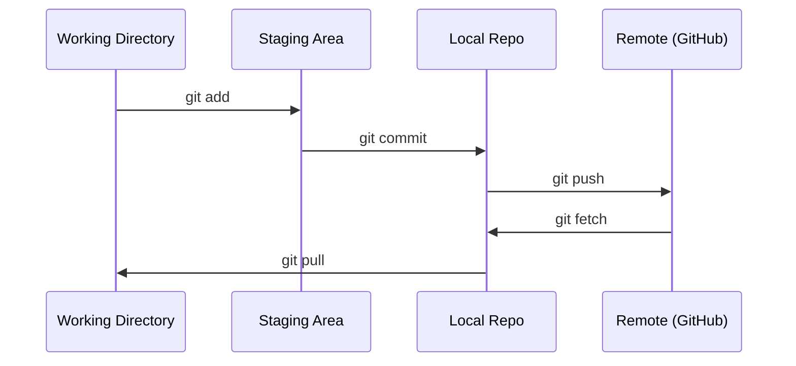

# 关键字和协作

> 每个实验,每一个模型,每一个课程都会被追踪.

**Type:** Learn
**Languages:** --
**Prerequisites:** Phase 0, Lesson 01
**Time:** ~30 minutes

## 学习目标

- 配置 git 身份,并使用每天的加,提交和推工作流程
- 建立和合并分支,进行孤立的实验,而不会打破主体
- 写一个`.gitignore`排除模型检查点和大型二元文件
- 通过 导航提交历史`git log`了解项目发展

## 问题

你即将在20个阶段写成数百个代码文件. 如果没有版本控制,你会失去工作,打破无法撤销的东西,

这一课涵盖了你需要什么,而不是更多.

## 概念



记住三个事情:
1. 经常保存 (`git commit`)
2. 按到远程 (`git push`)
3. 实验部门 (`git checkout -b experiment`)

```figure
s0-commit-dag
```

## 建立它

### 步骤1:配置 git

```bash
git config --global user.name "Your Name"
git config --global user.email "you@example.com"
```

### 步骤2:日常工作流程

```bash
git status
git add file.py
git commit -m "Add perceptron implementation"
git push origin main
```

### 步骤3:为实验分支

```bash
git checkout -b experiment/new-optimizer

# ... make changes, commit ...

git checkout main
git merge experiment/new-optimizer
```

### 步骤4:与本课程合作

只有维护者才能访问写作. 首先在 GitHub 上 (叉按,右上)`origin`您的本文:

```bash
git clone https://github.com/YOUR-USERNAME/ai-engineering-from-scratch.git
cd ai-engineering-from-scratch

git checkout -b my-progress
# work through lessons, commit your code
git push origin my-progress
```

## 用它

为了完成这个课程,你需要这些命令:

| Command | When |
|---------|------|
| `git clone` | Get the course repo |
| `git add` + `git commit` | Save your work |
| `git push` | Back it up to GitHub |
| `git checkout -b` | Try something without breaking main |
| `git log --oneline` | See what you've done |

这就是,你不需要反,桃选,或子模块.

## 运动

1. 叉这个 repo,克隆你的叉子,创建一个叫做`my-progress`写一个文件,提交它,推它
2. 创建一个`.gitignore`没有模拟检查站文件 (`.pt`现在`.pth`现在`.safetensors`)
3. 查看这个回复的提交历史`git log --oneline`阅读如何增加教训

## 关键词

| Term | What people say | What it actually means |
|------|----------------|----------------------|
| Commit | "Saving" | A snapshot of your entire project at a point in time |
| Branch | "A copy" | A pointer to a commit that moves forward as you work |
| Merge | "Combining code" | Taking changes from one branch and applying them to another |
| Remote | "The cloud" | A copy of your repo hosted somewhere else (GitHub, GitLab) |
