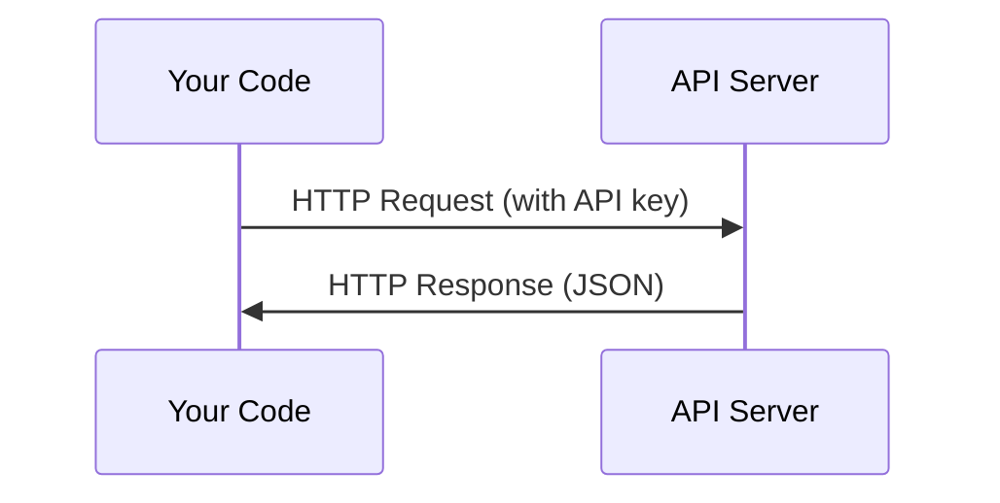

# 应用程序和关键

> 每个人工智能API都以相同的方式运作:发送请求,得到回应. 细节改变,模式不改变.

**Type:** Build
**Languages:** Python, TypeScript
**Prerequisites:** Phase 0, Lesson 01
**Time:** ~30 minutes

## 学习目标

- 通过环境变量安全存储API密钥,`.env`文件
- 使用人类 Python SDK 和原始 HTTP 进行LLM API 调用
- 进行调试,比较基于SDK和原始HTTP请求/响应格式
- 识别和处理包括身份验证和速度限制在内的常见API错误

## 问题

从第11阶段开始,你将打电话给LLM API (人类,OpenAI,谷歌).在第13-16阶段,你将建立使用这些API的代理.你需要知道API密钥如何工作,如何安全存储它们,以及如何进行你的第一个API电话.

## 概念



每个API通话都有:
1. 终端点 (URL)
2. 应用程序的 API 密钥 (身份验证)
3. 要求机构 (您需要什么)
4. 响应器 (你得到的回报)

```figure
s0-secret-inject
```

## 建立它

### 步骤1:安全存储API密钥

永远不要把API密钥放入代码中.

```bash
export ANTHROPIC_API_KEY="sk-ant-..."
export OPENAI_API_KEY="sk-..."
```

或使用一个`.env`文件 (添加到`.gitignore`):

```
ANTHROPIC_API_KEY=sk-ant-...
OPENAI_API_KEY=sk-...
```

### 步骤2:第一个API调用 (Python)

```python
import os

import anthropic

client = anthropic.Anthropic()

MODEL = os.environ.get("LLM_MODEL", "claude-sonnet-5")

response = client.messages.create(
    model=MODEL,
    max_tokens=256,
    messages=[{"role": "user", "content": "What is a neural network in one sentence?"}]
)

print(response.content[0].text)
```

`LLM_MODEL`其他提供商 (OpenAI,Google等) 遵循相同的键和模型 id 模式,但每个都有自己的 SDK,终端点和请求/响应方案.

### 步骤3:第一个API调用 (TypeScript)

```typescript
import Anthropic from "@anthropic-ai/sdk";

const client = new Anthropic();

const MODEL = process.env.LLM_MODEL ?? "claude-sonnet-5";

const response = await client.messages.create({
  model: MODEL,
  max_tokens: 256,
  messages: [{ role: "user", content: "What is a neural network in one sentence?" }],
});

console.log(response.content[0].text);
```

### 步骤4:原始 HTTP (没有 SDK)

```python
import os
import urllib.request
import json

url = "https://api.anthropic.com/v1/messages"
headers = {
    "Content-Type": "application/json",
    "x-api-key": os.environ["ANTHROPIC_API_KEY"],
    "anthropic-version": "2023-06-01",
}
body = json.dumps({
    "model": os.environ.get("LLM_MODEL", "claude-sonnet-5"),
    "max_tokens": 256,
    "messages": [{"role": "user", "content": "What is a neural network in one sentence?"}],
}).encode()

req = urllib.request.Request(url, data=body, headers=headers, method="POST")
with urllib.request.urlopen(req) as resp:
    result = json.loads(resp.read())
    print(result["content"][0]["text"])
```

了解原始 HTTP 调用帮助在调试时.

## 用它

对于这个课程:

| API | When you need it | Free tier |
|-----|-----------------|-----------|
| Anthropic (Claude) | Phases 11-16 (agents, tools) | $5 credit on signup |
| OpenAI | Phase 11 (comparison) | $5 credit on signup |
| Hugging Face | Phases 4-10 (models, datasets) | Free |

你不需要他们现在,当课时需要的时候,就把它们设置起来.

## 运送它

这一课产生了:
- `outputs/prompt-api-troubleshooter.md`- 诊断常见的API错误

## 运动

1. 获取一个人类API密钥,并进行你的第一个API电话
2. 试试原始 HTTP 版本,并将响应格式与 SDK 版本进行比较
3. 故意使用错误的API键并读取错误信息

## 关键词

| Term | What people say | What it actually means |
|------|----------------|----------------------|
| API key | "Password for the API" | A unique string that identifies your account and authorizes requests |
| Rate limit | "They're throttling me" | Maximum requests per minute/hour to prevent abuse and ensure fair usage |
| Token | "A word" (in API context) | A billing unit: input and output tokens are counted and charged separately |
| Streaming | "Real-time responses" | Getting the response word by word instead of waiting for the full response |
