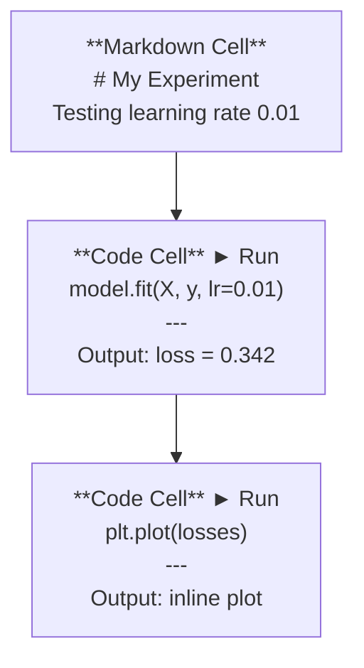
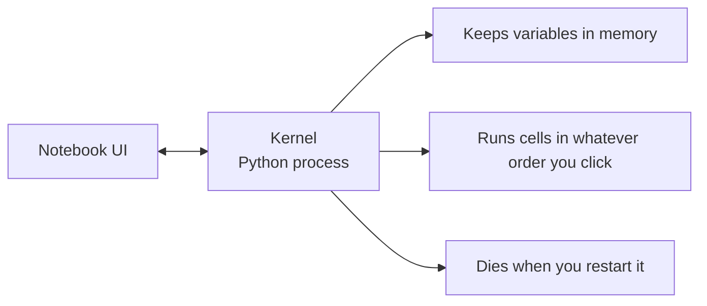

# 朱皮特笔记本

> 笔记本是人工智能工程的实验室.

**Type:** Build
**Languages:** Python
**Prerequisites:** Phase 0, Lesson 01
**Time:** ~30 minutes

## 学习目标

- 通过Jupyter扩展安装和启动JupyterLab,Jupyter笔记本或VS代码
- 使用魔术命令 (`%timeit`现在`%%time`现在`%matplotlib inline`) 进行基准和可视化直线
- 区分使用笔记本与脚本的时间,并应用"在笔记本中探索,在脚本中运输"工作流程
- 识别和避免常见的笔记本电脑陷:失序执行,隐藏状态和内存泄漏

## 问题

每个人工智能论文,教程和Kaggle竞赛都使用Jupyter笔记本.它们让你运行代码,看到输出线,混合代码和解释,并快速反复.如果你试图学习人工智能,没有笔记本,你就没有抓纸做数学功课了.

但笔记本有真正的陷.人们用它们做一切,包括他们很糟糕的事情.知道什么时候使用笔记本和什么时候使用脚本,

## 概念

一本笔记本是单元单元的列表.



核是一个在背景下运行的Python进程.当你运行一个细胞时,它会发送代码到核子中,核子执行它,然后返回结果.所有细胞都共享相同的核子,所以细胞之间存在变量.



无论你点击什么命令,这部分都是超级大国和步枪.

```figure
s0-cell-order
```

## 建立它

### 步骤1:选择你的接口

只有一个格式:

| Interface | Install | Best for |
|-----------|---------|----------|
| JupyterLab | `pip install jupyterlab` then `jupyter lab` | Full IDE experience, multiple tabs, file browser, terminal |
| Jupyter Notebook | `pip install notebook` then `jupyter notebook` | Simple, lightweight, one notebook at a time |
| VS Code | Install "Jupyter" extension | Already in your editor, git integration, debugging |

三个都读写一样.`.ipynb`根据人工智能技术的标准,

```bash
pip install jupyterlab
jupyter lab
```

### 关键键盘快捷方式

您可以在两个模式下操作.`Escape`对于命令模式 (左侧蓝色条),`Enter`对于编辑模式 (绿色).

**Command mode (most used):**

| Key | Action |
|-----|--------|
| `Shift+Enter` | Run cell, move to next |
| `A` | Insert cell above |
| `B` | Insert cell below |
| `DD` | Delete cell |
| `M` | Convert to markdown |
| `Y` | Convert to code |
| `Z` | Undo cell operation |
| `Ctrl+Shift+H` | Show all shortcuts |

**Edit mode:**

| Key | Action |
|-----|--------|
| `Tab` | Autocomplete |
| `Shift+Tab` | Show function signature |
| `Ctrl+/` | Toggle comment |

`Shift+Enter`你每天要使用一千次的. 首先学会它.

### 步骤3:细胞类型

**Code cells**运行Python并显示输出:

```python
import numpy as np
data = np.random.randn(1000)
data.mean(), data.std()
```

输出:`(0.0032, 0.9987)`

**Markdown cells**支持头条,大体,斜体,拉特克斯数学 (`$E = mc^2$`),表格和图像.

### 步骤4: 魔术命令

这些不是Python,而是从 Jupyter 开始的命令.`%`没有什么可怕的东西.`%%`们都在着.

**Time your code:**

```python
%timeit np.random.randn(10000)
```

输出:`45.2 us +/- 1.3 us per loop`

```python
%%time
model.fit(X_train, y_train, epochs=10)
```

输出:`Wall time: 2.34 s`

`%timeit`运行代码多次,平均.`%%time`运行一次.`%timeit`对于微型标志,`%%time`为了训练.

**Enable inline plots:**

```python
%matplotlib inline
```

每一个`plt.plot()`或`plt.show()`现在直接在笔记本中转载.

**Install packages without leaving the notebook:**

```python
!pip install scikit-learn
```

其他`!`预写程序运行任何命令.

**Check environment variables:**

```python
%env CUDA_VISIBLE_DEVICES
```

### 步骤5: 显示丰富输出直线

笔记本本可以自动显示细胞中的最后一个表达式.

```python
import pandas as pd

df = pd.DataFrame({
    "model": ["Linear", "Random Forest", "Neural Net"],
    "accuracy": [0.72, 0.89, 0.94],
    "training_time": [0.1, 2.3, 45.6]
})
df
```

这样将呈现一个格式化的HTML表,而不是一个文本垃圾.

```python
import matplotlib.pyplot as plt

plt.figure(figsize=(8, 4))
plt.plot([1, 2, 3, 4], [1, 4, 2, 3])
plt.title("Inline Plot")
plt.show()
```

图表就在细胞下面出现.这就是为什么笔记本主导人工智能工作.你看到数据,图表和代码在一起.

图片:

```python
from IPython.display import Image, display
display(Image(filename="architecture.png"))
```

### 步骤 6:谷歌协作

科拉布是云中的免费Jupyter笔记本电脑. 它提供了 GPU,预装库和谷歌驱动器集成.

1. 走去[colab.research.google.com](https://colab.research.google.com)
2. 装载任何`.ipynb`从本课程的文件
3. 运行时间 > 改变运行时间类型 > T4 GPU (免费)

与本地Jupyter的可拉比分:
- 文件不会在会议之间存在 (保存到驱动或下载)
- 预装:,熊猫,,火,,
- `from google.colab import files`为了上传/下载文件
- `from google.colab import drive; drive.mount('/content/drive')`为了持续存储
- 停课时间90分钟不活动后 (免费级别)

## 用它

### 笔记本与脚本:何时使用哪个

| Use notebooks for | Use scripts for |
|-------------------|-----------------|
| Exploring a dataset | Training pipelines |
| Prototyping a model | Reusable utilities |
| Visualizing results | Anything with `if __name__` |
| Explaining your work | Code that runs on a schedule |
| Quick experiments | Production code |
| Course exercises | Packages and libraries |

规则:**explore in notebooks, ship in scripts**现在,我们要去.

人工智能领域的常见工作流程:
1. 在笔记本中查找数据
2. 在笔记本中原型
3. 一旦它工作,将代码移动到`.py`文件
4. 进口这些`.py`文件将返回笔记本,以便进行进一步的实验.

### 常见的陷

**Out-of-order execution.**运行电脑的电脑,然后电脑的电脑,然后电脑的电脑.

**Hidden state.**您删除一个细胞,但它创建的变量仍然存储在内存中.笔记本看起来很清洁,但依赖于鬼细胞.

**Memory leaks.**运载4GB的数据集,训练一个模型,运载另一个数据集. 没有什么得到释放.`del variable_name`其他`gc.collect()`它们可以重新启动核.

## 运送它

这一课产生了:
- `outputs/prompt-notebook-helper.md`调试笔记本问题

## 运动

1. 打开JupyterLab,创建笔记本,然后使用`%timeit`为了比较清单理解与 numpy 创建一组100,000个随机数字
2. 创建一个包含分类和代码单元的笔记本,将 CSV 加载,显示数据框架,并绘制图表.然后运行Kernel>重启 & 运行所有,以验证它从上到下
3. 取代代码`code/notebook_tips.py`粘贴在Colab笔记本,然后用免费的GPU运行

## 关键词

| Term | What people say | What it actually means |
|------|----------------|----------------------|
| Kernel | "The thing running my code" | A separate Python process that executes cells and keeps variables in memory |
| Cell | "A code block" | An independently runnable unit in a notebook, either code or markdown |
| Magic command | "Jupyter tricks" | Special commands prefixed with `%` or `%%` that control the notebook environment |
| `.ipynb` | "Notebook file" | A JSON file containing cells, outputs, and metadata. Stands for IPython Notebook |

## 进一步阅读

- [JupyterLab Docs](https://jupyterlab.readthedocs.io/)对于全功能集
- [Google Colab FAQ](https://research.google.com/colaboratory/faq.html)对 Colab 特定的限制和特征
- [28 Jupyter Notebook Tips](https://www.dataquest.io/blog/jupyter-notebook-tips-tricks-shortcuts/)电源用户快捷方式
